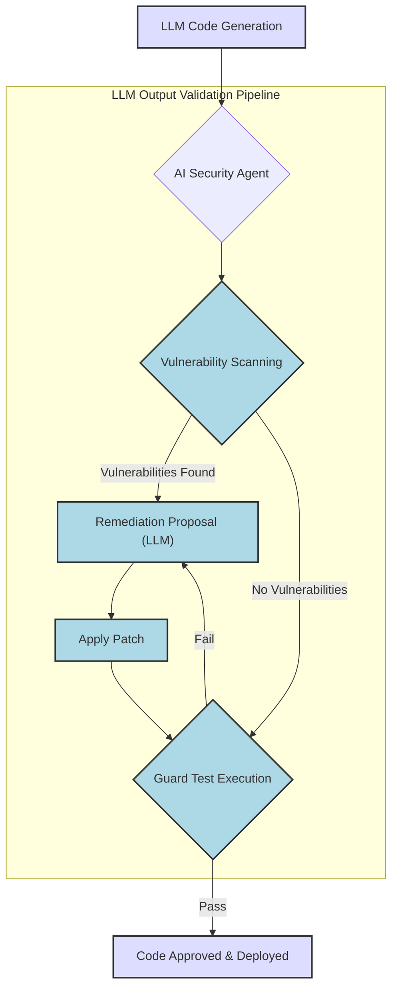

AI 기반의 자율 취약점 발견(Vulnerability Discovery) 및 수정(Remediation)은 현대 소프트웨어 개발 라이프사이클(SDLC)에서 보안 품질을 획기적으로 향상시키는 핵심 요소입니다. 특히 대규모 언어 모델(LLM)이 생성하는 코드의 품질과 보안을 검증하는 파이프라인에서는 이러한 자율 에이전트의 역할이 더욱 중요해지고 있습니다. Anthropic의 'Defending Code Reference Harness'는 이러한 자율 보안 에이전트의 참조 구현(Reference Implementation)으로, LLM이 생성하거나 수정하는 코드에 내재될 수 있는 잠재적 취약점을 사전에 식별하고 수정하는 메커니즘을 제공합니다.

## AI 기반 취약점 관리의 중요성
기존의 정적/동적 분석 도구(SAST/DAST)는 규칙 기반 또는 패턴 매칭에 의존하여 알려진 취약점을 탐지하는 데 효과적입니다. 그러나 LLM이 생성하는 코드는 예측 불가능한 패턴과 새로운 형태의 버그를 포함할 수 있으며, 기존 도구만으로는 이를 완전히 커버하기 어렵습니다. AI 기반 자율 에이전트는 코드의 의미론적(Semantic) 맥락을 이해하고, 잠재적 공격 경로를 추론하며, 발견된 취약점을 능동적으로 수정하는 자율성(Autonomy)을 가질 수 있습니다. 이는 개발 속도 저하 없이 보안 품질을 유지하며, 2026년 이후 AI 기반 개발 환경에서 필수적인 역량으로 자리매김할 것입니다.

## Defending Code Reference Harness의 작동 방식
Defending Code Reference Harness는 Claude와 같은 강력한 LLM을 활용하여 코드 베이스를 분석하고 취약점을 발견하며, 이를 수정하기 위한 일련의 과정을 자동화합니다. 핵심 개념은 다음과 같습니다.

1.  **코드 분석(Code Analysis)**: LLM은 주어진 코드 스니펫 또는 전체 모듈을 보안 관점에서 분석하여 잠재적 취약점 후보(Candidate Vulnerabilities)를 식별합니다.
2.  **취약점 식별(Vulnerability Identification)**: 식별된 후보에 대해 추가적인 컨텍스트 정보(예: 데이터 흐름, 사용자 입력 처리)를 고려하여 실제 취약점 여부를 판단합니다.
3.  **수정 제안(Remediation Proposal)**: 취약점이 확인되면, LLM은 이를 수정하기 위한 코드 패치(Patch)를 제안합니다.
4.  **수정 적용 및 검증(Apply & Validate)**: 제안된 패치는 실제 코드에 적용된 후, 새로운 가드 테스트(Guard Test) 또는 기존 테스트 케이스를 통해 수정의 유효성과 부작용(Regression)이 없는지 검증합니다.

이러한 과정은 반복적으로 수행될 수 있으며, 가드 테스트는 LLM이 생성한 수정안이 새로운 취약점을 유발하거나 기존 기능을 손상시키지 않도록 하는 중요한 안전 장치(Guardrail) 역할을 합니다.

### LLM 출력 검증 파이프라인 통합
우리의 LLM 출력 검증 파이프라인에 이 개념을 도입하면, LLM이 생성한 코드가 개발 단계에서부터 강화된 보안 검증을 거치게 됩니다. 예를 들어, 코드 생성 에이전트가 코드를 제출하기 전에 자율 취약점 에이전트가 이를 1차 검토하고 수정하는 단계를 추가할 수 있습니다.

```python
import openai # Mocking an LLM for demonstration

class VulnerabilityScanner:
    def scan_code(self, code: str) -> list[str]:
        # Simulate AI-driven vulnerability detection
        vulnerabilities = []
        if "eval(" in code:
            vulnerabilities.append("Potential eval() injection vulnerability")
        if "subprocess.run(" in code and "shell=True" in code:
            vulnerabilities.append("Potential shell injection via subprocess")
        # More sophisticated LLM-based analysis would go here
        if "SELECT * FROM users WHERE password = '" in code:
            vulnerabilities.append("Possible SQL injection in query")
        return vulnerabilities

class VulnerabilityRemediator:
    def remediate_code(self, code: str, vulnerability: str) -> str:
        # Simulate AI-driven remediation
        if "eval()" in vulnerability and "eval(" in code:
            print(f"Remediating: {vulnerability}")
            return code.replace("eval(", "safe_eval(") # Placeholder for a safer function
        if "shell injection" in vulnerability and "subprocess.run(" in code and "shell=True" in code:
            print(f"Remediating: {vulnerability}")
            return code.replace("shell=True", "shell=False")
        if "SQL injection" in vulnerability and "SELECT * FROM users WHERE password = '" in code:
            print(f"Remediating: {vulnerability}")
            # Example: Replace with parameterized query logic
            return code.replace("SELECT * FROM users WHERE password = '" + "user_input'", "SELECT * FROM users WHERE password = %s")
        return code

class GuardTest:
    def run_security_tests(self, code: str) -> bool:
        # Simulate running actual security tests (e.g., SAST, DAST, unit tests covering security scenarios)
        print("Running security guard tests...")
        scanner = VulnerabilityScanner()
        issues = scanner.scan_code(code)
        if issues:
            print(f"Guard test failed: {issues}")
            return False
        print("Guard test passed.")
        return True

def generate_and_secure_code(llm_generated_code: str) -> str:
    scanner = VulnerabilityScanner()
    remediator = VulnerabilityRemediator()
    guard_test = GuardTest()

    current_code = llm_generated_code
    iteration = 0
    max_iterations = 3

    while iteration < max_iterations:
        print(f"\n--- Security Iteration {iteration + 1} ---")
        vulnerabilities = scanner.scan_code(current_code)

        if not vulnerabilities:
            print("No vulnerabilities found by scanner.")
            if guard_test.run_security_tests(current_code):
                print("Code successfully secured and passed guard tests.")
                return current_code
            else:
                # If guard test fails without scanner finding issues, more advanced LLM analysis might be needed
                print("Guard tests failed despite no scanner findings. Manual review or deeper analysis needed.")
                break

        print(f"Vulnerabilities found: {vulnerabilities}")
        for vul in vulnerabilities:
            current_code = remediator.remediate_code(current_code, vul)
        
        iteration += 1
        print("Attempted remediation. Re-scanning...")

    print("Max iterations reached or unable to secure code.")
    return current_code

# Example Usage
llm_code_unsafe = "user_input = get_user_input(); eval(user_input);"
llm_code_sql_unsafe = "user_id = '1'; query = f\"SELECT * FROM users WHERE id = '{user_id}'\";"

secured_code = generate_and_secure_code(llm_code_unsafe)
print(f"\nOriginal: {llm_code_unsafe}")
print(f"Secured: {secured_code}")

secured_sql_code = generate_and_secure_code(llm_code_sql_unsafe)
print(f"\nOriginal SQL: {llm_code_sql_unsafe}")
print(f"Secured SQL: {secured_sql_code}")
```

### AI 기반 자율 보안 에이전트 워크플로우
아래 Mermaid 다이어그램은 AI 기반 취약점 발견 및 수정 에이전트가 LLM 생성 코드의 유효성을 검증하고 보안을 강화하는 프로세스를 시각화합니다.



## 트레이드오프

*   **정확성(Accuracy) vs. 오탐(False Positives)**: AI 기반 시스템은 복잡한 패턴을 학습하여 취약점을 탐지하지만, 오탐(False Positives)을 생성할 위험이 있습니다. 이는 개발자의 신뢰를 저하시키고, 불필요한 작업 부하를 유발합니다. 언제 좋고: 새로운 유형의 취약점이나 복잡한 비즈니스 로직에 숨겨진 취약점 발견에 강점이 있습니다. 언제 나쁜지: 단순한 코드나 잘 알려진 패턴에서 잦은 오탐이 발생하면 개발 효율성을 저해합니다.
*   **자동 수정(Automated Remediation) vs. 제어 상실(Loss of Control)**: AI가 자동으로 취약점을 수정하는 것은 개발 속도를 높일 수 있지만, 수정 내용에 대한 투명성(Transparency)이 부족하거나 의도치 않은 부작용(Side Effects)을 초래할 수 있습니다. 언제 좋고: 경미하거나 명확한 취약점(예: 의존성 업데이트, 간단한 입력 검증 누락)에 대해 빠른 대응이 필요할 때 유용합니다. 언제 나쁜지: 복잡한 로직 변경이나 아키텍처적 결정이 필요한 취약점의 경우, 인간 개발자의 검토 없이 자동 수정은 위험합니다.
*   **성능(Performance) vs. 심층 분석(Depth of Analysis)**: LLM 기반의 심층적인 코드 분석은 많은 연산 자원과 시간을 요구하여 개발/배포 파이프라인의 지연을 유발할 수 있습니다. 언제 좋고: 중요도가 높거나 공격에 노출될 가능성이 큰 핵심 모듈에 대해 집중적인 분석이 필요할 때 효과적입니다. 언제 나쁜지: 모든 코드 변경에 대해 풀 스캔(Full Scan)을 적용하면 CI/CD 파이프라인의 속도를 저하시켜 개발 생산성에 악영향을 미칩니다.
*   **초기 구축 비용(Initial Setup Cost) vs. 장기적 ROI(Long-term ROI)**: AI 기반 취약점 관리 시스템을 구축하고 훈련하는 데는 상당한 초기 투자(LLM API 비용, 인프라, 전문 인력)가 필요합니다. 언제 좋고: 대규모 코드베이스를 운영하거나 높은 보안 요구사항을 가진 조직에서 장기적으로 수동 보안 검토 비용을 절감하고 보안 수준을 향상시킬 때 높은 ROI를 기대할 수 있습니다. 언제 나쁜지: 소규모 프로젝트나 초기 스타트업 단계에서는 비용 대비 효과가 미미할 수 있으며, 더 간단한 보안 도구가 효율적일 수 있습니다.

## 실전 체크리스트

*   [ ] LLM 출력 검증 파이프라인에 AI 기반 취약점 스캐닝 단계를 통합하고, 모든 LLM 생성 코드가 이 단계를 거치도록 설정했는가?
*   [ ] 자율 취약점 에이전트가 제안한 수정 사항(Remediation)에 대해 최소 1개 이상의 독립적인 가드 테스트(Guard Test)가 자동 실행되어 유효성을 검증하는가?
*   [ ] AI가 발견한 취약점과 제안한 수정 내용에 대한 상세한 로그 및 감사 추적(Audit Trail)이 기록되며, 개발팀이 이를 쉽게 검토할 수 있는가?
*   [ ] 오탐(False Positives) 발생 시, AI 에이전트의 학습 데이터에 피드백을 제공하여 모델 성능을 개선하는 메커니즘이 존재하는가?
*   [ ] AI 기반 자율 수정 에이전트가 변경할 수 있는 코드 범위와 중요도에 따라, 인간 개발자의 수동 승인(Manual Approval) 단계를 필수로 포함하는가?
*   [ ] 최신 보안 취약점 데이터베이스(예: CVE, OWASP Top 10)를 LLM의 컨텍스트에 주기적으로 업데이트하여, AI 에이전트의 지식 기반을 최신 상태로 유지하는가?
*   [ ] AI 기반 취약점 발견/수정 시스템의 성능 지표(예: 탐지율, 오탐률, 수정 성공률)를 지속적으로 모니터링하고, 목표 지표 미달 시 경고를 발생시키는가?