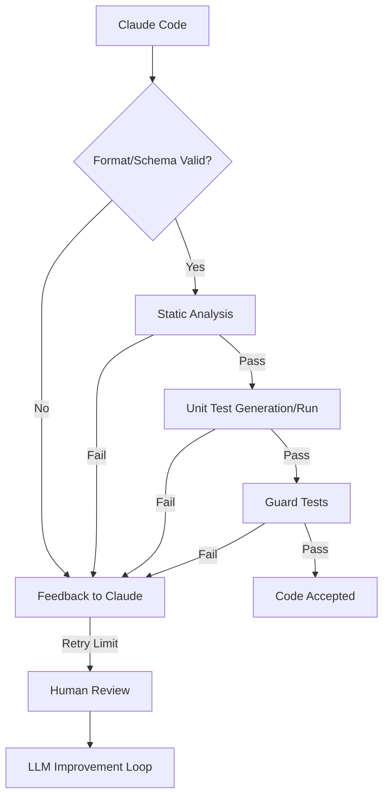

## Claude 코드 생성 신뢰성 강화: 확장된 검증 파이프라인

대규모 언어 모델(LLM)의 코드 생성 능력은 빠르게 발전하고 있지만, 특히 복잡한 코드베이스 작업에서 Claude와 같은 모델은 불완전한 코드, 스텁(stub), 또는 환각(hallucination)된 결과물을 생성하여 신뢰성 문제를 야기한다. 이는 개발 생산성을 저해하고 디버깅 비용을 증가시키므로, LLM 생성 코드의 신뢰성을 확보하기 위한 강력한 검증 파이프라인이 필수적이다.

## 기존 LLM 출력 검증의 한계와 코드 특화 검증

기존 LLM 출력 검증 파이프라인은 주로 MDX 유효성 검사, Zod 스키마 검증 등으로 형식적 일관성을 확보한다. 그러나 코드의 문법적 올바름, 기능적 정확성, 기존 코드베이스와의 조화는 깊이 있게 검증하기 어렵다. 코드 생성의 특수성을 고려할 때, 형식적 유효성을 넘어선 의미론적/기능적 검증 메커니즘이 요구된다.

## 확장된 코드 생성 검증 파이프라인 아키텍처

Claude 코드의 신뢰성을 높이기 위해, 기존 파이프라인에 정적 분석, 단위 테스트 자동 생성 및 실행, 코드 구조 및 의도 일치 확인을 위한 가드 테스트(Guard Tests)를 통합한다.

### 1. 정적 분석 도구 통합: Linter & Type Checker

ESLint, Prettier, TypeScript 컴파일러(tsc), Pylint, Black 등 정적 분석 도구를 통합하여 LLM 생성 코드의 스타일, 잠재적 버그, 타입 불일치를 자동 감지하고 코딩 표준 준수를 유도한다.

```typescript
// runStaticAnalysis.ts
import { exec } from 'child_process';
import path from 'path';

async function runStaticAnalysis(codeFilePath: string): Promise<boolean> {
  const ext = path.extname(codeFilePath);
  const cmd = (ext === '.ts' || ext === '.js') ? `eslint --fix ${codeFilePath} && tsc --noEmit ${codeFilePath}` : `pylint ${codeFilePath}`;
  return new Promise(resolve => {
    exec(cmd, (error, stdout, stderr) => {
      if (error) { console.error(`Static analysis failed: ${stderr}`); resolve(false); }
      resolve(true);
    });
  });
}
```

### 2. 단위 테스트 자동 생성 및 실행

LLM이 생성한 코드의 명세나 주석을 기반으로 간단한 단위 테스트를 자동으로 생성하고 실행한다. 이는 LLM이 제시하는 "완료" 상태가 실제 기능 구현을 의미하는지 확인하는 게이트웨이 역할을 한다. Jest, Vitest, Pytest 등을 활용한다.

```typescript
// runUnitTests.ts
import { exec } from 'child_process';
import fs from 'fs/promises';

async function generateAndRunUnitTests(code: string, funcName: string): Promise<boolean> {
  const tempModulePath = '/tmp/temp_module.ts';
  const tempTestPath = '/tmp/temp_module.test.ts';
  const testContent = `import { ${funcName} } from './temp_module'; describe('${funcName}', () => { it('should pass', () => { expect(${funcName}(1,1)).toBe(2); }); });`; // Simplified
  try {
    await fs.writeFile(tempModulePath, code);
    await fs.writeFile(tempTestPath, testContent);
    return new Promise(resolve => {
      exec(`npx jest ${tempTestPath}`, (error, stdout, stderr) => {
        if (error) { console.error(`Unit tests failed: ${stderr}`); resolve(false); }
        resolve(true);
      });
    });
  } catch (e) { console.error('Test setup error:', e); return false; }
}
```

### 3. 가드 테스트 도입: 코드 구조 및 의도 일치 확인

LLM의 환각, 스텁 코드 문제에 대응하기 위해, 특정 함수/클래스 정의, 필수 인터페이스 구현, 중요 로직 누락 여부 등을 정적으로 검사하는 '가드 테스트(Guard Tests)'를 도입한다. 이는 요구사항의 핵심 기능 존재 여부를 확인한다.

```typescript
// runGuardTests.ts
function checkGuardConditions(code: string): boolean {
  let passed = true;
  if (!code.includes('async function processData')) { console.error("Missing 'processData'"); passed = false; }
  if (code.includes('// TODO: Implement')) { console.error("Found 'TODO'"); passed = false; }
  return passed;
}
```

## 검증 파이프라인의 통합 흐름

확장된 검증 파이프라인은 각 단계에서 실패 시 LLM에게 수정 요청을 보내는 피드백 루프를 포함하며, 반복적인 실패 시 인간 개발자의 개입을 유도하여 효율성을 극대화한다.



## 트레이드오프

*   **초기 설정 비용 vs. 장기적 신뢰성/생산성**: 
    *   **좋음**: 대규모/Critical 코드 생성 시, 디버깅/유지보수 비용 절감.
    *   **나쁨**: 프로토타입/일회성 스크립트. 과도한 검증으로 속도 저하.
*   **복잡도 증가 vs. LLM 환각/스텁 감소**:
    *   **좋음**: LLM 환각/미완성 코드 빈번 시, 조기 감지로 개발자 피로도 감소.
    *   **나쁨**: LLM 신뢰도가 높거나 코드가 단순할 때. 불필요한 복잡성.
*   **LLM 피드백 지연 vs. 수정 정확도 향상**:
    *   **좋음**: LLM 오류 유형 다양 시, 구조화된 피드백으로 학습 효과 증대.
    *   **나쁨**: 즉각적 응답 중요 시. 개발 흐름 방해.
*   **컴퓨팅 자원 소모 vs. 버그 발생률 감소**:
    *   **좋음**: 프로덕션 코드 품질 최우선, 버그/보안 취약점 극도로 경계 시.
    *   **나쁨**: 리소스 제약 심하거나 실험적 환경. 자원 및 시간 소모 부담.

## 실전 체크리스트

Claude 코드 생성 신뢰성 강화를 위해 다음 항목들을 검토한다.

*   [ ] **정적 분석 통합**: Linter, Formatter, Type Checker가 LLM 출력 코드에 대해 CI/CD 또는 워크플로우에 자동 실행되도록 통합되었는가?
*   [ ] **단위 테스트 자동화**: LLM 생성 코드의 명세 기반 단위 테스트를 자동으로 생성하고 실행하는 로직이 구현되었는가?
*   [ ] **가드 테스트 정의**: 핵심 함수/클래스 정의, 필수 로직 포함, 스텁/플레이스홀더 부재 등을 검사하는 가드 테스트가 작성되었는가?
*   [ ] **오류 피드백 루프**: 검증 실패 시 원인을 파악하여 LLM에게 자동으로 수정 요청을 보낼 수 있는 피드백 메커니즘이 설계되었는가?
*   [ ] **인간 개입 트리거**: LLM의 반복 실패 시, 인간 개발자 개입을 요청하는 알림/에스컬레이션 절차가 마련되었는가?
*   [ ] **성능/비용 모니터링**: 파이프라인 추가로 인한 LLM 호출 비용 및 개발 주기 지연을 모니터링하고 최적화 방안을 검토하는가?
*   [ ] **버전 관리/추적**: LLM 생성 코드, 검증 결과, 수정 이력을 효과적으로 버전 관리하고 추적할 수 있는 시스템이 구축되었는가?