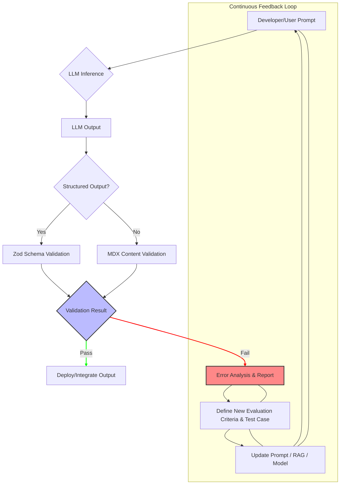

대규모 언어 모델(LLM)은 비약적인 발전을 거듭하며 다양한 애플리케이션에 통합되고 있습니다. 그러나 LLM의 출력은 본질적으로 비결정적(non-deterministic)이며, 주관적인 요소와 복잡한 추론 과정으로 인해 예상치 못한 오류를 발생시킬 수 있습니다. 전통적인 소프트웨어 개발에서 사후(post-hoc) 검증 방식만으로는 이러한 LLM 고유의 문제를 해결하기 어렵습니다. 여기서 평가 주도 개발(Evaluation-Driven Development, EDD) 방법론의 도입이 핵심적인 해결책으로 부상합니다. Airbnb의 사례에서 볼 수 있듯이, EDD는 평가를 단순한 사후 검증 단계를 넘어 핵심 엔지니어링 규율로 승격시켜, LLM 출력의 신뢰성과 안정성을 확보하는 데 기여합니다. 

## 평가 주도 개발(EDD)의 핵심 원칙

EDD의 기본 원칙은 실제 운영 환경이나 개발 과정에서 발견된 오류를 구체적인 평가 기준으로 전환하고, 이를 자동화된 테스트 케이스로 만들어 지속적으로 검증하는 것입니다. 이는 LLM이 잘못된 정보를 생성(hallucination)하거나, 주어진 스키마를 따르지 않거나, 특정 도구 호출에 실패하는 등 다양한 실패 시나리오를 체계적으로 포착하고 개선하는 데 필수적입니다. 이 과정은 다음과 같은 흐름으로 진행됩니다:

1.  **오류 발견 및 분석**: LLM 출력에서 발생하는 문제를 식별합니다.
2.  **평가 기준 정의**: 발견된 오류를 재현할 수 있는 명확하고 측정 가능한 평가 지표를 수립합니다.
3.  **테스트 케이스 구현**: 정의된 평가 기준을 기반으로 자동화된 테스트 코드를 작성합니다.
4.  **지속적 검증**: 개발 및 배포 파이프라인에 통합하여 지속적으로 LLM 출력을 검사합니다.
5.  **피드백 루프**: 평가 실패 시, LLM 프롬프트, 모델, 또는 RAG(Retrieval Augmented Generation) 전략을 개선하여 다시 평가 루프를 거동합니다.

이러한 순환적인 접근 방식은 LLM 기반 시스템의 품질을 점진적으로 향상시키고, 잠재적인 회귀(regression)를 방지하는 데 중요한 역할을 합니다.

## LLM 출력 검증 파이프라인에 EDD 적용

LLM 출력 검증 파이프라인에 EDD를 도입하는 것은 MDX 콘텐츠 유효성 검사 및 Zod 스키마 기반 데이터 검증을 통해 실현될 수 있습니다. 다음은 그 적용 전략입니다.

### 1. 오류 분석 및 평가 기준 정의

LLM이 생성하는 출력 유형과 그 과정에서 발생할 수 있는 오류를 체계적으로 분류하는 것이 첫 단계입니다. 예를 들어, 위키 엔트리를 생성하는 LLM의 경우 다음과 같은 오류 유형을 고려할 수 있습니다:

*   **MDX 형식 오류**: 잘못된 마크다운 문법, 깨진 코드 블록, 이미지 링크 누락 등.
*   **구조적 오류**: 필수 섹션 누락, 헤딩 레벨 불일치, 특정 요소의 부재 등.
*   **스키마 위반**: JSON 또는 YAML 출력 시 예상된 필드 누락, 데이터 타입 불일치, 추가적인 불필요한 필드 포함 등.
*   **내용적 오류**: Hallucination, 사실 왜곡, 관련 없는 정보 포함 등.

이러한 오류들을 구체적인 평가 지표와 테스트 케이스로 전환합니다. 예를 들어, '모든 MDX 파일은 ```js 코드 블록을 1개 이상 포함해야 한다'와 같은 규칙을 평가 기준으로 삼을 수 있습니다.

### 2. MDX Validation 루프 강화

LLM이 생성하는 MDX 콘텐츠는 문서의 구조와 가독성에 직접적인 영향을 미칩니다. `remark-lint`와 같은 도구를 활용하여 MDX의 구문 및 스타일 규칙을 자동으로 검증할 수 있습니다. 예를 들어, `remark-lint-heading-increment` 플러그인을 사용하여 헤딩 레벨이 올바르게 증가하는지 확인할 수 있고, `remark-lint-no-empty-url`을 통해 빈 URL을 방지할 수 있습니다. 

```typescript
import { remark } from 'remark';
import remarkLint from 'remark-lint';
import remarkPresetLintRecommended from 'remark-preset-lint-recommended';

async function validateMdx(mdxContent: string) {
  const file = await remark()
    .use(remarkLint)
    .use(remarkPresetLintRecommended)
    .process(mdxContent);

  if (file.messages.length > 0) {
    console.error('MDX Validation Errors:');
    file.messages.forEach(msg => {
      console.error(`- ${msg.ruleId}: ${msg.message} (Line ${msg.line}:${msg.column})`);
    });
    return false;
  } else {
    console.log('MDX content is valid.');
    return true;
  }
}

// Example LLM generated MDX content
const badMdx = `
# Title

### Subtitle

This is some content.

## Another Section

No code block here.
`;

const goodMdx = `
# Title

## Subtitle

This is some content.

This is a code block:

```javascript
console.log("Hello, world!");
```
`;

// await validateMdx(badMdx);
// await validateMdx(goodMdx);
```

이러한 MDX 검증은 CI/CD 파이프라인에 통합되어 LLM이 생성한 콘텐츠가 병합되기 전에 자동으로 품질을 검증합니다.

### 3. Zod Schema를 통한 타입 안전성 보장

LLM이 JSON이나 YAML과 같은 구조화된 데이터를 생성하는 경우, Zod와 같은 런타임 스키마 검증 라이브러리는 필수적입니다. Zod는 TypeScript-first 디자인으로, LLM 출력의 예상되는 구조와 타입을 정의하고 런타임에 이를 검증하여 타입 안전성을 보장합니다. 이는 LLM이 스키마를 따르지 않는 출력을 생성하는 '스키마 환각(schema hallucination)'을 방지하는 데 매우 효과적입니다.

다음은 Zod 스키마를 사용하여 LLM 출력 JSON을 검증하는 TypeScript 코드 예시입니다.

```typescript
import { z } from 'zod';

// Define the schema for the expected LLM output
const LLMProfileSchema = z.object({
  name: z.string().min(1, "Name cannot be empty"),
  age: z.number().int().positive("Age must be a positive integer"),
  email: z.string().email("Invalid email format"),
  interests: z.array(z.string()).min(1, "At least one interest is required"),
  bio: z.string().optional()
}).strict("LLM output contains unexpected fields."); // Disallow unknown fields for strict validation

// Example LLM outputs
const validLLMOutput = {
  name: "Alice Smith",
  age: 30,
  email: "alice@example.com",
  interests: ["coding", "reading", "hiking"]
};

const invalidLLMOutputMissingField = {
  name: "Bob Johnson",
  email: "bob@example.com",
  interests: ["gaming"]
};

const invalidLLMOutputWrongType = {
  name: "Charlie Brown",
  age: "twenty", // Should be a number
  email: "charlie@example.com",
  interests: ["drawing"]
};

const invalidLLMOutputUnexpectedField = {
  name: "David Lee",
  age: 25,
  email: "david@example.com",
  interests: ["music"],
  country: "USA" // Unexpected field given .strict()
};

console.log("--- Valid Output Test ---");
try {
  LLMProfileSchema.parse(validLLMOutput);
  console.log("Validation successful.");
} catch (error) {
  console.error("Validation failed:", error);
}

console.log("\n--- Missing Field Test ---");
try {
  LLMProfileSchema.parse(invalidLLMOutputMissingField);
  console.log("Validation successful (should fail).");
} catch (error) {
  console.error("Validation failed (expected):");
  // if (error instanceof z.ZodError) { console.error(error.errors); }
}

console.log("\n--- Wrong Type Test ---");
try {
  LLMProfileSchema.parse(invalidLLMOutputWrongType);
  console.log("Validation successful (should fail).");
} catch (error) {
  console.error("Validation failed (expected):");
  // if (error instanceof z.ZodError) { console.error(error.errors); }
}

console.log("\n--- Unexpected Field Test ---");
try {
  LLMProfileSchema.parse(invalidLLMOutputUnexpectedField);
  console.log("Validation successful (should fail).");
} catch (error) {
  console.error("Validation failed (expected):");
  // if (error instanceof z.ZodError) { console.error(error.errors); }
}
```

### 4. 지속적인 평가 및 피드백 루프

EDD의 핵심은 이러한 검증 단계를 CI/CD 파이프라인에 통합하여 지속적으로 실행하는 것입니다. LLM 출력 검증에 실패하면, 개발자에게 즉각적인 피드백을 제공하고, 해당 실패 사례를 새로운 테스트 케이스로 추가하여 평가 기준을 강화합니다. 이 피드백은 LLM 프롬프트 템플릿 최적화, RAG 문서 업데이트, 심지어 LLM 모델 자체의 미세 조정으로 이어질 수 있습니다.

다음 Mermaid 다이어그램은 EDD 기반 LLM 검증 파이프라인의 전체적인 흐름을 보여줍니다.



## 트레이드오프

EDD를 LLM 출력 검증 파이프라인에 도입할 때는 다음과 같은 트레이드오프를 고려해야 합니다.

*   **초기 구축 비용 vs 장기적 안정성**: 초기에는 평가 기준 정의, 테스트 케이스 구현, 파이프라인 통합에 상당한 시간과 자원이 소요됩니다. 이는 단기적인 MVP(Minimum Viable Product) 개발에는 부담이 될 수 있습니다. 하지만 장기적으로는 LLM 출력의 예측 불가능성으로 인한 잠재적 버그와 기술 부채를 크게 줄여, 운영 안정성과 유지보수 비용을 절감합니다. 따라서, **초기 프로토타이핑이나 실험적인 기능에는 부적합하지만, 프로덕션 환경에서 높은 신뢰성이 요구되는 핵심 LLM 애플리케이션에는 필수적입니다.**
*   **엄격한 평가 기준 vs LLM의 유연성 및 창의성**: 매우 엄격한 평가 기준은 LLM이 정해진 형식과 규칙을 따르도록 강제하여 출력의 일관성을 높입니다. 그러나 이는 LLM의 고유한 유연성과 창의적인 잠재력을 제한할 수 있습니다. 예를 들어, 시(Poetry)나 자유 형식의 에세이와 같이 정답이 모호하고 창의성이 중요한 LLM 태스크에는 엄격한 스키마 검증이 부적합할 수 있습니다. **정확한 정보 전달이나 특정 데이터 구조가 중요한 태스크(예: 코드 생성, 요약, 데이터 추출)에 유리하며, 창의적이고 탐색적인 LLM 활용 시에는 보다 유연한 평가 기준이 필요합니다.**
*   **자동화된 평가의 범위 vs 복잡한 주관적 판단**: MDX 형식 검증이나 Zod 스키마 검증과 같은 객관적이고 규칙 기반의 오류는 자동화된 평가로 효과적으로 처리됩니다. 하지만 내용의 정확성, 문맥 적합성, 윤리적 편향 등 고차원적이고 주관적인 품질 평가는 자동화가 어렵거나, 고도화된 LLッジ(LLM-as-a-Judge) 모델이 필요합니다. **구조적, 형식적 오류 방지에는 탁월하지만, 복잡한 의미론적/주관적 품질 판단에는 한계가 있으며, 인간 개입(Human-in-the-Loop)이 여전히 중요합니다.**
*   **성능 오버헤드 vs 품질 보증**: LLM 출력에 대한 광범위한 평가를 파이프라인에 통합하는 것은 추가적인 계산 및 시간 오버헤드를 발생시킬 수 있습니다. 이는 실시간 응답이 중요한 애플리케이션에서는 사용자 경험에 영향을 미칠 수 있습니다. **높은 품질이 핵심적인 서비스에서는 필수적인 투자이지만, 지연 시간에 민감한 애플리케이션에서는 평가 로직의 최적화나 비동기 처리 전략이 요구됩니다.**
*   **평가 기준 유지보수 vs 정적 코드**: LLM의 능력과 요구사항이 발전함에 따라 평가 기준과 테스트 케이스도 지속적으로 업데이트해야 합니다. 이는 정적 코드 베이스를 관리하는 것보다 더 많은 유지보수 노력을 요구할 수 있습니다. **LLM 기반 시스템이 지속적으로 진화하는 환경에서는 필수적인 과정이나, '한 번 설정하면 끝'이라는 접근 방식으로는 실패할 수 있습니다.**

## 실전 체크리스트

EDD 방법론을 LLM 출력 검증 파이프라인에 성공적으로 적용하기 위한 실전 체크리스트입니다.

*   [ ] 현재 LLM 출력에서 발생하는 주요 오류 유형(예: Hallucination, 형식 오류, 스키마 위반, 불완전한 응답)을 5가지 이상 식별하고 명확하게 문서화했는가?
*   [ ] 식별된 각 오류 유형에 대해 객관적이고 측정 가능한(예: 특정 키워드 부재, Zod validation 실패율 < 1%, MDX Lint 에러 0건) 평가 기준을 정의하고 이를 테스트 케이스로 구현했는가?
*   [ ] LLM이 생성하는 MDX 콘텐츠의 구조적 및 문법적 유효성 검사를 위해 `remark-lint` 또는 유사한 도구를 CI/CD 파이프라인에 통합하고, 핵심 규칙 세트를 적용했는가?
*   [ ] LLM의 구조화된 출력(JSON, YAML 등)을 위한 Zod (또는 Pydantic 등) 스키마를 정의하고, 모든 주요 LLM 출력에 대해 런타임 스키마 검증 로직을 구현했는가?
*   [ ] 평가 실패 시, 해당 실패를 즉시 감지하고 개발자에게 알림을 제공하며, LLM 프롬프트, RAG 데이터, 또는 모델 미세 조정을 위한 자동화된 피드백 루프(예: 실패 로그 기반 프롬프트 자동 업데이트 제안)가 작동하는가?
*   [ ] LLM 출력 검증 파이프라인의 성능 오버헤드를 정기적으로 측정하고, 핵심 사용자 흐름에 대한 지연 시간이 허용 가능한 SLA(Service Level Agreement) 내에서 유지되는지 확인했는가?
*   [ ] 새로운 오류 유형 발견 시, 평가 기준 및 테스트 케이스를 신속하게 업데이트하고 파이프라인에 통합하는 명확한 프로세스를 수립했는가?
*   [ ] 정기적인 LLM 출력 평가 보고서를 생성하여 시간 경과에 따른 LLM 품질 변화 추이를 모니터링하고, 주요 메트릭에 대한 목표치를 설정했는가?