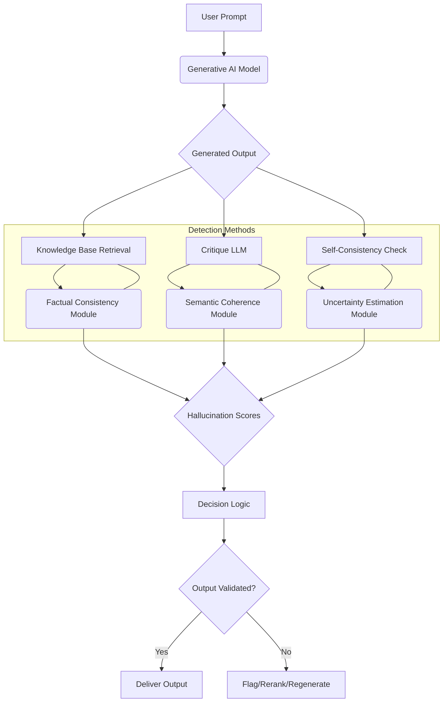

생성형 AI 모델의 환각(Hallucination) 현상은 모델이 사실과 다른, 비논리적이거나 원본 데이터에 없는 내용을 생성하는 오류를 의미한다. 이는 모델의 신뢰성(Trustworthiness)과 유용성을 심각하게 저해하며, 특히 의료, 금융, 법률 등 민감한 분야에서는 치명적인 결과를 초래할 수 있다. 따라서 생성형 AI 모델의 환각 현상을 자동으로 탐지하고 효과적으로 평가하는 기술은 모델의 신뢰성을 확보하고 실제 서비스에 도입하기 위한 핵심적인 과제이다.

## 환각 현상의 유형과 중요성

환각은 다양한 형태로 나타날 수 있다:

*   **사실적 환각(Factual Hallucination)**: 실제 세계의 사실과 모순되는 정보를 생성한다. (예: 잘못된 날짜, 인명, 지리 정보)
*   **내부 일관성 환각(Internal Consistency Hallucination)**: 생성된 텍스트 내부에서 앞뒤 내용이 모순되거나 비논리적인 흐름을 보인다.
*   **소스 비충실도 환각(Source Unfaithfulness Hallucination)**: RAG(Retrieval Augmented Generation)와 같이 특정 소스 문서를 기반으로 답변을 생성할 때, 소스에 없는 내용을 포함하거나 소스 내용을 왜곡한다.
*   **환상적 환각(Fanciful Hallucination)**: 완전히 허구적인 인물, 사건, 개념 등을 만들어낸다.

이러한 환각 현상은 사용자 경험을 저해하고, 잘못된 의사결정을 유도하며, 심지어 법적 문제로 이어질 수 있으므로, 모델 개발 단계부터 배포 후 운영 단계까지 지속적인 탐지와 평가가 필수적이다.

## 자동 탐지 및 평가 방법론

환각 현상을 자동으로 탐지하고 평가하는 방법은 크게 레퍼런스 기반(Reference-based)과 레퍼런스 프리(Reference-free) 방식으로 나눌 수 있다.

### 1. 레퍼런스 기반(Reference-based) 탐지

생성된 내용이 외부 지식 베이스(External Knowledge Base)나 검색된 문서(Retrieved Documents)와 얼마나 일치하는지 비교하는 방식이다.

*   **RAG 기반 사실 확인(Factual Verification)**: 생성된 텍스트의 핵심 사실(factoid)을 추출하고, 이를 사전에 검색된 신뢰할 수 있는 문서나 지식 그래프(Knowledge Graph)의 내용과 비교하여 일치 여부를 판단한다. 불일치하는 부분이 많을수록 환각 가능성이 높다고 판단한다.
*   **메트릭 기반 평가**: ROUGE, BLEU, METEOR와 같은 전통적인 NLG(Natural Language Generation) 평가 메트릭은 레퍼런스 텍스트와의 단어 및 구문 일치도를 측정하지만, 단순한 단어 일치만으로는 복잡한 사실 관계나 맥락적 오류를 완전히 탐지하기 어렵다. BERTScore, MoverScore 등 임베딩 기반(Embedding-based) 유사도 메트릭은 의미론적 일치도를 더 잘 포착할 수 있다.

### 2. 레퍼런스 프리(Reference-free) 탐지

외부 레퍼런스 없이 생성된 텍스트 자체의 일관성이나 모델의 내부 상태를 분석하여 환각을 탐지하는 방식이다.

*   **자체 일관성 검사(Self-Consistency Check)**: 동일한 프롬프트에 대해 모델이 여러 번 응답을 생성하도록 하고, 이들 응답 간의 일관성을 측정한다. 응답들이 서로 크게 다를 경우, 모델이 해당 정보에 대해 확신하지 못하거나 환각을 일으킬 가능성이 높다고 판단한다. 클러스터링(Clustering) 기법이나 투표(Voting) 방식을 활용할 수 있다.
*   **비평 모델(Critique Model, LLM-as-a-Judge)**: 더 크고 강력한 다른 LLM을 사용하여 주 모델의 출력물을 평가하는 방식이다. 비평 모델에게 사실 확인, 논리적 일관성, 맥락 적합성 등을 평가하도록 프롬프트를 설계하여 점수나 판단을 얻는다. 2026년에는 이러한 비평 모델이 특정 도메인에 특화된 전문가 LLM으로 발전하여, 더욱 정교한 평가가 가능해질 것으로 예상된다.
*   **불확실성 추정(Uncertainty Estimation)**: 모델이 특정 토큰을 생성할 때의 확률 분포(Probability Distribution)나 엔트로피(Entropy)를 분석한다. 낮은 확률로 생성된 토큰이나 높은 엔트로피를 보이는 부분은 모델의 불확실성을 나타내며, 이는 환각으로 이어질 수 있다. Conformal Prediction과 같은 기법을 활용하여 예측의 신뢰 구간을 제공할 수도 있다.

### 코드 예제: 간단한 RAG 기반 사실 확인 (Python)

아래는 생성된 텍스트의 문장이 원본 소스 문서에 존재하는지 간단하게 확인하는 Python 코드 예시이다. 실제 시나리오에서는 더 복잡한 NLP 기술과 임베딩 유사도 비교가 필요하다.

```python
import re
from typing import List

def simple_factual_check(generated_text: str, source_documents: List[str]) -> bool:
    """
    Checks if key facts from generated_text are present in source_documents.
    This is a very basic example; real-world solutions would use NLP techniques.
    """
    generated_sentences = re.split(r'(?<=[.!?]) +', generated_text)
    
    hallucinations_detected = 0
    total_facts_checked = 0

    for sentence in generated_sentences:
        if len(sentence) < 10: # Skip very short sentences
            continue
        
        is_fact_found = False
        for doc in source_documents:
            if sentence.strip().lower() in doc.lower():
                is_fact_found = True
                break
        
        if not is_fact_found:
            hallucinations_detected += 1
        total_facts_checked += 1
            
    if total_facts_checked == 0:
        return False # No facts to check
    
    hallucination_ratio = hallucinations_detected / total_facts_checked
    print(f"Hallucination ratio: {hallucination_ratio:.2f}")
    return hallucination_ratio > 0.3 # Example threshold for flagging

# Example Usage
generated_output = "The capital of France is Paris. The Eiffel Tower is in Rome."
sources = [
    "Paris is the capital and most populous city of France.",
    "The Eiffel Tower is located in Paris, France."
]

print(f"Hallucination detected: {simple_factual_check(generated_output, sources)}")

generated_output_correct = "The capital of France is Paris. The Eiffel Tower is in Paris."
print(f"Hallucination detected (correct): {simple_factual_check(generated_output_correct, sources)}")
```

### 자동화된 환각 탐지 파이프라인

환각 탐지 시스템은 사용자 프롬프트부터 최종 출력까지 여러 단계를 거치며 작동한다.



## 2026년 최신 트렌드: 실시간 탐지 및 설명 가능한 AI

2026년에는 환각 탐지 기술이 더욱 고도화되어 다음과 같은 방향으로 발전할 것이다.

*   **실시간, 온디맨드 환각 탐지(Real-time, On-demand Hallucination Detection)**: 모델 추론(Inference) 과정에 직접 통합되어, 출력이 생성되는 즉시 잠재적 환각을 탐지하고 사용자에게 경고하거나 대안을 제시한다.
*   **적대적 강건성 테스트(Adversarial Robustness Testing)**: 환각을 유발하는 프롬프트(Adversarial Prompt)를 자동으로 생성하고, 이를 통해 모델의 취약점을 파악하여 사전적으로 개선하는 연구가 활발해질 것이다.
*   **멀티모달 환각 탐지(Multimodal Hallucination)**: 텍스트뿐만 아니라 이미지, 비디오, 오디오 등 멀티모달(Multimodal) 생성형 AI 모델에서 발생하는 환각 현상(예: 이미지의 비정상적인 객체 생성)을 탐지하는 기술이 중요해진다.
*   **설명 가능한 AI (XAI)를 통한 환각 분석**: 환각이 발생했을 때, 어떤 부분이 왜 환각인지, 그리고 어떤 내부 파라미터나 외부 입력 때문에 발생했는지 그 원인을 설명하는 XAI 기법이 발전하여 모델 디버깅(Debugging) 및 개선에 기여한다.
*   **MLOps 툴링 통합**: 환각 탐지 및 평가 메트릭이 MLOps(Machine Learning Operations) 파이프라인에 깊숙이 통합되어, 모델 배포 후 지속적인 모니터링, 자동화된 재학습 트리거, 이상 징후 알림 등을 제공한다.

## 트레이드오프

환각 탐지 및 평가 방법론 선택 시 고려해야 할 주요 트레이드오프는 다음과 같다.

*   **레퍼런스 기반(예: RAG 기반 검증)**
    *   **언제 좋은가**: 높은 사실 정확성(Factual Accuracy)이 필수적이고, 신뢰할 수 있으며 포괄적인 지식 베이스(Knowledge Base)가 존재할 때 매우 효과적이다. 탐지된 오류에 대한 명확한 근거를 제시하여 설명 가능성(Explainability)이 높다.
    *   **언제 나쁜가**: 지식 베이스가 불완전하거나, 오래되었거나, 실시간으로 업데이트하기 어려울 때 제한적이다. 지식 베이스의 범위와 품질에 크게 의존한다.

*   **LLM-as-a-Judge (비평 모델)**
    *   **언제 좋은가**: 명확한 사실적 레퍼런스가 없거나, 주관적인 평가(예: 의미론적 일관성, 문체 적합성)가 필요할 때 유용하다. 다양한 콘텐츠 유형과 미묘한 오류를 평가하는 데 유연하다.
    *   **언제 나쁜가**: API 호출 비용이 높고(두 번째 LLM 사용), 비평 LLM 자체의 편향(Bias)이나 '메타 환각(Meta-hallucination)' 위험을 내포한다. 판단 근거에 대한 설명 가능성이 낮을 수 있다.

*   **자체 일관성/다중 샘플링(Self-Consistency/Multi-Sampling)**
    *   **언제 좋은가**: 외부 레퍼런스 없이 모델 내부의 논리적 모순이나 모호성을 탐지하는 데 효과적이다. 모델의 '자신감(Confidence)' 척도를 간접적으로 제공할 수 있다.
    *   **언제 나쁜가**: 여러 응답을 생성해야 하므로 계산 비용(Computational Cost)이 높다. 모델이 '확신을 가지고' 잘못된 내용을 일관되게 생성할 경우 탐지하기 어렵다.

*   **불확실성 추정(예: 엔트로피, 신뢰도 점수)**
    *   **언제 좋은가**: 생성 과정에서 잠재적 문제를 빠르게, 그리고 저비용으로 식별할 수 있다. 모델의 출력 파이프라인에 직접 통합하기 용이하다.
    *   **언제 나쁜가**: 불확실성이 반드시 사실적 오류를 의미하지는 않는다. 모델이 '자신감을 가지고' 잘못된 응답을 생성할 경우(즉, 불확실성이 낮을 경우) 환각을 탐지하지 못할 수 있다.

## 실전 체크리스트

프로젝트에 생성형 AI 환각 탐지 및 평가 방법을 적용할 때 다음 항목들을 검증해야 한다.

*   [ ] 사용 사례(Use Case)별 허용 가능한 환각 임계치(Hallucination Threshold)를 명확히 정의하고, 이를 바탕으로 평가 기준을 수립했는가?
*   [ ] 주기적인 데이터셋 업데이트 및 모델 재학습(Fine-tuning)을 통해 환각 발생률을 모니터링하고 줄이는 파이프라인이 구축되었는가?
*   [ ] 생성형 AI 모델의 출력에 대해 외부 지식 베이스(External Knowledge Base)와의 사실적 일관성 검증(Factual Consistency Verification) 로직을 통합했는가?
*   [ ] LLM-as-a-Judge 패턴을 활용하여 생성된 응답의 맥락적 적절성 및 비일관성을 평가하는 시스템을 구현했는가?
*   [ ] CI/CD(Continuous Integration/Continuous Deployment) 파이프라인에 자동화된 환각 지표(Hallucination Metric) 모니터링 및 경고 시스템을 포함하여 프로덕션 환경에서의 신뢰성을 확보했는가?
*   [ ] 사용자 피드백 메커니즘을 통해 탐지되지 않은 환각 사례를 수집하고 이를 평가 데이터셋 개선에 활용하는 루프(Loop)가 존재하는가?
*   [ ] 복잡한 도메인이나 전문 지식이 필요한 응답에 대해 전문가 리뷰(Human Expert Review) 단계를 포함하는 워크플로우를 설계했는가?