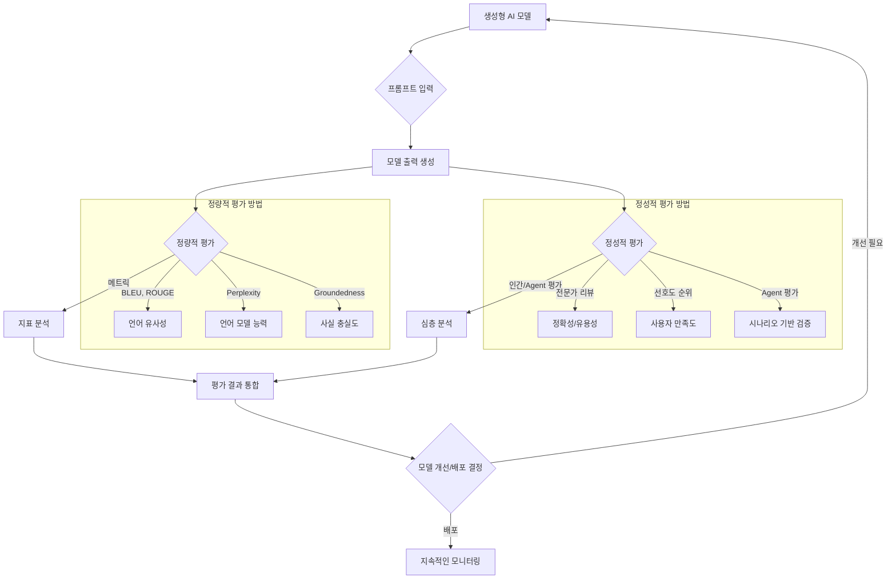

생성형 AI 모델의 발전은 전례 없는 가능성을 제시하지만, 동시에 그 성능을 효과적으로 검증하고 측정하는 데 복잡성을 더하고 있습니다. 특히 언어 모델(LLM)과 이미지 생성 모델 같은 생성형 AI는 예측 불가능한 출력과 주관적인 품질 기준을 가지므로, 기존의 분류나 회귀 모델 평가 방식으로는 한계가 있습니다. 이러한 모델이 실제 서비스에 배포되기 전, 그리고 배포 후에도 지속적으로 신뢰성과 유용성을 보장하기 위해서는 정량적 및 정성적 평가 방법론의 종합적인 이해와 적용이 필수적입니다.

## 생성형 AI 모델 평가의 중요성

생성형 AI 모델은 단순히 정확한 답을 내놓는 것을 넘어, '인간과 유사한', '창의적인', '일관성 있는' 출력을 생성하는 것이 목표입니다. 이로 인해 다음과 같은 측면에서 평가의 중요성이 부각됩니다.

*   **환각 (Hallucination) 방지**: 모델이 사실과 다른 정보를 생성하는 환각 현상은 사용자 신뢰를 크게 저해합니다. 이를 탐지하고 최소화하기 위한 평가가 중요합니다.
*   **안전성 및 편향 (Safety & Bias) 검증**: 유해하거나 편향된 콘텐츠 생성은 심각한 사회적, 윤리적 문제를 야기할 수 있습니다. 모델의 안전성과 공정성을 평가하는 것은 필수적입니다.
*   **사용자 경험 (User Experience) 최적화**: 모델의 출력 품질이 직접적으로 사용자 만족도에 영향을 미치므로, 실제 사용 시나리오에서의 유용성을 평가해야 합니다.
*   **비용 효율성 (Cost-Efficiency)**: 모델의 크기, 추론 속도, API 호출 비용 등 운영 비용과 성능 간의 균형점을 찾는 데 평가가 기여합니다.
*   **지속적인 개선 (Continuous Improvement)**: 모델 배포 후에도 성능 저하(Drift)나 새로운 취약점을 발견하고 개선하기 위한 모니터링 및 재평가 체계가 필요합니다.

## 정량적 평가 방법 (Quantitative Evaluation Methods)

정량적 평가는 모델의 성능을 객관적인 수치로 측정하여 비교하고 추이를 분석하는 데 사용됩니다.

### 메트릭 기반 평가 (Metric-Based Evaluation)

전통적인 자연어 처리(NLP) 메트릭은 생성형 AI에 부분적으로 적용될 수 있으나, 한계가 명확합니다.

*   **NLG 특정 메트릭**:
    *   **BLEU (Bilingual Evaluation Understudy)**, **ROUGE (Recall-Oriented Understudy for Gisting Evaluation)**, **METEOR (Metric for Evaluation of Translation with Explicit Ordering)**: 주로 기계 번역이나 요약에서 참조 텍스트와의 N-gram 중복을 통해 유사도를 측정합니다. 창의적이거나 다양한 답변을 선호하는 생성형 AI에서는 낮은 점수를 줄 수 있습니다.
    *   **Perplexity**: 언어 모델이 주어진 텍스트를 얼마나 잘 예측하는지 나타내는 지표입니다. 낮을수록 모델의 예측 능력이 우수합니다.
*   **LLM 특화 메트릭 (2026년 트렌드 반영)**:
    *   **Coherence & Fluency**: 출력의 논리적 일관성과 문법적 자연스러움을 측정합니다. Factual consistency (사실 일관성)는 RAG(Retrieval Augmented Generation) 모델에서 인용된 출처와 생성된 텍스트 간의 일치도를 평가합니다.
    *   **Groundedness**: 특히 RAG 모델에서 생성된 답변이 제공된 검색 결과 또는 소스 문서에 얼마나 충실한지를 평가합니다.
    *   **Safety Metrics**: 특정 키워드나 패턴을 탐지하여 유해하거나 편향된 콘텐츠의 생성을 측정합니다.
    *   **Novelty & Diversity**: 모델이 얼마나 새롭고 다양한 출력을 생성하는지 측정하는 지표입니다. 이는 창의적인 애플리케이션에서 중요합니다.

### 벤치마크 기반 평가 (Benchmark-Based Evaluation)

다양한 태스크와 도메인에 걸쳐 모델의 일반화된 능력을 평가합니다.

*   **범용 벤치마크**: **MMLU (Massive Multitask Language Understanding)**, **HELM (Holistic Evaluation of Language Models)**, **BIG-bench (Beyond the Imitation Game benchmark)**는 상식, 추론, 전문 지식 등 다양한 영역에서 LLM의 능력을 측정합니다.
*   **도메인 특화 벤치마크**: 특정 산업이나 용도에 맞게 설계된 데이터셋과 평가 지표를 활용합니다. (예: LegalBench, MedicalBench 등)
*   **합성 데이터셋 (Synthetic Datasets) 활용**: 실제 데이터 수집의 한계를 극복하기 위해 특정 시나리오를 반영한 합성 데이터를 생성하여 모델을 테스트하는 방식이 널리 활용되고 있습니다. 이는 새로운 트렌드로, 특히 엣지 케이스나 안전 시나리오 평가에 유용합니다.

## 정성적 평가 방법 (Qualitative Evaluation Methods)

정량적 메트릭만으로는 생성형 AI의 복잡한 뉘앙스를 포착하기 어렵습니다. 인간의 판단이나 심층 분석을 통해 모델의 품질을 평가하는 정성적 방법이 중요합니다.

### 인간 평가 (Human Evaluation)

*   **전문가 리뷰 (Expert Review)**: 도메인 전문가가 모델의 출력을 심층적으로 분석하여 정확성, 유용성, 창의성 등을 평가합니다. 초기 개발 단계 및 중요한 의사 결정에 필수적입니다.
*   **크라우드소싱 (Crowdsourcing)**: 대규모 인력을 활용하여 다양한 출력을 빠르게 평가합니다. 비용 효율적이나, 평가 가이드라인의 명확성과 평가자의 숙련도 관리가 중요합니다.
*   **A/B 테스팅 (A/B Testing)**: 두 가지 이상의 모델 버전 또는 프롬프트 전략을 실제 사용자에게 노출하여 선호도, 참여도 등의 사용자 지표를 비교합니다.
*   **선호도 순위 (Preference Ranking)**: 여러 모델의 출력을 동시에 보여주고 사용자에게 가장 선호하는 것을 선택하게 하여 순위를 매깁니다.

### Agent 기반 평가 (Agent-Based Evaluation)

2026년에는 LLM 에이전트가 자체적으로 다른 LLM의 출력을 평가하는 방식이 고도화될 것입니다. 에이전트는 특정 페르소나와 평가 기준을 부여받아 인간 평가자를 시뮬레이션하거나, 복잡한 시나리오를 자동으로 실행하며 모델의 응답을 검증할 수 있습니다.



### 코드 예시: RAG 모델의 Groundedness 평가 (Python)

아래 코드는 RAG(Retrieval Augmented Generation) 모델에서 생성된 답변의 Groundedness를 간단하게 측정하는 예시입니다. 생성된 답변이 참조 문서의 핵심 키워드를 포함하는지 확인하는 휴리스틱 접근 방식입니다. 실제 사용 시에는 더 복잡한 NLP 기술이나 LLM 기반 평가 툴이 필요합니다.

```python
import re

def evaluate_groundedness(generated_answer: str, retrieved_context: str) -> float:
    """
    RAG 모델의 Groundedness를 평가하는 간단한 함수.
    생성된 답변이 참조 컨텍스트의 핵심 키워드를 얼마나 포함하는지 측정.
    """
    if not retrieved_context:
        return 0.0 # 참조 컨텍스트가 없으면 Groundedness는 0

    # 컨텍스트에서 핵심 키워드 추출 (예: 명사, 주요 동사)
    # 실제로는 더 정교한 키워드 추출이나 임베딩 기반 유사도 측정 필요
    context_words = set(re.findall(r'\b\w+\b', retrieved_context.lower()))
    answer_words = set(re.findall(r'\b\w+\b', generated_answer.lower()))

    # 답변에 포함된 컨텍스트 키워드의 비율 계산
    grounded_words = context_words.intersection(answer_words)
    
    if not answer_words:
        return 0.0

    return len(grounded_words) / len(answer_words)

# 예시 사용
retrieved_context = "ChatGPT는 OpenAI가 개발한 대규모 언어 모델이다. 트랜스포머 아키텍처를 기반으로 한다."
generated_answer_good = "OpenAI의 ChatGPT는 트랜스포머 아키텍처를 사용하는 대규모 언어 모델이다."
generated_answer_bad = "ChatGPT는 구글에서 개발되었으며, 주로 이미지 생성에 사용된다."
generated_answer_partial = "ChatGPT는 OpenAI가 개발했다."

print(f"Good answer groundedness: {evaluate_groundedness(generated_answer_good, retrieved_context):.2f}") # 예상: 높음
print(f"Bad answer groundedness: {evaluate_groundedness(generated_answer_bad, retrieved_context):.2f}")   # 예상: 낮음
print(f"Partial answer groundedness: {evaluate_groundedness(generated_answer_partial, retrieved_context):.2f}") # 예상: 중간
```

이 예시는 기본적인 개념을 보여주며, 실제 프로덕션 환경에서는 `langchain`, `llamaindex`와 같은 프레임워크나 `ragas` 같은 전용 라이브러리를 활용하여 더욱 정교한 Groundedness 및 Factual Consistency 평가를 수행할 수 있습니다.

## 트레이드오프

생성형 AI 모델 평가에는 여러 가지 트레이드오프가 존재하며, 프로젝트의 목표와 리소스에 따라 최적의 균형점을 찾아야 합니다.

*   **자동화된 평가 vs. 인간 평가**:
    *   **언제 좋고**: 대규모 데이터셋에 대한 빠른 검증, 일관된 지표 추적, 비용 절감. 특히 초기 개발 단계나 모델 업데이트 후 회귀 테스트에 유용합니다.
    *   **언제 나쁜지**: 복잡한 뉘앙스, 창의성, 주관적인 품질, 문화적 맥락 등 인간의 심층적인 이해가 필요한 부분에서는 한계가 명확합니다. 환각, 편향 등 미묘한 문제를 놓칠 수 있습니다.
*   **범용 벤치마크 vs. 도메인 특화 메트릭**:
    *   **언제 좋고**: 모델의 일반적인 능력과 다양한 태스크에 대한 성능을 빠르게 파악하고, 다른 모델과 비교하는 데 유용합니다.
    *   **언제 나쁜지**: 특정 애플리케이션의 고유한 요구사항이나 도메인 지식을 정확히 반영하지 못할 수 있습니다. 실제 사용 시나리오에서의 성능을 과대평가하거나 과소평가할 위험이 있습니다.
*   **평가 속도 vs. 평가 깊이**:
    *   **언제 좋고**: 신속한 모델 반복(iteration)을 위해 빠르고 가벼운 평가 방식이 유리합니다. CI/CD 파이프라인에 통합하기 좋습니다.
    *   **언제 나쁜지**: 표면적인 평가만으로는 심각한 결함이나 잠재적 문제를 발견하기 어렵습니다. 모델의 행동 원리를 파악하거나 근본적인 문제점을 진단하기에는 부족합니다.
*   **비용 vs. 정확성**:
    *   **언제 좋고**: 제한된 예산 내에서 합리적인 수준의 평가를 수행해야 할 때. 크라우드소싱이나 간단한 자동화 메트릭이 적합합니다.
    *   **언제 나쁜지**: 고품질의 안전이 중요한 애플리케이션(예: 의료, 금융)에서는 평가의 정확성과 신뢰성이 최우선이므로, 비용이 많이 들더라도 전문가 평가와 포괄적인 테스트가 필요합니다.
*   **초기 모델 vs. 프로덕션 모델 평가**:
    *   **언제 좋고**: 초기 모델 개발 단계에서는 빠른 피드백 루프를 위해 간단한 메트릭과 소규모 인간 평가가 적합합니다.
    *   **언제 나쁜지**: 프로덕션 모델은 실제 사용자 트래픽과 다양한 입력 분포를 처리하므로, 실시간 모니터링, A/B 테스트, 드리프트 탐지 등 훨씬 강력하고 복합적인 평가 및 모니터링 체계가 요구됩니다.

## 실전 체크리스트

생성형 AI 모델 평가 전략을 수립하고 실행할 때 다음 체크리스트를 활용하여 효과적인 검증 프로세스를 구축할 수 있습니다.

*   [ ] **평가 목표 명확화**: 모델을 통해 달성하고자 하는 비즈니스 목표와 이에 상응하는 구체적인 평가 기준(예: 환각률 < 5%, 사용자 만족도 > 80%)을 정의했는가?
*   [ ] **메트릭 선정 및 가중치 부여**: 정량적 메트릭(BLEU, ROUGE, Groundedness 등)과 정성적 평가 기준(일관성, 창의성, 안전성)을 정의하고, 각 평가 항목의 중요도에 따라 적절한 가중치를 부여했는가?
*   [ ] **데이터셋 구축 및 관리**: 평가를 위한 골드 스탠더드(gold standard) 데이터셋, 엣지 케이스 데이터셋, 프롬프트 예시 등을 체계적으로 구축하고 버전을 관리하고 있는가?
*   [ ] **인간 평가 프로토콜 설계**: 인간 평가자(전문가, 크라우드워커)를 위한 명확한 평가 가이드라인, 루브릭, 평가 인터페이스, 그리고 평가자 간 일치도(Inter-rater Agreement) 측정 계획을 수립했는가?
*   [ ] **자동화된 평가 파이프라인 구축**: CI/CD에 통합될 수 있는 자동화된 평가 스크립트나 도구(예: `ragas`, `deepeval`)를 사용하여 모델 변경 시마다 회귀 테스트를 수행하고 있는가?
*   [ ] **Agent 기반 평가 도입 검토**: LLM 에이전트를 활용하여 복잡한 시나리오 기반 테스트, 안전성 테스트, 대규모 사용자 시뮬레이션 등을 자동화할 가능성을 탐색했는가?
*   [ ] **지속적인 모니터링 및 드리프트 탐지**: 모델 배포 후 실시간으로 모델의 성능 지표, 사용자 피드백, 그리고 데이터 드리프트나 개념 드리프트(Concept Drift)를 모니터링하고 알림을 설정했는가?
*   [ ] **평가 결과 시각화 및 보고**: 평가 결과를 이해하기 쉬운 형태로 시각화하고, 주요 이해관계자에게 정기적으로 보고하여 모델 개선 및 배포 의사결정에 활용하고 있는가?