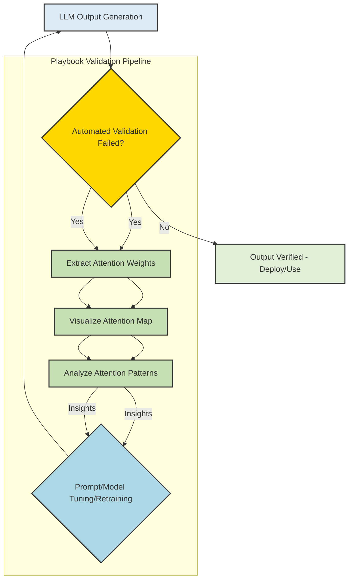

LLM (Large Language Model)이 생성하는 텍스트의 품질과 신뢰성은 현대 AI 애플리케이션의 핵심 성공 요소입니다. 그러나 LLM은 내부 동작이 불투명하여 출력이 예상과 다를 때 원인을 파악하고 디버깅하기 어렵다는 문제가 있습니다. 이때 LLM 어텐션 시각화(Attention Visualization)는 LLM이 특정 토큰을 생성할 때 입력 시퀀스의 어떤 토큰에 '집중(attend)'했는지 직관적으로 보여줌으로써 이러한 난제를 해결하는 강력한 도구로 부상하고 있습니다. 이 도구는 LLM의 '생각' 과정을 엿볼 수 있게 하여, 출력 검증 파이프라인을 강화하고 프롬프트 엔지니어링 및 모델 튜닝의 효율성을 극대화합니다.

## 어텐션 메커니즘과 시각화의 원리
Transformer 아키텍처 기반의 LLM은 셀프 어텐션(Self-Attention) 메커니즘을 통해 입력 시퀀스 내의 각 토큰이 다른 모든 토큰과의 관계를 학습합니다. 특정 출력 토큰을 생성할 때, LLM은 이전 입력 토큰들의 중요도를 계산하고 이를 가중치로 사용하여 새로운 토큰을 예측합니다. 어텐션 시각화 도구는 이러한 어텐션 가중치를 가시적으로 표현하여, 사용자가 LLM이 '왜' 특정 출력을 내었는지 이해하도록 돕습니다.

일반적으로 어텐션 시각화는 다음과 같은 방식으로 이루어집니다:
*   **토큰 참조 강조**: 생성된 특정 토큰을 클릭하거나 마우스를 올리면, 해당 토큰이 생성될 때 가장 크게 참조했던 이전 입력 토큰들이 시각적으로 강조됩니다 (예: 불투명도, 색상 강도). 참조 강도는 어텐션 가중치와 값 벡터(value vector)의 크기를 종합적으로 반영하여 계산됩니다.
*   **레이어/헤드 통합**: LLM은 여러 개의 어텐션 헤드와 레이어를 가지고 있습니다. 효과적인 시각화 도구는 이 모든 정보를 합산하여, 이전 토큰마다 하나의 통합된 참조 수치를 제공함으로써 복잡도를 줄이고 핵심적인 인사이트를 제공합니다.

## Playbook 출력 검증 파이프라인 통합
LLM 어텐션 시각화 도구를 `playbook`의 LLM 출력 검증 파이프라인에 통합하는 것은 LLM 워커의 신뢰성을 높이는 데 필수적입니다. 기존의 출력 검증은 주로 최종 결과물의 정확성만을 확인했지만, 어텐션 시각화를 통해 검증 실패의 근본 원인을 내부 동작에서 찾을 수 있습니다.

통합 과정은 다음과 같이 진행될 수 있습니다:
1.  **초기 검증 실패 감지**: `playbook`의 자동화된 검증 로직이 LLM 출력에서 오류(예: Hallucination, 불일치, 관련성 부족)를 감지합니다.
2.  **어텐션 가중치 추출**: 검증에 실패한 LLM 생성 과정에서 각 토큰의 어텐션 가중치를 추출합니다. 대부분의 LLM 라이브러리(예: Hugging Face Transformers)는 `output_attentions=True` 옵션을 통해 이를 지원합니다.
3.  **시각화 및 분석**: 추출된 어텐션 가중치를 시각화 도구로 분석합니다. 예를 들어, 잘못된 정보가 포함된 출력 토큰이 생성될 때, LLM이 어떤 잘못된 입력 토큰에 과도하게 집중했는지 또는 중요한 맥락을 놓쳤는지 파악합니다.
4.  **원인 진단 및 개선**: 분석된 어텐션 패턴을 기반으로 문제의 원인을 진단하고, 프롬프트 엔지니어링(프롬프트 내용 수정,Few-shot 예시 추가 등) 또는 모델 튜닝(특정 도메인 데이터로 Fine-tuning) 방향을 결정합니다.
5.  **재검증 및 워커 신뢰성 향상**: 개선된 프롬프트나 튜닝된 모델을 통해 다시 LLM 출력을 생성하고 검증하여, 워커의 전반적인 신뢰성을 향상시킵니다.

### 코드 예제: 어텐션 가중치 추출 (Conceptual Python)
```python
import torch
from transformers import AutoModelForCausalLM, AutoTokenizer

# 모델 및 토크나이저 로드 (예시: Mistral-7B)
model_name = "mistralai/Mistral-7B-Instruct-v0.2"
tokenizer = AutoTokenizer.from_pretrained(model_name)
# output_attentions=True 설정으로 어텐션 가중치 추출 활성화
model = AutoModelForCausalLM.from_pretrained(model_name, output_attentions=True)

# 입력 프롬프트
prompt = "The capital of France is Paris. The language spoken there is"
inputs = tokenizer(prompt, return_tensors="pt")

# 출력 생성 및 어텐션 가중치 추출
with torch.no_grad():
    outputs = model.generate(
        **inputs,
        max_new_tokens=5,
        num_beams=1,
        do_sample=False,
        output_attentions=True, # 어텐션 가중치 반환 설정
        return_dict_in_generate=True
    )

generated_tokens_ids = outputs.sequences[0]
generated_text = tokenizer.decode(generated_tokens_ids, skip_special_tokens=True)
attention_tuple = outputs.attentions # 각 레이어와 헤드의 어텐션 가중치 튜플

print(f"Generated text: {generated_text}")

# --- 어텐션 가중치 시각화 및 분석 (개념적 단계) ---
# attention_tuple은 (layer_idx, batch_idx, head_idx, query_len, key_len) 형태의 텐서 리스트
# 실제 시각화 도구는 이 데이터를 파싱하여 최종 토큰이 어떤 이전 토큰에 주목했는지 통합적으로 보여줌.
# 예를 들어, 마지막 생성 토큰(e.g., " French")이 "France" 또는 "Paris"에 강하게 어텐션했는지 분석.
# 이 과정은 시각화 라이브러리 또는 커스텀 스크립트를 통해 구현됩니다.
```

### LLM 출력 검증 워크플로우 (Mermaid)


## 트레이드오프
어텐션 시각화는 LLM 디버깅에 강력한 이점을 제공하지만, 도입 시 고려해야 할 트레이드오프가 존재합니다.

*   **향상된 디버깅 및 신뢰성 (Enhanced Debugging & Trust)**
    *   **언제 좋은가 (When Good)**: LLM의 Hallucination, Factuality 오류, 의도 불일치 등 복잡한 출력 오류의 근본 원인을 파악해야 할 때 매우 효과적입니다. 특히 금융, 의료, 법률 등 LLM의 의사결정 과정이 투명하게 공개되어야 하는 Critical Domain에서 모델의 신뢰성을 확보하고 설명력을 높이는 데 기여합니다.
    *   **언제 나쁜가 (When Bad)**: 단순한 오타, 문법 오류, 형식 불일치 등 경미하고 표면적인 문제에는 과도한 분석 도구가 될 수 있습니다. 매번 모든 출력에 대해 심층적인 시각화를 수행하면 개발 워크플로우에 불필요한 복잡성과 지연을 초래할 수 있습니다.
*   **성능 오버헤드 (Performance Overhead)**
    *   **언제 좋은가 (When Good)**: 개발 및 테스트 환경에서 심층적인 모델 분석 및 문제 해결을 위해 리소스 투입이 용인될 때 적합합니다. 또한, 프로덕션 환경에서 발생한 특정 고위험 오류에 대한 사후 분석(Post-mortem Analysis)에 활용될 수 있습니다.
    *   **언제 나쁜가 (When Bad)**: 실시간 응답 지연에 민감한 프로덕션 시스템에서 모든 LLM inference에 어텐션 가중치 추출 및 시각화 로직을 적용할 경우, 상당한 컴퓨팅 리소스 소비와 latency 증가를 유발합니다. 대규모 배치 처리나 저지연 애플리케이션에는 적합하지 않으며, 선별적인 적용이 필요합니다.
*   **해석의 복잡성 (Interpretation Complexity)**
    *   **언제 좋은가 (When Good)**: LLM 내부 구조와 어텐션 메커니즘에 대한 깊은 이해를 가진 Machine Learning Engineer나 연구자가 디버깅할 때 강력한 통찰력을 제공합니다. 복잡한 패턴 속에서 유의미한 상관관계를 발견하여 모델 개선 방향을 제시할 수 있습니다.
    *   **언제 나쁜가 (When Bad)**: LLM과 어텐션 메커니즘에 대한 전문 지식이 없는 사용자가 어텐션 맵을 해석하기 어려워 잘못된 결론을 내리거나 혼란을 겪을 수 있습니다. 효과적인 활용을 위해서는 시각화 도구의 직관성뿐만 아니라 사용자 교육 및 가이드라인이 필수적입니다.
*   **프롬프트 및 모델 튜닝 효율성 (Prompt & Model Tuning Efficiency)**
    *   **언제 좋은가 (When Good)**: 특정 입력 토큰에 대한 LLM의 잘못된 집중(mis-attention)을 명확하게 발견하여 프롬프트의 재구성(예: 중요한 정보 강조, 불필요한 정보 제거)이나 모델의 특정 레이어 튜닝 방향을 정확하게 제시할 때 유용합니다. 반복적인 시행착오를 줄이고 효율적인 개선 경로를 찾는 데 도움을 줍니다.
    *   **언제 나쁜가 (When Bad)**: 어텐션 메커니즘만으로는 LLM의 모든 복잡한 동작(예: 지식 추론, 외부 도구 사용)을 완전히 설명할 수 없습니다. 다른 해석 가능성 기법(예: activation patterns, neuron importance, LIME/SHAP)과 결합되지 않으면 부분적인 해결책에 그치거나, 어텐션 가중치의 변화가 항상 원하는 출력 변화로 이어지지 않을 수 있습니다.

## 실전 체크리스트
LLM 어텐션 시각화 도구를 프로젝트에 성공적으로 도입하고 활용하기 위한 실전 체크리스트입니다.

*   - [ ] **어텐션 가중치 추출 로직 통합**: LLM 출력 검증 파이프라인에 어텐션 가중치 추출 로직을 통합하고, 추출된 데이터의 형식(예: PyTorch Tensor, NumPy Array)과 저장 방식을 명세화했는가?
*   - [ ] **시각화 도구 선정 및 통합**: 선택한 어텐션 시각화 도구(예: open-source 라이브러리, 커스텀 개발 도구)가 모든 어텐션 헤드와 레이어의 정보를 효과적으로 통합하여 단일 토큰 참조 점수를 제공하며, 기존 시스템과 연동 가능한지 확인했는가?
*   - [ ] **해석 가이드라인 및 교육**: 시각화 결과 해석을 위한 내부 가이드라인 및 워크플로우를 수립하고, LLM 디버깅 및 프롬프트 엔지니어링을 담당하는 팀원들을 대상으로 어텐션 맵 해석 교육을 완료했는가?
*   - [ ] **성능 메트릭 정의 및 측정**: 어텐션 시각화 도입 전후의 LLM 출력 검증 및 디버깅 소요 시간(MTTD: Mean Time To Detect, MTTR: Mean Time To Resolve) 개선 효과를 측정할 수 있는 메트릭을 정의하고, 정기적으로 측정하고 있는가?
*   - [ ] **피드백 루프 설계**: 어텐션 시각화로부터 얻은 인사이트를 프롬프트 엔지니어링 또는 모델 미세 조정에 적용하기 위한 명확한 피드백 루프를 설계하고, 변경 사항이 LLM 출력 품질에 미치는 영향을 추적하는 시스템을 마련했는가?
*   - [ ] **프로덕션 환경 적용 계획**: 프로덕션 환경에 어텐션 시각화 기능을 도입할 경우, 추가적인 컴퓨팅 자원 및 Latency 증가에 대한 성능 벤치마킹과, 필수적인 경우에만 활성화하는 등의 최적화 계획을 수립했는가?
*   - [ ] **비정상 패턴 자동 탐지**: 특정 토큰에 과도하게 집중하거나, 관련 없는 토큰에 분산되는 현상과 같은 비정상적인 어텐션 패턴을 자동으로 탐지하고 알림을 발생시키는 시스템 구축을 고려했는가?