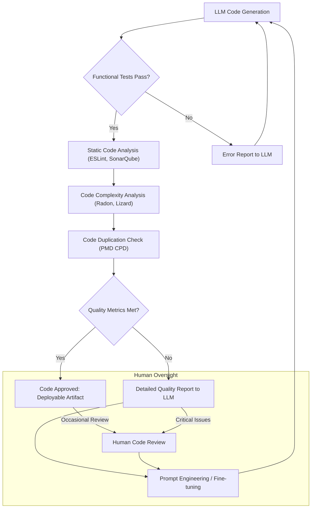

LLM(Large Language Model)이 생성한 코드는 종종 기능 테스트를 통과하지만, 인간 개발자가 작성한 코드와 비교했을 때 불필요한 추상화, 중복 로직, 그리고 바람직하지 않은 설계 패턴(code smell)을 포함하는 경우가 많습니다. 이러한 '조잡함(nastiness)'은 장기적인 유지보수 비용을 증가시키고, 기술 부채(technical debt)를 빠르게 누적시켜 프로젝트의 확장성을 저해합니다. 단순히 기능 동작 여부만을 검증하는 것을 넘어, 코드의 내부 품질을 측정하고 개선하는 파이프라인을 구축하는 것이 중요합니다.

## LLM 생성 코드의 '조잡함' 정의 및 문제점

'조잡함'은 다음과 같은 형태로 나타날 수 있습니다:

*   **불필요한 추상화 (Unnecessary Abstraction)**: 과도한 인터페이스, 제네릭, 디자인 패턴 적용으로 코드 이해도를 저해하고 복잡성을 증가시킵니다.
*   **중복 코드 (Code Duplication)**: 동일하거나 유사한 로직이 여러 곳에 반복되어 유지보수 시 오류 발생 가능성을 높이고 변경을 어렵게 합니다.
*   **나쁜 설계 (Poor Design)**: 낮은 응집도(Low Cohesion), 높은 결합도(High Coupling), 과도한 인자(Long Parameter List), 매직 넘버(Magic Numbers) 사용 등으로 코드 가독성과 확장성을 저해합니다.
*   **높은 복잡도 (High Complexity)**: 순환 복잡도(Cyclomatic Complexity)가 높은 함수나 클래스는 테스트 및 이해하기 어렵습니다.

이러한 문제점들은 LLM이 학습 데이터의 통계적 패턴을 따라가면서 최적의 '설계 의도(design intent)'보다는 '기능 구현'에 집중하기 때문에 발생하기 쉽습니다. 따라서 기능 검증을 넘어선 정교한 품질 검증 단계가 필수적입니다.

## 검증 파이프라인 강화 전략: 지표 및 도구

LLM 생성 코드의 '조잡함'을 측정하고 개선하기 위한 파이프라인은 정적 분석 도구와 코드 품질 지표를 통합하여 구축할 수 있습니다. 2026년 현재 트렌드는 이러한 분석을 CI/CD(Continuous Integration/Continuous Deployment) 워크플로우에 내재화하고, LLM에 직접적인 피드백 루프를 제공하는 것입니다.

### 1. 정적 분석 도구 통합

코드 품질 검사의 가장 기본적인 단계입니다. 다양한 언어와 프레임워크에 맞는 정적 분석 도구를 활용합니다:

*   **ESLint (JavaScript/TypeScript)**: 코딩 스타일, 잠재적 버그, 안티패턴을 감지합니다.
*   **SonarQube (Multi-language)**: 복잡도, 코드 스멜, 잠재적 보안 취약점 등 광범위한 품질 지표를 제공합니다.
*   **PMD / Checkstyle (Java)**: 코딩 컨벤션 위반 및 일반적인 디자인 문제를 식별합니다.
*   **Pylint / Black / Ruff (Python)**: 스타일 가이드 준수 및 코드 품질을 검사합니다.

이러한 도구들은 `.eslintrc`, `sonar-project.properties` 등 설정 파일을 통해 프로젝트의 코드 품질 표준을 정의하고 강제할 수 있습니다.

### 2. 코드 복잡도 및 중복 측정

정량적인 지표를 통해 코드의 복잡성과 중복성을 파악합니다:

*   **Cyclomatic Complexity (순환 복잡도)**: 함수의 독립 경로 수를 측정하여 복잡도를 나타냅니다. `Radon` (Python), `Complexity Report` (JavaScript), `Lizard` (Multi-language) 등의 도구로 측정할 수 있습니다.
*   **Halstead Complexity Metrics**: 코드의 연산자(operators)와 피연산자(operands) 수를 기반으로 프로그램 길이를 측정합니다.
*   **Duplication Detection (중복 코드 탐지)**: `DupFinder` (C#), `JPlag` (Multi-language), `pmd-cpd` (Multi-language) 등을 사용하여 중복된 코드 블록을 식별합니다. 특정 비율 이상의 중복은 리팩토링의 필요성을 시사합니다.

### 3. LLM 피드백 루프 고도화

측정된 품질 지표와 분석 보고서를 LLM에 다시 입력하여 자체 개선(self-correction)을 유도합니다. 이는 다음과 같은 방식으로 이루어질 수 있습니다:

*   **Prompt Engineering**: 정적 분석 결과나 복잡도 지표를 포함한 구체적인 개선 지시를 LLM에 전달합니다. (예: "이 코드는 순환 복잡도가 15를 초과합니다. 10 이하로 줄이고, 중복된 로직을 함수로 추출하여 리팩토링하세요.")
*   **Fine-tuning (미세 조정)**: 고품질 코드와 그에 대한 품질 지표 데이터를 LLM에 추가 학습시켜, 처음부터 더 나은 품질의 코드를 생성하도록 유도합니다.
*   **Agentic Refactoring**: LLM 에이전트가 품질 보고서를 해석하고, 코드를 리팩토링한 후 다시 품질 검증을 거치는 자동화된 반복 루프를 설계합니다.

## 예시: Python 코드와 품질 측정

다음은 LLM이 생성했을 법한 Python 코드의 예시와, 정적 분석 도구가 어떻게 '조잡함'을 감지하는지 보여줍니다.

```python
# Original LLM generated code
def process_user_data(user_list):
    active_users = []
    for user in user_list:
        if user.get("status") == "active":
            score = user.get("score", 0)
            if score > 80:
                active_users.append({"id": user["id"], "level": "high"})
            elif score > 50 and score <= 80:
                active_users.append({"id": user["id"], "level": "medium"})
            else:
                active_users.append({"id": user["id"], "level": "low"})
        elif user.get("status") == "pending":
            # Special handling for pending users, maybe log or skip
            print(f"Pending user: {user.get('id')}")
        elif user.get("status") == "inactive":
            pass # Ignore inactive users
    return active_users

# Potential static analysis flags:
# - Pylint: 'too-many-branches' (cyclomatic complexity high)
# - Radon: Cyclomatic complexity might be 7 or more due to nested if/elif
# - General code smell: Magic numbers (80, 50), repetitive dictionary creation.
```

이 코드에 대해 `Pylint`나 `Radon` 같은 도구를 실행하면 높은 순환 복잡도(high cyclomatic complexity)와 같은 경고를 받을 수 있습니다. 이러한 결과를 LLM에 제공하여 리팩토링을 지시할 수 있습니다.

```python
# Prompt for LLM:
# "Refactor the `process_user_data` function. Its cyclomatic complexity is 7, exceeding the threshold of 5. 
# Reduce branching, extract repetitive logic, and remove magic numbers. Ensure improved readability."
```

## 검증 파이프라인 흐름 (Mermaid Diagram)



## 트레이드오프

LLM 생성 코드의 '조잡함'을 측정하고 검증하는 파이프라인을 강화하는 데에는 다음과 같은 트레이드오프가 존재합니다.

*   **초기 설정 복잡성 (Initial Setup Complexity)**:
    *   **좋음**: 장기적으로 코드 품질 표준을 확립하고 기술 부채를 효과적으로 줄일 수 있습니다. 초기 투자를 통해 지속 가능한 고품질 코드 베이스를 구축할 기반을 마련합니다.
    *   **나쁨**: 초기 도구 통합, 품질 지표 정의, LLM 피드백 루프 구축에 상당한 시간과 전문 인력이 필요합니다. 이는 단기적인 개발 속도를 저해할 수 있습니다.
*   **성능 오버헤드 (Performance Overhead)**:
    *   **좋음**: 자동화된 품질 검증으로 수동 코드 검토 시간을 절약하고, 배포 후 발생할 수 있는 버그 감소에 크게 기여합니다. 이는 장기적인 개발 효율성을 높입니다.
    *   **나쁨**: 코드 품질 분석 단계가 파이프라인의 총 실행 시간을 늘려, LLM 코드 생성 및 검증의 빠른 반복 주기(iteration cycle)를 저해할 수 있습니다. 특히 대규모 코드베이스에서는 더욱 두드러집니다.
*   **오탐/미탐 가능성 (False Positive/Negative Probability)**:
    *   **좋음**: 잘 조정된 규칙 세트와 지표는 실제 품질 문제를 효과적으로 식별하여 LLM이 개선할 부분을 명확히 제시합니다.
    *   **나쁨**: LLM이 생성한 코드가 특정 패턴으로 인해 오탐으로 분류되거나, 미묘한 설계 결함이 미탐으로 인해 실제 '조잡함'을 놓칠 수 있습니다. 이는 파이프라인의 지속적인 튜닝과 인간의 전문적인 판단을 요구합니다.
*   **LLM 튜닝 및 학습 비용 (LLM Tuning & Training Cost)**:
    *   **좋음**: 품질 지표를 반영한 LLM 재학습(fine-tuning)은 모델이 장기적으로 더 나은 품질의 코드를 생성하는 능력을 구축하는 데 필수적입니다.
    *   **나쁨**: 품질 피드백을 LLM에 효과적으로 통합하고, 이를 통해 모델을 개선하는 것은 추가적인 데이터 수집, 모델 Fine-tuning, 그리고 광범위한 실험 비용과 시간을 발생시킵니다.
*   **인간 개입 필요성 (Need for Human Intervention)**:
    *   **좋음**: 자동화된 도구가 놓치기 쉬운 복잡한 설계 문제나 맥락적 '조잡함'에 대한 인간 전문가의 집중적인 검토를 가능하게 합니다. 이는 최종 코드 품질을 극대화합니다.
    *   **나쁨**: 도구만으로는 판단하기 어려운 설계 원칙이나 코드의 의도(intent)와 같은 추상적인 품질 문제는 여전히 인간의 지속적인 개입과 판단을 요구하며, 이는 완전한 자동화를 어렵게 합니다.

## 실전 체크리스트

이 지식을 프로젝트에 적용할 때 검증해야 할 항목들은 다음과 같습니다:

*   - [ ] LLM 생성 코드에 대해 최소 3가지 이상의 정적 분석 도구(예: ESLint, SonarQube, PMD)를 CI/CD 파이프라인에 통합하고, 각 도구의 규칙 세트가 프로젝트 표준에 맞춰 구성되었는가?
*   - [ ] 코드 복잡도(예: Cyclomatic Complexity) 측정 지표를 정의하고, 허용 임계값을 설정하여 이를 초과하는 코드에 대해 LLM에 피드백을 제공하는 자동화된 루프가 구축되었으며, 이 루프가 최소 주 1회 작동하는가?
*   - [ ] 중복 코드 탐지 도구를 활용하여 LLM이 생성한 코드의 중복률을 측정하고, 특정 임계값(예: 5% 이상) 초과 시 경고 또는 개선 지시를 내리는 파이프라인을 운영하며, 관련 메트릭을 추적하고 있는가?
*   - [ ] LLM이 정적 분석 도구의 피드백을 이해하고, 이를 바탕으로 코드를 스스로 개선하는 프롬프트 엔지니어링 전략을 적용하고 주기적으로(월 1회 이상) 개선 효과를 검증하는가?
*   - [ ] '조잡함' 지표(코드 스멜 개수, 복잡도 평균, 중복률 등)가 시간 경과에 따라 어떻게 변화하는지 추적하는 대시보드를 구축하고, 이를 LLM 성능 평가 지표에 포함하여 시각화하고 있는가?
*   - [ ] LLM이 생성한 리팩토링 제안에 대한 인간 검토 및 승인 절차를 정의하고, 이러한 피드백이 LLM 개선 데이터셋에 활용되도록 시스템화했는가?
*   - [ ] 기존 MDX validation 루프 및 Zod schema 외에, 코드 품질 측정 지표가 새로운 코드 스멜이나 설계 결함을 조기에 감지하는 데 기여하고 있음을 분기별로 평가하고, 필요 시 도구와 규칙을 업데이트하는가?
