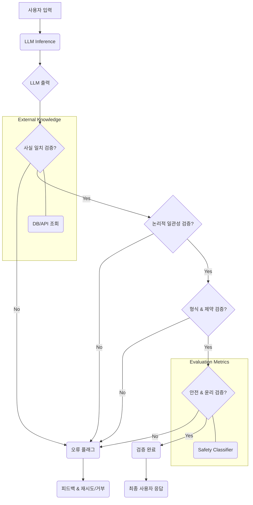

대규모 언어 모델 (LLM)의 활용이 확대됨에 따라, 모델 출력의 신뢰성은 핵심적인 품질 지표가 되었다. 특히 환각 (hallucination)은 LLM이 사실과 다른 정보를 마치 진실인 양 생성하는 현상으로, 비즈니스 및 안전에 심각한 위험을 초래할 수 있다. 최근 GLM-5.2와 같은 오픈소스 LLM들이 GPT-5.5와 같은 독점 모델과 비교해 더 낮은 환각률을 보이는 사례가 보고되면서, 모델의 크기나 소스 코드가 반드시 출력의 정확성을 보장하지 않음을 시사한다. 이는 LLM 출력 검증 파이프라인의 중요성을 더욱 부각시킨다.

## LLM 환각률 분석의 중요성

모델 크기가 커진다고 해서 무조건적인 정확성을 보장하지 않는다는 점은 GLM-5.2와 GPT-5.5의 비교 사례에서 명확히 드러났다. 753B 파라미터와 약 40B 활성 파라미터의 GLM-5.2는 특정 벤치마크에서 GPT-5.5와 근소한 차이로 접근하며, 오히려 환각률에서는 더 우수한 성능을 보였다. 이러한 결과는 특정 태스크나 도메인에서 오픈 웨이트 모델이 독점 모델 대비 경쟁력을 가질 수 있음을 의미하며, 비용 효율적인 대안을 탐색하는 데 중요한 단서가 된다.

환각률 분석은 단순히 모델의 '거짓말' 여부를 넘어, 모델의 지식 경계, 추론 능력, 그리고 특정 도메인에 대한 이해도를 평가하는 중요한 수단이다. 정량적인 환각률 측정은 모델 선택, 파인튜닝 방향 설정, 그리고 사용자에게 제공되는 정보의 신뢰성 확보에 필수적이다.

## LLM 출력 검증 파이프라인 설계

효과적인 LLM 출력 검증 파이프라인은 여러 계층의 검증 로직으로 구성되어야 한다. 이는 LLM이 생성한 텍스트를 다각도로 평가하여 오류를 최소화하고 신뢰도를 극대화하는 것을 목표로 한다.

### 1. 사실 일치 여부 (Factual Consistency) 검증

LLM의 출력이 외부 지식 기반 (데이터베이스, 문서, API 등)과 일치하는지 확인한다. 이는 가장 기본적인 검증 단계로, `RAG (Retrieval-Augmented Generation)` 패턴에서 검색된 문서와 생성된 답변의 일치 여부를 확인하는 방식이 대표적이다.

### 2. 논리적 일관성 (Logical Coherence) 검증

생성된 내용이 내부적으로 모순되지 않는지, 주어진 프롬프트의 맥락과 논리적으로 일치하는지 검증한다. 복잡한 추론이 요구되는 태스크에서 특히 중요하다.

### 3. 형식 및 제약 조건 (Format and Constraint) 준수 검증

JSON, XML 등 특정 형식 준수 여부, 길이 제약, 특정 키워드 포함 또는 제외 여부 등 프롬프트에 명시된 형식 및 제약 조건을 정확히 따랐는지 확인한다. 이는 `prompt engineering/llm-prompt-boolean-logic-control-precision-validation`과 같은 전략과 연계된다.

### 4. 안전 및 윤리 (Safety and Ethics) 검증

유해하거나 편향된 콘텐츠, 민감 정보를 생성하지 않도록 필터링한다. 이는 `evaluation/llm-output-safety-reliability-validation-enhancement`의 핵심이다.

### 5. 다중 LLM 앙상블 및 비교 검증

여러 LLM의 출력을 비교하여 다수결 원칙이나 특정 기준에 따라 가장 신뢰할 수 있는 답변을 선택하거나, 각 모델의 강점을 활용하여 최종 답변을 구성한다. `opencodex`와 같은 모델 비교 플랫폼을 활용하면 다양한 LLM의 출력 품질을 평가하고 최적의 모델을 선택하거나 앙상블하는 전략을 수립할 수 있다.



## 코드 예시: Python을 활용한 간단한 사실 검증 함수

아래는 LLM의 출력에 포함된 특정 주장을 외부 지식 소스 (이 예시에서는 간단한 딕셔너리)와 비교하여 사실 일치 여부를 검증하는 Python 코드 예시이다.

```python
import re

def validate_llm_output_factual_consistency(llm_output: str, external_facts: dict) -> bool:
    """
    LLM 출력의 사실 일치 여부를 검증합니다.
    Args:
        llm_output (str): LLM이 생성한 텍스트.
        external_facts (dict): 검증에 사용할 외부 지식 (fact: expected_value).
    Returns:
        bool: 모든 사실이 일치하면 True, 아니면 False.
    """
    print(f"[*] LLM Output: "`{llm_output}`)
    for fact, expected_value in external_facts.items():
        # 정규식을 사용하여 LLM 출력에서 사실을 찾고 값을 추출
        # 이 부분은 실제 시나리오에 따라 복잡도가 증가할 수 있습니다.
        # 예: "서울의 수도는 서울이다." -> "서울", "수도", "서울"
        match = re.search(rf"{re.escape(fact)}\s*(?:(?:은|는|이|가)\s*)?([\w\s.]+)", llm_output, re.IGNORECASE)
        if match:
            actual_value = match.group(1).strip().lower()
            if actual_value != str(expected_value).strip().lower():
                print(f"[-] Factual mismatch: Expected "`{expected_value}`" for "`{fact}`", got "`{actual_value}`")
                return False
        else:
            # 사실 자체를 찾지 못했으므로, 관련된 내용이 없거나 환각일 수 있습니다.
            print(f"[-] Fact "`{fact}`" not found in LLM output.")
            return False
    print("[+] All facts validated successfully.")
    return True

# 예시 사용법
external_knowledge = {
    "대한민국의 수도": "서울",
    "지구의 위성": "달"
}

output1 = "대한민국의 수도는 서울입니다. 지구의 유일한 위성은 달입니다."
output2 = "대한민국의 수도는 부산입니다. 지구의 유일한 위성은 화성입니다."

print("--- Validating Output 1 ---")
validate_llm_output_factual_consistency(output1, external_knowledge)

print("--- Validating Output 2 ---")
validate_llm_output_factual_consistency(output2, external_knowledge)
```

## 트레이드오프

LLM 출력 검증 파이프라인을 강화하는 과정에는 여러 트레이드오프가 존재한다. 각 접근 방식의 장단점을 이해하고 프로젝트의 요구사항에 맞춰 최적의 균형점을 찾아야 한다.

*   **엄격한 검증 로직 vs. 지연 시간 및 비용**: 검증 로직이 정교하고 다층적일수록 출력의 신뢰성은 높아지지만, 검증에 소요되는 시간 (레이턴시)과 컴퓨팅 리소스 (비용)가 증가한다. 
    *   **언제 좋은가**: 높은 수준의 정확성과 신뢰성이 필수적인 금융, 의료, 법률 같은 도메인에서 유리하다.
    *   **언제 나쁜가**: 실시간 상호작용이 중요하고 오류 허용 범위가 넓은 챗봇이나 콘텐츠 생성 애플리케이션에서는 사용자 경험을 저해할 수 있다.

*   **오픈소스 LLM 활용 vs. 독점 LLM 의존**: GLM-5.2와 같은 오픈소스 모델은 커스터마이징의 유연성, 비용 절감, 데이터 주권 확보에 유리하다. 반면 GPT-5.5와 같은 독점 모델은 일반적으로 높은 범용성과 안정적인 API를 제공한다.
    *   **언제 좋은가**: 특정 도메인에 특화된 모델이 필요하거나, 비용 최적화 및 모델의 내부 동작을 완전히 제어해야 할 때 오픈소스 모델이 적합하다.
    *   **언제 나쁜가**: 광범위한 태스크에 대한 높은 성능과 빠른 개발 속도가 중요하며, 유지보수 부담을 줄이고자 할 때는 독점 모델이 더 나은 선택일 수 있다.

*   **앙상블/다중 모델 검증 vs. 파이프라인 복잡성**: 여러 LLM의 출력을 종합적으로 평가하는 앙상블 기법은 단일 모델의 한계를 보완하고 전반적인 견고성을 높인다. 하지만 이를 구현하고 관리하는 파이프라인의 복잡도가 증가한다.
    *   **언제 좋은가**: 미션 크리티컬한 애플리케이션에서 최고 수준의 신뢰성과 견고성이 요구될 때, 혹은 특정 모델의 실패에 대한 복원력을 높이고자 할 때 유용하다.
    *   **언제 나쁜가**: 개발 및 운영 리소스가 제한적이거나, 단일 모델로도 충분한 성능을 달성할 수 있는 경우에는 과도한 오버헤드가 될 수 있다.

*   **실시간 검증 vs. 배치 검증**: 사용자 요청에 즉각적으로 반응하여 실시간으로 LLM 출력을 검증할 수 있다. 반면 배치 검증은 일정량의 출력을 모아 한 번에 검증하여 효율성을 높인다.
    *   **언제 좋은가**: 대화형 AI, 실시간 추천 시스템 등 즉각적인 피드백이 중요한 서비스에서는 실시간 검증이 필수적이다.
    *   **언제 나쁜가**: 대량의 비동기적 콘텐츠 생성, 데이터 분석 보고서 생성 등 레이턴시가 덜 중요한 작업에서는 배치 검증이 비용 효율적이다.

## 실전 체크리스트

LLM 출력 검증 파이프라인을 구축하거나 개선할 때 다음 체크리스트를 활용하여 체계적인 접근을 수행할 수 있다.

- [ ] **환각률 측정 메트릭 정의**: 프로젝트의 특성과 도메인에 맞는 정량적 환각률 (예: Fact Recall, Fact Precision) 측정 지표를 명확히 정의했는가?
- [ ] **외부 지식 소스 통합**: LLM 출력을 검증할 신뢰할 수 있는 외부 데이터베이스, 문서, API (예: Wikipedia API, 사내 지식 베이스)를 선정하고 통합했는가?
- [ ] **자동화된 검증 테스트 구축**: 사실 일치, 형식 준수, 안전성 검사를 위한 자동화된 테스트 스위트와 CI/CD 파이프라인을 구축했는가?
- [ ] **다중 LLM 비교 및 앙상블 전략 수립**: GLM-5.2, GPT-5.5 등 여러 LLM의 환각률과 성능을 비교하고, 최적의 단일 모델 선택 또는 앙상블 전략을 문서화했는가? (`opencodex`와 연계 고려)
- [ ] **성능 및 비용 모니터링**: 검증 파이프라인의 레이턴시, 처리량, 컴퓨팅 자원 사용량 등 성능 지표와 비용을 지속적으로 모니터링하고 최적화 계획을 수립했는가?
- [ ] **인간 피드백 루프 구현**: 자동화된 검증으로 탐지하기 어려운 복잡한 환각 사례나 모호한 경우를 식별하기 위한 인간 검수 (Human-in-the-Loop) 및 피드백 시스템을 구축했는가?
- [ ] **모델 업데이트 및 재검증 프로세스**: LLM 모델이 업데이트되거나 파인튜닝될 때마다 검증 파이프라인을 통해 재검증하는 프로세스를 확립하고 자동화했는가?
