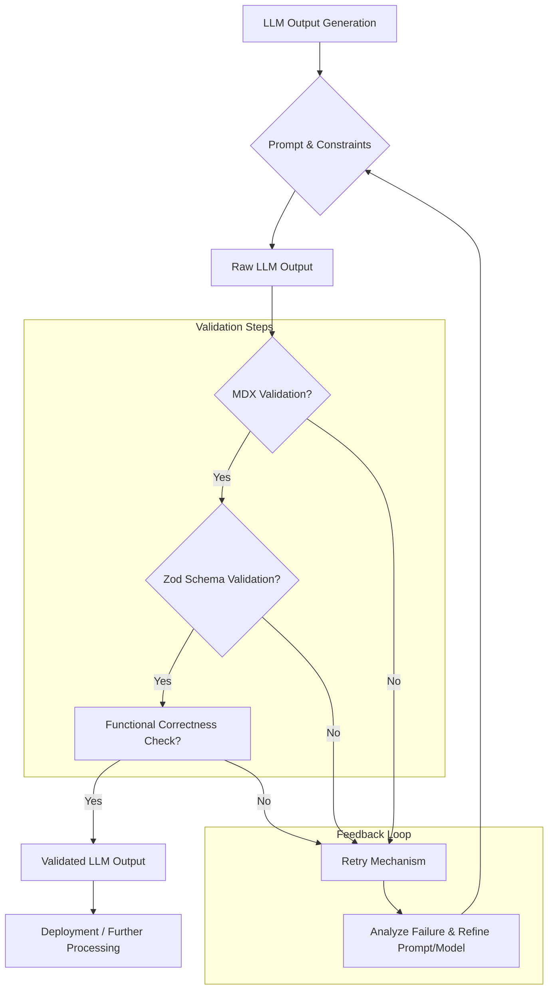

LLM 출력 평가는 모델의 성능을 정확히 측정하고 신뢰성을 확보하는 데 필수적이다. 특히, LLM의 반응에서 인간적인 속성을 찾거나 부여하는 의인화 편향(anthropomorphic bias)은 평가의 객관성을 크게 저해할 수 있다. Age of Empires II 사례가 시사하듯이, 강력한 기질(substrate) 위에 구현된 시스템의 복잡한 행동을 "인간적"이라고 해석하는 것은 본질적인 작동 방식과 무관한 주관적인 평가로 이어질 수 있다. 따라서 LLM 평가에서는 이러한 주관성을 배제하고, 기능적 완성도와 측정 가능한 지표에 기반한 객관적인 검증 기준을 확립하는 것이 2026년 LLM 개발의 핵심 과제이다.

### 의인화 편향의 문제점

의인화 편향은 LLM이 생성한 텍스트의 유창함, 문맥 이해 능력, 심지어 "창의성"과 같은 모호한 특성에 과도하게 집중하게 만든다. 이는 다음과 같은 문제를 야기한다:

*   **측정 불가능성**: "인간적"이라는 속성은 정량화하기 어려워, 평가 결과가 평가자의 주관에 따라 크게 달라질 수 있다.
*   **오해의 소지**: 모델이 특정 태스크를 성공적으로 수행했는지와 무관하게, 단순히 "인간적으로 그럴듯한" 답변을 내놓았다는 이유로 고평가될 수 있다.
*   **비효율적인 개선**: 실제 문제 해결 능력이나 비즈니스 가치와 직결되지 않는 방향으로 모델 개선 노력이 집중될 수 있다.

우리의 목표는 LLM이 특정 태스크를 얼마나 효과적이고 정확하게 완료하는지에 초점을 맞추는 것이다. 즉, LLM이 "어떻게 말하는가"보다는 "무엇을 하는가"에 집중해야 한다.

### 객관적 평가 기준 강화 전략

LLM 출력의 객관성을 강화하기 위한 핵심 전략은 다음과 같다.

1.  **기능적 완성도(Functional Completeness) 집중**:
    *   LLM이 맡은 태스크를 완벽하게 수행했는지를 평가의 최우선 기준으로 삼는다. 예를 들어, 특정 정보를 추출하거나, 코드를 생성하거나, 데이터 구조를 변환하는 등의 명확한 목표 달성 여부를 검증한다.
    *   **예시**: Markdown 문서를 생성하는 LLM의 경우, 문서의 내용 정확성뿐만 아니라 MDX(Markdown with JSX) 문법 준수, 코드 블록 형식, 링크 유효성 등 구조적 측면을 철저히 검증한다.

2.  **구조적 정확성(Structural Accuracy) 보장**:
    *   출력 형식을 엄격하게 정의하고, 이를 LLM이 준수하는지 자동화된 방식으로 검증한다. Zod나 Pydantic과 같은 스키마 유효성 검사 라이브러리를 활용하여 JSON, XML, YAML 등 구조화된 데이터의 정확성을 확인한다.
    *   **코드 예시 (TypeScript with Zod)**:
        ```typescript
        import { z } from 'zod';

        // Define a schema for a tech blog post
        const BlogPostSchema = z.object({
          title: z.string().min(10).max(100),
          author: z.string().min(3).max(50),
          tags: z.array(z.string()).min(3).max(6),
          content: z.string().min(500),
          publishedDate: z.string().datetime(),
          isDraft: z.boolean().default(false),
        });

        // Example LLM output (simulated)
        const llmOutput = {
          title: "LLM Output Evaluation: Beyond Anthropomorphism",
          author: "AI Writer",
          tags: ["LLM", "Evaluation", "Objectivity", "Bias"],
          content: "This article discusses methodologies to enhance the objectivity of LLM output evaluation by moving beyond subjective human-like attributes and focusing on measurable, functional criteria. We explore schema-based validation, automated test cases, and specific metrics...",
          publishedDate: "2023-10-26T10:00:00Z",
          isDraft: false
        };

        // Validate the LLM output
        try {
          const validatedOutput = BlogPostSchema.parse(llmOutput);
          console.log("LLM output is valid:", validatedOutput);
        } catch (error) {
          console.error("LLM output validation failed:", error.errors);
        }

        // Example of invalid output
        const invalidOutput = {
          title: "Short",
          author: "Me",
          tags: ["LLM"], // Too few tags
          content: "Too short.",
          publishedDate: "invalid-date"
        };

        try {
          BlogPostSchema.parse(invalidOutput);
        } catch (error) {
          console.error("Invalid LLM output caught:", error.errors);
        }
        ```

3.  **태스크 성공률(Task Success Rate) 지표**:
    *   LLM이 특정 질의에 대해 정확하고 완전한 답변을 제공했는지, 또는 주어진 명령을 오류 없이 수행했는지를 측정한다. 이는 특정 태스크의 성공 여부를 이진 분류(성공/실패)하거나, 여러 단계의 성공 기준을 두어 부분 점수를 부여하는 방식으로 구현할 수 있다.
    *   **예시**: 코드 생성 태스크의 경우, 생성된 코드가 컴파일되는지, 모든 유닛 테스트를 통과하는지, 성능 요구사항을 충족하는지 등을 객관적으로 검증한다.

4.  **자동화된 검증 파이프라인(Automated Validation Pipeline)**:
    *   MDX validation, Zod schema validation 등 다양한 구조적/내용적 검증 단계를 포함하는 파이프라인을 구축한다.
    *   LLM 출력이 이 파이프라인의 모든 단계를 통과해야만 '유효한' 것으로 간주된다.
    *   실패 시에는 Gemini retry와 같은 전략을 사용하여 LLM에게 재시도를 요청하고, 실패 원인을 분석하여 프롬프트나 모델 자체를 개선하는 데 활용한다.

### LLM Output Evaluation Pipeline Diagram



이러한 접근 방식은 LLM의 내부 작동 방식을 의인화하여 추측하는 대신, 외부에서 관찰 가능한 결과(observable outcomes)를 객관적으로 측정하고 평가함으로써 모델의 진정한 가치를 판단할 수 있게 한다. 2026년에는 이러한 객관적, 기능 중심의 평가 방법론이 LLM 시스템의 신뢰성과 효율성을 극대화하는 표준으로 자리 잡을 것이다.

## 트레이드오프

### 1. 초기 구현 복잡성 vs. 장기적 신뢰성 및 확장성
*   **언제 좋은가**: LLM 애플리케이션의 신뢰성, 유지보수성, 확장성이 중요한 장기 프로젝트에 적합하다. 특히 금융, 의료, 법률 등 오류 허용 범위가 낮은 분야에서 필수적이다.
*   **언제 나쁜가**: PoC(Proof of Concept) 단계나 빠른 프로토타이핑이 필요한 경우, 초기 설정에 드는 시간과 리소스가 부담이 될 수 있다. 유연성이 떨어져 빠른 반복에 방해가 될 수 있다.

### 2. 객관성 및 측정 가능성 vs. 미묘한 품질 및 사용자 경험 포착의 어려움
*   **언제 좋은가**: 구조적 정확성, 데이터 일관성, 태스크 성공률 등 명확한 기준에 따른 성능 측정이 필요한 경우 탁월하다. 모델 간의 공정한 비교 및 벤치마킹에 유용하다.
*   **언제 나쁜가**: LLM 출력의 창의성, 공감 능력, 자연스러움 등 인간적인 판단이 필요한 사용자 경험(UX) 측면의 미묘한 품질을 포착하기 어렵다. "인간적"인 대화 흐름이나 뉘앙스가 중요한 챗봇 등에는 추가적인 질적 평가가 필요할 수 있다.

### 3. 자동화된 검증 효율성 vs. 오버피팅 및 지표 조작(Gaming the Metrics) 위험
*   **언제 좋은가**: 대규모 LLM 출력에 대한 일관된 품질 관리가 필요할 때, 수동 검토의 한계를 극복하고 효율성을 극대화한다. CI/CD 파이프라인에 통합하여 지속적인 검증이 가능하다.
*   **언제 나쁜가**: 평가 지표가 너무 단순하거나 특정 태스크에만 과도하게 최적화될 경우, 모델이 해당 지표만 "잘" 충족시키도록 학습되어 실제 세계에서는 성능이 저하되는 오버피팅 현상이 발생할 수 있다. 지표 설계 시 다양한 측면을 고려해야 한다.

### 4. 의인화 편향 제거 vs. 개발자의 직관적 이해 감소
*   **언제 좋은가**: 모델의 실제 능력에 대한 오해를 줄이고, 데이터 기반의 합리적인 의사결정을 돕는다. 편향된 평가로 인한 잘못된 모델 개선 방향을 방지한다.
*   **언제 나쁜가**: 개발자가 모델의 작동 방식이나 문제점을 직관적으로 이해하고 디버깅하는 데 어려움을 겪을 수 있다. 특히 초기 단계에서는 모델의 반응을 보며 시행착오를 겪는 과정이 중요할 수 있다.

## 실전 체크리스트

다음은 LLM 출력 평가 및 검증에 의인화 편향을 제거하고 객관성을 강화하기 위한 실전 체크리스트이다.

- [ ] 모든 LLM 태스크에 대해 명확하고 측정 가능한 **기능적 성공 기준**을 정의했는가? (예: "JSON 출력은 특정 스키마를 100% 준수해야 함", "생성된 코드는 90% 이상의 유닛 테스트 통과율을 보여야 함")
- [ ] LLM이 생성하는 모든 구조화된 출력(JSON, XML, YAML 등)에 대해 **Zod, Pydantic 또는 유사한 스키마 유효성 검사**를 구현하고 이를 자동화 파이프라인에 통합했는가?
- [ ] MDX, Markdown, HTML 등 문서 형식 출력에 대해 **문법적, 구조적 유효성 검사 도구**를 사용하여 오류를 자동으로 감지하는가?
- [ ] 주요 태스크에 대한 **골든 데이터셋(Golden Dataset) 기반의 자동화된 테스트 스위트**를 구축하여 LLM 출력을 정량적으로 평가하고 있는가? (예: 특정 질문에 대한 정답 비교, 코드 실행 결과 비교)
- [ ] 검증 파이프라인에서 실패한 LLM 출력에 대해 **자동 재시도 메커니즘**(예: Gemini retry)을 구현하고, 재시도 횟수 및 실패 원인을 기록하여 분석하는가?
- [ ] LLM 출력 평가 지표를 **정기적으로 검토하고 업데이트**하여, 지표 조작(gaming the metrics)을 방지하고 실제 비즈니스 목표와의 정렬을 유지하는가?
- [ ] 평가 결과에서 발견된 지속적인 오류 패턴이나 구조적 결함에 대해 **LLM 프롬프트, 모델 파라미터 또는 파인튜닝 데이터**를 개선하는 피드백 루프를 확립했는가?
