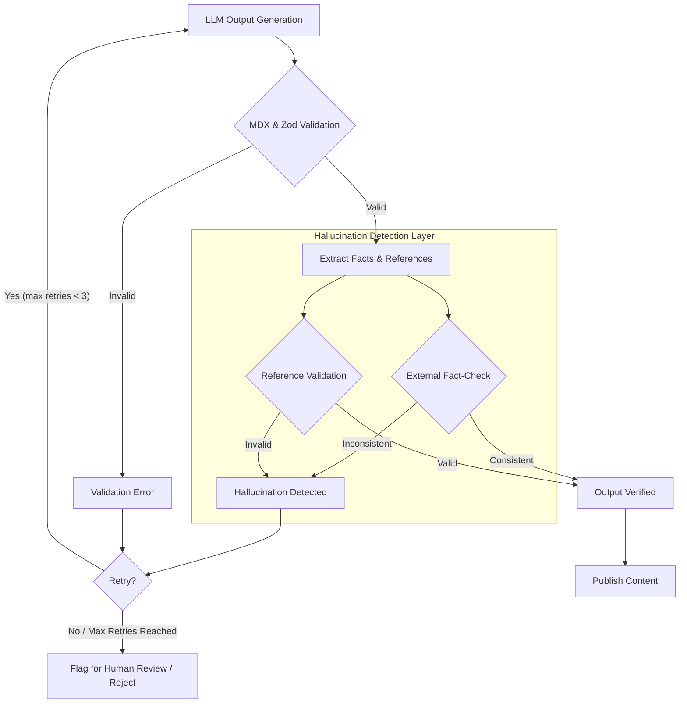

## LLM 출력 검증 파이프라인의 환각 감지 강화LLM(Large Language Model)이 생성하는 콘텐츠의 신뢰성은 지식 허브의 핵심 가치이다. arXiv의 새로운 정책에서 AI 생성 콘텐츠의 책임이 저자에게 있다는 점을 명확히 한 것처럼, LLM 출력의 환각(hallucination), 특히 잘못된 참고문헌이나 사실 오류는 심각한 문제를 야기할 수 있다. 본 문서에서는 LLM 출력 검증 파이프라인에 환각 감지 로직을 추가하여 지식 허브의 신뢰성을 높이는 방안을 제시한다. 기존 MDX validation, Zod schema validation, Gemini retry 등의 파이프라인에 더해 환각 감지를 통합하는 전략을 다룬다.

### LLM 환각의 유형 및 영향
LLM 환각은 모델이 사실과 일치하지 않거나, 입력된 컨텍스트에 없는 정보를 자신 있게 생성하는 현상을 의미한다. 이는 다음과 같은 형태로 나타날 수 있다.

*   **사실 환각 (Factual Hallucinations)**: 존재하지 않는 인물, 사건, 통계 데이터를 생성하거나 실제와 다른 정보를 제공하는 경우.
*   **참고문헌 환각 (Reference Hallucinations)**: 존재하지 않는 논문, 서적, 웹사이트를 인용하거나, 실제 존재하는 문헌이라도 내용과 무관하게 인용하는 경우. arXiv 정책이 특히 강조하는 부분이다.
*   **논리적 환각 (Logical Hallucinations)**: 문맥상 또는 상식적으로 비논리적인 주장을 펼치거나, 인과 관계를 잘못 설정하는 경우.

이러한 환각은 사용자 경험을 저해하고, 잘못된 정보의 확산을 초래하며, 지식 허브의 신뢰도를 심각하게 훼손한다. 특히 기술 문서나 교육 자료에서는 단 하나의 잘못된 정보도 큰 파급 효과를 가질 수 있다.

### 환각 감지 메커니즘 통합
기존의 LLM 출력 검증 파이프라인(예: MDX 포맷 유효성 검사, Zod 스키마를 통한 구조적 유효성 검사)에 환각 감지 계층을 추가하여 다층적인 방어 체계를 구축할 수 있다.

#### 1. 외부 지식 기반 사실 검증 (External Knowledge Base Fact-Checking)
생성된 텍스트 내의 핵심 사실(Named Entities, Dates, Numbers 등)을 추출하고, 이를 신뢰할 수 있는 외부 지식 베이스(예: Wikipedia, Wikidata, 특정 도메인의 데이터베이스, RAG(Retrieval Augmented Generation) 시스템의 소스 문서)와 교차 검증한다.

```typescript
import { retrieveFromKnowledgeBase, compareFacts } from './knowledgeService'; // Assume these exist

interface FactCheckResult {
  fact: string;
  isConsistent: boolean;
  source: string;
  confidence: number;
}

async function performFactCheck(text: string): Promise<FactCheckResult[]> {
  const extractedFacts = extractKeyFacts(text); // LLM-based or NLP extraction
  const results: FactCheckResult[] = [];

  for (const fact of extractedFacts) {
    const verifiedData = await retrieveFromKnowledgeBase(fact);
    const isConsistent = compareFacts(fact, verifiedData);
    results.push({
      fact: fact,
      isConsistent: isConsistent,
      source: verifiedData.source || 'N/A',
      confidence: verifiedData.confidence || 0.5,
    });
  }
  return results;
}

// Example Usage in a validation pipeline step
async function validateLLMOutput(llmOutput: string) {
  // ... existing MDX and Zod validation ...

  const factChecks = await performFactCheck(llmOutput);
  const inconsistentFacts = factChecks.filter(r => !r.isConsistent);

  if (inconsistentFacts.length > 0) {
    console.warn("Hallucination detected with inconsistent facts:", inconsistentFacts);
    // Trigger retry, human review, or rejection
    throw new Error("Factual hallucination detected.");
  }
  return true;
}
```

#### 2. 참고문헌 유효성 검사 (Reference Validation)
LLM이 생성한 참고문헌(URL, DOI, 논문 제목)의 유효성을 검증한다.

*   **URL 유효성 검사**: 웹 크롤러나 HTTP 요청을 통해 URL이 유효하고 접근 가능한지 확인한다.
*   **DOI/ISSN 검사**: CrossRef, PubMed 등의 API를 통해 DOI(Digital Object Identifier) 또는 ISSN(International Standard Serial Number)이 실제 존재하는지, 그리고 해당 메타데이터가 LLM이 인용한 내용과 일치하는지 확인한다.
*   **제목/저자 검사**: Google Scholar, Semantic Scholar 등의 검색 API를 활용하여 인용된 논문 제목이나 저자가 실제 존재하는지, 그리고 내용적 관련성이 있는지 대략적으로 검증한다.

#### 3. LLM 기반 자가-비판 및 신뢰도 평가 (LLM-based Self-Critique and Confidence Scoring)
LLM 자체에게 자신이 생성한 내용에 대한 비판적 평가를 요청하거나, 각 문장의 사실적 신뢰도를 예측하도록 지시할 수 있다. 예를 들어, Gemini 1.5 Pro와 같은 강력한 모델은 복잡한 추론 능력으로 생성된 텍스트의 일관성을 내부적으로 검토할 수 있다.

```json
{
  "content": "생성된 본문 내용",
  "references": [
    {"url": "...", "title": "...", "confidence": 0.9},
    {"doi": "...", "title": "...", "confidence": 0.7}
  ],
  "factual_statements": [
    {"statement": "...", "confidence": 0.8},
    {"statement": "...", "confidence": 0.6}
  ]
}
```
모델이 스스로 메타데이터를 생성하도록 유도하여 후처리 검증의 효율성을 높인다.

#### 4. 파이프라인 통합 아키텍처
기존 MDX/Zod 검증 후 환각 감지 계층을 추가하고, 감지 결과에 따라 재시도(retry), 경고(warning), 또는 실패(failure) 로직을 적용한다.



### 2026년 최신 트렌드 반영
2026년 LLM 기술 트렌드는 모델의 신뢰성과 투명성 향상에 중점을 둔다. Multi-LLM 에이전트 시스템에서 에이전트 간의 교차 검증, 강화된 RAG 파이프라인을 통한 소스 추적성 강화, 그리고 보다 정교한 온톨로지 기반 지식 그래프를 활용한 사실 검증이 중요해지고 있다. 또한, 모델의 '자신감 점수'를 활용하여 불확실성이 높은 문장을 식별하고 우선적으로 검토하는 접근 방식이 확산되고 있다. LLM 자체가 특정 도메인에 대한 '전문가 에이전트' 역할을 수행하며 해당 도메인의 지식을 기반으로 다른 LLM의 출력을 비판하는 시스템도 개발되고 있다.

---

## 트레이드오프

*   **정확도 vs. 지연 시간 & 비용**:
    *   **언제 좋음**: 높은 수준의 정확도와 신뢰성이 필수적인 의료, 금융, 법률 등 고위험 도메인에서 환각 감지는 필수적이다.
    *   **언제 나쁨**: 실시간 응답이 중요하고 비용 제약이 큰 시스템에서는 외부 API 호출, 추가 LLM 추론 등으로 인한 지연 시간 증가와 비용 상승이 문제가 될 수 있다.
*   **자동화된 검증 vs. 오탐(False Positive) / 미탐(False Negative)**:
    *   **언제 좋음**: 대량의 LLM 출력을 효율적으로 처리하고, 기본적인 오류를 걸러내는 데 효과적이다. 초기 필터링 단계에서 인간 개입 비용을 절감한다.
    *   **언제 나쁨**: 복잡하거나 미묘한 맥락의 환각은 자동화된 시스템이 감지하기 어렵다. 과도한 오탐은 불필요한 재시도를 유발하고, 미탐은 신뢰성 문제를 야기한다.
*   **복잡성 증가 vs. 신뢰성 향상**:
    *   **언제 좋음**: LLM 출력의 신뢰도를 극대화하여 지식 허브의 품질을 보장하고 장기적인 유지보수 비용을 절감한다.
    *   **언제 나쁨**: 검증 파이프라인이 복잡해지면서 개발 및 유지보수 비용이 증가하며, 디버깅이 어려워질 수 있다. 시스템의 전반적인 복잡도를 높인다.
*   **외부 서비스 의존성 vs. 자율성**:
    *   **언제 좋음**: 최신 지식이나 방대한 데이터베이스를 활용하여 LLM 내부 지식의 한계를 보완하고 검증의 폭을 넓힌다.
    *   **언제 나쁨**: 외부 API의 응답 속도, 안정성, 비용, 그리고 데이터 프라이버시 문제에 대한 의존성이 생긴다. 외부 서비스의 장애는 전체 파이프라인에 영향을 미칠 수 있다.

---

## 실전 체크리스트

프로젝트에 LLM 출력 환각 감지 파이프라인을 적용할 때 다음 항목들을 검증한다.

- [ ] **환각 유형 정의 및 임계값 설정**: 우리 서비스에서 허용 불가능한 환각 유형(사실 오류, 참고문헌 오류 등)을 명확히 정의하고, 각 유형에 대한 감지 정확도 및 허용 가능한 오류율 임계값을 설정했는가? (예: 참고문헌 유효성 99% 이상)
- [ ] **외부 지식 기반 통합 전략 수립**: 외부 지식 기반(RAG 소스, Wikipedia API, CrossRef 등)을 통해 사실 검증을 수행할 방법을 결정하고, 데이터 동기화 및 접근성 전략을 수립했는가?
- [ ] **성능 및 비용 영향 분석**: 환각 감지 로직 도입 후 LLM 호출 비용, 전체 파이프라인의 지연 시간 증가 등을 측정하고, 허용 가능한 범위 내에 있는지 검토했는가?
- [ ] **감지 로직의 재시도 및 폴백 전략 구현**: 환각이 감지되었을 때, 자동으로 LLM에 재시도를 요청하거나, 다른 LLM으로 전환하거나, 인간 검토 단계로 넘어가는 등의 폴백(fallback) 전략을 명확히 구현했는가?
- [ ] **모니터링 및 로깅 시스템 구축**: 환각 감지 결과(탐지된 환각 유형, 빈도, 소스 등), False Positive/Negative 비율, 검증 시간 등을 추적할 수 있는 모니터링 및 로깅 시스템을 구축했는가?
- [ ] **인간 개입 워크플로우 설계**: 자동화된 감지 시스템이 처리하지 못하는 복잡한 케이스나 고위험 콘텐츠에 대해 인간 전문가가 검토하고 수정할 수 있는 명확한 워크플로우를 설계했는가?
- [ ] **버전 관리 및 테스트 자동화**: 환각 감지 로직 및 외부 지식 기반 연동 설정에 대한 버전 관리를 수행하고, 새로운 규칙이나 모델 업데이트 시 회귀 테스트(regression testing)를 자동화했는가?