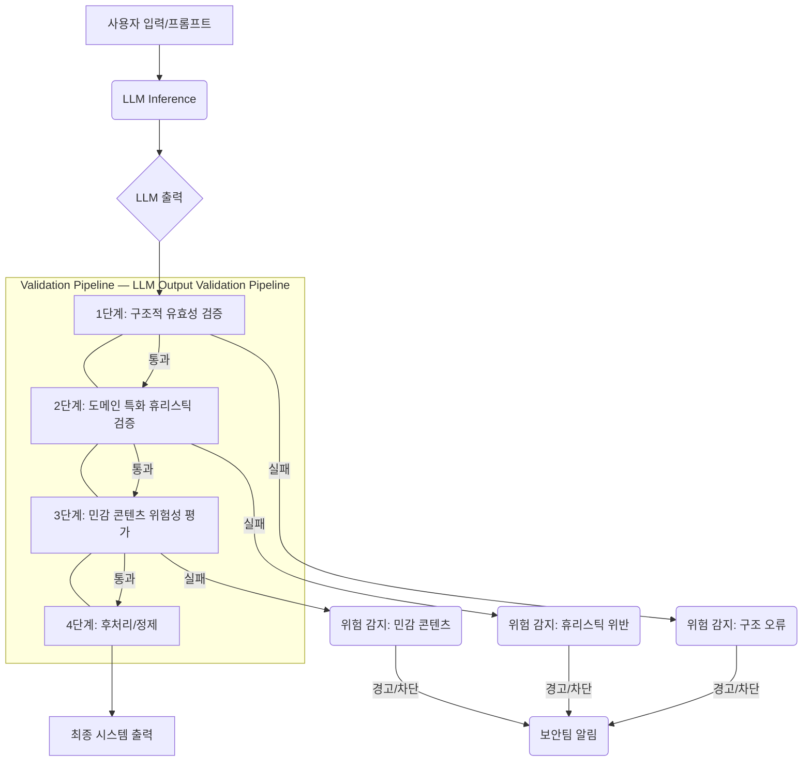

### LLM 출력 안전성 및 신뢰성 검증 로직 강화: 다층적 가드레일 설계
#### LLM Safety Alignment의 한계와 새로운 위협
최근 사례들은 LLM의 기본 안전 정렬(Safety Alignment)에만 의존하는 것이 얼마나 위험한지를 명확히 보여줍니다. 악성코드 개발자들이 스파이웨어에 '핵', '생물무기'와 같은 문구를 삽입하여 LLM 기반 보안 스캐너의 탐지를 회피하려는 시도는, 1차적인 안전 정렬이 악의적인 공격자에게 악용될 수 있는 맹점을 가질 수 있음을 시사합니다. 폐쇄형 모델과 오픈형 모델 모두 공격적인 거부를 유도하는 방식으로 조작될 수 있으며, 이는 실제 보안 분석에서 심각한 취약점으로 작용할 수 있습니다.

따라서 LLM의 출력이 안전하고 신뢰할 수 있음을 보장하기 위해, 단순히 LLM 내부의 안전 정렬에만 의존하는 것을 넘어선 다층적인 검증 로직(Multi-layered Validation Logic)과 가드 테스트(Guard Test)를 포함하는 견고한 출력 검증 파이프라인이 필수적입니다. 이는 잠재적 악용 가능성을 선제적으로 방어하고, 시스템의 전반적인 보안 탄력성을 강화하는 데 기여합니다.

### LLM 출력 검증 파이프라인 아키텍처
효과적인 LLM 출력 검증은 단순한 키워드 필터링을 넘어섭니다. 이는 LLM의 최종 출력물이 시스템의 보안, 윤리, 법적 기준을 충족하는지 종합적으로 평가하는 다단계 프로세스여야 합니다.



1.  **구조적 유효성 검증 (Structural Validation)**: LLM 출력이 예상되는 형식(JSON, XML, 특정 마크다운 구조 등)을 따르는지 확인합니다. 이는 기본적인 파싱 오류 및 의도적인 구조 파괴 시도를 방지합니다.
2.  **도메인 특화 휴리스틱 검증 (Domain-Specific Heuristic Validation)**: 특정 도메인이나 애플리케이션의 컨텍스트에서 위험하거나 부적절할 수 있는 패턴을 식별합니다. 이는 일반적인 LLM 안전 정렬이 놓칠 수 있는 미묘한 맥락적 위협을 탐지합니다. 예를 들어, 금융 애플리케이션에서는 특정 약물 이름이나 불법 거래 관련 용어가 포함된 출력을 플래그할 수 있습니다.
3.  **다층적 민감 콘텐츠 위험성 평가 (Multi-layered Sensitive Content Risk Assessment)**:
    *   **정규 표현식 및 키워드 매칭**: 초기 단계에서 잘 알려진 악성/위험 키워드, 구문, 정규 표현식 패턴을 탐지합니다.
    *   **의미론적 분석 (Semantic Analysis)**: 단순 키워드 매칭을 넘어 문맥을 파악하여 숨겨진 의도나 비유적인 표현으로 위장된 위험을 식별합니다. 별도의 소형 모델이나 LLM 호출을 사용하여 콘텐츠의 위험 등급을 평가할 수 있습니다.
    *   **외부 지식 기반 연동**: 특정 실시간 위협 인텔리전스 데이터베이스나 블랙리스트와 연동하여 출력을 검증합니다.
4.  **후처리 및 정제 (Post-processing & Refinement)**: 모든 검증 단계를 통과한 출력에 대해 최종적으로 형식 조정, 불필요한 공백 제거, 또는 특정 정보 마스킹 등의 작업을 수행합니다.

### 실전 코드 예시: 파이썬 기반 휴리스틱 검증
다음은 파이썬으로 구현된 간단한 휴리스틱 검증 로직 예시입니다. 이 `ContentSecurityGuard` 클래스는 지정된 키워드와 정규 표현식 패턴을 사용하여 LLM 출력을 검사합니다.

```python
import re
from typing import List, Dict

class ContentSecurityGuard:
    def __init__(self, sensitive_keywords: List[str], prohibited_patterns: List[str]):
        """
        ContentSecurityGuard 초기화.
        :param sensitive_keywords: 민감한 단어 리스트.
        :param prohibited_patterns: 금지된 패턴 (정규 표현식) 리스트.
        """
        self.sensitive_keywords = [kw.lower() for kw in sensitive_keywords]
        self.prohibited_patterns = [re.compile(pattern, re.IGNORECASE) for pattern in prohibited_patterns]

    def scan_output(self, llm_output: str) -> Dict[str, bool]:
        """
        LLM 출력을 스캔하여 안전성 위반 여부를 확인합니다.
        :param llm_output: LLM에 의해 생성된 문자열 출력.
        :return: 안전성 위반 여부를 나타내는 딕셔너리.
        """
        output_lower = llm_output.lower()
        violations = {
            "is_safe": True,
            "keyword_violations": [],
            "pattern_violations": []
        }

        # 1. 키워드 검사
        for keyword in self.sensitive_keywords:
            if keyword in output_lower:
                violations["is_safe"] = False
                violations["keyword_violations"].append(keyword)

        # 2. 정규 표현식 패턴 검사
        for pattern_idx, pattern in enumerate(self.prohibited_patterns):
            if pattern.search(llm_output):
                violations["is_safe"] = False
                violations["pattern_violations"].append(f"Pattern_{pattern_idx}") # 실제로는 pattern.pattern 사용

        return violations

# 예시 사용
guard = ContentSecurityGuard(
    sensitive_keywords=["nuclear", "bioweapon", "exploit", "malware", "spyware"],
    prohibited_patterns=[
        r"\b(bomb|weapon of mass destruction|WMD)\b",
        r"(ddos|phishing|ransomware)\sattack",
        r"secret\s(plan|code|document)"
    ]
)

test_output_1 = "This is a harmless document about software development."
test_output_2 = "Detected a new spyware variant with a bioweapon component."
test_output_3 = "The user requested details on a secret plan for a DDoS attack."

print(f"Output 1 Scan: {guard.scan_output(test_output_1)}")
print(f"Output 2 Scan: {guard.scan_output(test_output_2)}")
print(f"Output 3 Scan: {guard.scan_output(test_output_3)}")
```

이 예시는 기본적인 필터링 로직을 보여주지만, 실제 프로덕션 환경에서는 이보다 훨씬 정교한 로직과 머신러닝 기반 분류기, 그리고 외부 위협 인텔리전스와의 연동이 필요합니다. 2026년에는 이와 같은 가드레일 시스템이 LLM 애플리케이션 보안의 핵심 요소로 자리매김할 것입니다. 단순히 거부하는 것을 넘어, 공격의 의도를 파악하고 적절하게 대응하는 지능형 시스템으로 발전할 것입니다.

### ## 트레이드오프

1.  **성능 오버헤드 vs. 보안 강화**:
    *   **좋은 경우**: 민감 정보 처리, 금융 거래, 공공 서비스 등 높은 수준의 보안과 신뢰성이 요구되는 애플리케이션에서는 추가적인 검증 단계가 필수적입니다. 잠재적 피해 비용이 검증 오버헤드보다 훨씬 클 때 유효합니다.
    *   **나쁜 경우**: 단순 정보 검색, 비판적이지 않은 대화형 챗봇 등 낮은 보안 요구사항을 가진 애플리케이션에서는 과도한 검증 로직이 불필요한 지연 시간을 유발하고 사용자 경험을 저해할 수 있습니다.

2.  **개발 및 유지보수 복잡성 vs. 위험 완화**:
    *   **좋은 경우**: 새로운 유형의 공격 패턴이나 제로데이 취약점에 대한 방어가 중요할 때, 다층적이고 적응형 검증 시스템은 장기적인 보안 비용을 절감하고 규제 준수를 보장합니다.
    *   **나쁜 경우**: 리소스가 제한적이거나 개발 주기가 짧은 프로젝트에서는 복잡한 검증 시스템 구축 및 지속적인 업데이트가 큰 부담이 될 수 있습니다. 단순한 키워드 필터링으로도 충분한 경우도 존재합니다.

3.  **오탐(False Positive) 및 미탐(False Negative) 관리 vs. 완벽한 방어**:
    *   **좋은 경우**: 오탐율을 허용 가능한 수준으로 관리하면서 미탐율을 최소화하는 정교한 시스템은, 실제 위협을 효과적으로 차단하고 서비스의 신뢰도를 높입니다. 특히 규제 환경에서 중요합니다.
    *   **나쁜 경우**: 과도하게 엄격한 검증 로직은 정상적인 사용자의 요청까지 차단하여 서비스 사용성을 저하시킬 수 있습니다. 반대로 너무 느슨하면 실제 위협을 놓쳐 심각한 보안 사고로 이어질 수 있습니다. 적절한 균형점을 찾는 것이 중요합니다.

4.  **LLM 자체 안전 정렬 의존도 감소 vs. 모델 업데이트 효과 상실**:
    *   **좋은 경우**: LLM 내부의 안전 정렬이 우회될 가능성에 대비하여 외부 가드레일을 강화함으로써, 모델 자체의 한계에 대한 의존도를 줄이고 전체 시스템의 복원력을 높입니다.
    *   **나쁜 경우**: LLM 공급자가 모델의 안전 정렬을 업데이트하거나 개선했을 때, 외부 가드레일이 너무 독립적이면 이러한 개선 사항을 즉시 반영하지 못하여 중복되거나 비효율적인 검증이 발생할 수 있습니다.

### ## 실전 체크리스트

다음은 LLM 출력 안전성 및 신뢰성 검증 로직을 강화하기 위한 실전 체크리스트입니다.

*   [ ] **LLM 출력 파이프라인 분석**: 현재 LLM 출력이 생성되어 최종 사용자에게 도달하기까지의 모든 단계를 명확히 파악하고, 각 단계에서 어떤 형태의 검증이 필요한지 정의합니다.
*   [ ] **도메인 특화 위험 요소 식별**: 애플리케이션의 도메인(예: 금융, 의료, 법률, 게임)에서 발생할 수 있는 잠재적 위험(정보 유출, 불법 행위 조장, 편향된 정보, 환각 등)을 구체적으로 식별하고 목록화합니다.
*   [ ] **다층적 검증 로직 설계**: 최소 3단계 이상의 검증 로직(구조적, 휴리스틱, 의미론적/ML 기반)을 설계하고, 각 단계의 책임과 역할을 명확히 분리합니다.
*   [ ] **가드 테스트 스위트 구축**: LLM의 안전 정렬을 우회하려는 시나리오(예: "핵" 키워드를 우회하는 문구, 이중 부정 등)를 포함하는 광범위한 가드 테스트(Guard Test) 케이스를 구축하고 자동화합니다.
*   [ ] **실시간 모니터링 및 알림 시스템 구축**: 검증 로직에 의해 탐지된 모든 위반 사항에 대해 실시간으로 모니터링하고, 보안팀 또는 운영팀에 즉시 알림을 보낼 수 있는 시스템을 마련합니다.
*   [ ] **피드백 루프 구현**: 탐지된 위협 패턴이나 오탐/미탐 사례를 분석하여 검증 로직(키워드, 정규 표현식, ML 모델)을 지속적으로 업데이트하고 개선하는 피드백 루프를 구축합니다.
*   [ ] **성능 영향 분석**: 추가된 검증 로직이 LLM 응답 시간에 미치는 영향을 측정하고, 허용 가능한 지연 시간 내에서 작동하도록 최적화 방안을 마련합니다.
*   [ ] **외부 위협 인텔리전스 연동 고려**: 최신 위협 정보를 반영하기 위해 외부 위협 인텔리전스 피드(Threat Intelligence Feed) 또는 블랙리스트 데이터베이스와 연동하는 방안을 검토합니다.