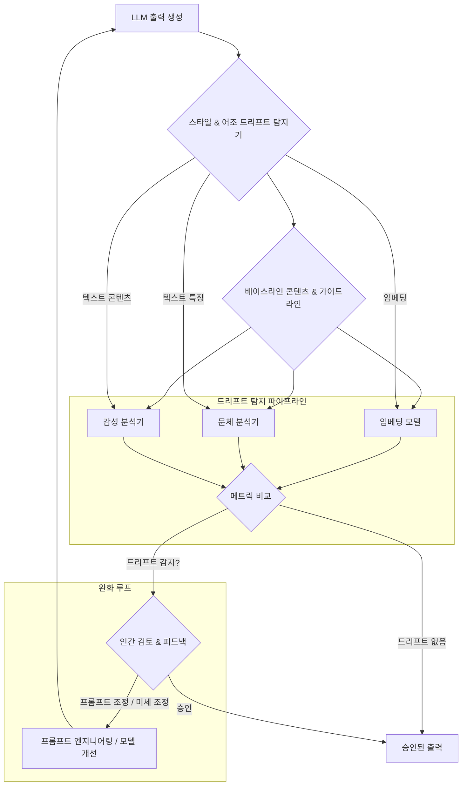

Large Language Model (LLM)과의 상호작용은 모델 출력에서 미묘하고 의도치 않은 스타일 및 어조의 변화, 즉 스타일 및 어조 드리프트 (Style and Tone Drift) 현상을 초래할 수 있습니다. 특정 LLM, 특히 Claude의 'load-bearing'과 같은 독특한 표현 방식에 지속적으로 노출되면, 모델이 생성하는 텍스트가 의도된 브랜드 가이드라인이나 고유한 인간의 목소리에서 벗어날 수 있습니다. 이러한 드리프트는 AI 생성 콘텐츠의 일관성과 진정성을 저해할 수 있으므로, 강력한 감지 및 완화 전략은 품질 및 브랜드 무결성 유지에 필수적입니다.

### 스타일 및 어조 드리프트 이해
스타일은 어휘 선택, 문장 구조, 형식, 수사적 장치 등 언어 사용 방식을 의미합니다. 반면, 어조 (Tone)는 텍스트에 담긴 태도나 감정적 색채를 전달합니다. 드리프트는 이러한 속성들이 명시적인 지시 없이 시간이 지남에 따라 미묘하게 변화할 때 발생합니다. 이는 여러 요인에서 비롯될 수 있습니다:
*   **모델 노출 (Model Exposure)**: 특정 데이터셋 (예: Claude의 학습 데이터)에 대한 지속적인 미세 조정 (Fine-tuning) 또는 상호작용은 특정한 문체적 습관을 모델에 각인시킬 수 있습니다.
*   **프롬프트 크립 (Prompt Creep)**: 반복적인 프롬프팅 또는 진화하는 프롬프트 템플릿은 모델 출력 특성을 미묘하게 변경할 수 있습니다.
*   **맥락적 영향 (Contextual Influence)**: 축적된 대화 맥락이 모델을 의도치 않게 다른 스타일로 유도할 수 있습니다.
*   **암묵적 학습 (Implicit Learning)**: 명시적인 지시 없이도 모델은 자주 받는 입력 스타일을 '학습'하고 적응할 수 있습니다.

### 강화된 감지 메커니즘
스타일 및 어조 드리프트를 감지하려면 정량적 메트릭과 정성적 인간 평가를 결합한 다각적인 접근 방식이 필요합니다.

#### 정량적 메트릭 (Quantitative Metrics)
1.  **의미론적 유사성 (Semantic Similarity)**: 임베딩 모델 (예: Sentence-BERT, OpenAI 임베딩)을 사용하여 현재 출력이 승인된 콘텐츠의 베이스라인과 의미 공간에서 얼마나 유사한지 비교합니다. 평균 임베딩 거리의 변화는 드리프트를 나타낼 수 있습니다.
2.  **어휘 다양성 (Lexical Diversity)**: Type-Token Ratio (TTR) 또는 Measure of Textual Lexical Diversity (MTLD)와 같은 메트릭은 어휘 풍부도 및 반복의 변화를 식별할 수 있습니다.
3.  **감성 분석 (Sentiment Analysis)**: 도구를 사용하여 감정적 가치 (긍정, 부정, 중립) 및 각성도를 정량화하여 감성 어조의 변화를 경고할 수 있습니다.
4.  **문체학적 특징 (Stylometric Features)**: 문장 길이 분포, 특정 접속사 사용, 평균 단어 길이, 기능어 빈도 등을 분석하여 문체적 특징을 식별합니다.
5.  **문법 및 가독성 점수 (Grammar and Readability Scores)**: Flesch-Kincaid Grade Level 또는 Gunning Fog Index와 같은 메트릭을 모니터링하여 복잡성과 접근성의 변화를 파악합니다.

#### 정성적 검토 (Qualitative Review)
인간 전문가 (SME: Subject Matter Experts)는 매우 귀중한 통찰력을 제공합니다. 다양한 모델 또는 프롬프트 버전의 출력에 대한 A/B 테스트는 스타일, 어조, 브랜드 정렬에 대한 인간 평가 척도와 결합되어 중요한 피드백 루프를 형성합니다. 이러한 인간 참여 (human-in-the-loop) 접근 방식은 순전히 알고리즘적인 방법이 놓칠 수 있는 미묘한 차이를 포착하는 데 도움이 됩니다.



### 완화 전략
드리프트가 감지되면, 목표 지향적인 개입이 필요합니다.

#### 프롬프트 엔지니어링 (Prompt Engineering)
시스템 프롬프트에 스타일과 어조를 명시적으로 정의하는 것이 기본입니다. 여기에는 다음이 포함됩니다:
*   **페르소나 정의 (Persona Definition)**: "당신은 B2B SaaS 기업의 전문 기술 작가입니다."
*   **어조 가이드라인 (Tone Guidelines)**: "공식적이고 객관적이며 격려적인 어조를 유지하세요."
*   **부정적 제약 (Negative Constraints)**: "지나치게 구어체적인 표현이나 'load-bearing'과 같은 특정 구절은 피하세요."
*   **예시 (Examples)**: 원하는 스타일과 어조를 완벽하게 구현하는 소규모 예시 (few-shot examples)를 제공합니다.
*   **XML/JSON 태그**: 구조화된 태그 (예: `<style_guide>`, `<tone_rules>`)를 사용하여 지시사항을 명확하게 구분합니다.

#### 파인튜닝 (Fine-tuning)
지속적이거나 시스템적인 드리프트의 경우, 원하는 스타일과 어조를 엄격하게 준수하는 고품질 데이터셋으로 기본 모델을 미세 조정하는 것이 효과적일 수 있습니다. 이는 광범위한 사전 학습 모델의 편향이나 문체적 영향에 덜 취약한 전문화된 모델을 생성합니다. LoRA (Low-Rank Adaptation)와 같은 기술은 효율적인 적응을 가능하게 합니다.

#### 후처리 계층 (Post-processing Layers)
최종 전달 전에 출력의 문체적 일관성을 검토하고 수정하는 보조 AI 계층 또는 규칙 기반 시스템을 구현합니다. 이는 '스타일 가드레일' 역할을 하여 출력을 미리 정의된 표준으로 정규화합니다.

### 코드 예시: 기본 스타일 드리프트 감지 (Python)

이 예시는 어휘 다양성 메트릭과 의미론적 유사성을 사용한 기본적인 접근 방식을 보여줍니다. 실제 시나리오에서는 더 정교한 문체 분석 및 고급 임베딩 모델이 사용될 것입니다.

```python
from collections import Counter
from sklearn.feature_extraction.text import TfidfVectorizer
from sklearn.metrics.pairwise import cosine_similarity
import re

class StyleDriftDetector:
    def __init__(self, baseline_texts):
        self.baseline_texts = baseline_texts
        self.vectorizer = TfidfVectorizer()
        self.baseline_embeddings = self._get_embeddings(baseline_texts)
        self.baseline_ttr = self._calculate_average_ttr(baseline_texts)

    def _preprocess(self, text):
        # Remove punctuation and convert to lowercase
        text = re.sub(r'[^\w\s]', '', text).lower()
        return text.split()

    def _get_embeddings(self, texts):
        processed_texts = [" ".join(self._preprocess(t)) for t in texts]
        if not processed_texts:
            return None
        # Fit vectorizer only once with baseline texts
        if self.vectorizer.vocabulary_: # if already fitted
            return self.vectorizer.transform(processed_texts)
        else:
            return self.vectorizer.fit_transform(processed_texts)

    def _calculate_ttr(self, text):
        words = self._preprocess(text)
        if not words:
            return 0.0
        return len(set(words)) / len(words)

    def _calculate_average_ttr(self, texts):
        ttr_scores = [self._calculate_ttr(text) for text in texts]
        return sum(ttr_scores) / len(ttr_scores) if ttr_scores else 0.0

    def detect_drift(self, new_text, semantic_threshold=0.8, ttr_threshold_pct=0.1):
        """
        Detects style drift based on semantic similarity and Type-Token Ratio.
        A lower semantic similarity or significant TTR deviation indicates drift.
        """
        new_embedding = self.vectorizer.transform([" ".join(self._preprocess(new_text))])
        if self.baseline_embeddings is None:
            print("Warning: No baseline embeddings to compare against.")
            return False, {"semantic_similarity": 0.0, "ttr_deviation": 0.0}

        # Calculate average cosine similarity to baseline texts
        avg_semantic_similarity = cosine_similarity(new_embedding, self.baseline_embeddings).mean()

        # Calculate TTR deviation
        new_ttr = self._calculate_ttr(new_text)
        ttr_deviation = abs(new_ttr - self.baseline_ttr) / self.baseline_ttr if self.baseline_ttr else 0.0

        is_semantic_drift = avg_semantic_similarity < semantic_threshold
        is_ttr_drift = ttr_deviation > ttr_threshold_pct

        return (
            is_semantic_drift or is_ttr_drift,
            {
                "avg_semantic_similarity": avg_semantic_similarity,
                "ttr_deviation_percentage": ttr_deviation * 100,
                "new_ttr": new_ttr,
                "baseline_ttr": self.baseline_ttr
            }
        )

# Example Usage:
baseline_samples = [
    "This is a factual statement about technical specifications. It must be precise.",
    "The system architects designed a robust solution for scalability and performance.",
    "Our enterprise-grade platform ensures data integrity and security compliance."
]

detector = StyleDriftDetector(baseline_samples)

# Test cases
output1 = "This is a factual statement about technical specifications. It should be precise."
output2 = "Yo, check out this sick tech stuff. It's totally awesome for like, scale and speed!"
output3 = "The architectural design promotes high availability. Data protection is paramount."

drift1, metrics1 = detector.detect_drift(output1, semantic_threshold=0.9, ttr_threshold_pct=0.05)
drift2, metrics2 = detector.detect_drift(output2, semantic_threshold=0.7, ttr_threshold_pct=0.2)
drift3, metrics3 = detector.detect_drift(output3, semantic_threshold=0.9, ttr_threshold_pct=0.05)

print(f"Output 1 Drift: {drift1}, Metrics: {metrics1}")
print(f"Output 2 Drift: {drift2}, Metrics: {metrics2}")
print(f"Output 3 Drift: {drift3}, Metrics: {metrics3}")
```

### ## 트레이드오프

*   **정량적 메트릭의 자동화된 감지 (Automated Quantitative Detection)**
    *   **장점**: 대량의 LLM 출력에 대한 일관되고 신속한 스크리닝이 가능하여 초기 단계에서 잠재적 드리프트를 식별하는 데 유리합니다. 반복적이고 객관적인 평가 기준을 제공합니다.
    *   **단점**: 미묘한 어조나 문맥적 뉘앙스를 포착하는 데 한계가 있을 수 있으며, 오탐(false positive) 또는 미탐(false negative)이 발생할 수 있습니다. 메트릭 설정 및 임계값 조정에 전문 지식이 필요합니다.

*   **인간 검토 피드백 루프 (Human Review Feedback Loop)**
    *   **장점**: 복잡한 스타일, 문화적 뉘앙스, 브랜드 목소리와 같은 주관적인 품질 요소를 정확하게 평가하여 높은 수준의 출력 품질을 보장합니다. LLM의 제약 학습(Constraint Learning)을 강화합니다.
    *   **단점**: 시간과 비용이 많이 들고, 확장성이 낮습니다. 인간 평가자 간의 주관성 차이로 인해 일관성 문제가 발생할 수 있으며, 피드백을 수집하고 모델에 다시 통합하는 데 시간이 걸립니다.

*   **프롬프트 가이드라인 보강 (Enhanced Prompt Guidelines)**
    *   **장점**: 모델 행동을 직접적으로 유도하고 제어하는 가장 빠르고 유연한 방법입니다. 신속한 실험 및 반복이 가능하며, 특정 시나리오에 맞는 맞춤형 스타일을 적용하기 용이합니다.
    *   **단점**: 프롬프트가 복잡해질수록 토큰 비용이 증가하고, 모델이 프롬프트 지시를 '잊거나(forget)' 무시할 수 있는 "Prompt Degradation" 현상이 발생할 수 있습니다. 모든 스타일 문제를 해결하기에 충분하지 않을 수 있습니다.

*   **모델 파인튜닝 (Model Fine-tuning)**
    *   **장점**: 특정 도메인이나 브랜드의 고유한 스타일 및 어조를 모델에 깊이 내재화할 수 있어, 보다 일관되고 자연스러운 출력을 기대할 수 있습니다. 장기적인 솔루션으로 효과적입니다.
    *   **단점**: 고품질의 레이블링된 데이터셋 구축에 많은 리소스가 필요하며, 파인튜닝 과정 자체가 비용과 시간이 많이 소요됩니다. 새로운 스타일 변화에 대한 적응력이 낮고, 한 번 파인튜닝되면 변경이 어렵습니다.

### ## 실전 체크리스트

프로젝트에 LLM 출력 스타일 및 어조 드리프트 감지 및 완화 로직을 적용할 때 다음 항목들을 검토해야 합니다.

- [ ] **베이스라인 콘텐츠 정의**: 타겟 스타일과 어조를 대표하는 고품질의 인간 작성 텍스트 샘플 또는 승인된 LLM 출력 베이스라인을 최소 < 100개 확보하고 주기적으로 업데이트하는가?
- [ ] **다중 메트릭 감지 시스템 구현**: 어휘 다양성 (TTR, MTLD), 감성 분석, 임베딩 기반 유사성 (코사인 유사도), 특정 키워드/구문 빈도 등 < 3가지 이상의 정량적 메트릭을 통합하여 드리프트를 감지하는 파이프라인이 구축되었는가?
- [ ] **드리프트 임계값 설정 및 모니터링**: 각 메트릭에 대해 허용 가능한 드리프트 임계값을 정의하고, 이 임계값을 초과하는 경우 알림을 트리거하는 모니터링 시스템이 가동 중인가? (예: 코사인 유사도 < 0.85, TTR 10% 이상 변화)
- [ ] **인간 검토 워크플로우 통합**: 정량적 드리프트가 감지되거나 주기적인 품질 검증을 위해, 인간 평가자가 LLM 출력을 검토하고 스타일/어조 일관성에 대한 피드백을 제공하는 프로세스가 설계되었는가?
- [ ] **프롬프트 가이드라인 표준화**: LLM에 전달되는 모든 프롬프트에 명시적인 스타일 및 어조 가이드라인, 페르소나 정의, 그리고 피해야 할 표현(예: "load-bearing"과 같은 특정 구어체)에 대한 부정적 제약이 포함되어 있는가?
- [ ] **드리프트 완화 전략 적용**: 감지된 드리프트 유형에 따라 프롬프트 조정, 소규모 파인튜닝, 또는 후처리 필터 적용 등 적절한 완화 전략이 명확히 정의되고 실행 가능한가?
- [ ] **모델 버전 관리 및 드리프트 이력 추적**: LLM 모델 버전, 사용된 프롬프트 버전, 그리고 시간 경과에 따른 스타일/어조 드리프트 감지 이력이 체계적으로 기록되고 추적되는가?