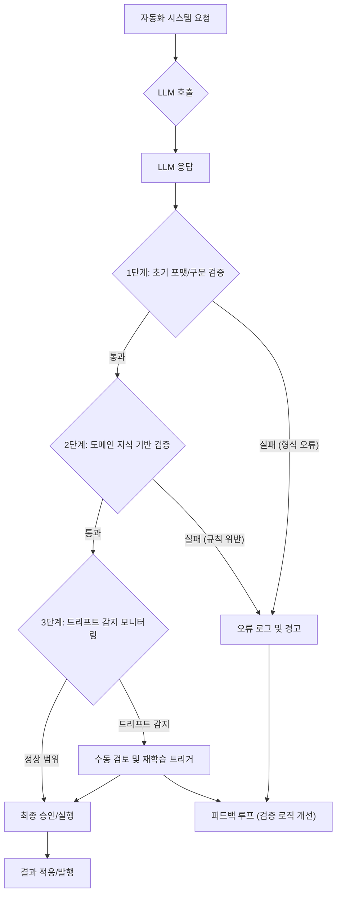

LLM(Large Language Model) 기반의 자동화 시스템은 업무 효율성을 혁신적으로 개선할 잠재력을 가지고 있지만, 잘못 설계된 검증 과정은 예측 불가능한 실패로 이어질 수 있습니다. AI 자동매매 시스템의 자산 손실이나 검수 없는 블로그 자동발행으로 인한 부정확한 정보 제공 사례는 LLM 출력에 대한 맹목적인 신뢰가 얼마나 위험한지 경고합니다. 이러한 실패는 LLM의 잠재력을 최대한 활용하면서도 안정성과 신뢰성을 확보하기 위한 강력한 출력 검증 파이프라인의 필요성을 명확히 보여줍니다.

## LLM 출력 검증의 중요성: 도메인 지식과 드리프트 감지

LLM은 방대한 데이터를 학습하여 놀라운 일반화 능력을 보여주지만, 특정 도메인의 미묘한 뉘앙스나 최신 정보를 정확히 반영하지 못할 수 있습니다. 특히 금융, 의료, 법률과 같이 오류가 치명적인 결과를 초래할 수 있는 영역에서는 LLM의 출력을 그대로 신뢰하는 것은 불가능합니다. 여기에 LLM 모델의 지속적인 업데이트나 미세 조정 없이 발생하는 예측 불가능한 행동 변화, 즉 '드리프트(drift)'는 자동화 시스템의 안정성을 해치는 주범이 됩니다.

견고한 LLM 출력 검증 파이프라인은 다음 두 가지 핵심 요소를 통합해야 합니다:

1.  **도메인 지식 기반의 검증 로직**: LLM의 일반적인 답변을 넘어, 특정 도메인의 규칙, 제약 조건, 최신 트렌드를 반영하는 명시적인 검증 계층을 추가해야 합니다. 이는 정형화된 데이터 스키마 검증부터 비정형 텍스트의 사실 여부 및 논리적 일관성 검토까지 포괄합니다.
2.  **드리프트 감지 메커니즘 고도화**: LLM의 출력 품질이 시간에 따라 저하되거나, 특정 유형의 오류가 증가하는 경향을 실시간으로 감지하고 경고하는 시스템이 필수적입니다. 이를 통해 문제가 확산되기 전에 개입하여 시스템을 안정화하고 재학습 또는 재조정을 수행할 수 있습니다.

## LLM 출력 검증 파이프라인 아키텍처

효과적인 LLM 출력 검증 파이프라인은 여러 단계의 검증 필터를 거쳐 LLM의 응답이 실제 시스템에 적용되기 전에 잠재적인 문제를 걸러냅니다.

### 파이프라인 구성 요소

*   **초기 형식 검증 (Syntactic Validation)**: LLM의 응답이 예상하는 JSON 스키마, XML 구조, 또는 특정 마크다운 형식 등 기본적인 문법 및 구조를 준수하는지 확인합니다. Pydantic과 같은 라이브러리가 유용합니다.
*   **도메인 규칙 검증 (Semantic & Business Rule Validation)**: 이 단계는 가장 중요합니다. LLM 출력이 특정 도메인의 비즈니스 로직, 사실 관계, 안전 제약 조건을 위반하지 않는지 검토합니다. 예를 들어, 금융 시스템에서는 '투자 수익률이 비현실적으로 높은가?', '특정 위험 자산에 대한 노출도가 허용치를 초과하는가?'와 같은 규칙을 검증할 수 있습니다. 블로그 발행 시스템에서는 '게시물의 주장 중 명백한 사실 오류는 없는가?', '최신 정보와 상충되지 않는가?' 등을 검증합니다.
*   **드리프트 감지 (Drift Detection)**: LLM의 출력 품질 지표(예: 오류율, 특정 키워드 출현 빈도, 감성 분석 결과 등)를 지속적으로 모니터링하여 기준선에서 벗어나는 경향을 감지합니다. 이는 A/B 테스트, 섀도우 모드 배포 등을 통해 새로운 모델 버전의 영향을 평가하는 것과도 연결됩니다.
*   **피드백 루프 및 인간 검토 (Human-in-the-Loop & Feedback Loop)**: 자동화된 검증을 통과하지 못했거나 드리프트가 감지된 경우, 인간 전문가의 개입을 요청하고, 그 검토 결과를 다시 시스템에 피드백하여 검증 로직이나 LLM 자체를 개선하는 데 활용합니다.



## 코드 예시: Python Pydantic을 활용한 LLM 출력 검증

다음은 Python과 Pydantic 라이브러리를 사용하여 LLM 출력을 도메인 스키마에 따라 검증하는 간단한 예시입니다. 특정 도메인의 규칙을 `BlogPost` 모델에 정의하고, LLM의 JSON 응답이 이 스키마를 따르는지 확인합니다.

```python
from pydantic import BaseModel, Field, ValidationError
from typing import List, Optional
import json

# 도메인별 스키마 정의: 블로그 게시물
class BlogPost(BaseModel):
    title: str = Field(min_length=10, max_length=100, description="블로그 게시물 제목")
    summary: str = Field(min_length=50, max_length=300, description="블로그 게시물 요약")
    keywords: List[str] = Field(min_items=3, max_items=8, description="관련 키워드 리스트 (최소 3개, 최대 8개)")
    category: str = Field(pattern=r"^(Technology|Science|Business|Marketing)$", description="게시물 카테고리 (정해진 목록 중 하나)")
    is_original_content: bool = Field(description="LLM이 생성한 콘텐츠의 독창성 여부 (boolean)")

def validate_llm_output(llm_output_json: str) -> Optional[BlogPost]:
    """
    LLM의 JSON 출력을 도메인 스키마에 따라 검증합니다.
    유효한 경우 BlogPost 객체를 반환하고, 실패 시 None을 반환합니다.
    """
    try:
        # LLM 출력을 Pydantic 모델로 파싱 및 검증
        validated_data = BlogPost.parse_raw(llm_output_json)
        print("INFO: LLM 출력 유효성 검사 성공.")
        return validated_data
    except ValidationError as e:
        print(f"ERROR: LLM 출력 유효성 검사 실패: {e.json()}")
        return None
    except json.JSONDecodeError as e:
        print(f"ERROR: JSON 파싱 실패: {e}")
        return None

# --- 예시 사용 --- 
# 1. 유효한 LLM 출력 시나리오
valid_output_example = """
{
    "title": "생성형 AI의 미래: 2026년 트렌드와 기술적 도전",
    "summary": "2026년 생성형 AI 시장의 주요 트렌드를 분석하고, 언어 모델의 한계를 극복하기 위한 기술적 도전 과제들을 심층적으로 다룹니다. 특히 LLM의 출력 검증과 신뢰성 확보 방안에 초점을 맞춥니다.",
    "keywords": ["GenerativeAI", "LLM", "2026Trends", "TechChallenge", "Validation", "Reliability"],
    "category": "Technology",
    "is_original_content": true
}
"""
validated_post = validate_llm_output(valid_output_example)
if validated_post:
    print(f"\nValidated Title: {validated_post.title}")

print("\n---\n")

# 2. 유효하지 않은 LLM 출력 시나리오 (제목이 너무 짧고, 키워드 부족, 카테고리 오류)
invalid_output_example = """
{
    "title": "AI 실패",
    "summary": "AI 자동화 시스템의 실패 사례를 통해 LLM 출력 검증의 중요성을 강조하고, 도메인 지식 기반의 검증 로직과 드리프트 감지 메커니즘을 통합하는 방법을 제시합니다.",
    "keywords": ["LLM"],
    "category": "Innovation",
    "is_original_content": false
}
"""
validated_post_invalid = validate_llm_output(invalid_output_example)
if not validated_post_invalid:
    print("\nInvalid output successfully rejected as expected.")
```

이 코드는 LLM이 생성한 JSON 문자열을 `BlogPost` 스키마에 맞게 검증합니다. `min_length`, `max_length`, `min_items`, `pattern`과 같은 Pydantic의 Field 유효성 검사를 통해 도메인 지식을 반영한 기본적인 규칙들을 강제할 수 있습니다. 실제 환경에서는 더 복잡한 도메인 규칙을 검증하기 위한 커스텀 validator나 외부 서비스 연동이 필요할 것입니다.

## 트레이드오프

LLM 출력 검증 파이프라인을 강화하는 것은 여러 트레이드오프를 수반합니다. 프로젝트의 특성과 요구사항에 따라 적절한 균형점을 찾아야 합니다.

*   **엄격성(Strictness) vs. 유연성(Flexibility)**
    *   **언제 좋고**: 금융, 의료 등 오류 허용 범위가 매우 좁은 도메인에서는 엄격한 검증이 필수적입니다. 잠재적 위험을 최소화합니다.
    *   **언제 나쁜지**: 창의적인 콘텐츠 생성이나 탐색적 작업에서는 너무 엄격한 규칙이 LLM의 잠재력을 제한하고 불필요한 False Positive를 유발하여 생산성을 저하시킬 수 있습니다.
*   **검증 로직의 복잡성 vs. 개발 및 유지보수 비용**
    *   **언제 좋고**: 고위험 도메인에서 정확하고 세밀한 검증이 요구될 때, 복잡한 규칙과 다단계 검증 로직은 시스템 신뢰도를 높입니다.
    *   **언제 나쁜지**: 검증 로직이 과도하게 복잡해지면 개발 초기 비용과 더불어 변경 발생 시마다 유지보수 및 업데이트 비용이 급증하고, 드리프트 발생 시 원인 분석이 어려워집니다.
*   **실시간 검증 vs. 배치 검증**
    *   **언제 좋고**: 사용자에게 즉각적인 피드백이 필요하거나, 실시간 의사 결정이 중요한 시스템(예: 자동매매)에서는 실시간 검증이 필수적입니다. 오류 발생 즉시 시스템 보호가 가능합니다.
    *   **언제 나쁜지**: 대량의 비실시간 데이터 처리나 중요도가 낮은 작업의 경우, 실시간 검증은 불필요한 인프라 비용과 지연을 초래할 수 있습니다. 배치 검증으로 효율적인 자원 사용이 가능합니다.
*   **인간 개입(Human-in-the-Loop) vs. 완전 자동화(Fully Automated)**
    *   **언제 좋고**: 초기 시스템 구축 단계, 고위험 작업, 또는 드리프트 감지 시 인간 전문가의 최종 검토는 안전장치 역할을 하며, 시스템 학습 데이터로 활용될 수 있습니다.
    *   **언제 나쁜지**: 인간 개입은 프로세스에 병목 현상을 유발하고 비용을 증가시킵니다. 확장성과 속도가 중요한 시스템에서는 자동화율을 높여야 합니다.

## 실전 체크리스트

프로젝트에 LLM 출력 검증 파이프라인을 적용하거나 강화할 때 다음 항목들을 점검하십시오:

- [ ] **도메인별 핵심 제약 조건 및 비즈니스 규칙 정의**: LLM 출력에 대한 최소 5가지 이상의 도메인별 핵심 검증 규칙을 명확히 정의하고 문서화했는가?
- [ ] **스키마 기반 형식 검증 도입**: LLM이 JSON 또는 특정 형식으로 출력할 경우, Pydantic/Zod와 같은 라이브러리를 사용하여 스키마 유효성 검증 단계를 파이프라인에 통합했는가?
- [ ] **의미적(Semantic) 사실 확인 로직 구현**: LLM의 응답 내용에 대한 사실 관계 오류나 논리적 비일관성을 감지하기 위한 RAG(Retrieval Augmented Generation) 기반 또는 외부 API 연동 검증 로직을 구현했는가?
- [ ] **LLM 출력 품질 지표 모니터링**: LLM의 출력에 대한 오류율, 드리프트 점수(drift score), 특정 키워드 변화 등 핵심 품질 지표를 실시간 또는 주기적으로 모니터링하는 대시보드를 구축했는가?
- [ ] **드리프트 감지 경고 시스템 설정**: 정의된 품질 지표가 특정 임계값을 벗어날 경우, 관련 팀에 자동으로 경고를 보내는 시스템을 설정하고 테스트했는가?
- [ ] **인간 검토 워크플로우 통합**: 자동 검증을 통과하지 못했거나 드리프트가 감지된 출력에 대해 인간 전문가가 검토하고 피드백을 제공하는 워크플로우를 마련했는가?
- [ ] **피드백 루프를 통한 시스템 개선**: 인간 검토 결과 및 드리프트 분석 데이터를 활용하여 LLM 프롬프트, 미세 조정 데이터셋, 또는 검증 로직 자체를 주기적으로 개선하는 프로세스를 확립했는가?