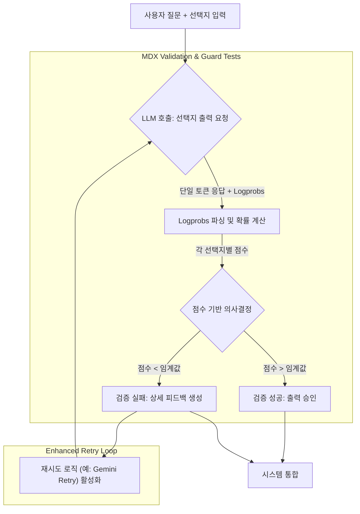

대규모 언어 모델 (LLM)의 활용이 증가함에 따라, LLM이 생성하는 출력의 신뢰성과 정확성을 검증하는 과정은 필수적입니다. 전통적인 LLM 출력 검증은 주로 정성적 판단이나 단순한 정규 표현식 매칭에 의존하여 '통과' 또는 '실패'라는 이분법적 결과를 제공했습니다. 그러나 이러한 방식은 LLM의 내부적 '확신' 정도를 파악하기 어렵고, 실패 시 재시도(retry) 로직에 충분히 세분화된 피드백을 주기 어렵다는 한계가 있었습니다.

## 확률 기반 점수의 필요성
LLM이 생성하는 각 토큰은 고유한 확률 분포를 가집니다. 이 확률 정보는 모델이 특정 토큰을 얼마나 '확신'하고 생성했는지를 나타냅니다. 'Jev 스타일 LLM 래퍼'에서 제안하는 접근 방식은 이러한 내재된 확률 정보를 활용하여 LLM의 출력을 단순한 텍스트가 아닌, 선택지별 확률과 점수를 포함하는 구조화된 형태로 변환하는 것입니다. 이는 MDX validation 루프 및 guard test와 같은 자동화된 검증 파이프라인에서 LLM의 결정을 더욱 정밀하게 평가하고, Gemini와 같은 모델의 retry 로직에 더 명확하고 유용한 피드백을 제공하여 전체 시스템의 정확도와 복원력을 높입니다.

## 핵심 개념 및 동작 원리
확률 기반 점수 시스템은 LLM에게 특정 질문에 대해 여러 선택지 중 하나를 선택하도록 유도하고, 각 선택지에 대한 LLM의 '확신도'를 수치화합니다. 이는 일반적으로 다음 단계를 통해 이루어집니다.

1.  **프롬프트 엔지니어링**: LLM에게 질문과 함께 명확한 선택지(예: A, B, C)를 제시하고, '오직 하나의 선택지 문자만 출력하라'는 지시를 포함합니다.
2.  **토큰 확률 추출**: LLM API에서 제공하는 `logprobs` (로그 확률) 또는 유사한 기능을 사용하여 LLM이 생성한 각 토큰의 확률 정보를 추출합니다.
3.  **점수 계산**: 추출된 토큰 확률을 기반으로 각 선택지에 대한 '참일 확률' 또는 '신뢰 점수'를 계산합니다. 예를 들어, `P = exp(logprob)` 공식을 사용하여 확률을 얻고, 이를 100점 만점으로 스케일링할 수 있습니다.
4.  **분류 결과 및 피드백**: 계산된 점수를 바탕으로 최종 분류 결과를 결정하고, 임계값(threshold)을 넘지 못하는 경우 재시도 로직에 점수와 함께 상세 피드백을 제공합니다.

### LLM 출력 검증 파이프라인 흐름



## 실제 동작 코드 예제 (Python)
아래 Python 코드는 LLM으로부터 선택지별 확률 점수를 얻는 Jev 스타일 `score()` 함수 로직을 모방합니다. 실제 LLM API 호출은 모델(예: Gemini, Claude, OpenAI) 및 사용 가능한 `logprobs` 기능에 따라 다를 수 있습니다.

```python
import math
import json

class MockLLMClient:
    """실제 LLM API 호출을 모방하는 Mock 클라이언트.
    실제 환경에서는 Anthropic, Google Gemini 또는 OpenAI API를 사용합니다.
    이 예제에서는 각 선택지에 대한 'True' 응답의 logprob을 미리 정의합니다.
    """
    def get_logprob_for_choice(self, question: str, choice: str) -> dict:
        # 실제 LLM 호출은 이 부분에서 이루어집니다.
        # 예를 들어, LLM에게 'Question: {question}\nIs "{choice}" the correct answer? Answer only 'True' or 'False'.'
        # 와 같이 프롬프트를 보낸 후, 'True' 또는 'False' 토큰의 logprob을 추출합니다.
        # Gemini API는 'logprobs'에 대한 직접적인 접근이 현재 제한적일 수 있으므로,
        # structured output이나 다른 간접적인 방법을 고려해야 합니다.

        # Mock 데이터: 각 선택지에 대한 'True'일 확률의 logprob
        mock_data = {
            "Which country is famous for the Eiffel Tower?": {
                "France": {"logprob_true": -0.01}, # P(True) ~ 0.99
                "Germany": {"logprob_true": -3.0},  # P(True) ~ 0.05
                "Italy": {"logprob_true": -2.3},   # P(True) ~ 0.10
            },
            "Is 'Python' a programming language?": {
                "True": {"logprob_true": -0.001}, # P(True) ~ 0.999
                "False": {"logprob_true": -10.0} # P(True) ~ 0.000
            }
        }

        # 질문과 선택지에 따라 mock_data에서 값을 가져옵니다.
        q_key = next((k for k in mock_data if question.startswith(k.split('?')[0])), None)
        if q_key and choice in mock_data[q_key]:
            return mock_data[q_key][choice]
        return {"logprob_true": -5.0} # Default low confidence

def calculate_choice_scores(llm_client: MockLLMClient, question: str, choices: list[str]) -> dict:
    """
    Jev 스타일 score() 함수 로직을 모방하여 LLM 출력의 확률 기반 점수를 계산합니다.
    LLM에 각 선택지에 대한 신뢰도를 측정하여 점수를 매깁니다.
    """
    results = {}
    for choice_text in choices:
        # LLM에게 현재 선택지에 대한 참/거짓 확률을 요청합니다.
        # 실제 구현에서는 LLM이 'True' 또는 'False' 중 어떤 것을 생성했는지와
        # 그 토큰의 logprob을 확인해야 합니다.
        # 여기서는 편의상 'logprob_true'만 가져오는 것으로 가정합니다.
        llm_response_data = llm_client.get_logprob_for_choice(question, choice_text)
        logprob_true = llm_response_data["logprob_true"]
        
        probability_true = round(math.exp(logprob_true), 4)
        score = round(probability_true * 100, 2)
        
        results[choice_text] = {
            "logprob_true": logprob_true,
            "probability_true": probability_true,
            "score": score
        }
    return results

# --- 예제 사용 --- #
if __name__ == "__main__":
    mock_llm = MockLLMClient()

    # 예제 1: 객관식 질문 검증
    question_1 = "Which country is famous for the Eiffel Tower?"
    options_1 = ["France", "Germany", "Italy"]
    scores_1 = calculate_choice_scores(mock_llm, question_1, options_1)
    print(f"\nQuestion: {question_1}")
    print(json.dumps(scores_1, indent=2))

    # 예제 2: 이진 질문 검증
    question_2 = "Is 'Python' a programming language?"
    options_2 = ["True", "False"]
    scores_2 = calculate_choice_scores(mock_llm, question_2, options_2)
    print(f"\nQuestion: {question_2}")
    print(json.dumps(scores_2, indent=2))
```

## 트레이드오프

*   **장점: 정확도 및 세분화된 피드백 증대**: LLM의 내부적 확신도를 정량화하여 검증 파이프라인의 정확성을 크게 높입니다. Gemini retry 로직에 단순한 실패가 아닌, '어떤 부분이 얼마나 불확실했는지'에 대한 상세 피드백을 제공하여 더 지능적인 재시도를 가능하게 합니다.
    *   **언제 좋고**: 높은 신뢰도가 요구되는 비즈니스 로직 검증, 금융/법률 관련 LLM 출력, 사용자에게 명확한 근거를 제시해야 하는 AI 시스템에 적합합니다.
    *   **언제 나쁜지**: 빠른 응답 시간과 낮은 비용이 최우선이거나, LLM의 확신도가 크게 중요하지 않은 초안 생성과 같은 시나리오에는 오버헤드가 될 수 있습니다.

*   **장점: 환각(Hallucination) 감지 및 감소**: LLM이 낮은 확신도로 생성한 응답을 식별하여 환각 가능성을 조기에 감지하고 필터링하거나 추가 검증 단계를 트리거할 수 있습니다.
    *   **언제 좋고**: 사실성(factuality)이 critical한 뉴스 요약, 보고서 작성, 코드 생성 등의 작업에서 LLM의 출력을 신뢰성 있게 관리할 필요가 있을 때 유용합니다.
    *   **언제 나쁜지**: 창의적이거나 주관적인 답변이 중요한 시나리오(예: 시 작성, 스토리텔링)에서는 낮은 확신도가 반드시 '나쁜' 출력을 의미하지 않을 수 있습니다.

*   **단점: 구현 복잡성 및 비용 증가**: LLM API에서 `logprobs`를 추출하고 이를 처리하는 로직을 추가해야 하므로 개발 복잡성이 증가합니다. 또한, `logprobs`를 요청하거나 각 선택지를 개별적으로 질의할 경우 토큰 사용량이 늘어나 비용이 증가할 수 있습니다.
    *   **언제 좋고**: 장기적인 시스템 안정성과 고품질 출력 유지가 비용 절감 및 비즈니스 가치 증대로 이어지는 경우 투자가 정당화됩니다.
    *   **언제 나쁜지**: PoC(Proof of Concept) 단계, 예산이 매우 제한적인 프로젝트, 또는 `logprobs` 기능이 미흡하거나 없는 LLM을 사용할 때는 다른 방법을 고려해야 합니다.

*   **단점: 모델 의존성 및 해석의 어려움**: LLM마다 `logprobs`의 품질과 해석 방식이 다를 수 있으며, 특정 모델은 `logprobs`에 대한 직접적인 접근을 제공하지 않을 수도 있습니다. 또한, 특정 `logprob` 값이 실제로 어느 정도의 '확신'을 의미하는지에 대한 명확한 기준 설정이 필요합니다.
    *   **언제 좋고**: 충분한 데이터와 전문가의 분석을 통해 LLM의 `logprobs`를 벤치마킹하고 보정할 수 있는 환경에서 유용합니다.
    *   **언제 나쁜지**: 여러 LLM을 혼합하여 사용하거나, `logprobs` 해석에 대한 명확한 기준 없이 획일적으로 적용할 경우 오판을 초래할 수 있습니다.

## 실전 체크리스트

프로젝트에 확률 기반 LLM 출력 검증을 도입할 때 다음 항목들을 점검합니다.

- [ ] 사용하려는 LLM API (예: Gemini Pro, Claude Opus)가 토큰별 `logprobs` 또는 유사한 형태의 신뢰도 스코어를 제공하는지 확인합니다.
- [ ] LLM의 프롬프트를 설계할 때, 선택지를 명확히 제시하고 LLM이 단일 토큰(예: 'A', 'True')으로 응답하도록 유도하는 지시어를 포함했는지 검증합니다.
- [ ] 추출된 `logprobs`를 실제 '확률' 또는 '점수'로 변환하는 로직(`exp(logprob)`)이 정확하고 안정적으로 작동하는지 단위 테스트 및 통합 테스트를 수행합니다.
- [ ] 검증 성공/실패를 판단하는 임계값(threshold)을 설정하고, 이 임계값이 실제 비즈니스 요구사항(예: 90% 신뢰도 이상)과 일치하는지 충분한 데이터로 벤치마킹합니다.
- [ ] MDX validation 루프 및 guard test에 확률 기반 점수 시스템을 통합하여, 기존 'pass/fail' 방식보다 얼마나 더 효과적인지 A/B 테스트 또는 비교 분석을 수행합니다.
- [ ] LLM이 낮은 점수를 반환했을 때 Gemini retry 로직이 이 점수를 활용하여 다른 프롬프트, 다른 모델, 또는 다른 전략으로 재시도하는지 확인하고, 재시도 성공률이 향상되었는지 측정합니다.
- [ ] 확률 기반 검증 시스템 도입으로 인한 LLM API 호출 비용 증가를 모니터링하고, 예상 범위 내에서 작동하는지 주기적으로 검토합니다.