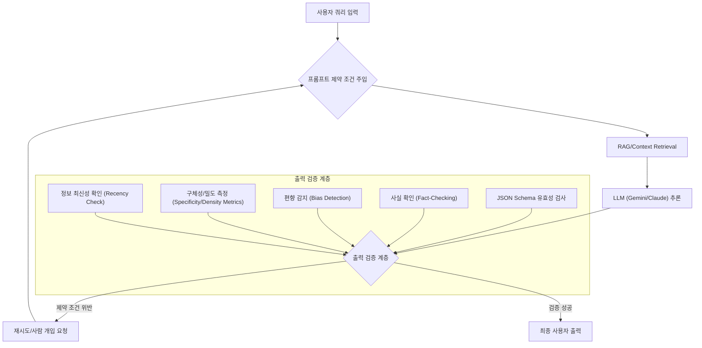

대규모 언어 모델(LLM)은 다양한 애플리케이션에서 놀라운 성능을 발휘하지만, 그 출력의 신뢰성과 정확성은 여전히 중요한 도전 과제입니다. 특히 시장 조사와 같이 민감한 분야에서는 LLM이 생성한 데이터의 오류가 심각한 비즈니스 결정으로 이어질 수 있습니다. LLM 출력 검증 파이프라인을 강화하는 핵심 전략 중 하나는 프롬프트에 명확하고 강력한 제약 조건을 도입하는 것입니다. 이는 모델의 응답 범위를 제한하고, 특정 기준을 충족하도록 유도하여 신뢰도를 향상시킵니다.

## LLM 리서치 오류 유형 및 프롬프트 제약 조건

LLM 기반 리서치에서 발생하는 주요 오류 유형은 다음과 같으며, 각각에 대응하는 프롬프트 제약 조건을 통해 문제 발생 가능성을 낮출 수 있습니다. 2026년 현재, 이러한 제약 조건은 단순한 지시를 넘어선 구조화된 가드레일(Guardrails)로 발전하고 있습니다.

### 1. 사실 오류 및 환각 (Factual Inaccuracy & Hallucination)
LLM이 존재하지 않는 사실을 지어내거나 부정확한 정보를 제공하는 경우입니다. 이는 시장 데이터의 왜곡으로 직결될 수 있습니다.

*   **제약 조건 예시**: "모든 주장은 제공된 문서에서만 근거해야 하며, 출처를 명확히 인용하라. 외부 지식을 사용하지 마라." "주어진 데이터셋에 없는 정보는 '알 수 없음'으로 응답하라."

### 2. 편향 증폭 (Bias Amplification)
학습 데이터에 존재하는 편향이 LLM 출력에 반영되어 특정 인구 집단이나 시장 부문에 대한 잘못된 인식을 초래할 수 있습니다.

*   **제약 조건 예시**: "성별, 연령, 지역 등 특정 그룹에 대한 고정관념을 피하고, 다양하고 중립적인 관점을 유지하라." "분석 시 모든 이해관계자의 관점을 균형 있게 고려하고, 근거 없는 추측을 배제하라."

### 3. 모호성 및 비구체성 (Vagueness & Lack of Specificity)
LLM의 답변이 지나치게 일반적이거나 추상적이어서 실제 의사 결정에 필요한 구체적인 통찰력을 제공하지 못하는 경우입니다.

*   **제약 조건 예시**: "모든 답변은 구체적인 수치, 통계, 사례를 포함해야 한다. 가능한 경우 정량적 데이터를 제시하라." "요청된 형식(예: JSON, 테이블)을 엄격히 준수하고, 각 필드의 의미를 명확히 정의하라."

### 4. 정보 노후화 (Outdated Information)
빠르게 변화하는 시장 환경에서 LLM이 오래된 데이터를 기반으로 응답할 경우, 현실과 동떨어진 분석 결과를 제공할 수 있습니다.

*   **제약 조건 예시**: "2026년 1분기 이후의 최신 데이터를 우선적으로 활용하라. 특정 시점 이후의 정보는 사용하지 마라." "데이터의 유효 기간을 명시하고, 출처가 불분명한 정보는 제외하라."

## 검증 파이프라인 아키텍처

프롬프트 제약 조건을 LLM 검증 파이프라인에 통합하는 아키텍처는 다음과 같습니다.



## 코드 예시: 제약 조건 기반 프롬프트 구성 및 검증

다음은 Python에서 프롬프트에 제약 조건을 주입하고, LLM 응답을 간단하게 검증하는 예시입니다. 여기서는 출력 형식을 JSON으로 강제하고, 필수 필드 존재 여부를 확인합니다.

```python
import json
from typing import Dict, Any

def build_constrained_prompt(query: str, constraints: Dict[str, str]) -> str:
    """
    주어진 쿼리에 제약 조건을 포함하는 프롬프트 생성.
    """
    constraint_str = "\n".join([f"- {k}: {v}" for k, v in constraints.items()])
    
    prompt = f"""
당신은 전문 시장 조사 분석가입니다. 다음 요청에 대해 엄격하게 제약 조건을 준수하여 응답하십시오.

# 요청
{query}

# 제약 조건
{constraint_str}

# 출력 형식
응답은 반드시 JSON 형식이어야 합니다. 다음 스키마를 따르십시오:
{{
  "title": "시장 보고서 제목",
  "summary": "간략한 요약 (최대 200자). 모든 사실은 근거 명시",
  "key_findings": [
    {{
      "finding": "핵심 발견 1",
      "evidence": "근거 (제공된 문서 페이지 번호 또는 섹션)",
      "date_range": "데이터 유효 범위"
    }}
  ]
}}
"""
    return prompt

def validate_llm_response(response: str, schema: Dict[str, Any]) -> bool:
    """
    LLM 응답을 주어진 JSON 스키마에 따라 검증.
    (실제로는 더 복잡한 스키마 유효성 검사 라이브러리 사용)
    """
    try:
        data = json.loads(response)
        # 필수 필드 존재 여부 확인 (간략화된 예시)
        if not all(key in data for key in schema.keys()):
            print(f"[Validation Error] Missing top-level keys. Expected: {list(schema.keys())}")
            return False
        if "key_findings" in data and isinstance(data["key_findings"], list):
            for item in data["key_findings"]:
                if not all(k in item for k in ["finding", "evidence", "date_range"]):
                    print("[Validation Error] Missing keys in key_findings item.")
                    return False
        return True
    except json.JSONDecodeError:
        print("[Validation Error] Response is not valid JSON.")
        return False
    except Exception as e:
        print(f"[Validation Error] An unexpected error occurred: {e}")
        return False

# 예시 사용
query = "2026년 대한민국 전기차 시장 동향 및 주요 경쟁사 분석"
constraints = {
    "데이터 출처": "오직 한국자동차산업협회(KAMA) 및 통계청 자료만 사용",
    "분석 시점": "2026년 1분기 기준 데이터",
    "출력 언어": "한국어",
    "정량적 데이터 포함": "시장 규모, 점유율은 반드시 수치로 제시"
}

json_schema_template = {
  "title": "",
  "summary": "",
  "key_findings": [
    {
      "finding": "",
      "evidence": "",
      "date_range": ""
    }
  ]
}


# 실제 LLM 호출을 시뮬레이션
# simulated_llm_response = llm_api_call(built_prompt)

# 가정된 LLM 응답 (올바른 형식)
simulated_llm_response_correct = '''
{
  "title": "2026년 대한민국 전기차 시장 동향 분석",
  "summary": "2026년 1분기 기준, 대한민국 전기차 시장은 판매량 5만 5천 대를 기록하며 전년 동기 대비 15% 성장했습니다. KAMA 자료에 따르면, 주요 경쟁사는 현대, 기아, 테슬라입니다.",
  "key_findings": [
    {
      "finding": "시장 성장률 15% 기록",
      "evidence": "KAMA 2026년 1분기 보고서, p.12",
      "date_range": "2026년 1분기"
    },
    {
      "finding": "현대차 시장 점유율 40%로 선두 유지",
      "evidence": "통계청 2026년 1분기 자동차 등록 통계, Table 3.1",
      "date_range": "2026년 1분기"
    }
  ]
}
'''

simulated_llm_response_incorrect = '''
{
  "report_name": "전기차 시장 보고서",
  "summary_text": "전기차는 미래입니다.",
  "data": []
}
'''

built_prompt = build_constrained_prompt(query, constraints)
# print(built_prompt)

print(f"Correct response validation: {validate_llm_response(simulated_llm_response_correct, json_schema_template)}")
print(f"Incorrect response validation: {validate_llm_response(simulated_llm_response_incorrect, json_schema_template)}")
```

## 트레이드오프

프롬프트 제약 조건 도입은 LLM 출력의 신뢰성을 크게 향상시키지만, 다음과 같은 트레이드오프를 고려해야 합니다.

*   **장점: 출력 신뢰성 및 일관성 향상**
    *   **언제 좋은가?**: 금융 분석, 법률 자문, 의료 진단 등 높은 정확성과 일관성이 필수적인 비즈니스 크리티컬 애플리케이션에 매우 효과적입니다. 자동화된 검증 파이프라인의 오류율을 크게 낮출 수 있습니다.
    *   **언제 나쁜가?**: 창의적이거나 탐색적인 쿼리, 모델의 자유로운 아이디어 생성이 필요한 경우에는 지나친 제약이 모델의 잠재력을 저해할 수 있습니다.

*   **장점: 자동화된 검증 용이성**
    *   **언제 좋은가?**: JSON Schema, 정규 표현식과 같은 구조화된 제약 조건을 사용하면 후처리 검증 로직을 쉽게 구현하고 자동화할 수 있습니다. 대량의 LLM 출력을 처리할 때 효율적입니다.
    *   **언제 나쁜가?**: 복잡하고 주관적인 제약 조건(예: '비판적 사고를 반영하라')은 자동화된 검증이 어렵고, 수동 검토 비용을 증가시킬 수 있습니다.

*   **단점: 프롬프트 엔지니어링 복잡도 증가**
    *   **언제 좋은가?**: 숙련된 프롬프트 엔지니어가 명확한 요구사항을 가지고 있을 때, 정밀한 제약 조건을 통해 원하는 출력을 얻는 데 도움이 됩니다.
    *   **언제 나쁜가?**: 프롬프트에 너무 많은 제약을 넣거나, 제약 조건 간에 충돌이 발생하면 모델이 혼란을 겪거나 원하는 응답을 생성하지 못할 수 있습니다. 프롬프트 관리 및 버전 관리가 복잡해집니다.

*   **단점: 모델 성능 저하 및 토큰 비용 증가 가능성**
    *   **언제 좋은가?**: 모델의 '환각' 성향을 억제하고 안정적인 출력을 얻는 데 유리합니다. 단기적으로는 더 많은 토큰을 사용하지만, 장기적으로는 오류 수정 비용을 절감할 수 있습니다.
    *   **언제 나쁜가?**: 과도하게 길고 상세한 제약 조건은 프롬프트 길이를 증가시켜 API 호출 비용을 늘리고, 모델이 중요한 정보에 집중하지 못하게 하여 성능을 저하시킬 수 있습니다. 특히 제한된 컨텍스트 윈도우를 가진 모델에 불리합니다.

## 실전 체크리스트

LLM 출력 검증 파이프라인에 프롬프트 제약 조건을 도입할 때 다음 항목들을 점검하여 성공적인 적용을 보장합니다.

- [ ] **오류 유형 식별 및 매핑**: 현재 LLM 에이전트에서 발생하는 주요 오류 유형(환각, 편향, 모호성, 최신성 등)을 식별하고, 각 오류에 대응하는 구체적인 프롬프트 제약 조건을 정의했는가?
- [ ] **구조화된 출력 형식 강제**: LLM 출력이 JSON Schema, XML 등 기계적으로 파싱 가능한 구조화된 형식을 따르도록 프롬프트에 명시적으로 지시하고, 관련 스키마를 제공했는가?
- [ ] **참조 자료 명시 및 인용 요구**: 모델이 답변을 생성할 때 참조해야 할 외부 자료(문서, 데이터베이스)를 명확히 지정하고, 모든 사실에 대한 출처 인용을 강제하는 제약 조건을 포함했는가?
- [ ] **자동화된 검증 로직 구현**: 정의된 제약 조건(예: 필수 필드 존재, 데이터 형식 유효성, 키워드 포함/제외)을 기반으로 LLM 출력을 자동으로 검증하는 파이프라인 컴포넌트를 구현했는가?
- [ ] **재시도 및 에러 핸들링 전략**: 검증에 실패한 LLM 출력에 대해 재시도 메커니즘, 프롬프트 재구성, 또는 사람 개입 요청과 같은 에러 핸들링 전략을 구축했는가?
- [ ] **성능 및 비용 모니터링**: 제약 조건 도입 후 LLM의 응답 시간, 토큰 사용량, 그리고 전반적인 시스템 처리량을 모니터링하여 성능 저하나 비용 증가가 발생하지 않는지 확인하는가?
- [ ] **지속적인 제약 조건 최적화**: LLM 에이전트의 동작 변화와 새로운 오류 유형 발견에 따라 프롬프트 제약 조건을 주기적으로 검토하고 개선하는 프로세스를 확립했는가?