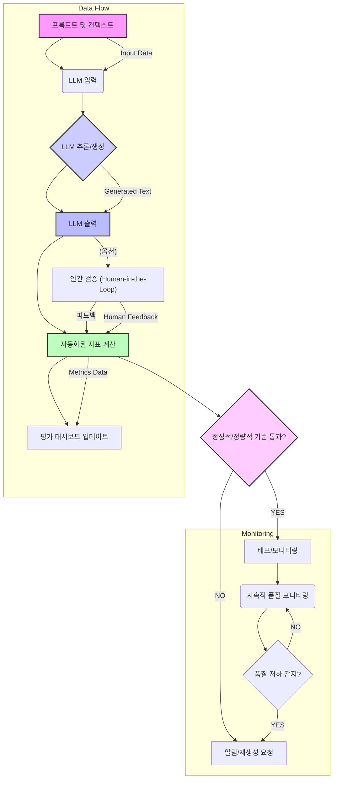

대규모 언어 모델 (Large Language Model, LLM)의 출력 검증 (Output Validation)은 AI 시스템의 신뢰성, 안전성, 그리고 비즈니스 가치를 보장하는 데 필수적인 기초 작업입니다. 생성형 AI의 발전은 놀랍지만, 그만큼 비결정적 (non-deterministic)이고 때로는 예상치 못한 결과물을 생성할 수 있기 때문에, LLM이 실제 운영 환경에서 의도한 대로 작동하는지 지속적으로 평가하고 검증하는 체계가 중요합니다. 이러한 검증 체계 없이는 시스템의 품질 저하 (drift)나 '조용한 버그 (silent bugs)' 발생 위험이 커집니다. 특히 2026년 현재, LLM은 단순한 텍스트 생성 도구를 넘어 다양한 산업군에서 핵심적인 역할을 수행하므로, 견고한 평가 지표 설계는 곧 제품의 성공과 직결됩니다.

## LLM 출력 품질의 핵심 차원
LLM 출력의 품질을 평가하기 위해서는 다양한 관점에서 측정 지표를 설계해야 합니다. 주요 품질 차원은 다음과 같습니다:

*   **정확성 (Accuracy) 및 사실성 (Factuality)**: LLM의 응답이 사실과 일치하는지, 즉 환각 (hallucination)을 일으키지는 않는지 확인합니다. 외부 지식 베이스나 검색 결과와 비교하여 검증할 수 있습니다.
*   **관련성 (Relevance)**: 사용자의 프롬프트 (prompt) 및 주어진 컨텍스트 (context)에 얼마나 충실하게 응답했는지 평가합니다. 불필요한 정보나 주제에서 벗어난 내용은 아닌지 중요합니다.
*   **일관성 (Coherence) 및 유창성 (Fluency)**: 생성된 텍스트가 문법적으로 올바르고, 자연스러우며, 논리적으로 잘 연결되는지 확인합니다. 이는 가독성 (readability)과 직결됩니다.
*   **안전성 (Safety) 및 편향성 (Bias)**: 유해하거나 차별적인 내용을 포함하고 있지 않은지 검토합니다. 특히 민감한 영역에서는 엄격한 가드레일 (guardrail) 설정과 평가가 요구됩니다.
*   **완전성 (Completeness)**: 프롬프트에서 요구하는 모든 정보나 질문에 대해 충분히 답변했는지 평가합니다.
*   **간결성 (Conciseness)**: 필요한 정보를 불필요하게 늘어뜨리지 않고 핵심을 잘 전달하는지 확인합니다.

## 정량적 평가 지표 설계
위에서 언급된 품질 차원들을 측정하기 위해 다양한 정량적 지표를 설계할 수 있습니다. 이는 크게 규칙 기반 (rule-based), 모델 기반 (model-based), 그리고 임베딩 기반 (embedding-based) 방식으로 나눌 수 있습니다.

### 규칙 기반 지표
정규 표현식 (regular expressions), 키워드 매칭, 특정 문구 포함 여부 등을 통해 간단하고 빠르게 검증할 수 있습니다. 예를 들어, 특정 금지어 목록이 있는지, 응답이 특정 형식(JSON, XML 등)을 따르는지 확인할 때 유용합니다.

### 모델 기반 지표
작거나 특정 작업에 미세 조정된 (fine-tuned) LLM을 사용하여 주 LLM의 출력을 평가하는 방식입니다. 예를 들어, '출력의 유해성 평가 모델', '출력의 요약 품질 평가 모델' 등을 구축하여 활용할 수 있습니다. 이는 사람의 수동 평가 (Human-in-the-Loop, HITL)를 보완하고 확장하는 효과적인 방법입니다.

### 임베딩 기반 지표
LLM의 출력과 '이상적인' 또는 '기대하는' 응답 간의 의미론적 유사성 (semantic similarity)을 측정하는 방식입니다. 코사인 유사도 (cosine similarity) 등을 활용하여 두 텍스트가 의미상 얼마나 가까운지 평가합니다. 이는 특히 답변의 '뉘앙스'를 평가하는 데 유용합니다.

## LLM 평가 워크플로우
효과적인 LLM 출력 검증을 위한 일반적인 워크플로우는 다음과 같습니다.



이 다이어그램은 LLM이 생성한 출력이 자동화된 지표를 통해 1차적으로 평가되고, 필요시 인간 검증 단계를 거쳐 최종적으로 배포되거나 재작업을 거치는 과정을 보여줍니다. 지속적인 모니터링은 배포 후에도 LLM 성능의 저하 (drift)를 감지하고 선제적으로 대응하는 데 중요합니다.

## 코드 예제: 간단한 Python 기반 지표 계산
파이썬 (Python)을 사용하여 LLM 출력의 사실성 및 의미론적 유사성을 평가하는 간단한 예시입니다. 여기서는 `transformers` 라이브러리의 `sentence-transformers`를 활용하여 임베딩 기반 유사성을 측정하고, 키워드 매칭을 통해 사실성을 간접적으로 확인합니다.

```python
from sentence_transformers import SentenceTransformer, util

def evaluate_llm_output(generated_text: str, context: str, expected_keywords: list):
    """
    LLM 출력을 평가하는 함수.
    - 사실성 (키워드 매칭)
    - 관련성 (의미론적 유사성)
    """
    model = SentenceTransformer('paraphrase-MiniLM-L6-v2')

    # 1. 사실성 평가 (키워드 매칭)
    factual_score = 0
    missing_keywords = []
    for keyword in expected_keywords:
        if keyword.lower() in generated_text.lower():
            factual_score += 1
        else:
            missing_keywords.append(keyword)
    factual_completeness = factual_score / len(expected_keywords) if expected_keywords else 1.0

    print(f"--- Factual Completeness ---")
    print(f"Keywords found: {factual_score}/{len(expected_keywords)}")
    if missing_keywords:
        print(f"Missing keywords: {', '.join(missing_keywords)}")

    # 2. 관련성 평가 (의미론적 유사성)
    if context:
        # 문장 임베딩 생성
        embeddings_generated = model.encode(generated_text, convert_to_tensor=True)
        embeddings_context = model.encode(context, convert_to_tensor=True)

        # 코사인 유사도 계산
        cosine_similarity = util.cos_sim(embeddings_generated, embeddings_context).item()
        print(f"--- Semantic Relevance ---")
        print(f"Cosine Similarity with context: {cosine_similarity:.4f}")
    else:
        cosine_similarity = 0.0
        print(f"No context provided for semantic relevance evaluation.")

    return {
        "factual_completeness": factual_completeness,
        "semantic_relevance": cosine_similarity
    }

# 예시 사용법
if __name__ == "__main__":
    generated_answer = "GPT-4o는 OpenAI가 개발한 최신 플래그십 모델입니다. 텍스트, 오디오, 비디오를 이해하고 생성할 수 있는 멀티모달 기능을 가지고 있습니다."
    input_context = "OpenAI의 최신 모델인 GPT-4o에 대한 정보를 알려주세요. 주요 특징은 무엇인가요?"
    keywords = ["OpenAI", "GPT-4o", "멀티모달"]

    results = evaluate_llm_output(generated_answer, input_context, keywords)
    print("\nEvaluation Results:", results)

    print("\n--- 다른 예시: 낮은 관련성 ---")
    generated_answer_bad = "최근 AI 기술은 빠르게 발전하고 있으며, 많은 기업들이 LLM에 투자하고 있습니다. 이에는 윤리적 고려도 중요합니다."
    results_bad = evaluate_llm_output(generated_answer_bad, input_context, keywords)
    print("\nEvaluation Results (Bad):", results_bad)
```

위 코드는 간단한 키워드 매칭과 `SentenceTransformer`를 이용한 의미론적 유사도 계산을 통해 LLM 출력의 사실성 및 관련성을 평가하는 방법을 보여줍니다. 실제 프로덕션 환경에서는 더 복잡한 모델 기반 평가 지표나 정교한 휴리스틱 (heuristics)이 필요합니다.

## 2026년 최신 트렌드 반영 및 고급 고려사항
LLM 출력 검증 분야는 2026년에도 빠르게 진화하고 있습니다. 다음은 주요 트렌드 및 고려사항입니다.

*   **지속적 평가 (Continuous Evaluation) 및 MLOps 통합**: LLM 애플리케이션의 CI/CD (Continuous Integration/Continuous Delivery) 파이프라인에 평가 지표 계산 및 모니터링을 통합하여 모델의 성능 저하 (performance degradation)를 실시간으로 감지하고 대응하는 것이 중요합니다.
*   **RAG (Retrieval Augmented Generation) 견고성 평가**: 검색 증강 생성 (RAG) 시스템의 경우, 검색 (retrieval) 단계의 정확성뿐만 아니라 LLM이 검색된 문서를 얼마나 효과적으로 활용하여 답변을 생성하는지 (faithfulness to source)를 평가하는 지표가 중요해지고 있습니다.
*   **적대적 테스트 (Adversarial Testing) 및 Red Teaming**: 모델의 취약점을 탐색하고 예상치 못한 오류를 유발하는 적대적 프롬프트 (adversarial prompts)를 사용하여 LLM의 안전성과 견고성을 미리 검증하는 방식이 더욱 중요해지고 있습니다.
*   **다중 모달 (Multi-modal) LLM 평가**: 텍스트 외에 이미지, 오디오, 비디오를 입출력으로 사용하는 멀티모달 LLM의 등장으로, 각 모달리티별 그리고 모달리티 간 상호작용에 대한 새로운 평가 지표와 방법론이 요구됩니다.
*   **설명 가능 AI (Explainable AI, XAI) 지표**: LLM이 특정 결정을 내린 이유나 특정 출력을 생성한 과정을 얼마나 잘 설명하는지에 대한 평가도 중요성이 커지고 있습니다. 이는 규제 준수 (regulatory compliance) 및 사용자 신뢰 구축에 필수적입니다.
