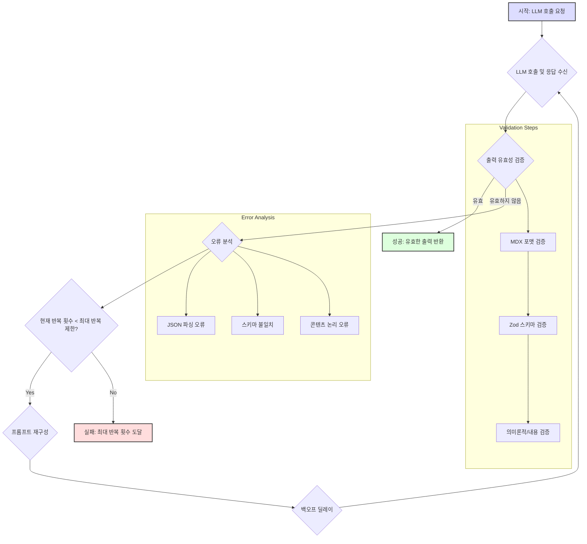

대규모 언어 모델 (LLM) 기반 애플리케이션의 신뢰성과 효율성을 보장하는 데 있어 LLM 출력의 유효성 검증 (validation) 파이프라인은 핵심적인 역할을 수행한다. 특히, AI 에이전트와 같이 복잡한 자율 시스템에서는 잘못된 LLM 출력이 전체 워크플로를 중단시키거나 예상치 못한 비용을 발생시킬 수 있다. 따라서 MDX validation, Zod 스키마 검증과 같은 다양한 유효성 검증 단계에서 실패 발생 시 어떻게 재시도(retry)를 수행하고, 무한 루프나 과도한 비용을 방지하기 위해 반복 횟수(iteration limits)를 어떻게 설정할지가 중요한 최적화 지점이다.

AI 코드 리뷰와 같은 시나리오에서 LLM이 만족스러운 결과를 생성하기까지 수십, 수백 번의 호출이 필요할 수 있다는 경험적 사실은 반복 제한과 리트라이 로직의 중요성을 강조한다. 무작정 많은 재시도는 비용과 지연을 증가시키며, 너무 적은 재시도는 실패율을 높여 시스템의 유용성을 저해한다.

## 핵심 개념: 리트라이 로직과 반복 제한

LLM 출력 검증 파이프라인의 핵심은 다음과 같은 원칙을 기반으로 한다.

### 1. 적응형 리트라이 (Adaptive Retry)

단순한 고정 횟수 재시도보다는, 오류 유형과 맥락에 따라 재시도 전략을 유연하게 조정하는 것이 효율적이다. 예를 들어, 출력 포맷 불일치(JSON 파싱 오류)는 스키마 수정 프롬프트를 통해 재시도할 수 있지만, 의미론적 부정확성(semantic inaccuracy)은 더 많은 컨텍스트를 제공하거나 다른 LLM 모델로 전환하는 재시도가 필요할 수 있다. 지수 백오프(exponential backoff)는 일시적인 API 문제를 해결하는 데 효과적이지만, 지속적인 논리 오류에는 부적합하다.

### 2. 반복 제한 (Iteration Limits) 및 조기 종료 조건 (Early Exit Conditions)

각 LLM 호출은 비용과 시간을 소모하므로, 무한정 재시도하는 것은 비실용적이다. 최대 반복 횟수를 설정하고, 특정 기준(예: 연속적인 동일 오류, 개선 없는 반복) 충족 시 조기 종료하는 메커니즘을 도입해야 한다. 이 과정에서 실패 분석을 위한 로그를 남기고, 사용자 또는 상위 시스템에 실패를 알리는 폴백(fallback) 전략이 필요하다.

### 3. 개선 추적 메트릭 (Metrics for Improvement Tracking)

리트라이 로직과 반복 제한의 효과를 측정하기 위해 다음과 같은 메트릭을 추적해야 한다.
*   **성공률 (Success Rate)**: 특정 반복 횟수 내에 유효한 출력을 생성한 비율.
*   **평균 반복 횟수 (Average Iterations to Success)**: 성공적인 출력을 얻기까지 평균적으로 소요된 LLM 호출 횟수.
*   **성공적인 출력당 비용 (Cost per Successful Output)**: 전체 LLM 호출 비용 대비 성공적인 출력 한 개를 얻는 데 소요된 비용.
*   **성공적인 출력당 지연 시간 (Latency per Successful Output)**: 최종 성공적인 출력을 얻기까지의 총 경과 시간.

## 검증 및 리트라이 파이프라인 예제

아래 Python 코드는 Zod-like 스키마 검증과 재시도 로직을 결합한 LLM 출력 검증 파이프라인의 간소화된 예시이다. `validate_llm_output` 함수는 LLM이 JSON 객체를 반환하고, 이 JSON이 정의된 스키마에 부합하는지 확인하는 역할을 한다.

```python
import json
import time
from typing import Any, Dict, List, Optional

class ValidationError(Exception):
    """Custom exception for validation errors."""
    pass

def mock_llm_call(prompt: str, iteration: int) -> Dict[str, Any]:
    """Mock LLM call simulating varying success rates."""
    print(f"-> LLM Call (Iteration {iteration}): {prompt[:50]}...")
    if iteration < 2: # Fail twice then succeed
        if iteration == 0:
            # Simulate format error (missing required field)
            return {"name": "John Doe"}
        else:
            # Simulate type error (age as string)
            return {"name": "Jane Doe", "age": "twenty"}
    else:
        # Simulate success
        return {"name": "Alice", "age": 30, "email": "alice@example.com"}

def validate_schema(data: Dict[str, Any]) -> None:
    """Simulates Zod-like schema validation."""
    if not isinstance(data, dict):
        raise ValidationError("Output is not a dictionary.")
    if "name" not in data or not isinstance(data["name"], str):
        raise ValidationError("Missing or invalid 'name' field.")
    if "age" not in data or not isinstance(data["age"], int):
        raise ValidationError("Missing or invalid 'age' field (must be int).")
    if "email" not in data or not isinstance(data["email"], str) or "@" not in data["email"]:
        raise ValidationError("Missing or invalid 'email' field.")
    print("Schema validation successful.")

def refine_prompt_for_retry(original_prompt: str, error_message: str) -> str:
    """Refines prompt based on validation error for retry."""
    return f"{original_prompt}\n\nPrevious error: {error_message}. Please correct the output format and content according to the schema: {{"name": str, "age": int, "email": str}}."

def llm_validation_pipeline(
    initial_prompt: str,
    max_retries: int = 3,
    base_delay: float = 1.0
) -> Optional[Dict[str, Any]]:
    """Executes LLM call with validation and adaptive retry logic."""
    current_prompt = initial_prompt
    for i in range(max_retries):
        try:
            llm_output = mock_llm_call(current_prompt, i)
            validate_schema(llm_output)
            print(f"Validation successful after {i + 1} iterations.")
            return llm_output
        except ValidationError as e:
            print(f"Validation failed (Iteration {i + 1}): {e}")
            if i < max_retries - 1:
                delay = base_delay * (2 ** i) # Exponential backoff
                print(f"Retrying in {delay:.2f} seconds with refined prompt...")
                current_prompt = refine_prompt_for_retry(initial_prompt, str(e))
                time.sleep(delay)
            else:
                print("Max retries reached. Exiting pipeline.")
                return None
        except json.JSONDecodeError:
            print(f"JSON decoding failed (Iteration {i + 1}).")
            if i < max_retries - 1:
                delay = base_delay * (2 ** i)
                print(f"Retrying in {delay:.2f} seconds with refined prompt...")
                current_prompt = refine_prompt_for_retry(initial_prompt, "Output is not valid JSON.")
                time.sleep(delay)
            else:
                print("Max retries reached. Exiting pipeline.")
                return None
    return None

# Example Usage
if __name__ == "__main__":
    initial_llm_prompt = "Generate a JSON object for a user with name, age (integer), and email."
    validated_output = llm_validation_pipeline(initial_llm_prompt, max_retries=3)
    if validated_output:
        print(f"Final Validated Output: {validated_output}")
    else:
        print("Failed to get valid LLM output after retries.")
```

## LLM 출력 검증 및 리트라이 플로우



## 트레이드오프

### 1. 반복 횟수 증가 vs. 비용 및 지연 시간
*   **언제 좋은가**: LLM이 높은 품질의 출력을 생성하지만 일관성이 부족할 때. 복잡하거나 중요한 작업에서 성공률을 극대화해야 할 때. (예: 규제 준수 문서 생성, 금융 데이터 분석) 낮은 비용의 LLM을 사용하여 여러 번 시도할 때.
*   **언제 나쁜가**: 실시간 응답이 필수적이거나 LLM 호출당 비용이 매우 높을 때. 반복적인 실패가 LLM의 근본적인 이해 부족에서 비롯될 때 (이 경우 프롬프트 엔지니어링 또는 모델 변경이 더 효과적).

### 2. 엄격한 유효성 검증 vs. 유연성 및 복구 가능성
*   **언제 좋은가**: 보안, 정확성, 안정성이 최우선인 애플리케이션에서. (예: 코드 생성, 데이터 변환, 자동화된 액션 트리거) 스키마 드리프트나 예상치 못한 출력으로부터 시스템을 보호해야 할 때.
*   **언제 나쁜가**: 창의적이거나 탐색적인 LLM 작업에서. 약간의 포맷 오류가 치명적이지 않고, 수동 수정이 가능한 경우. 개발 초기 단계에서 빠르게 프로토타입을 만들 때.

### 3. 조기 종료 vs. 최대 성공 가능성 확보
*   **언제 좋은가**: 비용 효율성이나 지연 시간이 핵심 제약 사항일 때. (예: 대량 배치 처리, 빠르게 실패하고 다음 작업으로 넘어가야 하는 에이전트) 반복적인 실패가 LLM의 현재 능력 범위를 넘어선다고 판단될 때.
*   **언제 나쁜가**: 단 한 번의 성공적인 출력이 매우 높은 가치를 가질 때. (예: 복잡한 문제 해결, 중요한 의사결정 지원) 실패가 일시적인 문제이거나 특정 컨텍스트 추가로 해결될 가능성이 있을 때.

## 실전 체크리스트

LLM 출력 검증 파이프라인의 리트라이 로직과 반복 제한을 최적화하기 위한 실전 체크리스트는 다음과 같다.

- [ ] **유효성 검증 스키마 정의 및 자동화**: MDX, JSON Schema, Zod 등을 사용하여 LLM 출력의 예상 구조와 콘텐츠에 대한 명확하고 자동화된 검증 규칙을 정의했는가?
- [ ] **오류 유형별 리트라이 전략 설계**: JSON 파싱 오류, 스키마 불일치, 의미론적 오류 등 주요 오류 유형별로 적합한 리트라이 전략(예: 프롬프트 수정, 다른 모델 사용, 지수 백오프)을 구현했는가?
- [ ] **동적 반복 제한 및 조기 종료 조건 구현**: 특정 작업의 중요도, LLM의 과거 성능, 예상 비용 등을 고려하여 동적으로 반복 제한을 설정하고, 무의미한 재시도를 방지하기 위한 조기 종료 조건을 마련했는가?
- [ ] **성능 메트릭 추적 및 시각화**: 성공률, 평균 반복 횟수, 성공 출력당 비용 및 지연 시간 등 핵심 메트릭을 실시간으로 추적하고 대시보드에서 시각화하여 파이프라인의 효율성을 모니터링하고 있는가?
- [ ] **실패 시 폴백 메커니즘 구축**: 최대 반복 횟수에 도달하거나 복구 불가능한 오류 발생 시, 사용자에게 알림, 수동 개입 트리거, 기본값 반환 등 적절한 폴백 메커니즘을 갖추고 있는가?
- [ ] **A/B 테스팅을 통한 전략 검증**: 다양한 리트라이 로직 및 반복 제한 전략을 A/B 테스팅하여 실제 환경에서의 성능과 비용 효율성을 비교 검증하고, 최적의 설정을 찾아내고 있는가?
- [ ] **모델 업데이트 시 재평가 주기 설정**: LLM 모델이 업데이트되거나 프롬프트가 변경될 때마다 기존의 리트라이 로직과 반복 제한 설정이 여전히 유효한지 재평가하는 주기를 마련했는가?