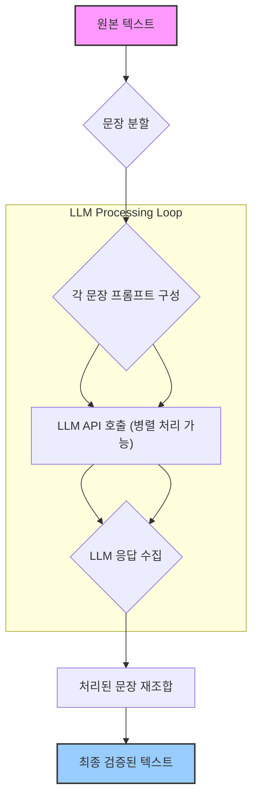

LLM(Large Language Model)의 출력은 갈수록 정교해지고 있지만, 텍스트 교정이나 윤문 과정에서 중요한 내용이 의도치 않게 누락되거나 변형되는 문제는 여전히 존재합니다. 특히 긴 텍스트를 한 번에 LLM에 전달할 경우, 모델이 전체 문맥을 처리하는 과정에서 특정 문장이나 구절을 '대충 훑고' 넘어가며 중요한 수정 사항을 놓치거나, 심지어 완전히 제외하는 경우가 발생할 수 있습니다. 이는 마치 `grep`과 같이 특정 키워드에만 집중하고 나머지 문맥은 무시하는 것과 유사한 현상입니다.

이러한 문제를 해결하고 LLM 출력의 완전성을 확보하기 위해, 문장 단위 강제 처리 (Sentence-Unit Forced Processing) 로직을 LLM 출력 검증 파이프라인에 적용하는 것이 중요합니다. 이 접근 방식은 LLM이 모든 문장을 개별적으로 읽고 처리하도록 강제하여, 텍스트 누락을 방지하고 검증의 신뢰도를 극대화합니다.

## 핵심 개념: 문장 단위 강제 처리 파이프라인

문장 단위 강제 처리 파이프라인의 핵심은 LLM에게 전체 텍스트를 한 덩어리로 제공하는 대신, 텍스트를 의미 있는 최소 단위인 '문장'으로 분할하여 각 문장을 개별적으로 처리하도록 유도하는 것입니다. 이 과정은 다음과 같은 단계를 거칩니다.

1.  **텍스트 분할 (Text Segmentation)**: 원본 텍스트를 구두점(온점, 물음표, 느낌표 등)을 기준으로 문장 단위로 분할합니다. 정확한 분할을 위해 NLTK(Natural Language Toolkit)와 같은 자연어 처리 라이브러리의 문장 토크나이저를 활용할 수 있습니다.
2.  **개별 LLM 호출 (Individual LLM Calls)**: 분할된 각 문장을 별도의 프롬프트로 구성하여 LLM에 전달합니다. 이때, 이전 문장 또는 전체 문서의 핵심 맥락을 요약하여 프롬프트에 추가하는 방식으로 문맥 상실을 최소화할 수 있습니다.
3.  **응답 수집 및 재조합 (Response Collection and Reassembly)**: 각 문장에 대한 LLM의 처리 결과를 수집합니다. 이후, 원래의 문장 순서에 맞춰 LLM이 수정하거나 검증한 문장들을 재조합하여 최종 텍스트를 생성합니다.

이러한 방식으로 모든 문장이 LLM에 의해 명시적으로 검토되고 처리되도록 강제함으로써, 텍스트의 어떠한 부분도 '간과'되지 않고 철저한 검증을 거치게 됩니다.

### 구현 상세: 파이프라인 설계 및 고려사항

**문장 분할 (Sentence Segmentation)**
다국어 환경에서는 `nltk`의 `punkt` 토크나이저를 해당 언어 모델과 함께 사용하는 것이 일반적입니다. 예를 들어, 한국어의 경우 KoNLPy나 커스텀 정규 표현식을 활용하여 문장 분할의 정확도를 높일 수 있습니다. 문장 분할은 파이프라인의 첫 단추이므로, 오류 없이 정확하게 수행되어야 합니다.

**개별 LLM 호출 및 컨텍스트 관리 (Individual LLM Calls and Context Management)**
각 문장을 처리할 때, 독립적인 호출은 문맥 손실을 야기할 수 있습니다. 이를 방지하기 위해 다음 전략을 고려할 수 있습니다.

*   **슬라이딩 윈도우 컨텍스트 (Sliding Window Context)**: 현재 문장과 N개의 이전 문장을 함께 프롬프트에 포함하여 LLM에 전달합니다.
*   **전역 컨텍스트 요약 (Global Context Summary)**: 전체 문서의 주요 요점이나 주제를 간략하게 요약하여 모든 문장 프롬프트에 첨부합니다.
*   **프롬프트 엔지니어링 (Prompt Engineering)**: 각 문장에 대해 LLM이 수행해야 할 검증/교정 작업을 명확히 지시하고, 불확실한 경우 질문하도록 유도합니다.

**응답 통합 및 재조합 (Response Aggregation and Reassembly)**
LLM이 처리한 문장들을 원래 순서대로 안전하게 병합하는 것이 중요합니다. 만약 LLM이 문장을 완전히 삭제하거나 추가하는 경우, 이를 반영하는 재조합 로직이 필요합니다. 버전 관리 시스템이나 차이(diff) 도구를 활용하여 변경 사항을 추적하고 검토할 수 있습니다.

### 코드 예제 (Python)

다음은 문장 단위 강제 처리 파이프라인의 개념을 보여주는 간단한 Python 코드 예제입니다. 실제 LLM API 호출은 플레이스홀더로 대체되었습니다.

```python
import nltk
from nltk.tokenize import sent_tokenize

# NLTK punkt tokenizer 다운로드 (최초 1회 실행)
try:
    sent_tokenize("Test.")
except LookupError:
    nltk.download('punkt')

def call_llm_api(prompt: str) -> str:
    """LLM API를 호출하고 응답을 반환하는 가상 함수"""
    print(f"[LLM Input]: {prompt[:50]}...")
    # 실제 LLM API 호출 로직 (예: Anthropic Claude, OpenAI GPT 등)
    # 여기서는 간단한 변환을 가정
    if "이상한" in prompt:
        return prompt.replace("이상한", "부자연스러운") + " (수정됨)"
    return prompt + " (검증됨)"

def process_text_sentence_by_sentence(text: str) -> str:
    """텍스트를 문장 단위로 분할하여 LLM으로 처리하는 파이프라인"""
    sentences = sent_tokenize(text, language='english') # 또는 'korean'
    processed_sentences = []

    for i, sentence in enumerate(sentences):
        # 각 문장에 대한 LLM 프롬프트 구성
        # 필요에 따라 이전 문맥을 포함할 수 있음
        prompt = f"다음 문장을 검토하고 필요한 경우 수정해주세요: {sentence}"
        llm_response = call_llm_api(prompt)
        processed_sentences.append(llm_response)
    
    return " ".join(processed_sentences)

# 예시 사용
original_text = "이 문장은 이상한가요? 아니면 괜찮은가요? LLM은 가끔 중요한 내용을 빠뜨리곤 합니다."
processed_text = process_text_sentence_by_sentence(original_text)
print("\n--- Original Text ---")
print(original_text)
print("\n--- Processed Text ---")
print(processed_text)
```

### 파이프라인 흐름



## 2026년 LLM 검증 트렌드

2026년에는 LLM이 기업의 핵심 비즈니스 프로세스에 깊숙이 통합되면서, 그 출력의 신뢰성과 무결성에 대한 요구가 더욱 증대될 것입니다. 특히 금융, 법률, 의료와 같이 규제가 엄격하거나 오류에 대한 허용치가 낮은 분야에서는 LLM이 생성하거나 처리한 모든 텍스트에 대해 사람의 개입 없이도 완전한 검증을 보장하는 자동화된 시스템이 필수적입니다. 문장 단위 강제 처리는 이러한 '블랙박스' 모델의 투명성과 제어 가능성을 높여, LLM 활용의 문턱을 낮추고 신뢰를 구축하는 데 기여합니다. 부분적인 오류가 전체 시스템에 미치는 연쇄 효과를 최소화하는 것도 중요한 트렌드입니다.

## 트레이드오프

문장 단위 강제 처리 방식은 LLM 출력 검증의 완전성을 높이지만, 모든 기술적 접근이 그러하듯 장단점이 존재합니다.

*   **장점: 출력 완전성 및 무결성 보장 (언제 좋은가)**: LLM이 텍스트의 특정 부분을 누락하거나 간과할 위험이 있을 때 매우 효과적입니다. 특히 법률 문서, 계약서, 보고서 등 정확성과 누락 없는 처리가 필수적인 경우에 이상적입니다. 기존 `grep` 방식이나 대략적인 검토로는 놓칠 수 있는 미묘한 오류나 누락을 방지하는 데 최적화되어 있습니다.
*   **장점: 디버깅 및 감사 용이성 (언제 좋은가)**: 각 문장 단위로 LLM의 처리 내역이 기록되므로, 특정 문장에서 오류가 발생했거나 변경이 일어났을 때 원인을 파악하고 감사하는 것이 훨씬 수월합니다. 모델의 행동을 더 투명하게 이해해야 할 때 유용합니다.
*   **단점: 비용 및 지연 시간 증가 (언제 나쁜가)**: 텍스트를 문장 단위로 분할하여 개별 LLM 호출을 수행하면, 전체 텍스트를 한 번에 처리하는 것보다 API 호출 횟수가 비례하여 증가합니다. 이는 토큰 비용과 전체 처리 지연 시간을 크게 늘릴 수 있습니다. 실시간 처리가 요구되거나 대량의 텍스트를 빠르게 처리해야 하는 환경에서는 제약이 될 수 있습니다.
*   **단점: 문맥 유지의 복잡성 (언제 나쁜가)**: 문장 단위로 분리하면 때로는 문맥이 단절되어 LLM이 전체적인 의미를 파악하기 어려워질 수 있습니다. 특히 긴 문장이나 여러 문장에 걸쳐 흐르는 복합적인 의미를 가진 텍스트의 경우, 문맥 전달 메커니즘 (슬라이딩 윈도우, 전역 요약 등) 구현에 추가적인 복잡성이 따르며, 그럼에도 불구하고 미묘한 문맥 오류가 발생할 가능성이 있습니다.
*   **단점: 구현 복잡성 증가 (언제 나쁜가)**: 문장 분할, 개별 호출 관리, 병렬 처리, 응답 재조합, 오류 처리 등 파이프라인의 설계 및 구현이 전체 텍스트 처리 방식보다 훨씬 복잡합니다. 개발 및 유지보수 비용이 증가하며, 작은 실수도 전체 파이프라인의 견고성에 영향을 미칠 수 있습니다.

## 실전 체크리스트

LLM 출력 검증 파이프라인에 문장 단위 강제 처리 로직을 적용할 때 다음 항목들을 점검하여 성공적인 구현을 보장하세요.

*   [ ] **문장 분할 정확도 검증**: 사용하는 문장 토크나이저가 다양한 텍스트 유형과 언어(한국어, 영어 등)에서 99% 이상의 정확도로 문장을 분할하는지 테스트 세트로 검증했는가?
*   [ ] **LLM 호출 병렬 처리 구현**: 개별 문장 LLM 호출이 비동기 또는 병렬로 처리되어 지연 시간을 최적화했는가? (예: `asyncio`, 스레드 풀)
*   [ ] **토큰 비용 및 지연 시간 모니터링**: 파이프라인 적용 후 LLM API 호출 비용과 전체 처리 시간이 얼마나 증가했는지 정량적으로 측정하고, 허용 가능한 범위 내에 있는지 지속적으로 모니터링하는 대시보드를 구축했는가?
*   [ ] **문맥 의존성 처리 전략 정의**: 각 문장 처리 시 어떤 방식으로 문맥 정보를 LLM에 전달할지 (예: 슬라이딩 윈도우, 요약 프롬프트) 명확히 정의하고 구현했는가?
*   [ ] **재조합 로직의 견고성 확인**: LLM이 문장을 수정, 삭제, 추가했을 때 재조합 로직이 원본 텍스트의 의미와 구조를 올바르게 반영하여 최종 텍스트를 생성하는지 다양한 시나리오로 테스트했는가?
*   [ ] **오류 로깅 및 재시도 메커니즘**: 특정 문장 처리 중 LLM API 오류나 타임아웃 발생 시, 해당 문장에 대한 재시도 로직과 상세한 오류 로깅 시스템을 구축했는가?
*   [ ] **성능 벤치마킹 및 임계점 설정**: 파이프라인의 처리량(throughput) 및 응답 시간(latency)에 대한 벤치마크를 수행하고, 시스템 부하 증가 시 성능 저하를 감지할 수 있는 임계점을 설정했는가?