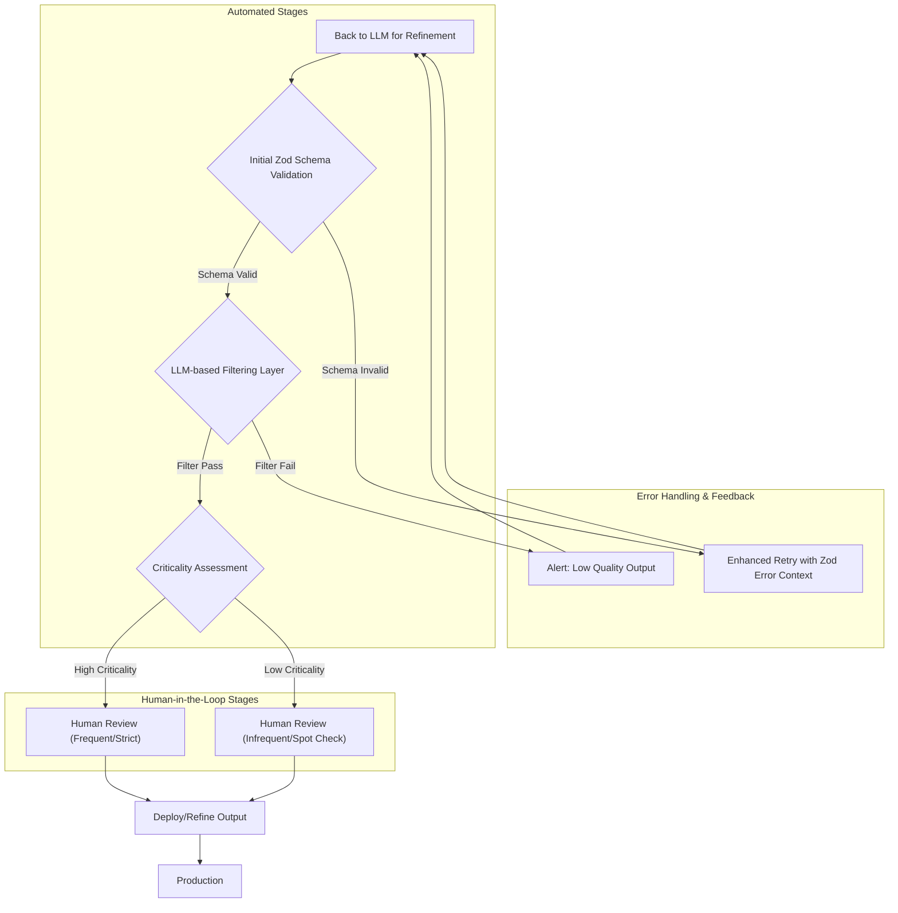

LLM(Large Language Model) 기반 시스템은 개발 생산성을 혁신적으로 높이지만, 동시에 '감독 피로(Supervisee Fatigue)'라는 새로운 과제를 안겨줍니다. LLM은 그럴듯한 결과물을 빠르게 생성하지만, 복잡한 변경사항의 의도를 놓치거나 '유창한 쓰레기(fluent garbage)'를 만들 수 있습니다. 이는 인간 개발자가 방대한 LLM 결과물을 검토하고 수정하는 데 막대한 시간과 노력을 투입하게 하여, 시스템의 지속 가능성을 위협합니다. 본 문서는 이러한 감독 피로를 완화하기 위한 LLM 출력 검증 파이프라인의 전략적 개선 방안을 제시합니다.

## 기존 LLM 출력 검증 파이프라인과 감독 피로 지점
현재 LLM 출력 검증 파이프라인은 MDX validation 루프, Zod schema 검증, Gemini retry 로직을 포함합니다. 이들은 기본적인 구조와 품질을 확보하지만, 여전히 다음 지점에서 감독 피로를 유발할 수 있습니다.

*   **MDX Validation 루프**: 문법적 오류를 잡지만, 의미론적 정확성이나 내용 품질을 보장하지 못해 인간 검토가 필수적입니다.
*   **Zod Schema**: JSON 출력의 형태와 타입 일관성을 강제하지만, 복잡한 비즈니스 로직이나 내용의 정확성까지 검증하기 어렵습니다.
*   **Gemini Retry**: 일시적 오류에 대한 복원력을 제공하지만, 본질적으로 잘못된 결과물이 반복될 경우 무의미한 재시도로 이어질 수 있습니다.

이러한 한계는 인간이 '유창한 쓰레기'를 조기에 걸러내고, LLM의 의도를 주입하는 데 더 많은 시간을 할애하게 만듭니다.

## 감독 피로 완화를 위한 파이프라인 개선 전략

### 1. LLM 기반의 추가 필터링 레이어 도입
인간 검토 단계 이전에 경량화된 LLM 모델을 활용하여 생성된 출력의 초기 품질을 평가하고 필터링하는 레이어를 추가합니다. 이 필터링 레이어는 '유창한 쓰레기'를 조기에 감지하여 불필요한 인간 검토를 줄이는 역할을 합니다. 예를 들어, 특정 키워드 부재, 논리적 비약, 또는 명백한 사실 오류 등을 검출할 수 있습니다. 2026년 트렌드는 이러한 계층적 검증을 통해 파이프라인 효율을 극대화하는 방향으로 진화하고 있습니다.

```typescript
import { z } from "zod";
// 실제 환경에서는 LLM SDK를 사용하여 경량 LLM 모델을 호출합니다.
// import { GoogleGenerativeAI } from "@google/generative-ai";

const mdxContentSchema = z.object({
  title: z.string().min(10),
  description: z.string().min(30),
  body: z.string().min(500),
  tags: z.array(z.string()).min(3).max(6)
});

async function llmQualityFilter(content: string): Promise<{ isAcceptable: boolean; reason?: string }> {
  try {
    const parsed = mdxContentSchema.parse(JSON.parse(content));
    // 실제 LLM 호출 로직 (경량 LLM 모델 사용 예: gemini-flash)
    // const genAI = new GoogleGenerativeAI(process.env.GEMINI_API_KEY || "");
    // const model = genAI.getGenerativeModel({ model: "gemini-flash" });
    // const prompt = `Evaluate the quality of this tech blog body for 'fluent garbage': ${parsed.body.substring(0, 500)}`;
    // const response = await model.generateContent(prompt);
    // const evaluation = JSON.parse(response.text()); // { isAcceptable: boolean, reason: string } 예상

    // 임시 더미 로직: 실제 LLM 대신 특정 문자열 포함 여부로 품질 판단
    if (parsed.body.includes("불완전한 내용") || parsed.body.includes("관련성 없음")) {
      return { isAcceptable: false, reason: "Content identified as low quality by internal filter." };
    }
    return { isAcceptable: true };
  } catch (error: any) {
    if (error instanceof z.ZodError) {
      return { isAcceptable: false, reason: `Schema validation failed: ${error.errors[0].message}` };
    }
    return { isAcceptable: false, reason: `Content parsing error: ${error.message}` };
  }
}
```

### 2. 중요도 기반의 인간 검토 주기 차등화
모든 LLM 출력에 동일한 수준의 인간 검토를 적용하는 대신, 내용의 중요도나 변경의 파급 효과에 따라 검토 주기를 차등화합니다. 예를 들어, 핵심 비즈니스 로직에 영향을 미치는 코드 생성이나 고위험군 문서의 경우 엄격하고 빈번한 검토를 유지하고, 중요도가 낮은 내부 문서나 정보성 컨텐츠의 경우 검토 주기를 늘리거나 스팟 체크(spot check) 방식으로 전환하여 인간 리소스를 효율적으로 배분합니다.

### 3. Zod Schema의 동적 및 확장적 활용
Zod 스키마는 정적 타입 검증을 넘어, 복잡한 유효성 검사 로직을 포함하도록 확장될 수 있습니다. `superRefine` 메서드를 사용하거나 정규 표현식을 통한 패턴 매칭을 강화하여 특정 필드의 내용이 다른 필드와 논리적으로 일관되는지 검증할 수 있습니다. 2026년에는 스키마 자체를 LLM이 생성하거나 동적으로 업데이트하여 새로운 요구사항에 빠르게 대응하는 방식이 중요해지고 있습니다.

### 4. 강화된 Contextualized Retry 로직
기존의 단순 재시도 로직을 넘어, 실패 원인을 분석하여 LLM에 더 풍부한 컨텍스트(context)를 제공하고 재시도를 수행합니다. Zod 스키마 검증 실패 시 구체적인 오류 메시지를 LLM에 전달하여, LLM이 다음 생성 시 오류를 효과적으로 수정하도록 유도합니다. 이는 불필요한 재시도를 줄이고 LLM의 자체 수정 능력(self-correction capability)을 강화하는 데 핵심적인 2026년 전략입니다.

## LLM 출력 검증 파이프라인 (향상된 버전)


## 트레이드오프

*   **성능 vs. 정확도**: 
    *   **언제 좋은가**: 추가 LLM 필터링 레이어는 전반적인 출력 품질을 높여 인간 검토 부담을 줄이지만, LLM 추론 지연 시간을 추가합니다. 고품질이 필수적인 시나리오에 적합합니다.
    *   **언제 나쁜가**: 실시간에 가까운 빠른 응답이 요구되거나 LLM 호출 비용이 민감한 시스템에서는 병목이 될 수 있습니다.
*   **비용 vs. 감독 피로 완화**: 
    *   **언제 좋은가**: LLM 기반 필터링은 초기 API 호출 비용을 증가시키지만, 장기적으로 인간 검토 비용과 생산성 저하를 줄여 TCO(Total Cost of Ownership)를 절감할 수 있습니다.
    *   **언제 나쁜가**: 생성되는 출력 양이 적고 인간 검토 비용이 낮은 초기 단계 프로젝트에서는 추가 LLM 비용이 비효율적일 수 있습니다.
*   **복잡성 vs. 유연성**: 
    *   **언제 좋은가**: 다단계 검증 파이프라인은 초기 설정 및 유지보수 복잡성을 증가시키지만, 다양한 오류를 다층적으로 걸러내는 높은 유연성과 견고성을 제공합니다. 변화하는 요구사항에 민첩하게 대응하기 좋습니다.
    *   **언제 나쁜가**: 소규모 프로젝트나 검증 요구사항이 단순한 경우, 과도하게 복잡한 파이프라인은 불필요한 오버헤드를 초래할 수 있습니다.

## 실전 체크리스트

프로젝트에 LLM 출력 검증 파이프라인의 '감독 피로' 완화 전략을 도입할 때 다음 항목들을 검증합니다.

- [ ] 현재 LLM 출력 검증 파이프라인에서 인간 검토자가 가장 많은 시간을 할애하는 병목(bottleneck)을 식별하고 문서화했는가?
- [ ] LLM 기반의 추가 필터링 레이어를 도입하여 '유창한 쓰레기'를 1차적으로 걸러내는 자동화된 기준(예: 키워드 밀도, 논리적 일관성 점수)을 명확히 정의하고 테스트했는가?
- [ ] 생성되는 컨텐츠의 중요도를 분류하고, 각 중요도에 따른 인간 검토 주기 및 강도(strictness)를 정책으로 수립했는가?
- [ ] Zod 스키마를 활용하여 단순 형식 검증을 넘어, 복잡한 비즈니스 로직이나 필드 간의 논리적 일관성을 검증하는 `superRefine` 같은 고급 기능을 적용했는가?
- [ ] LLM에게 오류 피드백을 전달하는 `Contextualized Retry` 로직이 Zod 스키마 검증 실패 메시지를 파싱하여 구체적인 수정 지침을 제공하는지 확인했는가?
- [ ] 파이프라인 개선 후, 인간 검토자의 실제 검토 시간 및 '감독 피로' 체감도가 유의미하게 감소했는지 정량적/정성적 지표(예: 리뷰 시간, 설문조사)로 측정하고 있는가?
- [ ] LLM 필터링 레이어 도입으로 인한 추가 API 호출 비용을 추적하고 있으며, 비용 대비 효율성(Cost-Benefit Analysis)을 주기적으로 평가하고 있는가?