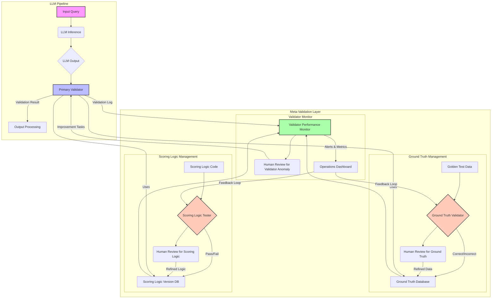

LLM 기반 애플리케이션의 신뢰성은 LLM 자체의 성능뿐 아니라, 그 출력을 평가하고 검증하는 파이프라인의 견고성에 크게 좌우됩니다. 특히 LLM 파이프라인의 검증기(Validator)는 시스템의 품질을 결정하는 핵심 요소이지만, 종종 검증기 자체의 오류 가능성은 간과되곤 합니다. 출제자가 낸 문제의 정답지에 오류가 있거나 채점 기준이 불명확하다면, 아무리 훌륭한 LLM 모델도 잘못된 평가를 받게 됩니다. 이러한 문제점을 해결하기 위해 LLM 파이프라인 검증기에 대한 자체 검증(Self-Verification) 및 메타-검증(Meta-Validation) 절차를 강화하는 것이 필수적입니다.

## 검증기 신뢰성 확보를 위한 메타-검증의 필요성

전통적인 소프트웨어 테스트와 마찬가지로, LLM 파이프라인의 검증기도 개발자의 의도와 다르게 동작하거나, 엣지 케이스에서 예상치 못한 오류를 발생시킬 수 있습니다. 특히 LLM의 비결정적 특성과 도메인의 복잡성이 결합될 때, 검증기의 작은 결함이 전체 시스템의 신뢰도를 크게 저하시킬 수 있습니다. 카톡 주문 메시지를 상품 코드로 변환하는 LLM 파이프라인 사례에서 출제자가 정답지와 채점기에서 오류를 발견한 것은, 검증 메커니즘 자체에 대한 검증이 얼마나 중요한지를 명확히 보여줍니다. 2026년 현재, LLM 활용 범위가 넓어지면서 이러한 검증기의 오류는 실제 비즈니스 손실이나 사용자 경험 저하로 직결될 수 있으므로, 검증기 자체의 신뢰성 확보는 더욱 중요해지고 있습니다.

## 핵심 개념 및 구현 전략

### 1. 정답지 (Ground Truth) 메타-검증
LLM의 성능을 평가하는 기준이 되는 정답 데이터(Golden Set)는 매우 중요합니다. 정답지가 잘못되면 모델은 잘못된 방향으로 학습되거나 평가됩니다.

*   **다중 검증자 합의 (Multi-Annotator Consensus)**: 최소 2명 이상의 독립적인 전문가가 동일한 입력에 대해 정답을 생성하고, 불일치하는 경우 재검토 및 토론을 통해 합의점을 도출합니다.
*   **주기적인 감사 (Periodic Auditing)**: 일정 주기 또는 새로운 데이터셋이 추가될 때마다 기존 정답지의 일부를 무작위로 추출하여 재검토하고, 잠재적 오류나 편향을 식별합니다.
*   **Adversarial Ground Truth Generation**: 의도적으로 모호하거나 헷갈리는 입력에 대한 정답지를 생성하여 검증기가 미처 포착하지 못할 수 있는 LLM의 미묘한 오류를 찾아냅니다.

### 2. 채점 로직 (Scoring Logic) 메타-검증
LLM 출력과 정답지를 비교하여 점수를 매기는 채점기의 로직 또한 완벽할 수 없습니다. 오작동하는 채점기는 잘못된 피드백을 시스템에 제공합니다.

*   **테스트 케이스 기반 검증**: 채점 로직의 각 기능 단위에 대해 상세한 단위 테스트(Unit Test) 및 통합 테스트(Integration Test)를 작성하여, 다양한 엣지 케이스에서 정확하게 동작하는지 확인합니다.
*   **수동 검증 (Manual Verification)**: 복잡한 채점 로직의 경우, 특정 입력-출력 쌍에 대해 채점기가 부여하는 점수를 수동으로 계산하여 실제 출력과 일치하는지 확인합니다.
*   **변형 테스트 (Mutation Testing)**: 채점 로직의 일부를 의도적으로 변경(mutate)했을 때, 기존 테스트 케이스가 이를 감지하는지 확인하여 테스트 커버리지의 강도를 평가합니다.

### 3. 스키마 기반 검증 (Schema-based Validation) 강화
Zod, Pydantic과 같은 스키마 유효성 검사 라이브러리를 활용하여 LLM의 출력뿐만 아니라, 검증 파이프라인의 입력 및 중간 결과에도 엄격한 스키마를 적용합니다. 이는 데이터 구조의 일관성을 강제하고 초기 단계에서 오류를 감지하는 데 효과적입니다.

```typescript
// Zod를 이용한 LLM 출력 및 검증 입력 스키마 정의 (TypeScript)
import { z } from 'zod';

// LLM 출력 스키마: 상품 코드와 수량 리스트
const ProductSchema = z.object({
  code: z.string().regex(/^[A-Z]{2}\d{3}$/, "Invalid product code format"),
  quantity: z.number().int().min(1, "Quantity must be at least 1"),
});

const LLMOutputSchema = z.object({
  orders: z.array(ProductSchema).min(1, "At least one order is required"),
  confidence: z.number().min(0).max(1, "Confidence must be between 0 and 1"),
});

// 정답지 스키마: LLM 출력과 동일한 구조
const GroundTruthSchema = LLMOutputSchema;

// 검증 함수 예시
function validateLLMOutput(rawOutput: unknown): z.infer<typeof LLMOutputSchema> | null {
  try {
    return LLMOutputSchema.parse(rawOutput);
  } catch (error) {
    console.error("LLM Output Schema Validation Failed:", error.errors);
    return null;
  }
}

function validateGroundTruth(rawGroundTruth: unknown): z.infer<typeof GroundTruthSchema> | null {
  try {
    return GroundTruthSchema.parse(rawGroundTruth);
  } catch (error) {
    console.error("Ground Truth Schema Validation Failed:", error.errors);
    return null;
  }
}

// 채점 로직의 메타-검증을 위한 스키마
// 채점기가 반환해야 할 결과의 스키마를 정의하여 채점기 자체의 출력을 검증할 수 있습니다.
const ScoringResultSchema = z.object({
  is_correct: z.boolean(),
  score: z.number().min(0).max(100),
  errors: z.array(z.string()).optional(),
});

// 채점기 함수 시그니처 및 출력 검증
type ScorerFunction = (llmOutput: z.infer<typeof LLMOutputSchema>, groundTruth: z.infer<typeof GroundTruthSchema>) => unknown;

function metaValidateScorerOutput(scorerFunc: ScorerFunction, llmOutput: z.infer<typeof LLMOutputSchema>, groundTruth: z.infer<typeof GroundTruthSchema>): z.infer<typeof ScoringResultSchema> | null {
  try {
    const rawScoringResult = scorerFunc(llmOutput, groundTruth);
    return ScoringResultSchema.parse(rawScoringResult);
  } catch (error) {
    console.error("Scorer Output Schema Validation Failed:", error.errors);
    return null;
  }
}

// 실제 사용 예시 (pseudo code)
// const llmResponse = { orders: [{ code: "AB123", quantity: 2 }], confidence: 0.95 };
// const validatedLLM = validateLLMOutput(llmResponse);

// const correctGroundTruth = { orders: [{ code: "AB123", quantity: 2 }], confidence: 1.0 };
// const validatedGroundTruth = validateGroundTruth(correctGroundTruth);

// if (validatedLLM && validatedGroundTruth) {
//   const myScorer = (output, truth) => { /* ... custom scoring logic ... */ return { is_correct: true, score: 100 }; };
//   const metaValidatedScoring = metaValidateScorerOutput(myScorer, validatedLLM, validatedGroundTruth);
//   if (metaValidatedScoring) {
//     console.log("Scorer output is valid:", metaValidatedScoring);
//   }
// }
```

### 4. 반복 및 재평가 메커니즘 (Retry & Re-evaluation)
Gemini retry와 같은 기법은 LLM 자체의 실패에 대응하지만, 검증 과정의 불확실성에 대해서도 적용될 수 있습니다. 검증기가 특정 입력에 대해 일관성 없는 결과를 내거나 모호한 판단을 내릴 때, 자동으로 여러 번 재평가를 시도하고, 그 결과를 종합하여 최종 판단을 내리는 메커니즘을 구축할 수 있습니다.

### 5. Human-in-the-Loop (HITL) 피드백 루프
검증기가 스스로 판단하기 어려운 '회색 영역'의 케이스들을 식별하고, 이를 인간 전문가에게 에스컬레이션(escalation)하는 워크플로우를 구축합니다. 인간의 판단은 정답지 업데이트, 채점 로직 개선, 또는 새로운 스키마 규칙 생성으로 이어져 검증기 자체의 학습 및 진화에 기여합니다.

## LLM 파이프라인 검증기 메타-검증 아키텍처



이 아키텍처는 LLM 파이프라인의 `Primary Validator`가 `Ground Truth Database`와 `Scoring Logic Version DB`를 활용하여 LLM 출력을 검증하는 동시에, `Meta-Validation Layer`가 이 검증기의 신뢰성 자체를 확보하는 메커니즘을 보여줍니다. `Ground Truth Validator`는 정답지 자체의 품질을 관리하고, `Scoring Logic Tester`는 채점 로직의 정확성을 확인합니다. `Validator Performance Monitor`는 전반적인 검증 과정의 건전성을 감시하며, 모든 피드백은 `Human Review`를 통해 시스템 개선으로 이어집니다.

## 트레이드오프

*   **개발 복잡성 증가 (Increased Development Complexity)**
    *   **언제 좋고**: LLM 파이프라인이 비즈니스 핵심 로직에 있거나, 오류가 큰 재정적/평판적 손실을 야기할 수 있는 경우. 고품질의 출력이 절대적으로 요구될 때 초기 복잡성을 감수할 가치가 있습니다.
    *   **언제 나쁜지**: 빠른 프로토타이핑이나 비판적이지 않은 내부 도구 개발 시 과도한 오버헤드가 될 수 있습니다. 복잡성 증가로 인한 개발 지연이 더 큰 문제가 되는 상황에서는 지양해야 합니다.

*   **성능 오버헤드 (Performance Overhead)**
    *   **언제 좋고**: 검증 오류로 인한 다운스트림 시스템의 장애나 잘못된 의사결정이 성능 저하보다 더 큰 비용을 초래하는 경우. 예를 들어, 금융 거래, 의료 진단 등 고위험군 애플리케이션에 적합합니다.
    *   **언제 나쁜지**: 실시간 응답 시간이 매우 중요한 저지연(low-latency) 서비스나 대량의 요청을 처리해야 하는 시스템에서는 추가적인 검증 단계가 병목 현상을 유발할 수 있습니다.

*   **유지보수 비용 증대 (Higher Maintenance Cost)**
    *   **언제 좋고**: LLM 모델이나 도메인 지식이 자주 변경되어 검증 로직 자체의 업데이트 빈도가 높은 경우. 변경으로 인한 회귀 오류를 사전에 방지하여 장기적인 유지보수 비용을 절감합니다.
    *   **언제 나쁜지**: 안정적이고 변화가 적은 도메인에서, 검증기 자체의 코드 변경이 드물다면 메타-검증 시스템의 유지보수 비용이 그 효용을 넘어설 수 있습니다.

*   **오버엔지니어링 위험 (Risk of Over-engineering)**
    *   **언제 좋고**: LLM 파이프라인이 여러 하위 모듈과 복잡하게 얽혀 있고, 각 모듈의 검증기가 서로 다른 의존성을 가질 때. 시스템 전체의 안정성을 위한 견고한 기반을 제공합니다.
    *   **언제 나쁜지**: 단일 LLM 호출과 간단한 출력 검증으로 충분한 소규모, 단일 목적의 파이프라인. 불필요한 복잡성은 개발 속도만 저해하고 관리 부담만 늘립니다.

*   **인적 자원 요구 (Human Resource Requirements)**
    *   **언제 좋고**: 정답지 검토, 채점 로직 감사, 모호한 케이스 처리 등 `Human-in-the-Loop` 피드백이 시스템의 정확도 향상에 결정적인 역할을 할 때. 전문가의 통찰력이 필수적인 분야에서 강점입니다.
    *   **언제 나쁜지**: 전문가 자원이 제한적이거나, 검증 작업이 반복적이고 단순하여 자동화만으로 충분한 경우. 불필요한 인력 투입은 비효율을 초래할 수 있습니다.

## 실전 체크리스트

LLM 파이프라인 검증기의 자체 검증을 강화하기 위한 실전 체크리스트는 다음과 같습니다:

*   [ ] **정답지 다중 검증**: 모든 정답지(Golden Set)에 대해 최소 2명 이상의 독립된 전문가가 검토하고 합의했는지 여부를 기록하고 관리합니다.
*   [ ] **채점 로직 테스트 커버리지**: 채점 로직의 주요 기능 및 엣지 케이스에 대한 단위 테스트 및 통합 테스트의 커버리지가 < 90% 이상인지 확인합니다.
*   [ ] **스키마 유효성 검사 적용**: LLM 출력, 정답지, 채점기 중간 결과 등 모든 데이터 인터페이스에 Zod와 같은 스키마 유효성 검사가 적용되었는지 확인합니다.
*   [ ] **검증기 회귀 테스트**: 검증기 로직 변경 시, 기존의 Golden Set에 대한 회귀 테스트를 자동으로 수행하고, 예상 결과와 일치하는지 확인하는 파이프라인이 구축되어 있는지 점검합니다.
*   [ ] **Human-in-the-Loop 워크플로우**: 검증기가 판단하기 어려운 모호한 케이스나 불일치하는 결과를 인간 전문가에게 에스컬레이션하는 명확한 워크플로우와 도구가 마련되어 있는지 확인합니다.
*   [ ] **Adversarial 테스트 케이스 관리**: 검증기를 '속이거나' 한계점을 시험하는 Adversarial 테스트 케이스를 주기적으로 생성하고, 이를 검증 파이프라인에 통합하여 활용하고 있는지 확인합니다.
*   [ ] **검증 지표 모니터링**: 검증기의 정확도, 일관성, 응답 시간 등 핵심 지표를 지속적으로 모니터링하고, 이상 징후 발생 시 자동으로 알림을 받을 수 있는 시스템이 구축되어 있는지 점검합니다.

이러한 자체 검증 및 메타-검증 절차를 통해 LLM 파이프라인은 더욱 견고해지고, 결과적으로 더 신뢰할 수 있는 AI 서비스를 제공할 수 있습니다.