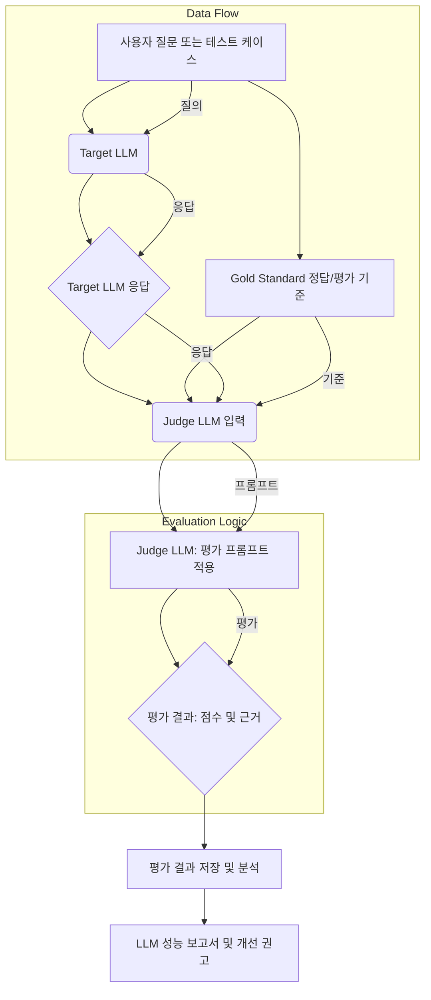

LLM(Large Language Model) 기반 시스템의 성공적인 운영은 응답 품질에 대한 객관적이고 지속적인 평가 능력에 달려 있습니다. 갭 분석(Gap Analysis)을 통해 현재 성능과 목표 성능 간의 차이를 식별하고, 이를 메울 수 있는 전략을 수립하기 위해서는 신뢰할 수 있는 자동 평가 지표(Automated Evaluation Metrics)의 설계가 필수적입니다. 이 엔트리에서는 2026년 기준 최신 트렌드를 반영하여 LLM 응답 품질 자동 평가 지표를 디자인하고 구현하는 전략을 다룹니다.

## LLM 응답 품질 평가의 중요성

전통적인 소프트웨어와 달리 LLM의 비결정론적 특성(non-deterministic nature)은 예측 가능한 품질을 유지하기 어렵게 만듭니다. 모델 업데이트, 프롬프트 변경, 데이터 드리프트(data drift) 등 다양한 요인이 응답 품질에 영향을 미치므로, 지속적인 모니터링 및 평가 체계가 중요합니다. 이는 사용자 경험 저하 방지, 비용 최적화, 그리고 비즈니스 목표 달성에 직결됩니다.

### 핵심 평가 영역

LLM 응답 품질을 평가할 때 고려해야 할 주요 영역은 다음과 같습니다.

1.  **사실 일관성 (Factual Consistency) 및 환각 (Hallucination) 방지**: 생성된 정보가 제공된 소스(예: RAG retrieve_and_generate) 또는 외부 지식과 얼마나 일치하는가.
2.  **관련성 (Relevance)**: 응답이 사용자의 질문 또는 의도에 얼마나 부합하는가.
3.  **완결성 (Completeness)**: 질문에 필요한 모든 정보가 충분히 포함되어 있는가.
4.  **유용성 (Utility) 및 유효성 (Helpfulness)**: 응답이 특정 작업을 완료하거나 문제 해결에 얼마나 도움이 되는가.
5.  **일관성 (Coherence) 및 유창성 (Fluency)**: 응답의 논리적 흐름, 문법적 정확성, 자연스러운 표현.
6.  **안전성 (Safety) 및 편향성 (Bias) 제어**: 유해하거나 편향된 콘텐츠 생성 여부.

## 자동 평가 지표 설계 원칙

자동 평가 지표는 사람의 개입 없이 반복적으로 실행될 수 있어야 하며, 결과는 신뢰할 수 있고 해석 가능해야 합니다. 이를 위한 설계 원칙은 다음과 같습니다.

*   **정량화 가능성 (Quantifiability)**: 평가 대상을 수치화할 수 있어야 합니다.
*   **재현 가능성 (Reproducibility)**: 동일한 조건에서 평가를 수행했을 때 항상 같은 결과가 나와야 합니다.
*   **확장성 (Scalability)**: 많은 수의 응답에 대해 효율적으로 평가를 수행할 수 있어야 합니다.
*   **설명 가능성 (Explainability)**: 지표의 결과가 어떤 문제를 나타내는지 직관적으로 이해할 수 있어야 합니다.
*   **견고성 (Robustness)**: 입력 데이터의 미세한 변화에도 평가 결과가 크게 변동하지 않아야 합니다.

## LLM-as-a-Judge 기반 자동 평가

2026년 현재, LLM-as-a-Judge(혹은 G-EVAL)는 LLM 응답 평가의 핵심 방법론으로 자리 잡았습니다. 이는 또 다른 LLM(평가자 LLM)을 사용하여 대상 LLM의 응답을 평가하는 방식입니다. 사람의 개입을 줄이면서도 복잡한 평가 기준을 적용할 수 있다는 장점이 있습니다.

### LLM-as-a-Judge 시스템 아키텍처

다음 Mermaid 다이어그램은 LLM-as-a-Judge 기반의 자동 평가 시스템의 일반적인 흐름을 보여줍니다.



### LLM-as-a-Judge 구현 예시

Python을 활용하여 간단한 LLM-as-a-Judge 평가 함수를 구현하는 예시입니다. 여기서는 LLM의 API를 호출하여 특정 기준에 따라 응답을 평가하도록 프롬프트를 구성합니다.

```python
import openai
import json

def evaluate_llm_response(question: str, target_response: str, gold_standard: str, criteria: str) -> dict:
    """
    LLM-as-a-Judge를 사용하여 LLM 응답을 평가합니다.
    Args:
        question: 원본 질문
        target_response: 평가 대상 LLM의 응답
        gold_standard: 정답 또는 이상적인 응답 (선택 사항)
        criteria: 평가 기준을 상세히 설명하는 문자열
    Returns:
        평가 점수와 근거를 포함하는 딕셔너리
    """

    # 평가자 LLM에 전달할 프롬프트 구성
    prompt = f"""
    You are an impartial AI assistant tasked with evaluating the quality of a given LLM response.
    Your evaluation should consider the following criteria:
    {criteria}

    Here is the user's QUESTION: "{question}"
    Here is the TARGET LLM's RESPONSE: "{target_response}"
    Here is the GOLD STANDARD (if applicable): "{gold_standard}"

    Evaluate the TARGET LLM's RESPONSE strictly based on the provided criteria.
    Provide a numerical score from 1 to 5 (1 = Very Poor, 5 = Excellent) and a brief justification.
    Output your response in JSON format like this: {{"score": <score>, "justification": "<justification>"}}.
    """

    try:
        response = openai.chat.completions.create(
            model="gpt-4o", # 또는 다른 강력한 LLM 모델
            messages=[
                {"role": "system", "content": "You are a helpful assistant."},
                {"role": "user", "content": prompt}
            ],
            response_format={ "type": "json_object" },
            temperature=0.0 # 평가의 일관성을 위해 낮은 온도 설정
        )
        evaluation_result = json.loads(response.choices[0].message.content)
        return evaluation_result
    except Exception as e:
        print(f"Error during LLM evaluation: {e}")
        return {"score": 0, "justification": "Evaluation failed."}

# 예시 사용
if __name__ == "__main__":
    q = "Explain the concept of quantum entanglement."
    tr = "Quantum entanglement is a phenomenon where two or more particles become linked in such a way that they share the same quantum state, regardless of the distance separating them. Measuring one particle instantaneously influences the state of the others."
    gs = "Quantum entanglement is a quantum mechanical phenomenon in which the quantum states of two or more objects are linked together such that they cannot be described independently of the others, even when the objects are separated by a large distance. Any measurement of a property of one particle, such as its spin, instantaneously determines the corresponding property of the other particles, regardless of the distance between them."
    crit = "1. Factual Accuracy: Is the explanation correct and free of hallucinations? 2. Completeness: Does it cover the core aspects of entanglement? 3. Clarity: Is it easy to understand for a non-expert?"

    result = evaluate_llm_response(q, tr, gs, crit)
    print(f"Evaluation Result: {result}")
```

이 예시에서는 `openai.chat.completions.create`를 사용하여 평가자 LLM(여기서는 `gpt-4o`)을 호출합니다. 중요한 것은 평가 프롬프트(prompt)에 평가 기준(`criteria`), 원본 질문(`question`), 대상 응답(`target_response`), 그리고 가능하다면 정답(`gold_standard`)을 명확하게 포함하는 것입니다. `response_format`을 `json_object`로 설정하여 파싱을 용이하게 합니다.

## 트레이드오프

자동 평가 지표 설계 및 LLM-as-a-Judge 접근 방식은 여러 트레이드오프를 수반합니다.

*   **평가 정확도 vs. 비용/속도**: LLM-as-a-Judge는 사람의 평가와 유사한 높은 정확도를 제공할 수 있지만, 강력한 LLM 모델 사용 시 비용과 지연 시간(latency)이 증가합니다. 언제 좋은가: 높은 신뢰도가 요구되는 핵심 기능이나 초기 개발 단계에서 폭넓은 피드백이 필요할 때 좋습니다. 언제 나쁜가: 대량의 실시간 평가가 필요하거나 비용 제약이 엄격할 때 적합하지 않습니다.
*   **지표 복잡성 vs. 해석 가능성**: 다수의 복합적인 지표를 사용하여 미세한 품질 변화를 포착할 수 있지만, 결과 해석이 어려워지고 개선 방향 도출이 모호해질 수 있습니다. 언제 좋은가: 복잡한 다면적 응답(예: 에이전트의 다단계 추론)을 평가할 때 좋습니다. 언제 나쁜가: 단순한 QA 봇처럼 단일 목적의 응답 평가 시 과도하게 복잡하며, 개발자가 빠르게 문제 원인을 파악해야 할 때 비효율적입니다.
*   **정적 데이터셋 vs. 동적/실시간 데이터 평가**: 고정된 테스트셋으로 평가하면 재현성은 높지만, 실제 사용자 환경의 변화(데이터 드리프트)를 반영하기 어렵습니다. 언제 좋은가: 모델 배포 전 회귀 테스트(regression test)나 특정 시점의 성능 벤치마킹에 좋습니다. 언제 나쁜가: 프로덕션 환경에서 모델 성능 저하를 조기에 감지해야 하거나 새로운 유형의 질문에 대한 대응력을 평가해야 할 때 부족합니다.
*   **Human-in-the-Loop (HITL) 통합 수준**: HITL를 통해 평가 정확도를 높일 수 있지만, 인력 및 시간 비용이 발생합니다. 언제 좋은가: LLM-as-a-Judge의 한계를 보완하거나 중요한 의사결정 전에 최종 검증이 필요할 때 좋습니다. 언제 나쁜가: 평가 프로세스를 완전히 자동화하여 운영 비용을 최소화하고 싶을 때 병목이 될 수 있습니다.

## 실전 체크리스트

프로젝트에 LLM 응답 품질 자동 평가 지표를 적용하기 위한 실전 체크리스트입니다.

- [ ] **평가 목표 명확화**: 어떤 유형의 응답 품질(예: 사실 정확도, 관련성, 안전성)을 최우선으로 개선할 것인지 정의했는가?
- [ ] **평가 기준 구체화**: 각 평가 영역에 대해 구체적이고 측정 가능한 평가 기준(rubric)을 수립했는가? (예: "응답은 3개 이상의 핵심 개념을 포함해야 하며, 1개 이상의 오개념이 없어야 한다.")
- [ ] **벤치마크 데이터셋 구축**: 초기 성능을 측정하고 평가 시스템의 유효성을 검증할 수 있는 대표적인 질문-응답 쌍(`question-response pair`) 데이터셋을 확보했는가?
- [ ] **LLM-as-a-Judge 프롬프트 최적화**: 평가자 LLM에 제공하는 프롬프트가 평가 기준을 명확하게 전달하고, 편향 없이 일관된 평가를 유도하도록 설계되었는가? Zero-shot, Few-shot 프롬프팅 기법을 검토했는가?
- [ ] **평가 결과 저장 및 시각화**: 평가 점수와 근거를 영구적으로 저장하고, 시간 경과에 따른 추이 및 지표별 분포를 쉽게 시각화할 수 있는 대시보드 시스템을 구축했는가?
- [ ] **드리프트(Drift) 감지 메커니즘 통합**: 모델 버전 변경, 프롬프트 업데이트, 입력 데이터 분포 변화 등 잠재적인 성능 저하 요인을 자동으로 감지하고 경고하는 시스템을 마련했는가?
- [ ] **CI/CD 파이프라인 연동**: 코드 변경 또는 모델 재학습 시 자동 평가를 트리거하고, 특정 품질 임계값 미달 시 배포를 블록하는 등의 자동화된 워크플로우를 구현했는가?
