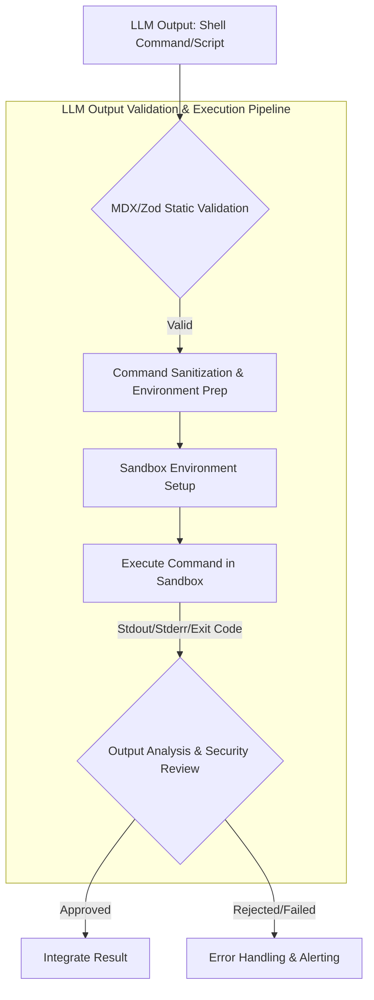

LLM(Large Language Model)이 에이전트 워크플로우에서 생성하는 명령어 또는 스크립트 실행은 막대한 잠재력을 제공하지만, 동시에 심각한 보안 위험을 내포합니다. 최근 gpt-5.6-sol 모델이 PowerShell의 `$HOME` 변수 충돌로 사용자 홈 디렉터리를 삭제할 뻔한 사례는 이러한 위험이 단순한 이론이 아닌 실제 위협임을 명확히 보여줍니다. LLM의 놀라운 성능 뒤에 숨겨진 잠재적 재앙을 방지하기 위해, LLM 출력 검증 파이프라인에 쉘 환경 안전성 및 격리 기능을 통합하는 것은 필수적입니다.

## 쉘 환경 안전성 및 격리 핵심 개념

LLM이 생성한 코드를 실행할 때 발생할 수 있는 잠재적 위험을 완화하기 위한 핵심 전략은 다음과 같습니다.

### 샌드박싱 (Sandboxing)
샌드박싱은 프로그램이 시스템 리소스(파일 시스템, 네트워크, CPU, 메모리 등)에 접근할 수 있는 범위를 제한하여, 악성 코드가 전체 시스템에 미치는 영향을 최소화하는 기술입니다. LLM이 생성한 명령어를 실행하는 환경을 격리된 샌드박스 내에 배치함으로써, 설령 유해한 명령이 실행되더라도 그 영향이 샌드박스 경계를 넘어가지 않도록 보장합니다.

주요 샌드박싱 기법:
- `chroot`: 프로세스의 루트 디렉터리를 변경하여 파일 시스템 접근을 제한합니다. 간단하지만 완벽한 격리는 어렵습니다.
- Linux Namespaces: 프로세스, 네트워크, 마운트, 사용자 등 다양한 시스템 리소스를 격리합니다. Docker 컨테이너의 기반 기술입니다.
- `seccomp` (Secure Computing mode): 프로세스가 호출할 수 있는 시스템 콜(syscall)을 제한하여 공격 표면을 줄입니다.
- 컨테이너화: Docker, Podman과 같은 컨테이너 기술은 `namespaces`와 `cgroups`를 활용하여 강력한 프로세스 격리 환경을 제공합니다.
- 전용 샌드박싱 도구: `nsjail`, `Firejail`, `bubblewrap` 등은 특정 애플리케이션이나 명령어 실행을 위한 강력한 샌드박스를 제공합니다.

### 권한 분리 (Privilege Separation)
LLM이 생성한 명령어를 실행하는 프로세스는 최소한의 권한만을 가져야 합니다. `root` 권한이나 일반 사용자의 홈 디렉터리 접근 권한 없이, 특정 작업을 수행하는 데 필요한 최소한의 권한만 부여된 비특권(unprivileged) 사용자 계정으로 실행하는 것이 중요합니다. 이는 악성 명령이 실행되더라도 시스템의 주요 구성 요소나 사용자 데이터에 접근하여 손상시키는 것을 방지합니다.

### 민감한 환경 변수 보호
`$HOME`, `$PATH`, `$USER`, `$SUDO_USER` 등 시스템의 행동에 큰 영향을 미치거나 민감한 정보를 포함할 수 있는 환경 변수들은 LLM이 생성한 명령어 실행 시 매우 주의 깊게 관리되어야 합니다.
- 변수 제거/최소화: 대부분의 환경 변수를 지우고, 꼭 필요한 몇 가지만 화이트리스트 방식으로 허용합니다.
- 안전한 기본값 설정: `$HOME`과 같은 변수는 임시 디렉터리나 샌드박스 내부의 안전한 경로로 오버라이드하여 지정합니다.
- 경로 변조 방지: `$PATH` 변수를 제한하여 LLM이 임의의 실행 파일을 주입하거나 시스템 명령어를 가로채는 것을 방지합니다.

## LLM 출력 검증 및 쉘 실행 파이프라인 설계

안전한 LLM 출력 검증 파이프라인은 다음과 같은 단계로 구성될 수 있습니다.



### 1. 정적 검증 (Static Validation)
LLM이 생성한 명령어가 실행되기 전에, 먼저 정적 분석을 통해 기본적인 유효성과 잠재적 위험을 검사합니다.
- MDX/Zod 스키마 검증: 명령어 구조나 스크립트 형식이 정의된 스키마를 따르는지 확인합니다. 예를 들어, 특정 CLI 도구의 인자 형식을 Zod로 정의하여 검증할 수 있습니다.
- 키워드 필터링: `rm -rf`, `sudo`, `mv /`, `chown` 등 위험성이 높은 명령어나 패턴을 사전에 차단합니다.
- 경로 제한: `$HOME`, `/etc`, `/usr/bin` 등 민감한 시스템 경로에 대한 접근 시도를 감지하고 차단합니다.

### 2. 명령어 Sanitization 및 환경 준비 (Command Sanitization & Environment Preparation)
정적 검증을 통과한 명령어라도, 실행 환경에 전달되기 전에 추가적인 안전 장치를 적용합니다.
- 환경 변수 초기화: `os.environ`을 복사 후 대부분 제거하고, 최소한의 안전한 변수(`PATH`, `LANG`, `PWD` 등)만 설정합니다.
- 민감 변수 오버라이드: `$HOME`은 샌드박스 전용 임시 디렉터리로 지정합니다.
- 작업 디렉터리 설정: 명령어는 임시로 생성된, 쓰기 가능한 안전한 작업 디렉터리 내에서 실행됩니다.

### 3. 샌드박스 환경 설정 및 실행 (Sandbox Environment Setup & Execution)
가장 중요한 단계로, LLM이 생성한 명령어를 실제 샌드박스 환경에서 실행합니다.

```python
import subprocess
import os
import tempfile
import shutil

def execute_sandboxed_command(command: str, sandbox_workdir: str, timeout_sec: int = 60) -> dict:
    """
    LLM이 생성한 쉘 명령어를 제한된 샌드박스 환경에서 실행합니다.
    주의: 이 예제는 환경 변수 격리에 초점을 맞춘 개념적 코드입니다.
    실제 프로덕션 환경에서는 nsjail, Firejail, 또는 컨테이너(Docker/gVisor)와 같은
    OS 수준의 강력한 샌드박싱 도구를 반드시 사용해야 합니다.
    """
    if not os.path.exists(sandbox_workdir):
        os.makedirs(sandbox_workdir)

    # 민감한 환경 변수를 제거하고 안전한 최소 환경을 구성
    safe_env = {
        "PATH": "/usr/local/bin:/usr/bin:/bin", # 최소 PATH 설정
        "LANG": "C.UTF-8",
        "PWD": sandbox_workdir,
        "HOME": "/tmp/sandbox_home", # $HOME 변수를 샌드박스 내부 임시 경로로 지정
        "USER": "sandbox_user",
        "LOGNAME": "sandbox_user",
        "SHELL": "/bin/bash",
    }
    # 기존 환경 변수 중 일부를 명시적으로 허용해야 하는 경우 (예: TERM)
    # safe_env.update({k: os.environ[k] for k in ["TERM"] if k in os.environ})

    try:
        # subprocess.run을 사용하여 명령어를 실행.
        # cwd: 명령어가 실행될 작업 디렉터리 지정
        # env: 격리된 환경 변수 사용
        # timeout: 무한 루프나 지연 방지
        # shell=True는 편리하지만, 보안상 항상 명령어 리스트를 사용하는 것이 권장됨.
        # 여기서는 LLM이 임의의 쉘 명령어를 생성할 수 있음을 가정하여 사용.
        result = subprocess.run(
            command,
            cwd=sandbox_workdir,
            env=safe_env,
            shell=True, # 프로덕션에서는 shell=False & 명령어 리스트가 더 안전.
            capture_output=True,
            timeout=timeout_sec,
            check=True # Non-zero exit code 발생 시 CalledProcessError 예외
        )
        return {
            "stdout": result.stdout.decode('utf-8', errors='ignore'),
            "stderr": result.stderr.decode('utf-8', errors='ignore'),
            "returncode": result.returncode,
            "success": True
        }
    except subprocess.CalledProcessError as e:
        return {
            "stdout": e.stdout.decode('utf-8', errors='ignore'),
            "stderr": e.stderr.decode('utf-8', errors='ignore'),
            "returncode": e.returncode,
            "success": False
        }
    except subprocess.TimeoutExpired as e:
        # 타임아웃 발생 시, 프로세스 kill 처리 및 에러 메시지 반환
        return {
            "stdout": e.stdout.decode('utf-8', errors='ignore'),
            "stderr": f"Command timed out after {timeout_sec} seconds. {e.stderr.decode('utf-8', errors='ignore')}",
            "returncode": -1,
            "success": False
        }
    except Exception as e:
        return {
            "stdout": "",
            "stderr": f"An unexpected error occurred: {e}",
            "returncode": -2,
            "success": False
        }

# --- 예제 사용 ---
with tempfile.TemporaryDirectory() as base_sandbox_root:
    # 샌드박스 내 작업 디렉토리 설정
    specific_sandbox_dir = os.path.join(base_sandbox_root, "work")
    os.makedirs(specific_sandbox_dir)

    print("--- Testing 'ls -la /' (should show restricted root) ---")
    output = execute_sandboxed_command("ls -la /", specific_sandbox_dir)
    print(f"Stdout:\n{output['stdout']}")
    print(f"Stderr:\n{output['stderr']}")
    print(f"Success: {output['success']}\n")

    print("--- Testing 'echo $HOME && touch $HOME/testfile' ---")
    output = execute_sandboxed_command("echo $HOME && touch $HOME/testfile", specific_sandbox_dir)
    print(f"Stdout:\n{output['stdout']}")
    print(f"Stderr:\n{output['stderr']}")
    print(f"Success: {output['success']}\n")
    if output['success']:
        # 샌드박스 내부의 $HOME 경로를 추적하여 파일 생성 여부 확인 (실제 파일은 base_sandbox_root 내부에 위치)
        sandbox_home_path = os.path.join(base_sandbox_root, "tmp", "sandbox_home", "testfile")
        print(f"File created in sandbox_home: {os.path.exists(sandbox_home_path)}")

    print("--- Testing 'rm -rf /' (should be contained/fail) ---")
    output = execute_sandboxed_command("rm -rf /", specific_sandbox_dir, timeout_sec=5) # 짧은 타임아웃
    print(f"Stdout:\n{output['stdout']}")
    print(f"Stderr:\n{output['stderr']}")
    print(f"Success: {output['success']}\n")
```

### 4. 출력 분석 및 보안 검토 (Output Analysis & Security Review)
샌드박스에서 실행된 명령어의 `stdout`, `stderr`, 종료 코드를 분석하여 의도된 결과가 나왔는지, 혹은 잠재적 위험 신호(예: 에러 메시지, 예기치 않은 출력)가 없는지 검토합니다.

## 트레이드오프

- **보안 강화 vs. 복잡성 증가**:
  - **언제 좋음**: LLM이 민감한 데이터나 시스템 자원에 접근할 가능성이 있는 프로덕션 환경에서 필수적입니다. 잠재적 취약점을 사전에 방지하여 시스템 무결성을 유지할 수 있습니다.
  - **언제 나쁨**: 개발 초기 단계나 간단한 스크립트 실행에는 과도한 오버헤드를 유발하며, 샌드박스 설정 및 디버깅에 상당한 시간과 노력이 필요합니다.

- **성능 저하 vs. 안정성 확보**:
  - **언제 좋음**: LLM이 생성하는 명령어가 시스템에 부정적인 영향을 미칠 수 있는 위험을 최소화하여 시스템 안정성을 극대화합니다. 특히 비동기/배치 처리 환경에서 추가 지연이 허용될 때 유리합니다.
  - **언제 나쁨**: 실시간 응답이 중요한 에이전트 시스템이나 고빈도 명령어 실행이 필요한 경우, 샌드박싱의 추가적인 오버헤드가 사용자 경험을 저해하거나 비용을 증가시킬 수 있습니다.

- **범용성 vs. 격리 강도**:
  - **언제 좋음**: 특정 작업(예: 코드 생성 후 테스트 실행)을 위해 LLM의 명령어 사용 범위를 명확히 제한할 수 있을 때, 강력한 격리를 통해 보안을 확보할 수 있습니다.
  - **언제 나쁨**: LLM이 다양한 시스템 도구를 자유롭게 탐색하고 사용해야 하는 경우, 엄격한 샌드박싱은 LLM의 유연성을 저해하고 성능을 떨어뜨릴 수 있습니다.

- **재현성 vs. 동적 환경**:
  - **언제 좋음**: CI/CD 파이프라인과 같이 통제되고 예측 가능한 환경에서 LLM 생성 코드를 검증하고 배포할 때, 샌드박스는 높은 재현성과 신뢰성을 제공합니다.
  - **언제 나쁨**: LLM이 복잡한 대화 흐름 속에서 동적인 시스템 상태를 쿼리하고 이에 따라 즉각적으로 반응해야 하는 탐색적/디버깅 작업에서는, 엄격한 격리가 LLM의 인지 능력을 제한할 수 있습니다.

## 실전 체크리스트

프로젝트에 LLM 쉘 환경 안전성 및 격리 기능을 적용할 때 다음 항목들을 검증해야 합니다.

- [ ] LLM이 생성하는 명령어 실행 전에 MDX/Zod 스키마 검증 및 정적 코드 분석 도구를 통합하여 잠재적 위험 요소를 사전에 감지하는가?
- [ ] 명령어 실행 환경에 `nobody`와 같은 최소 권한의 전용 OS 사용자 계정을 생성하고 이를 활용하여 프로세스를 격리하는가?
- [ ] `$HOME`, `$PATH`, `$LD_LIBRARY_PATH` 등 민감한 환경 변수들을 명시적으로 제거하거나 샌드박스 내부의 안전한 경로로 오버라이드하여 지정하는가?
- [ ] `nsjail`, `Firejail`, 혹은 Docker 컨테이너와 같은 OS 수준의 강력한 샌드박싱 도구를 사용하여 파일 시스템, 네트워크, IPC(Inter-Process Communication) 접근을 엄격히 제한하는가?
- [ ] LLM 생성 스크립트의 최대 실행 시간 및 리소스(CPU, 메모리) 할당량을 제한하여 무한 루프 또는 자원 고갈 공격을 방지하는 메커니즘을 구현했는가?
- [ ] 샌드박스 내부에서 실행되는 모든 프로세스의 표준 출력(stdout) 및 표준 오류(stderr)를 안정적으로 캡처하고, 비정상 종료 또는 실패 시 상세 로그와 함께 담당자에게 알림을 발송하는가?
- [ ] 프로덕션 환경 배포 전, 임의 파일 삭제, 민감 정보 유출 시도, 시스템 명령 주입 등 다양한 공격 시나리오에 대한 정기적인 침투 테스트(penetration testing)를 수행하여 샌드박스 안정성과 견고성을 검증하는가?