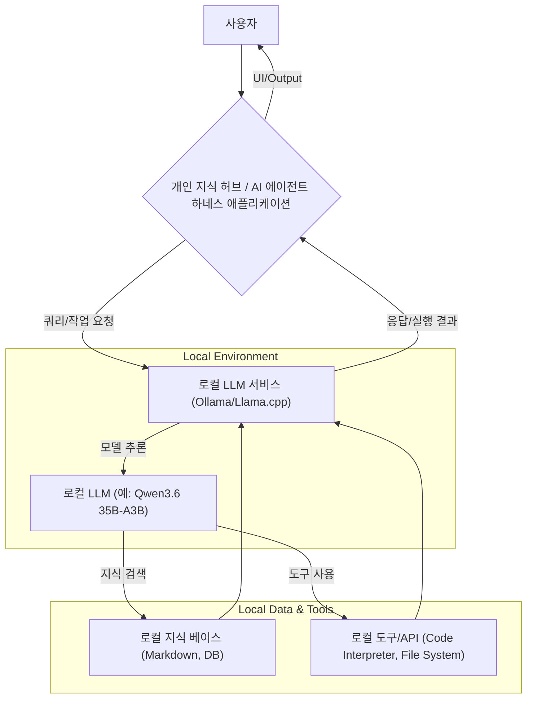

로컬 LLM(Large Language Model) 환경 구축은 개인 정보 보호, 비용 효율성, 그리고 특정 워크플로우에 대한 세밀한 제어라는 강력한 이점을 제공합니다. 클라우드 기반 LLM 서비스의 의존성을 줄이고자 하는 요구가 증가하면서, 개인 지식 허브(Personal Knowledge Hub) 및 AI 에이전트 하네스(AI Agent Harness)와 같은 분야에서 로컬 LLM의 역할이 중요해지고 있습니다.

## 왜 로컬 LLM인가?

데이터 프라이버시는 로컬 LLM 도입의 가장 큰 동기 중 하나입니다. 민감한 개인 정보나 기업 기밀 데이터는 외부 클라우드 서비스로 전송될 때마다 잠재적인 보안 위험에 노출됩니다. 로컬 LLM 환경은 이러한 데이터를 장치 내부에 안전하게 보관하여 데이터 유출 위험을 원천 차단하고, GDPR, HIPAA 등 엄격한 데이터 규정 준수를 가능하게 합니다.

또한, 클라우드 LLM API 사용에 따른 지속적인 비용 부담은 특히 고빈도 또는 대규모 작업에서 상당한 부담이 될 수 있습니다. 로컬 LLM은 초기 하드웨어 투자 후에는 API 호출 비용 없이 무제한 사용이 가능하여 장기적으로 예측 가능한 비용 구조를 제공합니다. 이는 특히 AI 에이전트의 반복적인 작업이나 개인 지식 허브에서의 잦은 질의응답 시 매우 효과적입니다.

세 번째 핵심 이유는 커스터마이징 및 제어입니다. 로컬 환경에서는 모델의 파인튜닝, 프롬프트 엔지니어링, 외부 도구(Tool) 통합 등 모든 요소를 완벽하게 제어할 수 있습니다. 특정 도메인에 최적화된 모델을 구축하거나, AI 에이전트가 안전하고 예측 가능한 방식으로 특정 작업을 수행하도록 가드레일(Guardrails)을 설정하는 데 유리합니다.

## 로컬 LLM 환경의 구성 요소

로컬 LLM 환경을 구축하기 위해서는 적절한 하드웨어와 소프트웨어 스택이 필요합니다.

### 하드웨어 요구사항
주요 요구사항은 GPU (그래픽 처리 장치)와 충분한 RAM입니다. 모델의 크기(예: 7B, 13B, 35B)와 양자화(Quantization) 수준에 따라 필요한 GPU VRAM(Video RAM)이 결정됩니다. 예를 들어, Qwen3.6 35B와 같은 모델의 4비트 양자화 버전은 일반적으로 24GB 이상의 VRAM을 요구할 수 있습니다. 엔비디아(NVIDIA) GPU가 가장 널리 지원되며, AMD GPU도 `llama.cpp`와 같은 프로젝트에서 지원이 확대되고 있습니다.

### 소프트웨어 스택
*   **Ollama:** 가장 인기 있는 로컬 LLM 실행 도구 중 하나로, 다양한 모델을 쉽게 다운로드하고 실행할 수 있는 사용자 친화적인 CLI(Command Line Interface)와 API를 제공합니다. Docker 컨테이너와 유사한 방식으로 모델을 관리합니다.
*   **llama.cpp:** C++로 작성된 고성능 추론 엔진으로, 다양한 하드웨어에서 LLM을 효율적으로 실행할 수 있도록 최적화되어 있습니다. 낮은 리소스 환경에서도 잘 작동하며, 개발자가 직접 컴파일하여 세부적인 제어를 할 수 있습니다.
*   **LM Studio / Jan AI:** 데스크톱 애플리케이션 형태로, 모델 다운로드, 로컬 서버 실행, 채팅 인터페이스 등을 제공하여 비개발자도 쉽게 로컬 LLM을 사용할 수 있도록 돕습니다.

## 개인 지식 허브에 로컬 LLM 통합

개인 지식 허브는 사용자의 모든 정보를 한곳에 모아 관리하고, LLM을 통해 이 정보와 상호작용하는 시스템입니다. 로컬 LLM은 이 허브의 핵심 엔진으로 활용될 수 있습니다.

*   **오프라인 RAG (Retrieval-Augmented Generation):** 사용자의 로컬 문서(Markdown 파일, PDF, Notion 백업 등)를 임베딩(Embedding)하고, 이를 벡터 데이터베이스에 저장합니다. 질의가 들어오면 관련 문서를 검색하여 LLM의 컨텍스트에 추가(Retrieval)하고, LLM이 이 정보를 바탕으로 답변(Generation)을 생성합니다. 모든 과정이 로컬에서 이루어져 데이터 유출 우려가 없습니다.
*   **콘텐츠 요약 및 생성:** 방대한 개인 문서를 빠르게 요약하거나, 기존 지식을 바탕으로 새로운 아이디어를 생성하는 데 로컬 LLM을 활용할 수 있습니다.
*   **코드 및 스크립트 도우미:** 개인 프로젝트의 코드베이스를 로컬 LLM에 학습시켜, 코드 설명, 리팩토링 제안, 버그 수정 등을 지원합니다.

## AI 에이전트 하네스에 로컬 LLM 통합

AI 에이전트 하네스는 LLM 기반 에이전트가 특정 작업을 수행하도록 돕는 프레임워크입니다. 로컬 LLM은 에이전트의 '두뇌' 역할을 하며, 외부 네트워크 호출 없이 안전하고 효율적인 작업 환경을 제공합니다.

*   **샌드박스(Sandbox)화된 코드 실행:** 에이전트가 코드를 생성하고 실행해야 할 때, 로컬 환경에서 샌드박스 내에서 안전하게 테스트할 수 있습니다. 이는 특히 외부 API나 중요한 시스템 리소스에 접근할 수 있는 경우에 중요합니다.
*   **보안 도구 사용:** 파일 시스템 접근, 내부 API 호출 등 에이전트가 사용할 도구들을 로컬 환경에서 직접 제어할 수 있습니다. 권한을 최소화하고 잠재적인 악의적 행동을 감지하고 차단하는 가드레일을 구축할 수 있습니다.
*   **빠른 프로토타이핑 및 반복:** 클라우드 API의 지연 시간이나 비용 제약 없이, 에이전트의 로직이나 프롬프트를 빠르게 수정하고 테스트할 수 있습니다. 이는 'Claude Code 하네스'와 같은 시스템의 일부 기능을 로컬로 전환하여 개발 주기를 단축하는 데 기여합니다.

### 로컬 LLM 상호작용 예제 (Python/Ollama)

아래 코드는 `ollama` Python 클라이언트를 사용하여 로컬 LLM과 상호작용하는 기본적인 방법을 보여줍니다. `ollama` 서버가 실행 중이고, 원하는 모델(예: `qwen:7b`)이 다운로드되어 있다고 가정합니다.

```python
import ollama

# ollama 서버가 실행 중이고 모델이 다운로드되어 있어야 합니다 (예: ollama pull qwen:7b)
def query_local_llm(prompt: str, model: str = "qwen:7b"):
    try:
        response = ollama.chat(model=model, messages=[
            {'role': 'user', 'content': prompt},
        ])
        return response['message']['content']
    except Exception as e:
        return f"Error querying local LLM: {e}"

# 개인 지식 허브 활용 예시
context_knowledge = "개인 지식 허브는 사용자의 사적 데이터를 안전하게 보관하며, 정보 검색 및 생성을 로컬에서 처리합니다."
prompt_knowledge_hub = f"다음 문서를 바탕으로 '개인 지식 허브'의 주요 이점을 한 문장으로 요약해줘: {context_knowledge}"
print(f"Knowledge Hub Summary: {query_local_llm(prompt_knowledge_hub)}")

# AI 에이전트 작업 예시
prompt_agent_task = "Python으로 'Hello, Local LLM!'을 출력하는 함수를 작성해줘."
print(f"Agent Code Suggestion: {query_local_llm(prompt_agent_task)}")
```

## 로컬 LLM 환경 아키텍처 다이어그램



## 2026년 최신 트렌드 반영

2026년 로컬 LLM 환경 구축은 다음과 같은 트렌드를 중심으로 발전할 것으로 예상됩니다.

*   **고도화된 Quantization 최적화:** 더 정교한 양자화 기술을 통해 모델의 크기와 VRAM 요구량을 더욱 줄이면서도 성능 저하를 최소화합니다. 이는 더 많은 사용자가 일반 PC에서도 고성능 LLM을 구동할 수 있게 합니다.
*   **Edge AI 하드웨어 가속:** NPU (Neural Processing Unit), 전용 AI 칩셋 등 엣지(Edge) 디바이스에 최적화된 하드웨어 가속기가 발전하면서, 모바일 및 임베디드 환경에서도 로컬 LLM 성능이 크게 향상됩니다.
*   **Agentic Frameworks의 로컬 LLM 백엔드 지원 강화:** CrewAI, LangChain, AutoGen 등 AI 에이전트 프레임워크들이 `ollama`, `llama.cpp`와 같은 로컬 LLM 솔루션을 기본 백엔드로 더욱 강력하게 지원하여, 개발자가 로컬 환경에서 에이전트를 쉽게 구축하고 배포할 수 있도록 돕습니다.
*   **멀티모달 로컬 모델의 발전:** 텍스트뿐만 아니라 이미지, 오디오, 비디오 등 다양한 형태의 데이터를 로컬에서 처리할 수 있는 멀티모달(Multi-modal) LLM이 등장하여 개인 지식 허브 및 에이전트의 활용 범위를 넓힙니다.
*   **분산 학습(Federated Learning) 및 개인화:** 여러 로컬 디바이스가 각자의 데이터를 기반으로 모델을 학습시키고, 그 결과물을 중앙 서버와 공유하여 전체 모델의 성능을 향상시키면서도 개인 데이터는 로컬에 유지하는 기술이 주목받을 것입니다.

## 트레이드오프

로컬 LLM 환경 구축은 여러 장점과 동시에 신중하게 고려해야 할 단점들도 내포합니다. 다른 엔트리가 이 문서를 참조할 때 다음 판단 근거를 활용할 수 있습니다.

*   **데이터 프라이버시 및 보안 (Data Privacy & Security):**
    *   **언제 좋음:** 민감한 개인 정보나 기업 기밀 데이터를 다룰 때, 외부 유출 위험을 원천 차단하여 강력한 보안 및 규제 준수를 제공합니다.
    *   **언제 나쁨:** 클라우드 LLM의 최신 모델이나 대규모 컴퓨팅 자원이 필요한 복잡한 작업에는 성능 및 기능적 한계가 명확하여, 최첨단 AI 기능 활용에 제약이 따릅니다.
*   **비용 효율성 (Cost Efficiency):**
    *   **언제 좋음:** API 호출 비용 없이 무제한으로 사용 가능하여 장기적인 운영 비용을 크게 절감하고 예측 가능하게 합니다. 초기 하드웨어 투자 후 추가적인 종량제 비용이 발생하지 않습니다.
    *   **언제 나쁨:** 고성능 GPU 등 초기 하드웨어 구매 비용이 발생하며, 이는 진입 장벽이 될 수 있습니다. 또한, 전기 요금 등 운영 비용도 고려해야 합니다.
*   **성능 및 지연 시간 (Performance & Latency):**
    *   **언제 좋음:** 네트워크 왕복 없이 로컬에서 직접 추론하므로 매우 낮은 지연 시간을 제공하여 실시간 상호작용이 중요한 애플리케이션(예: 대화형 에이전트)에 유리합니다.
    *   **언제 나쁨:** 클라우드 LLM 대비 모델의 크기와 복잡성에서 제약이 있어, 매우 큰 문맥 창(Context Window)이나 복잡한 추론 능력에서는 성능이 떨어질 수 있습니다. 하드웨어 스펙에 따라 실제 성능 편차가 큽니다.
*   **커스터마이징 및 제어 (Customization & Control):**
    *   **언제 좋음:** 모델의 파인튜닝, 프롬프트 엔지니어링, 도구 통합 등 모든 환경을 완벽하게 제어하고 커스터마이징할 수 있어 특정 사용 사례에 최적화된 시스템 구축이 용이합니다.
    *   **언제 나쁨:** 모델 업데이트, 최신 연구 적용, 종속성 관리 등 환경 설정 및 유지보수에 상당한 기술적 지식과 지속적인 노력이 필요합니다.
*   **모델 다양성 및 기능 (Model Variety & Capabilities):**
    *   **언제 좋음:** 다양한 오픈소스 LLM을 선택하여 특정 작업에 최적화된 모델을 실험하고 활용할 수 있으며, 특정 모델에 대한 종속성을 줄일 수 있습니다.
    *   **언제 나쁨:** 클라우드 LLM이 제공하는 최신, 최대 규모의 모델이나 멀티모달 기능 등 첨단 기능에 대한 접근이 제한될 수 있으며, 특정 작업을 위한 모델의 가용성도 로컬 환경에서는 제한적일 수 있습니다.

## 실전 체크리스트

로컬 LLM 환경을 개인 지식 허브나 AI 에이전트 하네스에 성공적으로 적용하기 위한 검증 항목들입니다.

*   [ ] **하드웨어 호환성 및 성능 검증:** 사용하려는 로컬 LLM(예: Qwen 3.6 35B)의 최소 GPU RAM 요구사항(VRAM)과 CPU 사양을 확인하고, 실제 환경에서 충분한 추론 속도를 보장하는지 벤치마킹했는가?
*   [ ] **로컬 LLM 서비스 스택 선정 및 구축:** `ollama`, `llama.cpp`, `LM Studio` 등 로컬 LLM 구동 환경 중 프로젝트 요구사항(API 호환성, 컨테이너화, 관리 편의성)에 가장 적합한 스택을 선정하고 안정적으로 설치 및 구성했는가?
*   [ ] **데이터 프라이버시 아키텍처 설계 및 구현:** 개인 지식 허브나 에이전트 하네스가 처리할 민감 데이터가 로컬 환경 외부로 절대 유출되지 않도록, 네트워크 접근 통제 및 샌드박싱 등 보안 아키텍처를 명확히 설계하고 구현했는가?
*   [ ] **에이전트 도구 통합 및 보안 강화:** 로컬 LLM 기반 에이전트가 파일 시스템 접근, 외부 프로그램 실행 등 도구를 사용할 경우, 권한 최소화(Least Privilege) 원칙에 따라 접근 범위를 제한하고 잠재적 위험에 대한 가드레일(Guardrails)을 구축했는가?
*   [ ] **지식 베이스(Knowledge Base) 로컬 RAG 시스템 구축 및 평가:** 개인 지식 허브를 위해 로컬 문서(Markdown, PDF 등)를 효율적으로 임베딩하고 검색할 수 있는 RAG(Retrieval-Augmented Generation) 파이프라인을 구축했으며, 질의응답 성능 및 관련성 정확도를 평가했는가?
*   [ ] **모델 업데이트 및 관리 전략 수립:** 새로운 로컬 LLM 버전이나 파인튜닝 모델이 나왔을 때, 기존 환경에 미치는 영향을 최소화하며 업데이트할 수 있는 관리 프로세스(버전 관리, 백업, 롤백)를 수립했는가?
*   [ ] **성능 모니터링 및 최적화 도구 도입:** 로컬 LLM의 GPU 사용률, 메모리 점유율, 추론 시간 등을 실시간으로 모니터링하고 성능 병목 현상을 식별하여 최적화할 수 있는 도구(예: `nvidia-smi`, Prometheus + Grafana)를 도입했는가?