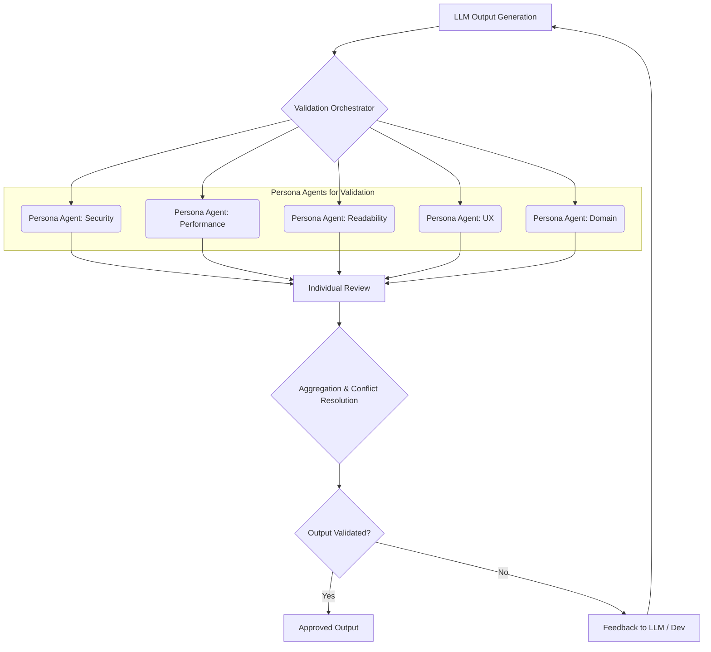

## 다중 페르소나 기반 LLM 출력 검증 강화

LLM(Large Language Model) 기반 시스템의 프로덕션 환경 도입이 가속화되면서, 출력의 신뢰성과 견고성은 핵심적인 과제가 되었다. 기존의 단일 LLM 에이전트 검증 방식은 관점의 동질성으로 인해 잠재적 편향이나 엣지 케이스를 간과할 위험이 크다. 실제 팀워크에서 다양한 전문성을 가진 인원들이 다각도로 문제를 분석하듯, AI 에이전트 팀 역시 다중 페르소나를 통해 LLM 출력을 심층적으로 검증하는 접근이 필요하다. 이는 `NVIDIA Nemotron-Personas-Korea`와 같은 기술을 활용하여 다양한 문화적, 전문적 관점을 가진 에이전트를 구축하는 것으로 구현될 수 있다.

### 다중 페르소나 에이전트 팀의 전략적 활용

다중 페르소나 기반 에이전트 팀은 각기 다른 배경, 전문 지식, 심지어 문화적 특성을 지닌 LLM 에이전트들로 구성된다. 이들은 특정 LLM 출력에 대해 독립적으로 평가하고 피드백을 제공함으로써, 단일 에이전트가 놓칠 수 있는 미묘한 오류, 편향, 또는 품질 저하를 식별하는 데 효과적이다. 예를 들어, 코드 리뷰 시 '보안 전문가', '성능 최적화 전문가', '신입 개발자', '테스트 전문가', '도큐멘테이션 전문가'와 같은 페르소나가 각자의 관점에서 코드를 검토한다면, 훨씬 포괄적인 피드백을 얻을 수 있다. 이는 MDX(Markdown with JSX) 콘텐츠 유효성 검사, Zod 스키마 기반 데이터 검증, UX 리서치, 그리고 드리프트 감지 시나리오 등 복합적인 검증이 필요한 경우 특히 유용하다.

### LLM 검증 파이프라인 통합 방안

다중 페르소나 에이전트 팀은 LLM 검증 파이프라인의 여러 핵심 단계에 통합될 수 있다.

#### 1. MDX 유효성 검사 루프
MDX 문서의 논리적 일관성, 기술적 정확성, 사용자 경험 측면에서의 적합성을 다각도로 검증한다.
*   **기술 리드 페르소나**: 코드 정확성, 기술 문서의 구조적 일관성 검토.
*   **콘텐츠 에디터 페르소나**: 문법, 가독성, 브랜드 가이드라인 준수 여부 확인.
*   **엔드 유저 페르소나**: 정보 이해도, 사용 편의성, 유용성 평가.

#### 2. Zod 스키마 검증 심화
LLM이 생성하는 JSON 데이터의 구조적 정확성을 넘어선 의미론적 유효성까지 검증한다.
*   **데이터 거버넌스 페르소나**: 비즈니스 로직 및 규제 준수 여부 확인.
*   **도메인 전문가 페르소나**: 데이터 내용의 도메인 지식 일치 여부 및 오용 가능성 검토.

#### 3. 드리프트 감지 시나리오 확장
LLM 모델 드리프트(Drift) 감지 메커니즘을 강화한다.
*   **이상 감지 전문가 페르소나**: 특정 메트릭 또는 패턴 변화 감지, 초기 경고 발생.
*   **사용자 경험 전문가 페르소나**: 출력 변화가 사용자 경험에 미치는 영향 예측.
*   **보안 전문가 페르소나**: 잠재적 보안 취약성 또는 새로운 공격 벡터로 이어질 변화 모니터링.

### 다중 페르소나 기반 에이전트 코드 예시

다음은 간단한 다중 페르소나 에이전트 팀을 구성하여 코드 스니펫을 검토하는 Python 예제이다.

```python
from typing import List, Dict

# 실제 LLM 호출을 시뮬레이션
def get_llm_review(code: str, persona_role: str) -> str:
    """Simulates LLM review based on persona role."""
    # 실제 구현: LLM API 호출 및 persona 기반 프롬프트 적용
    if "security" in persona_role.lower():
        return f"[{persona_role}] 잠재적 SQL Injection 취약점. 입력 유효성 검사 필수."
    elif "performance" in persona_role.lower():
        return f"[{persona_role}] 이 루프는 N^2 복잡도. 효율적 알고리즘 고려 필요."
    elif "readability" in persona_role.lower():
        return f"[{persona_role}] 변수명 불분명. 설명적 이름으로 변경 권장."
    else:
        return f"[{persona_role}] 일반 검토: 코드 작동 양호, 개선 여지 있음."

def conduct_multi_persona_review(code_snippet: str, personas: List[str]) -> Dict[str, str]:
    reviews = {}
    for role in personas:
        reviews[role] = get_llm_review(code_snippet, role)
    return reviews

if __name__ == "__main__":
    sample_code = "def process_data(data): return [x for x in data if x in data]"
    persona_roles = ["Security Expert", "Performance Engineer", "Readability Reviewer"]

    print("--- Multi-Persona Code Review Start ---")
    all_reviews = conduct_multi_persona_review(sample_code, persona_roles)
    for role, review_text in all_reviews.items():
        print(f"Review from {role}: {review_text}")
    print("--- Multi-Persona Code Review End ---")
```
이 예제는 각 페르소나의 역할에 따라 LLM이 다른 관점의 피드백을 생성함을 보여준다. 실제 구현에서는 각 페르소나에 특화된 복잡한 프롬프트 엔지니어링과 LLM 호출 로직이 포함될 것이다.

### 다중 페르소나 검증 파이프라인 개요



이 다이어그램은 LLM 출력이 생성된 후, 검증 오케스트레이터가 다중 페르소나 에이전트 팀에 출력을 분배하고, 각 에이전트의 개별 리뷰가 종합되어 최종 검증 결정으로 이어지는 과정을 보여준다. 유효성 검사에 실패하면 LLM 또는 개발자에게 피드백이 전달된다.

## 트레이드오프

### 1. 검증 깊이 및 정확성 vs. 비용 및 복잡성
*   **언제 좋은가**: 고품질 및 높은 신뢰성이 요구되는 미션 크리티컬 시스템, 또는 엣지 케이스 및 편향 감지가 중요한 경우. 단일 에이전트로는 발견 어려운 문제점을 다각도로 파악하여 검증 정확성을 비약적으로 향상시킨다.
*   **언제 나쁜가**: 리소스 제한적이거나, 검증할 LLM 출력이 대량이고 각 출력의 중요도가 낮은 경우. 각 페르소나 LLM 호출 및 관리 비용 증가로 오버헤드가 크고 파이프라인 복잡도 상승.

### 2. 초기 설정 시간 vs. 장기적 유지보수 용이성
*   **언제 좋은가**: 각 페르소나 정의, 프롬프트 설계에 초기 시간 소요되지만, 일단 잘 구축되면 LLM 모델 변경 또는 새 요구사항 발생 시 기존 페르소나 재활용 및 확장이 용이하다. 시스템 견고성 향상으로 장기적인 디버깅 및 유지보수 비용 절감.
*   **언제 나쁜가**: 빠른 프로토타이핑이나 짧은 개발 주기가 필요한 프로젝트에서는 초기 설정 시간이 부담. 페르소나를 잘못 정의하거나 과도하게 도입 시 관리 복잡성 가중 및 검증 결과 일관성 저해.

### 3. 포괄적인 피드백 vs. 피드백 충돌 및 해석의 어려움
*   **언제 좋은가**: 보안, 성능, 가독성, UX 등 여러 측면에서의 개선점을 동시에 파악하여 LLM 출력 품질을 다각도로 분석 및 개선할 때 유용하다. 복합적인 요구사항을 가진 LLM 애플리케이션에 적합하다.
*   **언제 나쁜가**: 각 페르소나가 상충되는 피드백을 제공할 경우, 이를 통합하고 최종 의사결정을 내리는 과정이 복잡해질 수 있다. 피드백 우선순위 지정 및 충돌 해결을 위한 추가 로직이나 인간 개입이 필요할 수 있어 자동화 수준 저해.

## 실전 체크리스트

프로젝트에 다중 페르소나 기반 LLM 출력 검증을 도입할 때 다음 항목들을 점검하십시오.

- [ ] **페르소나 정의 명확성**: 각 에이전트 페르소나의 역할, 전문성, 검토 기준이 명확하게 정의되어 있으며 상호 보완적인가?
- [ ] **프롬프트 엔지니어링 최적화**: 각 페르소나 에이전트가 역할을 효과적으로 수행하도록 역할 기반 프롬프트가 잘 설계되고 테스트되었는가?
- [ ] **충돌 해결 메커니즘 구축**: 상충되는 피드백 발생 시, 통합 및 우선순위 결정 로직(예: 투표, 가중치, 인간 검토)이 명확히 수립되었는가?
- [ ] **성능 및 비용 모니터링**: 다중 에이전트 도입 후 LLM 호출 횟수, 처리 시간, API 비용 등 지표를 지속적으로 모니터링하고 최적화 방안을 마련했는가?
- [ ] **드리프트 감지 연동**: 다중 페르소나 에이전트가 감지한 출력 변화나 이상 징후가 기존 드리프트 감지 시스템에 효과적으로 연동되어 경고를 발생시키는가?
- [ ] **피드백 루프 자동화**: 검증 결과를 LLM 재학습, 파인튜닝, 개발자 피드백으로 연결하는 자동화된 파이프라인이 구축되어 있는가?
- [ ] **지속적인 페르소나 업데이트**: 비즈니스 요구사항, 도메인 지식, LLM 모델 변화에 따라 페르소나 정의를 주기적으로 검토하고 업데이트하는 프로세스를 확립했는가?