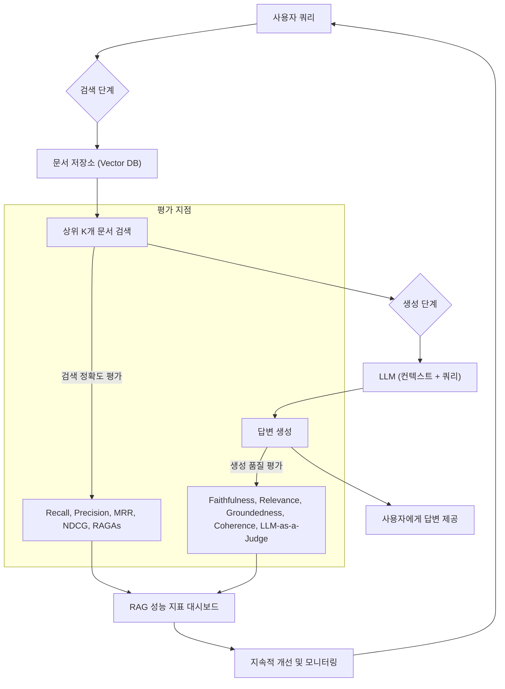

RAG(Retrieval Augmented Generation) 애플리케이션의 확산은 LLM이 생성하는 답변의 관련성과 신뢰성을 크게 향상시켰습니다. 그러나 RAG 시스템의 진정한 가치를 실현하기 위해서는 검색된 정보의 정확성과 최종 생성된 답변의 품질을 체계적으로 평가하는 방법론이 필수적입니다. 부적절한 검색 결과는 LLM의 할루시네이션(Hallucination)을 유발하거나, 사용자 쿼리와 무관한 답변을 생성하게 만듭니다. 이에 따라 RAG 시스템은 두 가지 핵심 축, 즉 검색(Retrieval)과 생성(Generation) 관점에서 종합적으로 평가되어야 합니다.

## RAG 평가의 이중 축: 검색(Retrieval)과 생성(Generation)

### 검색 정확도 평가 (Retrieval Accuracy Evaluation)

검색 정확도는 주어진 쿼리에 대해 관련성 높은 문서를 얼마나 효과적으로 찾아내는지를 측정합니다. 이는 RAG 시스템의 기반이 되므로 매우 중요합니다. 주요 지표는 다음과 같습니다.

*   **Precision (정밀도)**: 검색된 문서 중 실제로 관련성 있는 문서의 비율.
*   **Recall (재현율)**: 전체 관련성 있는 문서 중 검색된 문서의 비율.
*   **MRR (Mean Reciprocal Rank)**: 첫 번째 관련성 있는 문서가 검색 결과 상위에 얼마나 빨리 나타나는지를 측정합니다. 순위가 높을수록 점수가 높습니다.
*   **NDCG (Normalized Discounted Cumulative Gain)**: 검색 결과의 순서와 관련성 등급을 모두 고려하여 평가합니다. 상위 결과일수록, 관련성이 높을수록 가중치가 부여됩니다.

이러한 지표들은 일반적으로 정답(ground truth) 문서 세트와 비교하여 계산됩니다. 2026년에는 RAGAs(Retrieval Augmented Generation Assessment)와 같은 프레임워크가 검색 정확도 평가의 표준으로 자리매김하고 있습니다. RAGAs는 `context_recall`, `context_precision`, `context_relevancy` 등 RAG 특화 검색 지표를 제공합니다.

```python
# RAGAs를 활용한 검색 정확도 평가 예시 (2026년 기준)
from ragas import evaluate
from ragas.metrics import context_recall, context_precision, context_relevancy
from datasets import Dataset

# 평가 데이터셋 준비 (실제 환경에서는 더 많은 데이터 필요)
data = {
    "question": [
        "RAG 시스템의 핵심은 무엇인가요?",
        "LLM 할루시네이션을 줄이는 방법은?"
    ],
    "answer": [
        "RAG 시스템의 핵심은 외부 지식 검색을 통해 LLM의 답변 품질을 향상시키는 것입니다.",
        "LLM 할루시네이션을 줄이기 위해서는 고품질의 검색 결과를 제공하고, 검색된 컨텍스트를 기반으로 답변을 생성하도록 유도해야 합니다."
    ],
    "contexts": [
        ["RAG는 LLM이 최신 정보를 검색하고 이를 바탕으로 응답을 생성하도록 돕는 프레임워크입니다.", "외부 지식 검색은 RAG의 핵심입니다."],
        ["할루시네이션은 LLM이 사실과 다른 정보를 생성하는 현상입니다.", "정확한 컨텍스트 제공이 할루시네이션 방지에 중요합니다."]
    ],
    "ground_truths": [
        ["RAG는 외부 데이터 소스에서 정보를 검색하여 LLM에 제공함으로써, 모델이 최신 정보와 특정 도메인 지식을 활용하여 더 정확하고 사실적인 답변을 생성하도록 돕는 기술입니다."],
        ["LLM 할루시네이션을 줄이기 위한 주요 전략에는 외부 검색을 통한 사실성 강화, 명확한 프롬프트 엔지니어링, 그리고 모델의 불확실성을 표현하도록 유도하는 방법이 있습니다."]
    ]
}

dataset = Dataset.from_dict(data)

# RAGAs 평가 실행
result = evaluate(
    dataset,
    metrics=[context_recall, context_precision, context_relevancy]
)

print(result)
```

### 생성 품질 평가 (Generation Quality Evaluation)

생성 품질 평가는 LLM이 최종적으로 생성한 답변이 얼마나 유용하고 정확하며 자연스러운지를 측정합니다. 이 분야는 LLM 기술 발전과 함께 빠르게 진화하고 있습니다.

*   **Faithfulness (사실성)**: 생성된 답변이 검색된 컨텍스트에 얼마나 충실한지 (즉, 컨텍스트 밖의 정보를 포함하지 않는지).
*   **Answer Relevance (답변 관련성)**: 생성된 답변이 사용자 쿼리에 얼마나 직접적으로 관련되는지.
*   **Groundedness (근거성)**: 생성된 답변이 검색된 문서 내의 증거에 얼마나 잘 근거하는지.
*   **Coherence (일관성)**: 답변의 흐름과 논리적 구조가 얼마나 일관성 있고 이해하기 쉬운지.

기존의 ROUGE, BLEU와 같은 Reference-based metrics는 기계 번역 등에 유용하지만, LLM의 자유로운 생성 능력에는 한계가 있어 2026년에는 LLM-as-a-Judge (LLMJ) 접근 방식이 주류를 이룹니다. LLMJ는 또 다른 LLM을 사용하여 생성된 답변을 평가하는 방식으로, 인간 평가와 높은 상관관계를 보이며 확장성이 뛰어납니다.

```python
# LLM-as-a-Judge를 활용한 생성 품질 평가 개념 코드 (Python)
import os
from openai import OpenAI # 예시로 OpenAI API 사용

def evaluate_answer_with_llm(query: str, retrieved_context: str, generated_answer: str) -> dict:
    client = OpenAI(api_key=os.getenv("OPENAI_API_KEY"))

    prompt = f"""
    다음 쿼리, 검색된 컨텍스트, 그리고 생성된 답변을 평가해주세요.
    평가 항목은 'Faithfulness', 'Relevance', 'Groundedness', 'Coherence' 입니다.
    각 항목에 대해 1 (매우 나쁨) 부터 5 (매우 좋음) 까지 점수를 매기고, 간략한 이유를 설명해주세요.

    --- 쿼리 ---
    {query}

    --- 검색된 컨텍스트 ---
    {retrieved_context}

    --- 생성된 답변 ---
    {generated_answer}

    --- 평가 결과 (JSON 형식) ---
    """

    response = client.chat.completions.create(
        model="gpt-4o", # 최신 평가용 LLM 모델 사용
        response_format={"type": "json_object"},
        messages=[
            {"role": "system", "content": "당신은 RAG 시스템 답변을 평가하는 전문 AI 심사위원입니다. 정확하고 객관적으로 평가해주세요."},
            {"role": "user", "content": prompt}
        ],
        temperature=0.1
    )

    import json
    return json.loads(response.choices[0].message.content)

# 예시 사용
query = "파리 에펠탑의 높이는 얼마인가요?"
context = "에펠탑은 프랑스 파리에 위치한 철골 구조의 타워로, 높이는 330미터입니다."
answer = "파리 에펠탑의 높이는 약 330미터입니다."

# evaluation_result = evaluate_answer_with_llm(query, context, answer)
# print(evaluation_result)

# 실제 운영 환경에서는 대규모 데이터셋에 대해 이 함수를 반복 실행하고 결과를 집계합니다.
```

### 통합 RAG 평가 워크플로우

RAG 시스템의 전체 파이프라인은 복잡하므로, 각 단계를 개별적으로 평가하는 것 외에도 엔드투엔드(end-to-end) 성능을 평가해야 합니다. 이는 사용자 만족도, 응답 시간, 비용 효율성 등을 포함합니다. A/B 테스트, 실시간 모니터링, 그리고 Human-in-the-Loop (HITL) 피드백 루프를 통해 지속적인 개선이 이루어져야 합니다.



## 트레이드오프

*   **자동화된 평가 (RAGAs, LLM-as-a-Judge) vs. Human 평가**
    *   **언제 좋고**: 대규모 데이터셋에 대한 신속하고 일관된 평가가 필요할 때, 비용 효율성이 중요할 때 좋습니다. 초기 개발 단계 및 회귀 테스트에 적합합니다.
    *   **언제 나쁜지**: 미묘한 뉘앙스, 주관적인 판단, 창의성 또는 복잡한 맥락 이해가 필요한 경우에 인간 평가만큼 정확하지 못할 수 있습니다. 특히 사용자 경험(UX) 측면의 최종 품질 판단에는 한계가 있습니다.

*   **Reference-based Metrics (ROUGE, BLEU) vs. Reference-free Metrics (LLM-as-a-Judge)**
    *   **언제 좋고**: 정답(reference answer)이 명확하고 다양성이 제한적인 시나리오(예: 요약, 기계 번역)에서는 빠르고 객관적인 비교가 가능할 때 좋습니다.
    *   **언제 나쁜지**: LLM의 생성 답변은 여러 가지 유효한 형태를 가질 수 있어, 단일 또는 소수의 정답과 비교하는 것이 부적절하며, LLM의 창의성을 제대로 반영하지 못할 때 나쁩니다.

*   **개별 컴포넌트 평가 (검색 모듈만) vs. 엔드투엔드 평가 (전체 RAG 파이프라인)**
    *   **언제 좋고**: 특정 모듈의 성능 병목 현상을 진단하거나, 모듈별 최적화가 필요한 경우에 좋습니다. 초기 개발 및 디버깅에 유용합니다.
    *   **언제 나쁜지**: 개별 컴포넌트가 최적화되어도 전체 시스템의 상호작용에서 문제가 발생할 수 있으며, 최종 사용자 경험을 온전히 반영하지 못할 때 나쁩니다. 실제 운영 환경에서의 성능 저하 원인을 파악하기 어려울 수 있습니다.

## 실전 체크리스트

RAG 애플리케이션의 검색 정확도 및 생성 품질 평가를 프로젝트에 적용할 때 다음 항목들을 검증해야 합니다.

- [ ] **평가 데이터셋 구축**: 실제 사용자 쿼리 분포를 반영하고, 각 쿼리에 대한 관련 문서 및 이상적인 답변(ground truth)을 포함하는 고품질의 평가 데이터셋이 충분히 구축되었는가?
- [ ] **검색 지표 정의 및 자동화**: `context_recall`, `context_precision`, `context_relevancy` 등 RAG에 특화된 검색 지표를 명확히 정의하고, RAGAs와 같은 프레임워크를 활용하여 이들 지표의 자동화된 측정이 파이프라인에 통합되었는가?
- [ ] **생성 품질 지표 정의 및 자동화**: `Faithfulness`, `Relevance`, `Groundedness`, `Coherence`와 같은 생성 품질 지표를 정의하고, LLM-as-a-Judge 접근 방식을 통해 자동 평가 시스템이 구현되었는가?
- [ ] **Human 평가와의 일관성 검증**: 자동화된 평가 시스템 (특히 LLM-as-a-Judge)의 결과가 소규모 인간 평가자 그룹의 판단과 높은 상관관계를 가지는지 정기적으로 검증하는 프로세스가 마련되었는가?
- [ ] **성능 모니터링 대시보드 구축**: 검색 정확도 및 생성 품질 지표를 실시간으로 추적하고 시각화할 수 있는 모니터링 대시보드가 운영 환경에 구축되었으며, 이상 징후 발생 시 알림이 가능한가?
- [ ] **A/B 테스트 환경 구축**: 새로운 RAG 모델 또는 컴포넌트 변경 사항을 실제 사용자 트래픽에 점진적으로 적용하고, 기존 시스템과 성능을 비교할 수 있는 A/B 테스트 환경이 구축되었는가?
- [ ] **피드백 루프 구현**: 사용자 피드백(명시적/암묵적)을 수집하고 이를 평가 데이터셋 업데이트 및 시스템 개선에 활용하는 지속적인 피드백 루프가 설계 및 구현되었는가?