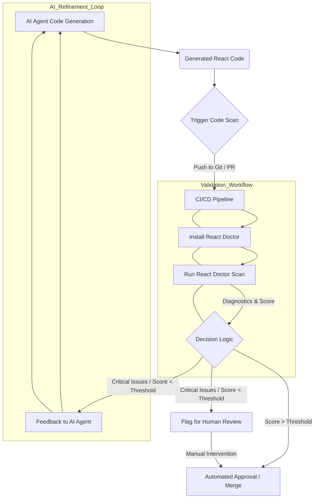

AI 코딩 에이전트의 확산은 개발 속도를 비약적으로 향상시키지만, 생성된 코드의 품질, 보안, 유지보수성에 대한 새로운 도전 과제를 야기합니다. 특히 React 애플리케이션의 경우, AI가 생성한 코드가 문법적으로는 올바르더라도 미묘한 안티패턴, 성능 병목 현상, 접근성 문제 등을 내포할 수 있습니다. 이러한 문제를 간과하면 장기적으로 기술 부채가 증가하고 애플리케이션 안정성이 저해될 수 있습니다. React Doctor는 이러한 AI 생성 React 코드의 품질을 정적 분석을 통해 객관적으로 검증하는 데 특화된 진단 도구로 등장했습니다. 이 도구는 상태 관리, 부수 효과, 성능, 보안, 접근성, 아키텍처 전반에 걸친 진단 결과를 0~100점의 점수와 함께 제공하여, AI 생성 코드의 신뢰도를 크게 높이는 데 기여합니다.

## React Doctor란 무엇인가?

React Doctor는 React 프로젝트의 소스 코드를 스캔하여 잠재적인 문제점을 식별하는 정적 분석 도구입니다. 이 도구는 코드의 AST(Abstract Syntax Tree)를 분석하여 React의 모범 사례나 업계 표준에서 벗어나는 영역을 찾아냅니다. 주요 진단 영역은 다음과 같습니다:

*   **상태 관리 (State Management)**: 잘못된 `useState`, `useReducer` 사용, 불필요한 리렌더링 유발 코드.
*   **부수 효과 (Side Effects)**: `useEffect`의 잘못된 의존성 배열, 무한 루프 가능성.
*   **성능 (Performance)**: `useMemo`, `useCallback`의 부재로 인한 불필요한 계산, 과도한 컴포넌트 리렌더링.
*   **보안 (Security)**: XSS 취약점, 인젝션 공격 가능성.
*   **접근성 (Accessibility)**: ARIA 속성 누락, 키보드 내비게이션 문제.
*   **아키텍처 (Architecture)**: 과도한 컴포넌트 결합도, 비즈니스 로직과 UI 로직의 혼재.

진단 결과는 각 문제에 대한 상세 설명과 함께 종합적인 품질 점수로 제공됩니다. 이 점수는 AI가 생성한 코드의 품질을 객관적으로 측정하고, 개선이 필요한 영역을 명확히 제시하는 데 활용될 수 있습니다.

## AI 코드 검증 파이프라인에 React Doctor 통합

AI 에이전트가 생성한 React 코드의 검증 파이프라인에 React Doctor를 통합하는 것은 LLM 출력의 신뢰성을 보장하는 핵심적인 단계입니다. `playbook`의 `LLM output validation pipeline`과 같은 자동화된 워크플로우에 React Doctor를 통합함으로써, AI 생성 코드가 실제 배포 가능한 품질 기준을 충족하도록 보장할 수 있습니다.

통합 과정은 일반적으로 다음과 같은 흐름으로 진행됩니다:

1.  **AI 코드 생성**: AI 에이전트가 React 컴포넌트, 훅, 유틸리티 함수 등 특정 요구사항에 맞는 코드를 생성합니다.
2.  **정적 분석 트리거**: 생성된 코드는 임시 브랜치에 커밋되거나 테스트 환경에 마운트됩니다. 이 과정에서 `npx react-doctor@latest` 명령어가 CI/CD 파이프라인의 일부로 자동 실행됩니다.
3.  **진단 보고서 생성**: React Doctor는 코드 스캔을 수행하고, 품질 점수 및 상세 진단 보고서를 터미널 또는 지정된 형식으로 출력합니다.
4.  **자동화된 의사결정**: 파이프라인은 React Doctor의 종합 점수와 특정 규칙 위반 여부를 기반으로 다음 조치를 결정합니다:
    *   **자동 승인**: 점수가 미리 정의된 임계값(예: 85점 이상)을 초과하고, 심각한 문제가 없는 경우.
    *   **자동 수정 제안/적용**: 경미하고 일반적인 안티패턴에 대해 React Doctor의 권고에 따라 AI 에이전트가 자동으로 코드를 수정하도록 지시하거나, Prettier 같은 도구와 연계하여 포맷을 교정합니다.
    *   **인간 검토 요청**: 점수가 임계값 미만이거나, 해결하기 어려운 복잡한 문제가 발견된 경우, 개발자에게 코드 검토를 요청합니다.
    *   **AI 재생성 및 피드백**: 문제가 심각하거나 자동 수정이 어려운 경우, React Doctor의 진단 결과를 구체적인 피드백으로 AI 에이전트에게 제공하여 코드의 재생성을 유도하는 반복적인 개선 루프를 시작합니다.

이러한 통합은 AI 코드 생성 프로세스를 단순한 출력에서 벗어나, 품질이 보장되고 자가 수정이 가능한 시스템으로 전환시킵니다.

## 코드 예제 및 진단 흐름

AI가 생성한 다음 React 컴포넌트 예시를 살펴보겠습니다. 이 컴포넌트에는 잠재적인 성능 문제가 있습니다.

```jsx
// src/components/DataDisplay.jsx
import React, { useState, useEffect } from 'react';

const DataDisplay = ({ sourceData }) => {
  const [displayItems, setDisplayItems] = useState([]);

  // 이 useEffect는 sourceData나 displayItems가 변경될 때마다 실행되어,
  // 불필요한 계산을 야기할 수 있습니다. displayItems를 의존성 배열에 포함하는 것은 일반적인 안티패턴입니다.
  useEffect(() => {
    const processData = () => {
      console.log('Processing data for display...');
      return sourceData.filter(item => item.status === 'active');
    };
    setDisplayItems(processData());
  }, [sourceData, displayItems]); // displayItems를 의존성에 포함하여 무한 루프 또는 비효율 발생 가능

  return (
    <div>
      <h3>Active Data Items</h3>
      <ul>
        {displayItems.map(item => (
          <li key={item.id}>{item.name}</li>
        ))}
      </ul>
    </div>
  );
};

export default DataDisplay;
```

프로젝트 내에서 `npx react-doctor@latest`를 실행하면, 이 파일의 `useEffect` 의존성 배열에 `displayItems`가 포함된 문제를 감지할 것입니다. 이로 인해 불필요한 리렌더링 루프나 과도한 계산이 발생할 수 있습니다.

React Doctor의 진단 출력은 다음과 유사할 수 있습니다:

```
React Doctor Report:
Overall Score: 60/100

[Performance] Avoid unnecessary re-renders in useEffect dependencies. (DataDisplay.jsx:11)
    -> The dependency array includes 'displayItems', which is set within the effect itself. This can lead to an infinite loop or excessive re-renders.
[State Management] Consider using useMemo for expensive computations outside of effects. (DataDisplay.jsx:9)
    -> 'processData' is an expensive function called directly inside useEffect; wrap it with useMemo if its dependencies are stable.
```

이러한 진단 피드백은 AI 생성 코드의 잠재적 문제를 구체적이고 실행 가능한 방식으로 제시하여, 자동화된 수정 또는 개발자의 개입을 유도할 수 있습니다.

## AI 코드 검증 파이프라인: Mermaid 다이어그램



## 2026년 트렌드 및 중요성

2026년에는 AI 에이전트의 자율성과 소프트웨어 개발 라이프사이클(SDLC) 내 통합 수준이 더욱 심화될 것으로 예상됩니다. 이에 따라 인간 중심의 코드 검토에서 자동화된 지능형 검증으로의 전환은 필수적입니다. 'Shift-Left' 품질 보증 전략이 더욱 강조되며, 문제가 가장 이른 단계, 즉 AI 코드 생성 직후에 식별되고 해결되어야 합니다. React Doctor는 이러한 트렌드에 완벽하게 부합하며, React 애플리케이션을 위한 전문적인 가드레일 역할을 합니다.

또한, React 생태계의 복잡성 증가(예: Concurrent Rendering, Server Components)는 표준 린팅 규칙을 넘어 미묘한 문제를 감지할 수 있는 정교한 정적 분석 도구의 필요성을 증대시킵니다. 이러한 검증 과정을 자동화함으로써 개발자들은 고수준의 아키텍처 결정과 복잡한 문제 해결에 집중할 수 있게 됩니다. 이는 AI 에이전트가 단순한 코드 생성 도구를 넘어, 신뢰할 수 있는 개발 파트너로 진화하는 데 핵심적인 역할을 합니다.

## 트레이드오프

*   **정적 분석의 초기 품질 확보 vs. 런타임 동작의 완전성**: React Doctor는 코드 패턴, 잠재적 버그, 성능 저하 요인 등을 광범위하게 정적 분석하여 AI 생성 코드의 초기 품질을 빠르게 확보하는 데 탁월합니다. 이는 런타임에 발생할 수 있는 동적 버그나 복잡한 사용자 시나리오에 대한 검증 부담을 줄여줍니다. 그러나 비즈니스 로직의 정확성, 복잡한 사용자 상호작용, 통합 테스트 등 런타임 검증이 필요한 영역에서는 한계가 명확합니다. 정적 분석만으로는 완벽한 코드 품질을 보장할 수 없으며, E2E 테스트나 수동 테스트를 대체할 수 없습니다.

*   **자동화된 피드백 루프의 효율성 vs. False Positive 관리**: AI 에이전트에 React Doctor의 진단 결과를 즉시 피드백하여 코드를 자율적으로 수정하거나 개선하는 자동화된 개발 사이클을 구축하는 데 유리합니다. 이는 일관된 코드 품질 기준을 유지하고 반복적인 수정 작업을 줄여줍니다. 하지만 React Doctor가 생성하는 일부 진단이 실제 문제로 이어지지 않는 False Positive를 유발할 수 있습니다. 이 경우, 잘못된 피드백이 AI 에이전트를 오도하거나 불필요한 수동 개입을 요구하여 개발 프로세스에 노이즈와 비효율성을 초래할 수 있습니다. 초기 설정과 튜닝에 상당한 공수가 필요합니다.

*   **개발 속도 가속화 vs. 초기 설정 및 유지보수 비용**: AI 생성 코드의 품질 검증 단계를 자동화함으로써 개발자들이 수동 코드 검토에 소요되는 시간을 절약하고, 배포 전 품질 리스크를 낮춰 전반적인 개발 속도를 가속화할 수 있습니다. 반면, React Doctor를 기존 파이프라인에 통합하고, 특정 프로젝트의 요구사항에 맞춰 규칙을 커스터마이징하며, 지속적으로 도구를 업데이트하고 False Positive를 관리하는 데 상당한 초기 설정 및 지속적인 유지보수 노력이 필요할 수 있습니다.

*   **객관적인 품질 측정 vs. 문맥적 이해 부족**: React Doctor의 점수 시스템과 상세 보고서는 코드 품질에 대한 객관적이고 표준화된 측정을 제공하여, 여러 AI 에이전트의 출력이나 프로젝트 간 코드 품질 비교에 유용합니다. 이는 MLOps 파이프라인 내에서 AI 모델의 성능 지표로도 활용될 수 있습니다. 그러나 코드가 특정 비즈니스 요구사항이나 독특한 아키텍처 패턴을 따를 때, React Doctor의 일반적인 규칙이 해당 문맥을 충분히 이해하지 못하고 부적절한 경고를 발생시킬 수 있습니다. 이는 개발자들이 도구의 권고를 무시하게 만들거나, 실제로는 문제가 없는 코드를 수정하는 데 시간을 낭비하게 할 수 있습니다.

## 실전 체크리스트

AI 코드 검증 파이프라인에 React Doctor를 효과적으로 통합하기 위해 다음 항목들을 확인하고 구현해야 합니다:

*   [ ] **기준 점수 및 임계값 설정**: AI 생성 코드가 통과해야 할 React Doctor의 최소 품질 점수 임계값(예: 80점 이상)과 각 카테고리별(성능, 보안, 접근성 등) 허용 가능한 최대 위반 수를 명확히 정의했는가?
*   [ ] **CI/CD 통합 자동화**: AI 에이전트가 코드를 생성한 직후, React Doctor 스캔이 자동으로 트리거되고 그 결과가 후속 피드백 루프에 원활하게 통합되도록 CI/CD 파이프라인을 구성했는가?
*   [ ] **오탐(False Positive) 관리 전략**: 프로젝트 특성을 고려하여 불필요한 경고를 무시하거나 규칙을 커스터마이징하는 `.reactdoctor.js` 또는 `package.json` 설정을 통해 오탐을 최소화하는 전략을 수립하고 이를 적용했는가?
*   [ ] **피드백 루프 정의**: React Doctor의 진단 결과(종합 점수, 특정 규칙 위반 메시지)를 기반으로 AI 에이전트에게 어떤 형태의 피드백을 제공하고, 어떻게 자율적인 수정 또는 재시도를 유도할 것인지 구체적으로 정의했는가? (예: "성능 점수가 낮으므로 `useMemo`를 활용한 최적화를 고려하라")
*   [ ] **핵심 성능 지표 (KPI) 연동**: React Doctor 점수 및 주요 진단 항목을 AI 에이전트의 `LLM output validation quality metrics` 또는 `generative-ai-model-evaluation` 지표와 연동하여 장기적인 코드 품질 개선 추이를 추적하고 보고하는 시스템을 구축했는가?
*   [ ] **점진적 적용 및 모니터링**: 초기 통합 시에는 경고 모드(fail-on-warning false)로 React Doctor를 실행하여 AI 생성 코드에 대한 진단 결과를 모니터링하고, 충분히 안정화된 후 점진적으로 엄격한 검증 규칙을 적용할 계획을 수립하고 있는가?
*   [ ] **보안 및 접근성 규칙 강화**: `llm-output-validation-prompt-constraints-robustness` 관점에서 AI 생성 코드의 보안 취약점(예: XSS, CSRF) 및 접근성(예: ARIA 속성, 키보드 내비게이션) 관련 React Doctor 규칙을 최우선으로 활성화하고 검증하고 있는가?