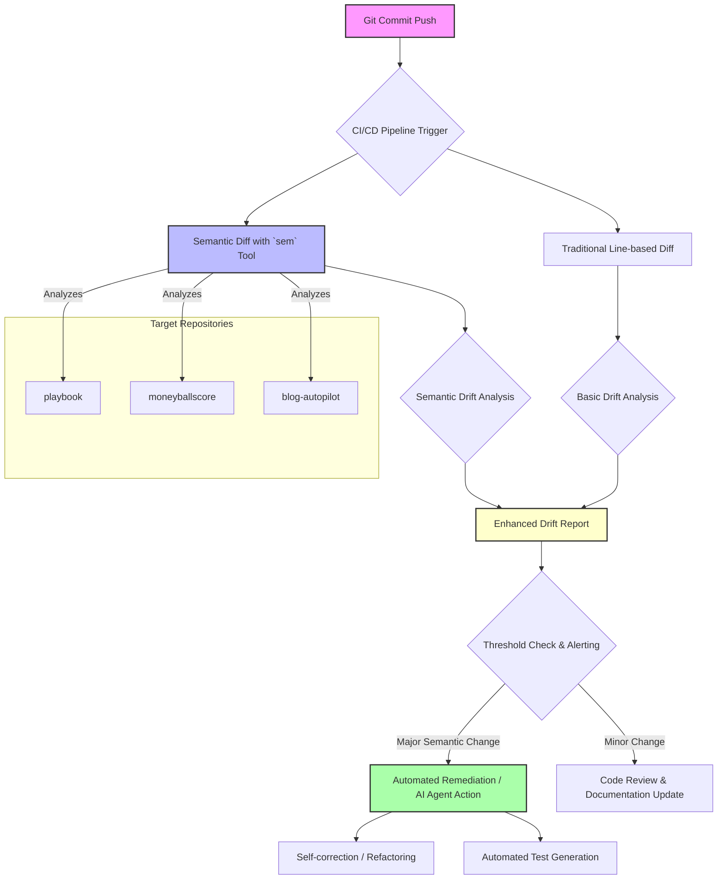

코드 베이스의 무결성을 유지하고 진화를 효율적으로 관리하는 것은 현대 소프트웨어 개발에서 핵심적인 과제입니다. 기존의 라인 기반(line-based) 변경 감지는 코드의 물리적 변화를 보여주지만, 실제 애플리케이션의 기능적 드리프트(functional drift)나 시맨틱(semantic) 변경을 파악하는 데는 한계가 있습니다. 예를 들어, 함수의 이름이 변경되거나 매개변수 순서가 바뀌는 등의 변경은 수많은 라인 변경으로 나타나지만, 그 본질은 단일 엔티티의 시맨틱 변경입니다. 이러한 비효율성을 극복하기 위해 `sem`과 같은 시맨틱 버전 관리 도구는 Git 저장소 내에서 함수, 클래스 등 코드 엔티티(entity) 단위의 변경을 추적하여 코드 변경에 대한 훨씬 더 심층적인 인사이트를 제공합니다.

`sem` 도구는 단순히 줄 단위의 추가/삭제/수정을 넘어서, 어떤 함수/메서드/클래스가 추가(added), 수정(modified), 삭제(deleted), 이동(moved), 이름 변경(renamed)되었는지 식별합니다. 이는 'line x~y가 변경됨'이라는 모호한 메시지 대신 '함수 `blah`가 변경됨'과 같이 의미론적으로 명확한 정보를 제공합니다. 이러한 접근 방식은 특히 대규모 코드 베이스나 AI 에이전트가 코드를 유지보수하고 진화시키는 환경에서 그 가치를 발휘합니다. AI 에이전트가 코드 변경의 '의도'를 더 잘 이해하고, 예상치 못한 기능적 드리프트를 조기에 감지하며, 더욱 정교한 자동화된 코드 리팩토링이나 버그 수정을 수행할 수 있게 합니다.

### `sem` 도구의 작동 방식 및 통합

`sem`은 Git 리포지토리의 커밋 히스토리나 현재 작업 디렉토리를 분석하여 코드의 추상 구문 트리(Abstract Syntax Tree, AST) 또는 유사한 내부 표현을 구축합니다. 이후 두 버전 간의 이러한 구조적 엔티티를 비교하여 시맨틱한 차이를 식별합니다. 이 도구는 별도의 복잡한 설정 없이 대부분의 Git 리포지토리에서 즉시 작동합니다.

예를 들어, `playbook`, `moneyballscore`, `blog-autopilot` 같은 프로젝트에 `sem` 도구를 통합하여 기존 드리프트 탐지 파이프라인을 고도화할 수 있습니다. 전통적인 `git diff` 명령어와 함께 `sem`의 결과를 활용함으로써, 라인 변경뿐 아니라 핵심 로직 및 구조의 변화를 추적하여 코드 무결성과 기능적 드리프트를 보다 정밀하게 감지합니다.

다음은 `sem` 도구의 기본적인 사용 예시입니다. 특정 커밋 범위 내의 시맨틱 변경 사항을 JSON 형식으로 출력하는 방법입니다:

```bash
#!/bin/bash

# Compare semantic changes between two Git revisions
# e.g., from HEAD~1 (previous commit) to HEAD (current commit)
SEM_DIFF_OUTPUT=$(sem diff --json HEAD~1 HEAD)

if [ $? -eq 0 ]; then
    echo "Semantic changes detected:"
    echo "${SEM_DIFF_OUTPUT}"
    # Further processing of JSON output, e.g., filtering for major changes
else
    echo "Failed to run sem diff or no semantic changes detected."
fi

# Example output snippet:
# [
#   {
#     "type": "modified",
#     "entity_type": "function",
#     "old_name": "calculate_score",
#     "new_name": "calculate_score",
#     "path": "src/score_logic.py",
#     "old_span": "(10, 0)-(20, 0)",
#     "new_span": "(10, 0)-(22, 0)"
#   },
#   {
#     "type": "added",
#     "entity_type": "class",
#     "new_name": "ResultFormatter",
#     "path": "src/utils.py",
#     "new_span": "(5, 0)-(15, 0)"
#   }
# ]
```

이러한 JSON 출력은 AI 에이전트나 자동화된 시스템이 파싱하여 코드 변경의 중요도를 판단하고, 적절한 후속 조치를 트리거하는 데 활용될 수 있습니다. 예를 들어, 주요 `API` 함수의 시맨틱 변경이 감지되면 자동으로 테스트 스위트를 확장하거나, 관련 문서 업데이트를 제안할 수 있습니다.

### 시맨틱 드리프트 탐지 파이프라인



이 다이어그램은 `sem` 도구가 `CI/CD` 파이프라인 내에서 어떻게 기존의 라인 기반 diff와 병렬로 작동하여, 더욱 정교한 드리프트 분석을 가능하게 하는지 보여줍니다. 특히 `AI` 에이전트의 개입 지점이 명확해져, 코드 베이스의 상태 변화에 대한 더욱 지능적인 대응이 가능해집니다.

## 트레이드오프

시맨틱 버전 관리를 통한 드리프트 탐지는 강력한 이점을 제공하지만, 몇 가지 트레이드오프를 고려해야 합니다.

*   **정확성 대 오버헤드**: 시맨틱 분석은 라인 기반 분석보다 훨씬 정확하게 코드의 본질적인 변화를 식별합니다. 이는 중요한 변경 사항을 놓치지 않게 해주지만, `AST` 파싱 및 비교에 따른 추가적인 계산 오버헤드가 발생합니다. (좋은 점: 기능적 의미의 높은 정확성. 나쁜 점: 대규모 코드베이스에서 분석 시간이 증가할 수 있음)
*   **세분화된 정보 대 복잡성**: `sem`은 함수, 클래스 단위의 세분화된 변경 정보를 제공하여 개발자나 `AI` 에이전트가 코드의 '무엇'이 변경되었는지 명확히 알 수 있게 합니다. 그러나 이 새로운 정보 계층을 통합하고 해석하기 위한 시스템 및 학습 곡선이 필요합니다. (좋은 점: 변경의 의도를 더 잘 이해. 나쁜 점: 새로운 도구와 데이터 모델에 대한 적응 필요)
*   **초기 감지 대 노이즈 가능성**: 시맨틱 도구는 라인 변경만으로는 감지하기 어려운 리팩토링이나 구조적 변경을 조기에 감지할 수 있습니다. 하지만, 일부 사소한 코드 재정렬(예: import 문의 순서 변경)도 시맨틱 변경으로 감지될 수 있어, 초기에는 노이즈로 인식될 수 있습니다. (좋은 점: 중요한 구조적 변경의 조기 경보. 나쁜 점: 설정에 따라 사소한 변경도 보고하여 초기에는 False Positive를 유발할 수 있음)
*   **자동화 효율성 대 도구 종속성**: `sem`과 같은 도구를 사용하면 `AI` 에이전트의 코드 분석 및 자동화된 의사결정 효율성이 크게 향상됩니다. 그러나 이는 특정 도구에 대한 종속성을 생성하며, 해당 도구의 유지보수나 언어 지원 범위에 따라 제약을 받을 수 있습니다. (좋은 점: `AI` 기반 코드 관리의 효율성 극대화. 나쁜 점: 특정 오픈소스 도구의 안정성과 지원에 의존)

## 실전 체크리스트

`sem` 도구를 활용한 시맨틱 드리프트 탐지 강화를 프로젝트에 적용할 때 다음 체크리스트를 활용하여 성공적인 통합을 보장할 수 있습니다.

- [ ] `sem` 도구를 `playbook`, `moneyballscore`, `blog-autopilot` 등 주요 Git 저장소에 설치하고 초기 분석을 수행했는가?
- [ ] `CI/CD` 파이프라인에 `sem diff` 명령어를 통합하여, 각 커밋 또는 `PR` 시 자동으로 시맨틱 변경 리포트를 생성하도록 설정했는가?
- [ ] 시맨틱 변경 리포트(JSON 형식)를 파싱하고, 주요 함수 `API` 변경, 클래스 구조 변경 등 중요도에 따른 알림 임계값을 정의했는가?
- [ ] `AI` 에이전트(예: 코드 리뷰 에이전트, 자동 리팩토링 에이전트)가 `sem`의 시맨틱 변경 출력을 이해하고, 이를 바탕으로 지능적인 권고나 자동 작업을 수행하도록 훈련시켰는가?
- [ ] `sem`이 지원하는 언어(예: Python, JavaScript 등)가 프로젝트의 주요 코드 베이스 언어를 모두 포함하는지 확인하고, 필요한 경우 추가 언어 지원 방안을 모색했는가?
- [ ] 시맨틱 변경 데이터와 전통적인 라인 기반 `diff` 데이터를 결합하여 통합 드리프트 대시보드를 구축하고, 이를 정기적으로 모니터링하고 있는가?
- [ ] `sem` 도구의 성능(분석 시간, 리소스 사용량)을 측정하고, 대규모 리포지토리에 대한 최적화 방안(예: 특정 경로만 분석)을 적용했는가?