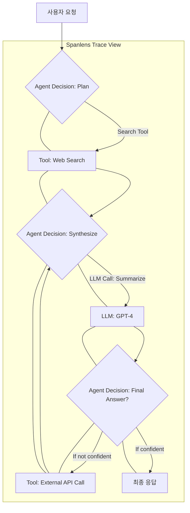

## LLM 관측의 중요성
대규모 언어 모델(LLM) 기반 애플리케이션의 개발 및 운영은 전통적인 소프트웨어와는 다른 복잡성을 가집니다. 특히, LLM 호출의 비결정적 특성, 높은 비용, 그리고 다단계 에이전트 워크플로우의 디버깅 난이도는 시스템의 안정성과 효율성을 저해하는 주요 요소입니다. 이러한 문제들을 해결하기 위해 LLM 호출 로깅, 비용 추적, 그리고 에이전트 트레이싱을 통합하여 시스템 전반의 가시성을 확보하는 '관측(Observability)'이 필수적입니다.

## Spanlens 개요: LLM 워크플로우 가시성 확보
Spanlens는 LLM 기반 시스템을 위한 오픈소스 관측 플랫폼으로, 개발자들이 LLM 호출 및 에이전트 워크플로우를 한곳에서 쉽게 모니터링하고 분석할 수 있도록 설계되었습니다. 주요 기능은 다음과 같습니다.

### LLM 호출 로깅 및 비용 추적
각 LLM API 호출에 대한 상세 정보를 기록하고, 토큰 사용량에 따른 실제 비용을 추적합니다. 이는 예상치 못한 비용 증가를 방지하고, 최적화 기회를 식별하는 데 도움을 줍니다.

### 에이전트 트레이스 시각화
LangChain과 같은 프레임워크를 사용하는 에이전트 기반 애플리케이션의 경우, Spanlens는 다단계 추론 과정(trace)을 시각화하여 에이전트의 의사결정 흐름과 도구 사용 패턴을 명확하게 보여줍니다. 이는 복잡한 에이전트의 디버깅과 성능 개선에 핵심적인 역할을 합니다.

### 출력 검증 및 드리프트 감지 지원
수집된 관측 데이터를 활용하여 LLM 출력의 유효성을 검증하고, 모델 성능 또는 동작 방식의 미세한 변화(drift)를 감지하는 파이프라인을 구축할 수 있습니다. 이는 프로덕션 환경에서 LLM 애플리케이션의 신뢰성을 유지하는 데 중요합니다.

## Spanlens 연동 예제
Spanlens는 다양한 LLM 프레임워크와의 연동을 지원하며, 파이썬 환경에서 LangChain과 통합하는 예시는 다음과 같습니다.

```python
from langchain.llms import OpenAI
from langchain.chains import LLMChain
from langchain.prompts import PromptTemplate
import os

# Spanlens 클라이언트 초기화 (실제 환경에서는 API 키 등 설정 필요)
# Spanlens 클라이언트는 LLM 호출을 자동으로 캡처하도록 설정될 수 있습니다.
# 예를 들어, LangChain 콜백을 통해 통합될 수 있습니다.

# Spanlens_init() 함수가 있다고 가정
def spanlens_init():
    # Spanlens SDK 초기화 로직 (pseudo-code)
    print("Spanlens client initialized.")
    # 실제로는 Spanlens SDK를 임포트하고 설정합니다.
    # from spanlens import SpanlensClient
    # client = SpanlensClient(api_key=os.getenv("SPANLENS_API_KEY"))
    # return client

# client = spanlens_init()

# LLM 모델 설정
llm = OpenAI(temperature=0.7, openai_api_key=os.getenv("OPENAI_API_KEY"))

# 프롬프트 템플릿 정의
prompt = PromptTemplate(
    input_variables=["topic"],
    template="Explain {topic} in simple terms for a beginner."
)

# LLM 체인 생성
chain = LLMChain(llm=llm, prompt=prompt)

# LLM 호출 및 결과 확인
topic = "large language models"
response = chain.run(topic)

print(f"Topic: {topic}")
print(f"Explanation: {response}")

# Spanlens는 이 호출을 자동으로 로깅하고 추적하며,
# Spanlens 대시보드에서 해당 호출의 상세 정보, 토큰 사용량, 비용 등을 확인할 수 있습니다.
```

## Spanlens를 활용한 에이전트 워크플로우 트레이싱
복잡한 에이전트 시스템에서는 여러 LLM 호출, 도구 사용, 그리고 중간 단계의 추론이 발생합니다. Spanlens는 이를 시각적으로 표현하여 에이전트의 작동 방식을 투명하게 만듭니다.


위 Mermaid 다이어그램은 Spanlens가 어떻게 에이전트의 다단계 의사결정 과정을 시각화하는지 보여줍니다. 각 노드는 LLM 호출, 도구 사용, 또는 특정 에이전트 단계에 해당하며, 화살표는 실행 흐름을 나타냅니다. 개발자는 이 트레이스를 통해 병목 현상, 잘못된 도구 선택, 또는 불필요한 LLM 호출 등을 쉽게 식별할 수 있습니다.

## 트레이드오프
Spanlens와 같은 관측 플랫폼 도입에는 다음과 같은 트레이드오프가 존재합니다.

*   **성능 오버헤드 vs. 디버깅 효율성:**
    *   **좋음:** LLM 호출 및 에이전트 스텝마다 로깅 및 트레이싱 데이터를 수집하므로, 런타임 성능에 미미한 오버헤드가 발생할 수 있습니다. 하지만 이는 복잡한 LLM 에이전트의 디버깅 시간을 획기적으로 단축하고 문제의 근본 원인을 신속하게 파악할 수 있게 하여 개발 효율성을 크게 높입니다. 특히, 프로덕션 환경에서의 장애 분석에 매우 유용합니다.
    *   **나쁨:** 극도로 낮은 레이턴시가 요구되는 실시간 애플리케이션이나, 처리량이 매우 높은 배치 작업에서는 추가적인 로깅 오버헤드가 문제가 될 수 있습니다. 이 경우, 샘플링 기반 트레이싱 또는 비동기 로깅 전략을 고려해야 합니다.

*   **데이터 저장 및 관리 복잡성 vs. 비용 및 성능 분석:**
    *   **좋음:** 모든 LLM 상호작용 데이터를 한곳에 집중하여 저장하고 관리함으로써, LLM 비용 분석, 성능 최적화, 그리고 사용자 경험(UX) 개선을 위한 심층적인 인사이트를 얻을 수 있습니다. 과거 데이터를 기반으로 모델의 장기적인 드리프트나 비용 변화를 예측하고 대응할 수 있습니다.
    *   **나쁨:** 수집되는 데이터의 양이 많아질수록 저장 공간, 데이터베이스 관리, 그리고 쿼리 성능 유지에 대한 부담이 증가합니다. 특히 민감한 정보가 포함될 경우 데이터 보안 및 규정 준수(compliance)에 대한 추가적인 고려가 필요합니다.

*   **초기 설정 및 통합 비용 vs. 장기적 운영 비용 절감:**
    *   **좋음:** Spanlens와 같은 도구를 시스템에 처음 통합하는 데 시간과 개발 리소스가 소요될 수 있습니다. 그러나 일단 구축되면, LLM API 비용 초과를 방지하고, 에이전트의 비효율적인 루프를 제거하며, 문제 발생 시 빠른 진단과 해결을 가능하게 하여 장기적으로 상당한 운영 비용 절감 효과를 가져옵니다.
    *   **나쁨:** 소규모 프로젝트나 PoC(Proof of Concept) 단계에서는 초기 통합 비용이 즉각적인 이점보다 크게 느껴질 수 있습니다. 복잡한 커스터마이징이 필요하거나, 기존 시스템 아키텍처와 충돌이 발생할 경우 통합 비용이 예상보다 커질 수 있습니다.

## 실전 체크리스트
Spanlens를 프로젝트에 성공적으로 도입하기 위한 실전 체크리스트입니다.

*   [ ] **LLM 호출 로깅 정책 정의**: 어떤 LLM 호출(성공/실패, 프롬프트/응답, 토큰 사용량)을 Spanlens로 보낼지 명확히 정의합니다.
*   [ ] **비용 추적 정확성 검증**: 실제 LLM API 청구서와 Spanlens가 보고하는 비용 데이터 간의 일치 여부를 주기적으로 확인하고, 불일치 발생 시 원인을 분석합니다.
*   [ ] **에이전트 트레이스 시각화 활용**: 핵심 에이전트 워크플로우에 대한 트레이스를 Spanlens에서 시각화하고, 비효율적인 경로 또는 의도치 않은 동작을 식별하여 최적화합니다.
*   [ ] **드리프트 감지 파이프라인 연동**: Spanlens의 관측 데이터를 활용하여 LLM 출력의 품질, 일관성 또는 관련성 변화(드리프트)를 감지하는 자동화된 파이프라인을 구축하고 알림 체계를 설정합니다.
*   [ ] **데이터 보존 정책 및 보안**: 수집된 LLM 호출 및 트레이스 데이터에 대한 보존 기간, 접근 제어, 그리고 PII(개인 식별 정보) 마스킹 등 보안 정책을 수립하고 준수합니다.
*   [ ] **알림 및 경고 설정**: LLM 비용 임계값 초과, 에이전트 오류율 증가, 또는 특정 성능 지표 하락 시 Spanlens를 통해 자동화된 알림을 받을 수 있도록 설정합니다.
*   [ ] **성능 벤치마킹**: Spanlens 도입 전후의 LLM 애플리케이션 성능(레이턴시, 처리량)을 벤치마킹하여 관측 오버헤드를 평가하고 필요한 경우 최적화 전략을 수립합니다.