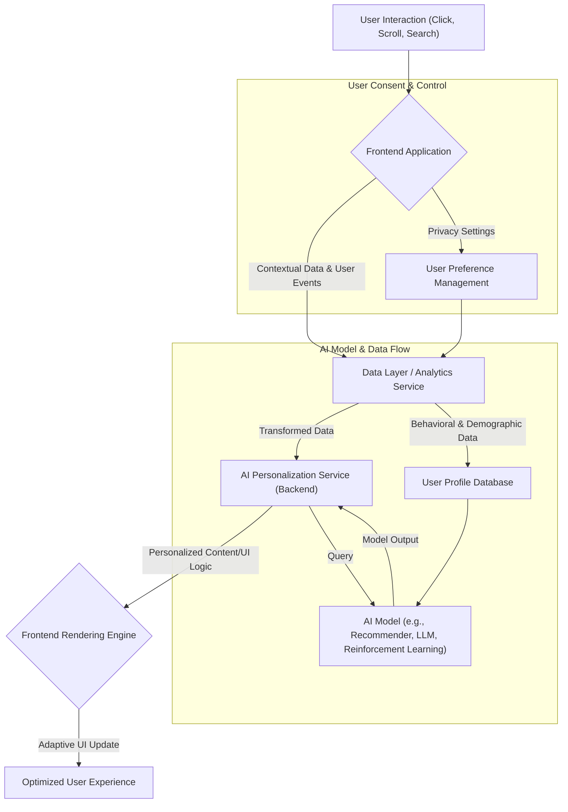

AI 기반 개인화된 사용자 경험(Personalized User Experience, PX)은 더 이상 선택이 아닌 필수적인 프론트엔드 개발 전략으로 자리매김하고 있다. 정적인 인터페이스를 넘어, 사용자의 개별적인 요구, 선호도, 행동 패턴을 실시간으로 학습하고 반응하는 동적인 UI를 구축하는 것이 핵심이다. 이는 사용자 참여도(Engagement)와 만족도, 더 나아가 비즈니스 목표 달성에 직접적인 영향을 미친다.

AI 기반 개인화는 사용자의 명시적 입력(Explicit Input)뿐만 아니라, 암묵적 행동(Implicit Behavior), 사용 환경(Context), 그리고 심지어 감정 상태까지 분석하여 최적의 콘텐츠, 기능, 레이아웃을 제공한다. 이러한 접근 방식은 전통적인 A/B 테스팅이나 사용자 세그멘테이션으로는 달성하기 어려운 수준의 정교한 경험을 가능하게 한다. 프론트엔드 개발자는 이러한 AI의 잠재력을 최대한 활용하여, 예측 가능하고 반응적인 인터페이스를 설계해야 한다.

## 핵심 원칙 및 작동 방식

AI 기반 개인화된 경험을 구현하기 위한 프론트엔드 디자인의 핵심은 다음과 같은 원칙에 기반한다.

*   **맥락적 관련성 (Contextual Relevance)**: 사용자의 현재 상황(위치, 시간, 기기, 세션 등)과 과거 행동 데이터를 종합하여 가장 관련성 높은 정보를 제공한다.
*   **적응성 (Adaptivity)**: AI 모델의 예측 또는 추천 결과에 따라 UI 컴포넌트, 콘텐츠, 레이아웃이 유동적으로 변화하고 재구성된다.
*   **사용자 주도권 (User Agency)**: AI가 제공하는 개인화에 대해 사용자가 이해하고, 제어할 수 있는 메커니즘을 제공하여 신뢰를 구축한다. Explainable AI (XAI) UI가 중요한 이유이다.
*   **실시간 반응성 (Real-time Responsiveness)**: 사용자 행동에 즉각적으로 반응하고, 백엔드 AI 서비스와의 통신 지연을 최소화하여 끊김 없는 경험을 제공한다.

이러러한 원칙 하에, 프론트엔드는 사용자 이벤트를 캡처하고, 이를 AI 모델이 활용할 수 있는 데이터 형태로 전송한다. AI 모델은 이 데이터를 기반으로 개인화된 응답을 생성하고, 프론트엔드는 이를 수신하여 동적으로 UI를 업데이트한다.

## 주요 프론트엔드 디자인 패턴

### 1. 적응형 콘텐츠 및 레이아웃 (Adaptive Content & Layout)

가장 기본적인 개인화 패턴으로, AI 모델이 예측한 사용자 선호도에 따라 특정 UI 컴포넌트의 가시성, 순서, 또는 콘텐츠를 동적으로 변경한다. 예를 들어, 전자상거래 웹사이트에서 사용자 검색 기록과 구매 패턴을 기반으로 추천 상품 섹션을 개인화하거나, 뉴스 앱에서 사용자 관심사에 맞춰 기사 목록을 재구성할 수 있다. 이는 Next.js의 서버 컴포넌트나 클라이언트 컴포넌트에서 비동기 데이터 페칭을 통해 구현할 수 있다.

### 2. 예측적 프리페칭 및 로딩 (Predictive Pre-fetching & Loading)

AI가 사용자의 다음 행동을 예측하여 필요한 리소스를 미리 로드하거나 캐싱하는 패턴이다. 이는 지연 시간(Latency)을 줄이고 사용자 경험의 매끄러움을 크게 향상시킨다. 예를 들어, AI가 사용자가 특정 페이지로 이동할 확률이 높다고 예측하면, 해당 페이지의 데이터를 미리 가져와 대기 시간을 없앨 수 있다. Next.js 라우터의 `prefetch` 기능과 결합하여 AI의 예측력을 활용하면 효과를 극대화할 수 있다.

### 3. 멀티모달 상호작용 (Multi-modal Interaction)

키보드, 마우스 외에 음성, 시선 추적, 제스처 등 다양한 입력 방식을 통합하여 개인화된 경험을 제공한다. AI는 이러한 복합적인 입력에서 더 풍부한 사용자 맥락을 파악하고, 이를 기반으로 UI를 조정하거나 적절한 피드백을 제공한다. 예를 들어, 사용자의 시선이 머무는 영역에 대한 AI 분석을 통해 관련 정보를 자동 제공하거나, 음성 명령에 따라 UI가 동적으로 반응하도록 설계할 수 있다.

### 4. 설명 가능한 AI UI (Explainable AI UI, XAI UI)

AI가 왜 특정 방식으로 개인화를 했는지 사용자에게 설명하는 UI 패턴이다. 이는 사용자에게 신뢰를 주고, AI 시스템에 대한 이해도를 높여준다. 예를 들어, 