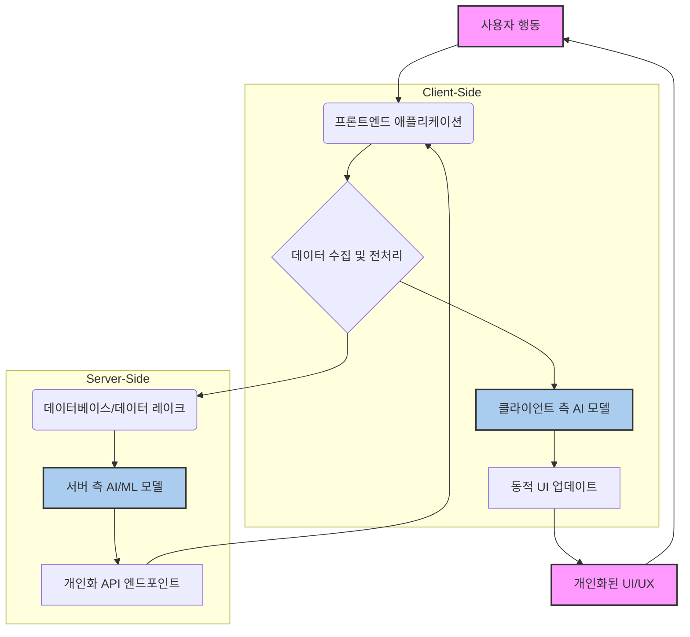

프론트엔드 개발에서 AI의 역할은 단순히 데이터 시각화를 넘어, 사용자 개개인에게 최적화된 경험을 제공하는 개인화된 UI/UX 구현의 핵심 동력으로 부상하고 있습니다. 2026년 현재, 사용자 경험의 개인화는 더 이상 선택이 아닌 필수가 되었으며, 이는 사용자의 참여도를 높이고 전환율을 개선하는 데 결정적인 영향을 미칩니다. 이 엔트리는 프론트엔드에서 AI를 활용한 개인화된 UI/UX를 구현하는 구체적인 방법론과 실전 적용 가이드를 제공합니다.

## 개인화된 UI/UX의 필요성 및 핵심 개념
사용자 경험의 개인화는 각 사용자의 선호도, 행동 이력, 실시간 컨텍스트를 학습하여 UI 요소, 콘텐츠, 상호작용 방식 등을 동적으로 맞춤 제공하는 것을 의미합니다. 이는 추천 시스템, 적응형 인터페이스, 예측형 상호작용, 감성 분석 등 다양한 AI 기술을 통해 구현될 수 있습니다.

AI 기반 개인화의 핵심은 사용자 데이터를 수집, 분석하여 패턴을 식별하고, 이를 바탕으로 미래 행동을 예측하거나 현재 니즈에 부합하는 최적의 UI/UX를 동적으로 제공하는 데 있습니다. 이 과정은 크게 클라이언트 측(On-Device AI)과 서버 측 AI 모델 활용으로 나눌 수 있습니다.

## 클라이언트 측(On-Device) AI를 활용한 개인화
클라이언트 측 AI는 사용자 기기에서 직접 모델을 실행하여 실시간에 가까운 개인화 경험을 제공합니다. 이는 네트워크 지연을 줄이고, 사용자 데이터가 서버로 전송되지 않으므로 프라이버시 보호에 유리하다는 장점이 있습니다.

### 구현 기술
- **TensorFlow.js**: JavaScript 환경에서 머신러닝 모델을 직접 브라우저나 Node.js에서 실행할 수 있게 합니다. 미리 훈련된 모델을 로드하거나, 브라우저에서 직접 모델을 훈련할 수도 있습니다.
- **ONNX Runtime Web**: ONNX(Open Neural Network Exchange) 형식의 모델을 웹에서 실행할 수 있는 기능을 제공합니다. 다양한 프레임워크에서 훈련된 모델을 웹에서 활용할 때 유용합니다.

### 실전 코드 예제: TensorFlow.js를 이용한 사용자 행동 예측
사용자가 특정 UI 요소와 상호작용하는 패턴을 학습하여 다음 행동을 예측하고, 이에 따라 UI를 동적으로 변경하는 시나리오입니다. 예를 들어, 사용자가 특정 카테고리 상품을 자주 탐색하면 관련 상품을 미리 로드하거나 추천 UI를 강조할 수 있습니다.

```javascript
// user-behavior-model.js
import * as tf from '@tensorflow/tfjs';

async function createAndTrainModel() {
  // 더미 데이터: [클릭 횟수, 스크롤 깊이, 체류 시간] -> [다음 액션 예측 (0: 무시, 1: 상세 보기)]
  const trainingData = tf.tensor2d([
    [10, 0.8, 120], [5, 0.2, 30], [25, 0.95, 300], [2, 0.1, 10], [18, 0.7, 180]
  ]);
  const outputData = tf.tensor2d([[1], [0], [1], [0], [1]]);

  const model = tf.sequential();
  model.add(tf.layers.dense({ inputShape: [3], units: 8, activation: 'relu' }));
  model.add(tf.layers.dense({ units: 1, activation: 'sigmoid' }));

  model.compile({ optimizer: 'adam', loss: 'binaryCrossentropy' });

  await model.fit(trainingData, outputData, { epochs: 50 });
  console.log('Model trained!');
  return model;
}

// UI에서 모델 활용 예시
async function predictUserAction(userInteraction) {
  const model = await createAndTrainModel(); // 실제 환경에서는 모델 로드
  const prediction = model.predict(tf.tensor2d([userInteraction], [1, 3]));
  const actionLikelihood = prediction.dataSync()[0];
  console.log(`Next action likelihood: ${actionLikelihood.toFixed(2)}`);

  if (actionLikelihood > 0.6) {
    // 특정 임계값 이상이면 개인화된 UI 요소 활성화
    console.log('Activate personalized UI for user action!');
    // 예: 관련 상품 미리보기, CTA 버튼 강조
    return true;
  }
  return false;
}

// 사용 예시
// predictUserAction([15, 0.75, 200]); // 높은 확률로 상세 보기 예상
// predictUserAction([3, 0.15, 20]);   // 낮은 확률로 상세 보기 예상
```

## 서버 측 AI와의 통합을 통한 개인화
대규모 데이터 분석, 복잡한 모델 훈련, LLM(Large Language Model) 활용 등은 주로 서버 측 AI를 통해 이루어집니다. 프론트엔드는 이러한 서버 측 AI의 결과를 비동기적으로 호출하여 UI/UX에 반영합니다.

### 구현 기술 및 패턴
- **REST API / GraphQL**: 가장 일반적인 통합 방식입니다. 프론트엔드는 사용자 데이터를 서버로 전송하고, 서버는 AI 모델을 통해 처리된 개인화된 응답을 반환합니다.
- **WebSockets / Server-Sent Events (SSE)**: 실시간 개인화가 중요한 경우(예: 실시간 추천, AI 챗봇과의 대화)에 활용됩니다. 서버에서 AI가 처리한 결과를 실시간으로 프론트엔드로 스트리밍합니다.
- **BFF(Backend For Frontend) 패턴**: 프론트엔드 특정 요구사항에 맞춰 최적화된 API 계층을 두어, 여러 백엔드 AI 서비스의 데이터를 통합하고 가공하여 프론트엔드에 제공합니다.

### 실전 코드 예제: 개인화된 추천 목록 API 호출

```typescript
// personalized-recommendation-service.ts
interface RecommendationItem {
  id: string;
  name: string;
  imageUrl: string;
  score: number;
}

async function fetchPersonalizedRecommendations(userId: string): Promise<RecommendationItem[]> {
  try {
    const response = await fetch(`/api/recommendations?userId=${userId}`, {
      method: 'GET',
      headers: { 'Content-Type': 'application/json' }
    });

    if (!response.ok) {
      throw new Error(`HTTP error! status: ${response.status}`);
    }

    const data: RecommendationItem[] = await response.json();
    return data;
  } catch (error) {
    console.error('Failed to fetch personalized recommendations:', error);
    // 폴백 로직: 기본 추천 또는 최근 인기 아이템 반환
    return [];
  }
}

// React 컴포넌트에서 활용 예시 (Next.js 기준)
// import React, { useEffect, useState } from 'react';
// import { fetchPersonalizedRecommendations } from './personalized-recommendation-service';

// function PersonalizedProductList({ userId }: { userId: string }) {
//   const [recommendations, setRecommendations] = useState<RecommendationItem[]>([]);
//   const [loading, setLoading] = useState(true);

//   useEffect(() => {
//     async function getRecommendations() {
//       setLoading(true);
//       const items = await fetchPersonalizedRecommendations(userId);
//       setRecommendations(items);
//       setLoading(false);
//     }
//     getRecommendations();
//   }, [userId]);

//   if (loading) return <div>로딩 중...</div>;
//   if (recommendations.length === 0) return <div>추천 상품이 없습니다.</div>;

//   return (
//     <div className="grid grid-cols-3 gap-4">
//       {recommendations.map(item => (
//         <div key={item.id} className="border p-4 rounded">
//           
//           <h3 className="font-bold">{item.name}</h3>
//           <p>추천 점수: {item.score.toFixed(1)}</p>
//         </div>
//       ))}
//     </div>
//   );
// }
```

## AI 기반 개인화 UI/UX 시스템 아키텍처



## 2026년 최신 트렌드 반영
- **하이퍼 개인화(Hyper-personalization)**: 단순한 추천을 넘어, 사용자의 감정 상태, 실시간 위치, 기분 등 미세한 컨텍스트까지 분석하여 UI/UX를 조정합니다. 예를 들어, 사용자가 피로해 보이면 UI의 색상 톤을 부드럽게 바꾸거나, 필요한 정보를 더 크게 강조하는 식입니다.
- **멀티모달 AI 인터페이스**: 텍스트, 음성, 이미지, 제스처 등 다양한 입력 방식을 AI가 통합적으로 이해하고 반응하는 UI를 구현합니다. 프론트엔드에서는 Web Speech API, WebRTC, WebAssembly 기반 이미지/영상 처리 등을 통해 이를 지원합니다.
- **설명 가능한 AI (Explainable AI, XAI) UX**: AI가 특정 개인화 결정을 내린 이유를 사용자에게 투명하게 설명하는 UI 요소를 포함합니다. 이는 사용자의 신뢰를 구축하고 제어권을 부여하는 데 중요합니다.
- **프라이버시 중심 AI (Privacy-Preserving AI)**: 연합 학습(Federated Learning), 동형 암호(Homomorphic Encryption) 등 기술을 활용하여 사용자 데이터를 직접 공유하지 않으면서도 개인화 모델을 훈련하고 적용합니다. 프론트엔드는 이러한 기술을 지원하는 클라이언트 라이브러리와 데이터 마스킹 전략을 구현합니다.

## 트레이드오프

### 1. 성능 vs. 개인화 깊이
- **언제 좋고**: 클라이언트 측 AI는 즉각적인 반응과 낮은 네트워크 부하를 제공하여, 실시간 상호작용이 중요한 경우(예: 타이핑 중 자동 완성, 시선 추적 기반 UI 조정)에 유리합니다.
- **언제 나쁜지**: 대규모 데이터셋 기반의 복잡한 개인화 로직(예: 이질적인 상품 추천, 대규모 사용자 그룹 분석)에는 서버 측 AI가 필수적이며, 클라이언트 측 AI만으로는 개인화의 깊이와 정확도에 한계가 있습니다.

### 2. 개발 복잡성 vs. 사용자 만족도
- **언제 좋고**: AI 기반 개인화는 초기 개발 비용과 복잡성이 높지만, 장기적으로는 사용자 만족도, 참여율, 전환율을 크게 개선하여 비즈니스 가치를 창출합니다.
- **언제 나쁜지**: 개인화가 미미하거나 불필요한 기능(예: 단순 정보성 페이지)에 과도한 AI 리소스를 투입하면, 개발 비용 대비 효과가 떨어지고 시스템이 불필요하게 복잡해질 수 있습니다.

### 3. 데이터 프라이버시 vs. 개인화 정확도
- **언제 좋고**: 강력한 데이터 프라이버시 보호는 사용자의 신뢰를 얻고 규제 준수에 필수적입니다. 클라이언트 측 AI나 차등 프라이버시(Differential Privacy) 같은 기술이 이를 돕습니다.
- **언제 나쁜지**: 프라이버시 보호를 위해 데이터 수집을 과도하게 제한하면, AI 모델이 사용자의 진정한 선호도를 학습하기 어려워 개인화의 정확도가 저하될 수 있습니다. 적절한 균형점 탐색이 중요합니다.

### 4. 비용 vs. 규모 확장성
- **언제 좋고**: 클라우드 기반 AI 서비스나 GPU 인스턴스를 활용한 서버 측 AI는 대규모 사용자 트래픽과 복잡한 모델 연산에 대한 뛰어난 확장성을 제공합니다.
- **언제 나쁜지**: AI API 호출 비용, 클라우드 인프라 비용 등은 서비스 규모가 커질수록 기하급수적으로 증가할 수 있습니다. 비용 효율적인 모델 선택, 캐싱 전략, 배치 처리 최적화가 필요합니다.

## 실전 체크리스트

AI 기반 개인화된 UI/UX를 프로젝트에 적용할 때 다음 항목들을 검토해야 합니다.

- [ ] **사용자 데이터 수집 전략 정의**: 어떤 사용자 데이터를(행동, 인구 통계, 컨텍스트 등) 수집할 것인지, 수집 목적과 범위가 명확하게 정의되어 있는가?
- [ ] **데이터 프라이버시 및 보안 준수**: GDPR, CCPA 등 개인정보보호 규정을 준수하며, 민감 정보 처리에 대한 암호화, 익명화, 동의 절차가 잘 구현되어 있는가?
- [ ] **AI 모델 선택 및 통합 방식 결정**: 클라이언트 측 AI (TensorFlow.js) 또는 서버 측 AI (LLM API, 커스텀 ML 모델) 중 어떤 방식이 현재 개인화 목표와 성능 요구사항에 적합한가? 또는 하이브리드 접근을 고려하는가?
- [ ] **개인화 지표 정의 및 A/B 테스트 계획**: 개인화된 UI/UX가 실제 사용자 참여, 전환율, 만족도에 긍정적인 영향을 미치는지 측정할 명확한 KPI(Key Performance Indicator)와 A/B 테스트 계획이 수립되어 있는가?
- [ ] **폴백(Fallback) 전략 구현**: AI 모델 예측 실패, API 오류, 네트워크 문제 시 사용자 경험 저하를 막기 위한 기본 UI/UX 또는 보편적 추천 등 폴백 전략이 구현되어 있는가?
- [ ] **UX 투명성 및 제어권 제공**: AI가 왜 특정 추천이나 UI 변경을 했는지 사용자에게 설명하고, 사용자가 개인화 설정을 조절하거나 끌 수 있는 옵션을 제공하는가?
- [ ] **성능 최적화 및 로딩 전략**: AI 모델 로딩 시간, 데이터 처리 지연이 사용자 경험에 미치는 영향을 최소화하기 위한 코드 스플리팅, 레이지 로딩, Web Worker 활용 등 최적화 전략이 적용되어 있는가?
- [ ] **지속적인 모니터링 및 모델 재학습 파이프라인**: 개인화 모델의 성능이 시간에 따라 저하되지 않도록 지속적으로 모니터링하고, 새로운 사용자 행동 데이터를 반영하여 모델을 주기적으로 재학습하는 파이프라인이 구축되어 있는가?
