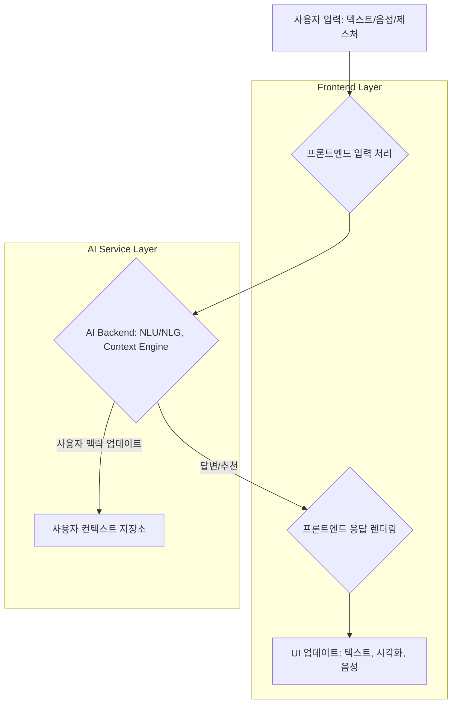

## AI 기반 사용자 경험(UX) 강화를 위한 프론트엔드 디자인 패턴

### 서론: AI 시대의 UX 패러다임 변화
AI 기술의 발전은 사용자 경험(UX) 디자인에 근본적인 변화를 요구하고 있습니다. 단순히 정보를 보여주는 것을 넘어, AI는 사용자의 의도를 예측하고, 맥락을 이해하며, 능동적으로 상호작용할 수 있는 새로운 가능성을 열었습니다. 이러한 변화 속에서 프론트엔드 개발자는 사용자에게 자연스럽고 효과적인 AI 상호작용을 제공하는 데 핵심적인 역할을 수행합니다. 본 문서에서는 2026년 이후 AI 기반 UX 강화를 위한 주요 프론트엔드 디자인 패턴과 구현 전략을 탐구합니다.

### 1. 예측 및 선제적 인터랙션 (Proactive & Predictive Interaction)
AI는 사용자의 행동 패턴, 컨텍스트, 과거 데이터를 분석하여 미래의 요구사항을 예측하고 선제적으로 정보를 제공하거나 작업을 제안할 수 있습니다. 이는 사용자가 명시적으로 요청하기 전에 가치를 제공하여 경험의 효율성과 만족도를 극대화합니다.

#### 주요 패턴:
*   **Ambient AI Guidance**: 백그라운드에서 AI가 지속적으로 컨텍스트를 모니터링하며, 필요한 순간에만 미묘하게 개입하여 가이드를 제공합니다. (e.g., 문서 작성 중 관련 정보 추천, 이메일 작성 시 문맥 기반 제안)
*   **Intelligent Defaults & Suggestions**: AI가 사용자 컨텍스트에 따라 UI 컨트롤의 기본값을 자동으로 설정하거나, 가장 가능성 높은 옵션을 먼저 제시합니다. (e.g., 비행기 예약 시 목적지에 따른 시간 추천, 회의 시간표 조율 시 참석자 일정 기반 추천)

```typescript
// React 컴포넌트 예시: AI 기반 선제적 추천 위젯
import React, { useState, useEffect } from 'react';
import { fetchProactiveSuggestions } from './api'; // AI API 호출 함수

interface Suggestion {
  id: string;
  title: string;
  description: string;
  action: () => void;
}

const ProactiveSuggestionWidget: React.FC = () => {
  const [suggestions, setSuggestions] = useState<Suggestion[]>([]);
  const [isVisible, setIsVisible] = useState(false);

  useEffect(() => {
    const loadSuggestions = async () => {
      // 사용자 컨텍스트 (현재 페이지, 과거 행동 등)를 AI에 전달
      const context = {
        currentPage: window.location.pathname,
        userActivity: getUserActivityLog(),
      };
      const data = await fetchProactiveSuggestions(context);
      if (data && data.length > 0) {
        setSuggestions(data);
        setIsVisible(true); // 추천이 있을 때만 위젯 표시
      } else {
        setIsVisible(false);
      }
    };

    const interval = setInterval(loadSuggestions, 5000); // 5초마다 추천 업데이트
    return () => clearInterval(interval);
  }, []);

  if (!isVisible || suggestions.length === 0) {
    return null;
  }

  return (
    <div className="proactive-suggestion-widget">
      <h3>AI Suggested Actions</h3>
      <ul>
        {suggestions.map((s) => (
          <li key={s.id}>
            <strong>{s.title}</strong>: {s.description}
            <button onClick={s.action}>Go</button>
          </li>
        ))}
      </ul>
    </div>
  );
};

export default ProactiveSuggestionWidget;

// 실제 구현에서는 서버 측에서 사용자 컨텍스트를 분석하여 추천을 생성합니다.
// 예시 API 함수 스텁
const fetchProactiveSuggestions = async (context: any): Promise<Suggestion[]> => {
  console.log('Fetching suggestions with context:', context);
  // Simulate API call
  return new Promise((resolve) =>
    setTimeout(() => {
      if (Math.random() > 0.3) { // Sometimes return suggestions
        resolve([
          {
            id: '1',
            title: 'Complete Your Profile',
            description: 'Add your interests to get better recommendations.',
            action: () => alert('Navigating to profile!'),
          },
          {
            id: '2',
            title: 'Read Related Article',
            description: 'Based on your current reading, you might like this.',
            action: () => alert('Navigating to article!'),
          },
        ]);
      } else {
        resolve([]);
      }
    }, 1000)
  );
};

const getUserActivityLog = () => {
  // 실제 사용자 활동 로그를 수집하는 로직 (e.g., local storage, Redux store)
  return ["viewed_product_X", "searched_for_Y"];
};
```

### 2. 설명 가능한 AI (Explainable AI, XAI) 인터페이스
AI의 결정이 사용자에게 불투명할 경우 신뢰를 잃을 수 있습니다. XAI 인터페이스는 AI의 추천, 예측, 또는 행동의 근거를 사용자에게 명확하고 이해하기 쉽게 설명하여 신뢰도를 높입니다.

#### 주요 패턴:
*   **Transparency Cards**: AI의 결정에 대한 주요 요인, 데이터 소스, 신뢰도 점수 등을 요약하여 카드 형태로 제공합니다.
*   **Interactive Explanation**: 사용자가 AI의 특정 예측 결과에 대해 "왜?"라고 질문할 수 있는 인터페이스를 제공하고, AI가 그에 대한 설명을 시각적으로 혹은 텍스트로 풀어냅니다. (e.g., 특정 대출 거절 사유에 대한 AI 분석 보고서, 의료 진단 AI의 주요 판단 근거 시각화)

### 3. 적응형 및 개인화된 UI (Adaptive & Personalized UI)
AI는 개별 사용자의 선호도, 행동 패턴, 목표에 따라 UI 레이아웃, 콘텐츠, 기능 접근 방식을 동적으로 조정할 수 있습니다. 이는 One-size-fits-all 접근 방식으로는 불가능한 깊이 있는 개인화를 가능하게 합니다.

#### 주요 패턴:
*   **Dynamic Content & Layout**: 사용자 역할, 사용 빈도, 선호하는 작업 흐름에 따라 대시보드 위젯, 내비게이션 항목, 콘텐츠 섹션의 순서 및 가시성을 조정합니다.
*   **Preference Learning**: AI가 사용자의 명시적/암묵적 피드백을 학습하여 시간이 지남에 따라 개인화 수준을 향상시킵니다. (e.g., 뉴스 피드 알고리즘, 전자상거래 추천 시스템)

### 4. 대화형 인터페이스 (Conversational Interfaces, CI)
자연어 처리(NLP) 기술의 발전으로 챗봇, 음성 비서 등 대화형 AI는 이제 단순한 명령 수행을 넘어 복잡한 상호작용과 의미 있는 대화를 가능하게 합니다.

#### 주요 패턴:
*   **Contextual Chatbots**: 이전 대화 맥락을 기억하고 이해하여 보다 유연하고 자연스러운 대화를 이어갑니다.
*   **Multimodal Conversational AI**: 텍스트, 음성, 시각적 요소를 통합하여 사용자가 가장 자연스럽고 편리한 방식으로 AI와 상호작용할 수 있도록 지원합니다.



### 5. 상황 인식 디자인 (Context-Aware Design)
AI는 사용자의 현재 위치, 시간, 기기, 주변 환경 등 다양한 상황적 데이터를 통합하여 더욱 정확하고 관련성 높은 상호작용을 제공할 수 있습니다. 이는 AI가 실제 세계의 복잡성을 이해하고 그에 맞춰 반응하도록 돕습니다.

#### 주요 패턴:
*   **Location-Based AI**: 사용자의 물리적 위치에 기반하여 관련 정보나 서비스를 제공합니다. (e.g., 공항 도착 시 비행 정보 알림, 특정 상점 근처 지나갈 때 할인 쿠폰 제공)
*   **Time & Schedule-Awareness**: 사용자의 일정과 시간대를 고려하여 알림, 제안, 작업 우선순위를 조정합니다. (e.g., 퇴근 시간 예측하여 교통 정보 제공, 주말 계획에 따른 추천 활동)

## 트레이드오프

### 1. 예측 및 선제적 인터랙션
*   **언제 좋고**: 사용자의 반복적인 작업이나 명확한 목표가 있는 상황에서 생산성 향상에 매우 효과적입니다. 예를 들어, 코딩 중 다음 코드 완성 추천, 문서 작성 중 적절한 어휘 제안 등.
*   **언제 나쁜지**: 예측이 부정확하거나 사용자가 예측 불가능한 행동을 할 때 오히려 방해가 되거나 짜증을 유발할 수 있습니다. 너무 잦은 개입은 사용자의 자율성을 침해할 수 있습니다.

### 2. 설명 가능한 AI (XAI) 인터페이스
*   **언제 좋고**: AI의 결정이 사용자의 삶에 중대한 영향을 미치거나(금융, 의료), 규제 준수가 필요한 경우(GDPR의 설명 가능성 요구) 신뢰 확보와 책임성 증명에 필수적입니다.
*   **언제 나쁜지**: 모든 AI의 결정 과정을 상세히 설명하는 것은 UI를 복잡하게 만들고 정보 과부하를 초래할 수 있습니다. 사소한 추천 기능에는 과도한 설명이 불필요할 수 있습니다.

### 3. 적응형 및 개인화된 UI
*   **언제 좋고**: 장기적으로 서비스를 사용하는 고정 사용자에게 매우 강력합니다. 사용자의 학습 곡선을 줄이고 만족도를 높여 이탈률 감소에 기여합니다. (e.g., 음악/영상 스트리밍 서비스의 추천, 맞춤형 학습 콘텐츠)
*   **언제 나쁜지**: 새로운 사용자나 가끔 사용하는 사용자에게는 일관성 없는 경험을 제공하여 혼란을 줄 수 있습니다. 과도한 개인화는 '필터 버블'을 생성하여 정보의 다양성을 저해할 수도 있습니다.

### 4. 대화형 인터페이스 (CI)
*   **언제 좋고**: 복잡한 질의응답, 여러 단계의 정보 입력, 비정형적인 요청 처리 등 자연어 처리가 강점을 발휘하는 영역에서 사용자에게 직관적이고 효율적인 인터랙션을 제공합니다. (e.g., 고객 서비스 챗봇, 음성 기반 스마트 홈 제어)
*   **언제 나쁜지**: AI가 사용자의 의도를 정확히 파악하지 못할 경우 반복적인 질문이나 오해를 유발하여 사용자를 좌절시킬 수 있습니다. 시각적 정보가 중요한 작업에는 비효율적일 수 있습니다.

### 5. 상황 인식 디자인
*   **언제 좋고**: 실생활과 밀접하게 연관된 서비스(내비게이션, 스마트 홈, 헬스케어)에서 AI가 사용자의 물리적, 시간적 맥락을 이해하고 반응할 때 탁월한 가치를 제공합니다. (e.g., 스마트워치 기반 건강 알림, 스마트폰 위치 기반 맛집 추천)
*   **언제 나쁜지**: 사용자의 개인 정보 보호(Privacy)에 대한 우려를 야기할 수 있으며, 부정확한 상황 인지는 잘못된 정보나 추천으로 이어질 수 있습니다. 과도한 센서 데이터 수집은 배터리 소모와 성능 저하를 초래할 수 있습니다.

## 실전 체크리스트

AI 기반 UX 강화를 위한 프론트엔드 디자인 패턴을 프로젝트에 적용할 때 다음 항목들을 검증해야 합니다.

- [ ] AI의 예측 또는 추천이 사용자에게 명확하게 'AI에 의해 생성된 것'으로 인지되는가? (Transparency Indicator)
- [ ] AI가 제공하는 정보나 기능에 대한 사용자의 명시적 피드백 메커니즘이 존재하는가? (e.g., "도움이 되었나요?", "이 추천이 마음에 드나요?")
- [ ] AI의 선제적 개입이 사용자의 현재 작업 흐름을 방해하지 않고, 필요한 시점에만 미묘하게 나타나는가? (Non-intrusive design)
- [ ] AI가 부정확한 정보나 오류를 생성했을 경우, 사용자가 이를 쉽게 수정하거나 무시할 수 있는 복구(Recovery) 메커니즘이 제공되는가?
- [ ] 개인화된 UI 또는 콘텐츠가 다양한 사용자 그룹(신규 사용자, 숙련자)에게 일관적이면서도 맞춤형 경험을 동시에 제공하는 균형을 이루는가?
- [ ] 대화형 인터페이스의 경우, AI가 사용자 발화의 복잡성과 모호성을 얼마나 잘 처리하며, 맥락을 유지하는가?
- [ ] AI 기반 기능의 성능(응답 속도, 정확도)이 사용자 기대치를 충족하며, 성능 저하 시 명확한 로딩/에러 상태를 표시하는가?
- [ ] AI 기능 구현 시 사용자 데이터 수집 및 활용에 대한 개인 정보 보호(Privacy) 정책이 명확하게 고지되고 동의를 얻었는가?
- [ ] AI의 결정 과정을 설명하는 XAI 요소가 일반 사용자가 이해하기 쉬운 언어와 시각적 표현으로 제공되는가?