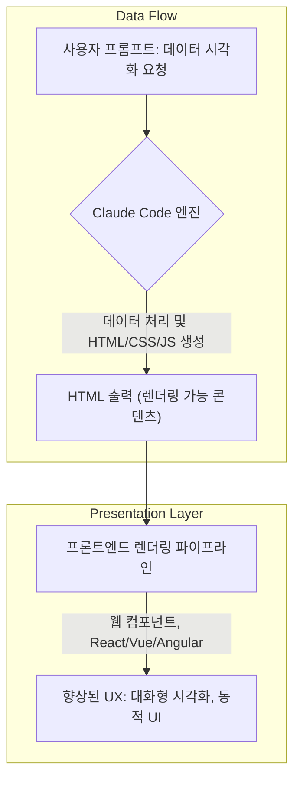

대규모 언어 모델 (LLM)이 생성하는 콘텐츠의 표준은 오랫동안 Markdown이었습니다. 간결하고 읽기 쉬우며 구조화에 용이하다는 장점이 있지만, 복잡한 시각화, 동적인 상호작용, 풍부한 스타일링에는 명확한 한계가 존재합니다. Claude Code와 같은 최신 LLM은 이러한 한계를 넘어 HTML 출력을 직접 생성하는 기능을 제공하며, 이는 사용자 경험 (UX) 개선에 있어 새로운 지평을 열고 있습니다.

## HTML 출력의 강력함: 단순함을 넘어서

Claude Code에서 HTML을 출력 형식으로 활용하는 것은 단순한 마크업 이상의 가치를 제공합니다. HTML은 웹의 기본 언어로서 `<table>` 태그를 통한 정교한 데이터 표현부터 CSS를 활용한 복잡한 스타일링, SVG를 통한 벡터 그래픽 생성, 그리고 JavaScript를 이용한 동적인 상호작용 구현까지 광범위한 기능을 지원합니다. 이는 LLM이 생성하는 결과물을 정적인 텍스트나 기본적인 서식에 머무르지 않고, 시각적으로 매력적이고 직관적인 정보 전달 도구로 변모시킬 수 있음을 의미합니다.

### 시각화 및 상호작용 요소의 향상

HTML 출력은 특히 다음과 같은 영역에서 UX를 혁신적으로 개선할 수 있습니다.

*   **정교한 데이터 테이블**: 복잡한 데이터를 Markdown 표보다 훨씬 유연하게 표현할 수 있습니다. 조건부 스타일링, 셀 병합, 필터링 및 정렬 기능까지 JavaScript를 통해 구현 가능합니다.
*   **동적 다이어그램 및 그래프**: SVG나 `<canvas>` 요소를 사용하여 흐름도, 아키텍처 다이어그램, 데이터 시각화 차트 등을 생성하고, 필요에 따라 사용자와 상호작용하도록 만들 수 있습니다.
*   **풍부한 사용자 인터페이스 요소**: 폼 요소, 버튼, 탭 UI 등 전통적인 웹 UI 컴포넌트를 LLM이 직접 생성하여, 사용자가 콘텐츠와 직접 소통하고 탐색할 수 있는 경험을 제공합니다.

2026년에는 AI가 생성한 HTML 기반의 콘텐츠가 단순한 정보 전달을 넘어선 **개인화된 대시보드**, **실시간 데이터 시각화**, 그리고 **능동적인 문제 해결을 위한 인터랙티브 워크플로우**를 제공하는 핵심 요소로 자리매김할 것입니다. 특히 플레이북 지식 허브와 같은 시스템에서는 이러한 HTML 출력을 통해 기존 정적 문서의 한계를 뛰어넘는 시각적 품질과 사용자 경험을 즉시 확보할 수 있습니다.

## Claude Code HTML 출력 예제

다음은 Claude Code에 데이터 시각화를 위한 HTML 테이블을 요청하는 프롬프트와 예상 출력입니다.

```python
# Claude Code 프롬프트 예시
prompt = """다음 분기별 판매 데이터를 사용하여 HTML 테이블을 생성해주세요. 매출이 5000만 달러를 초과하는 분기는 배경색을 연한 녹색으로, 3000만 달러 미만인 분기는 연한 주황색으로 표시해주세요. 각 분기별 성장률을 계산하여 마지막 열에 추가하고, 헤더 스타일은 굵게 처리해주세요.

데이터:
분기,매출(백만 달러),이익률(%)
Q1 2024,45,12
Q2 2024,58,15
Q3 2024,32,10
Q4 2024,65,18
"""

# Claude Code가 생성할 HTML 출력 (예상)
html_output = """
<style>
  table {
    width: 100%;
    border-collapse: collapse;
    margin-top: 20px;
    font-family: Arial, sans-serif;
  }
  th, td {
    border: 1px solid #ddd;
    padding: 8px;
    text-align: left;
  }
  th {
    background-color: #f2f2f2;
    font-weight: bold;
  }
  .high-revenue {
    background-color: #e6ffe6; /* Light green */
  }
  .low-revenue {
    background-color: #fff0e6; /* Light orange */
  }
</style>
<table>
  <thead>
    <tr>
      <th>분기</th>
      <th>매출(백만 달러)</th>
      <th>이익률(%)</th>
      <th>성장률(%)</th>
    </tr>
  </thead>
  <tbody>
    <tr class="high-revenue">
      <td>Q1 2024</td>
      <td>45</td>
      <td>12</td>
      <td>-</td>
    </tr>
    <tr class="high-revenue">
      <td>Q2 2024</td>
      <td>58</td>
      <td>15</td>
      <td>+28.89</td>
    </tr>
    <tr class="low-revenue">
      <td>Q3 2024</td>
      <td>32</td>
      <td>10</td>
      <td>-44.83</td>
    </tr>
    <tr class="high-revenue">
      <td>Q4 2024</td>
      <td>65</td>
      <td>18</td>
      <td>+103.13</td>
    </tr>
  </tbody>
</table>
"""
print(html_output)
```

이 예시에서는 Claude Code가 데이터를 분석하여 조건부 스타일링이 적용된 HTML 테이블을 생성합니다. 성장률 계산과 같은 로직 처리도 LLM 내부에서 이루어지며, 이를 통해 사용자에게 보다 풍부하고 가공된 정보를 제공할 수 있습니다.

## Mermaid Diagram: HTML 출력 흐름



## 트레이드오프

Claude Code의 HTML 출력 활용은 강력한 UX 개선 도구이지만, 적용 시 고려해야 할 트레이드오프가 존재합니다.

*   **풍부한 시각적 표현**: Markdown의 한계를 넘어선 복잡한 시각화 및 스타일링이 가능합니다. (언제 좋음: 데이터 분석 결과 보고서, 아키텍처 문서화, 대화형 튜토리얼; 언제 나쁨: 극도로 경량화된 텍스트 전용 인터페이스)
*   **상호작용성 강화**: JavaScript를 포함하여 동적인 UI 요소, 실시간 데이터 업데이트, 사용자 입력 처리 등을 구현할 수 있습니다. (언제 좋음: AI 에이전트의 대화형 대시보드, 설정 패널, 동적 콘텐츠 탐색; 언제 나쁨: 정적 콘텐츠만 필요한 경우, 클라이언트 측 로직을 최소화해야 하는 환경)
*   **콘텐츠 통합 유연성**: 생성된 HTML은 기존 웹 생태계에 자연스럽게 통합되어, 복잡한 프레임워크나 라이브러리 없이도 웹 애플리케이션에 쉽게 삽입될 수 있습니다. (언제 좋음: 웹 기반 지식 허브, CMS, 대화형 매뉴얼; 언제 나쁨: 네이티브 앱 환경, 엄격한 샌드박싱이 필요한 보안 민감 영역)
*   **보안 위험 증가**: LLM이 생성한 HTML/JavaScript 코드에는 잠재적인 크로스-사이트 스크립팅 (XSS) 취약점이나 악성 스크립트가 포함될 위험이 있습니다. (언제 좋음: 내부용, 통제된 환경; 언제 나쁨: 외부 사용자에게 노출되는 Public 서비스, 민감한 사용자 데이터 처리)
*   **렌더링 및 디버깅 복잡성**: 일반 Markdown보다 렌더링 파이프라인이 복잡해지며, 생성된 HTML/JS에 오류가 발생할 경우 디버깅이 어려울 수 있습니다. (언제 좋음: 고품질의 시각적 결과물이 중요할 때; 언제 나쁨: 신속한 배포 및 유지보수가 핵심인 MVP 단계, 리소스가 제한적인 환경)

## 실전 체크리스트

Claude Code의 HTML 출력을 프로젝트에 적용하기 위한 실전 체크리스트입니다.

*   [ ] LLM이 생성하는 HTML 출력에 대한 **콘텐츠 보안 정책 (CSP)** 구현 여부를 검토하고, 필요한 경우 strict CSP를 적용하여 인라인 스크립트 및 위험한 리소스 로드를 제한합니다.
*   [ ] 생성된 HTML 내 **인라인 JavaScript 및 `eval()` 사용** 여부를 모니터링하고, 보안 취약점 방지를 위해 런타임 시 제한 또는 제거 조치를 마련합니다.
*   [ ] HTML 출력 렌더링 전 **DOM XSS 필터링 또는 신뢰할 수 있는 Sanitization 라이브러리 (예: DOMPurify)** 적용 계획을 수립하고, 모든 사용자 입력 및 LLM 생성 콘텐츠에 대해 이를 적용합니다.
*   [ ] 생성된 HTML의 **시맨틱 정확성 및 웹 접근성 (Accessibility)** 검증 프로세스를 정의하고, 자동화된 도구 (예: Lighthouse, axe-core)를 통해 정기적으로 평가합니다.
*   [ ] **HTML 출력 파싱 및 렌더링 성능**에 대한 벤치마킹을 수행하고, 대량의 HTML 콘텐츠 생성 시 발생할 수 있는 클라이언트 측 성능 저하를 방지하기 위한 최적화 방안을 수립합니다.
*   [ ] 복잡한 시각화/상호작용 요소 생성을 위한 **구체적인 프롬프트 엔지니어링 가이드라인**을 수립하여 LLM의 출력 품질 일관성을 확보하고, 원하는 디자인 패턴을 유도합니다.
*   [ ] HTML 출력에서 예상치 못한 오류나 보안 문제가 발생했을 경우, 이를 감지하고 **LLM 피드백 루프 및 자동 재시도 메커니즘**을 구현하여 시스템의 견고성을 높입니다.