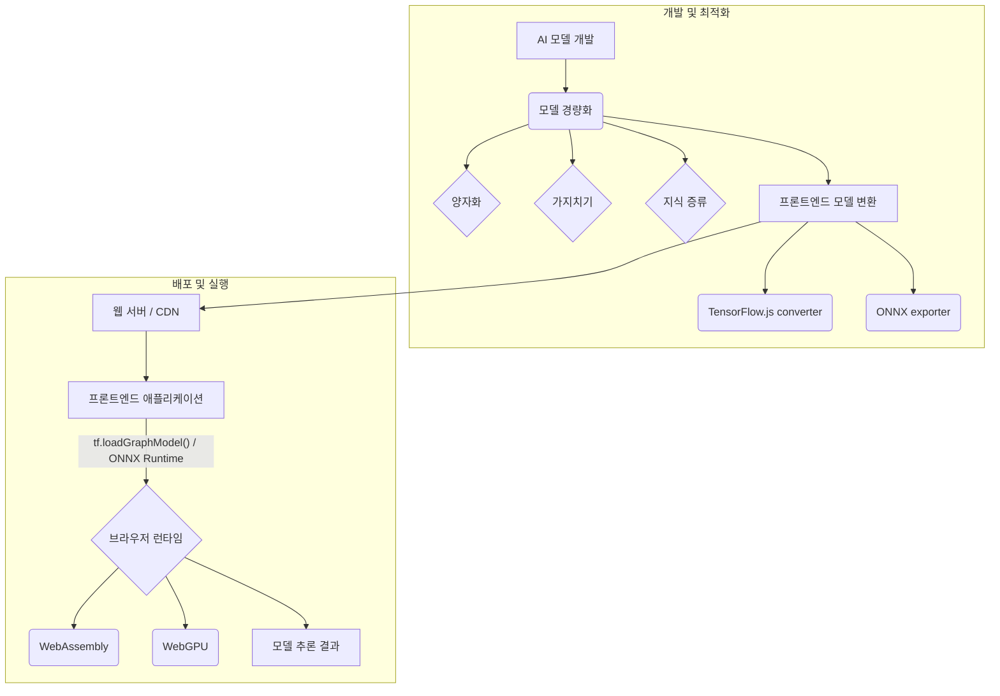

프론트엔드 환경에서 AI 모델을 직접 실행하는 것은 사용자 경험 향상, 개인 정보 보호 강화, 그리고 네트워크 지연 감소라는 명확한 이점을 제공합니다. 서버와의 왕복 통신 없이 클라이언트 장치에서 실시간 추론을 수행함으로써, 애플리케이션은 더 빠르고 반응성이 높아지며 오프라인 환경에서도 핵심 기능을 제공할 수 있습니다. 2026년에는 WebGPU, WebNN과 같은 브라우저 기술의 발전으로 이러한 온디바이스(on-device) AI의 가능성이 더욱 확장될 것입니다.

## 모델 경량화 전략 (Model Optimization Strategies)

프론트엔드 환경의 제약사항을 고려할 때, 모델 경량화는 필수적인 과정입니다.

### 1. 양자화 (Quantization)
모델의 가중치와 활성화 함수를 덜 정밀한 데이터 타입으로 변환하여 모델 크기와 연산 부하를 줄이는 기술입니다. `Float32`를 `Float16` 또는 `Int8`로 변환하는 것이 일반적이며, 이는 모델 파일 크기를 크게 줄이고 추론 속도를 향상시킬 수 있습니다.

### 2. 가지치기 (Pruning)
모델의 중요도 낮은 연결이나 뉴런을 제거하여 희소성(sparsity)을 높이는 방식입니다. 모델의 정확도를 유지하면서 크기와 연산량을 줄일 수 있습니다.

### 3. 지식 증류 (Knowledge Distillation)
대규모의 '교사(teacher)' 모델의 지식을 소규모의 '학생(student)' 모델로 이전하여, 학생 모델이 교사 모델과 유사한 성능을 내면서도 훨씬 가벼워지도록 만듭니다.

### 4. 아키텍처 최적화 (Architecture Optimization)
MobileNet, SqueezeNet, EfficientNet과 같이 모바일 및 엣지 디바이스에 최적화된 경량 모델 아키텍처를 선택하는 것입니다.

## 프론트엔드 배포 프레임워크 (Frontend Deployment Frameworks)

클라이언트 사이드에서 AI 모델을 실행하기 위한 다양한 라이브러리와 기술 스택이 있습니다.

*   **TensorFlow.js**: Google에서 개발한 JavaScript 기반 라이브러리로, 브라우저와 Node.js에서 TensorFlow 모델을 직접 실행하거나 학습시킬 수 있습니다. Keras 스타일의 고수준 API를 제공하여 사용이 용이합니다.
*   **ONNX Runtime Web**: ONNX (Open Neural Network Exchange) 형식으로 내보내진 모델을 브라우저에서 실행할 수 있게 해주는 라이브러리입니다. WebAssembly (WASM) 기반으로 고성능 추론을 지원하며, 다양한 프레임워크에서 학습된 모델을 통합할 수 있는 장점이 있습니다.
*   **WebNN API (2026 트렌드)**: 브라우저에서 신경망 연산을 직접 가속화할 수 있도록 설계된 새로운 표준 API입니다. 아직 초기 단계지만, GPU나 NPU와 같은 하드웨어 가속기를 브라우저 내에서 직접 활용하여 `TensorFlow.js`나 `ONNX Runtime Web`보다 훨씬 높은 성능을 제공할 잠재력을 가지고 있습니다.

## 모델 배포 및 로드 (Model Deployment and Loading)

경량화된 모델은 다양한 방식으로 프론트엔드 애플리케이션에 배포될 수 있습니다.

### 1. 번들링 (Bundling)
모델 파일을 직접 애플리케이션 번들에 포함시키는 방식입니다. 초기 로딩 시 모델을 사용할 수 있지만, 번들 크기가 커질 수 있습니다.

### 2. CDN 호스팅 (CDN Hosting)
모델 파일을 CDN에 호스팅하고, 필요 시 비동기적으로 로드합니다. 이는 초기 번들 크기를 줄이고 캐싱 이점을 활용할 수 있게 합니다.

### 3. 동적 로딩 (Dynamic Loading)
`import()` 문이나 `TensorFlow.js`의 `tf.loadGraphModel()` / `tf.loadLayersModel()`과 같은 API를 사용하여 필요할 때 모델을 비동기적으로 로드합니다.

### 코드 예시: TensorFlow.js를 이용한 모델 로드 및 추론

다음은 `TensorFlow.js`를 사용하여 간단한 이미지 분류 모델을 브라우저에서 로드하고 추론하는 예시입니다.

```javascript
import * as tf from '@tensorflow/tfjs';

// 모델 로드 함수
async function loadAndRunModel() {
  console.log('Loading model...');
  // 경량화된 MobileNetV2 모델을 로드합니다.
  const model = await tf.loadGraphModel('https://tfhub.dev/google/tfjs-model/imagenet/mobilenet_v2_100_224/classification/3/default/1', {fromTFHub: true});
  console.log('Model loaded.');

  // 더미 입력 데이터 생성 (예: 1x224x224x3 이미지 텐서)
  const inputTensor = tf.zeros([1, 224, 224, 3]);

  // 추론 실행
  console.log('Running inference...');
  const predictions = model.predict(inputTensor);
  const outputData = await predictions.data();
  console.log('Inference complete. Output sample:', outputData.slice(0, 10));

  // 결과 처리 (예: 최상위 예측 클래스)
  const topK = Array.from(outputData)
    .map((p, i) => ({ probability: p, className: `Class ${i}` }))
    .sort((a, b) => b.probability - a.probability)
    .slice(0, 5);

  console.log('Top 5 predictions:', topK);

  // 메모리 해제
  inputTensor.dispose();
  predictions.dispose();
  model.dispose(); // 모델을 더 이상 사용하지 않을 때 메모리 해제
}

loadAndRunModel().catch(console.error);
```

이 예제에서는 `tf.loadGraphModel()`을 사용하여 모델을 로드하고, `model.predict()`로 추론을 수행합니다. 실제 애플리케이션에서는 이미지나 다른 사용자 입력 데이터를 전처리하여 텐서 형태로 변환한 후 모델에 전달해야 합니다. `dispose()`를 사용하여 불필요한 텐서 메모리를 해제하는 것은 중요합니다.

## Mermaid 다이어그램: 프론트엔드 AI 모델 배포 파이프라인



## 트레이드오프

프론트엔드 AI 모델 경량화 및 배포에는 다음과 같은 트레이드오프가 존재합니다.

*   **성능 vs. 정확도 (Performance vs. Accuracy)**
    *   **언제 좋은가**: 실시간에 가까운 빠른 응답과 사용자 장치에서의 직접 실행이 필수적인 경우 (예: AR 필터, 실시간 제스처 인식). 경량화된 모델은 리소스 제약이 있는 환경에서도 작동 가능합니다.
    *   **언제 나쁜가**: 미미한 정확도 저하도 허용할 수 없는 고정밀 작업 (예: 의료 영상 진단, 금융 사기 탐지)이나, 클라이언트 측 자원으로 처리하기 어려운 매우 복잡하고 대규모의 모델이 필요한 경우.

*   **모델 크기 vs. 초기 로딩 시간 (Model Size vs. Initial Loading Time)**
    *   **언제 좋은가**: 모델 크기를 줄이면 초기 로딩 시간이 단축되어 사용자 경험이 향상됩니다. 특히 모바일 환경이나 저속 네트워크 사용자에게 유리합니다.
    *   **언제 나쁜가**: 과도한 경량화로 인해 모델의 유용한 기능이나 복잡성이 희생될 수 있습니다. 또한, 사용자의 네트워크 환경이 매우 좋다면, 더 큰 고정밀 모델을 한 번에 로드하는 것이 더 나을 수 있습니다.

*   **구현 복잡성 vs. 유연성 (Implementation Complexity vs. Flexibility)**
    *   **언제 좋은가**: `TensorFlow.js`나 `ONNX Runtime Web`과 같은 프레임워크를 사용하면 모델을 브라우저에서 직접 실행할 수 있어 서버 의존성을 줄이고 유연한 아키텍처를 구현할 수 있습니다.
    *   **언제 나쁜가**: 모델 변환, 경량화 과정, 브라우저 환경에서의 디버깅은 서버 기반 배포에 비해 더 높은 전문성과 복잡한 설정이 필요할 수 있습니다. 특히 이종 브라우저/장치 환경을 고려해야 합니다.

*   **데이터 개인 정보 보호 vs. 중앙 집중식 제어 (Data Privacy vs. Centralized Control)**
    *   **언제 좋은가**: 클라이언트 측 추론은 사용자 데이터가 서버로 전송될 필요가 없어 개인 정보 보호 측면에서 강력한 이점을 제공합니다. GDPR, CCPA와 같은 규제 준수에 유리합니다.
    *   **언제 나쁜가**: 모델의 성능 모니터링, 업데이트, 재학습 및 전반적인 모델 라이프사이클 관리가 서버 측 배포에 비해 더 어려워질 수 있습니다. 모델 드리프트(drift) 감지 및 대응이 복잡해집니다.

## 실전 체크리스트

프로젝트에 프론트엔드 AI 모델 경량화 및 배포를 적용할 때 다음 항목들을 검증해야 합니다.

*   [ ] **목표 성능 측정 및 최적화**: 모델의 정확도, 추론 속도, 메모리 사용량에 대한 최소/최대 요구 사항을 정의하고, 이를 충족하는지 지속적으로 측정하고 최적화했는가?
*   [ ] **모델 경량화 기법 적용**: 양자화, 가지치기, 지식 증류 등 최소 2가지 이상의 경량화 기법을 적용하여 모델 크기를 50% 이상 줄였는가?
*   [ ] **브라우저 호환성 테스트**: 주요 대상 브라우저(Chrome, Firefox, Safari, Edge) 및 모바일 기기에서 모델이 정상적으로 로드되고 예측하는지 테스트했는가? WebGL 또는 WebGPU 가속이 제대로 사용되는지 확인했는가?
*   [ ] **초기 로딩 시간 최적화**: 모델 로딩 전략(번들링, CDN, 동적 로딩)을 선택하고, 모델 파일 크기 및 네트워크 요청 수를 최소화하여 `DOMContentLoaded` 시간을 2초 이내로 유지했는가?
*   [ ] **에러 처리 및 폴백 (Fallback) 전략**: 모델 로딩 실패, 추론 오류, 또는 WebGL/WebGPU 지원 불가 시 사용자에게 적절한 안내를 제공하거나 서버 측 추론으로 폴백하는 메커니즘을 구현했는가?
*   [ ] **메모리 관리**: `TensorFlow.js` 텐서의 `dispose()` 메서드나 `tf.memory()`를 활용하여 불필요한 메모리 할당을 방지하고, 메모리 누수가 발생하지 않도록 관리하는가?
*   [ ] **보안 고려사항**: 클라이언트 측에서 모델이 노출될 수 있음을 인지하고, 민감한 데이터 처리나 중요한 비즈니스 로직에 모델 출력을 직접 의존하지 않도록 설계했는가? (모델 역공학 위험)