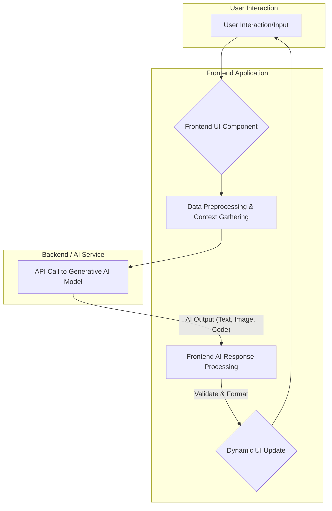

생성형 AI는 프론트엔드 UI/UX 디자인 패러다임에 근본적인 변화를 가져오고 있습니다. 기존의 정적이고 예측 가능한 인터페이스에서 벗어나, AI는 사용자 행동, 컨텍스트, 그리고 의도를 실시간으로 학습하여 동적이고 개인화된 경험을 제공하는 핵심 동력으로 작용합니다. 이러한 변화는 사용자 인터랙션을 개선하고 AI 기능을 효과적으로 전달하는 새로운 디자인 가이드라인과 패턴을 요구합니다. 2026년에는 AI가 단순한 도구를 넘어 사용자 경험의 공동 창작자(co-creator)로 자리매김하며, 인터페이스는 더욱 지능적이고 유동적으로 진화할 것입니다.

## 핵심 디자인 패턴

### 1. 컨텍스트 기반 적응형 UI (Context-Aware Adaptive UI)
AI는 사용자의 현재 작업, 위치, 시간, 과거 인터랙션 이력 등을 종합적으로 분석하여 UI 컴포넌트의 가시성, 레이아웃, 심지어 스타일까지 동적으로 조정합니다. 이는 사용자에게 가장 관련성 높은 정보와 기능을 적시에 제공하여 인지 부하(cognitive load)를 줄이고 생산성을 향상시킵니다.

### 2. 능동적 지원 및 제안 (Proactive Assistance & Suggestion)
AI는 사용자의 의도를 예측하여 다음 단계에 필요한 정보나 액션을 미리 제안합니다. 이는 검색어 자동 완성, 이메일 초안 작성, 디자인 요소 추천, 코드 스니펫 제안 등 다양한 형태로 나타나며, 사용자가 명시적으로 요청하기 전에 도움을 제공하여 워크플로우를 가속화합니다.

### 3. 자연어 및 다중 모드 인터랙션 (Natural Language & Multimodal Interaction)
텍스트 기반의 프롬프트 입력을 넘어 음성, 시각, 제스처 등 다양한 입력 방식을 통합하여 보다 자연스러운 인터랙션을 가능하게 합니다. AI는 이러한 복합적인 입력 데이터를 이해하고 처리하여 복잡한 요청도 직관적으로 수행할 수 있도록 지원합니다. 이는 인터랙션의 장벽을 낮추고 접근성을 향상시킵니다.

### 4. AI 기반 콘텐츠 및 레이아웃 생성 (AI-Driven Content & Layout Generation)
AI는 텍스트, 이미지, 비디오 등 다양한 콘텐츠를 생성하거나 기존 콘텐츠를 재구성하여 제공합니다. 나아가 웹페이지 섹션, 앱 화면의 레이아웃까지 제안하여 디자이너와 개발자의 생산성을 크게 향상시킵니다. 이는 A/B 테스트를 통한 최적화에도 활용될 수 있습니다.

### 5. 설명 가능한 AI (Explainable AI, XAI) 통합
AI의 제안이나 결정이 내려진 이유를 사용자에게 투명하게 설명하는 UI 패턴입니다. 이는 AI 시스템에 대한 사용자의 신뢰를 구축하고, AI의 편향성(bias)이나 오류를 사용자가 이해하고 관리할 수 있도록 돕습니다. 예를 들어, '왜 이 제품을 추천했나요?'와 같은 질문에 대한 설명을 제공합니다.

## AI 기반 UI/UX 상호작용 흐름



## 실제 코드 예시: AI-Assisted Text Input (React)

아래는 사용자가 텍스트를 입력할 때 AI가 맥락에 맞는 제안을 제공하는 간단한 React 컴포넌트 예시입니다. 이는 능동적 지원 패턴의 기초적인 구현을 보여줍니다. `fetchSuggestion` 함수는 실제 AI API 호출로 대체될 수 있습니다.

```jsx
import React, { useState, useEffect } from 'react';

function AIAssistedInput({ initialValue = '' }) {
  const [inputValue, setInputValue] = useState(initialValue);
  const [aiSuggestion, setAiSuggestion] = useState('');
  const [isLoading, setIsLoading] = useState(false);

  // Debounce for fetching suggestion
  useEffect(() => {
    const handler = setTimeout(() => {
      if (inputValue.length > 5) {
        fetchSuggestion(inputValue);
      } else {
        setAiSuggestion('');
      }
    }, 500); // Wait 500ms after last keystroke
    return () => {
      clearTimeout(handler);
    };
  }, [inputValue]);

  const fetchSuggestion = async (text) => {
    if (!text.trim()) {
      setAiSuggestion('');
      return;
    }
    setIsLoading(true);
    try {
      // In a real application, this would be an API call to an AI model
      const response = await new Promise(resolve => setTimeout(() => {
        if (text.toLowerCase().includes('email')) {
          resolve("Subject: Meeting Summary - [Date] | Dear Team, ...");
        } else if (text.toLowerCase().includes('blog post')) {
          resolve("Consider an intro, 3 main points, and a conclusion for your blog post.");
        } else {
          resolve(`AI suggests: Refine "${text}". Add more context or keywords.`);
        }
      }, 800));
      setAiSuggestion(response);
    } catch (error) {
      console.error('Error fetching AI suggestion:', error);
      setAiSuggestion('Failed to get suggestion. Please try again.');
    } finally {
      setIsLoading(false);
    }
  };

  const handleChange = (e) => {
    setInputValue(e.target.value);
  };

  const applySuggestion = () => {
    if (aiSuggestion) {
      setInputValue(prev => prev + '\n' + aiSuggestion);
      setAiSuggestion('');
    }
  };

  return (
    <div style={{ maxWidth: '600px', margin: '20px auto', padding: '15px', border: '1px solid #ccc', borderRadius: '8px' }}>
      <h3>AI-Assisted Text Input</h3>
      <textarea
        value={inputValue}
        onChange={handleChange}
        placeholder="Start typing your content here..."
        rows="8"
        style={{ width: '100%', padding: '10px', fontSize: '16px', borderRadius: '4px', border: '1px solid #ddd' }}
      />
      {isLoading && inputValue.length > 5 && <p>Generating suggestion...</p>}
      {aiSuggestion && !isLoading && (
        <div style={{ marginTop: '15px', backgroundColor: '#f0f8ff', padding: '10px', borderRadius: '4px', border: '1px dashed #aaddff' }}>
          <h4>AI Suggestion:</h4>
          <p>{aiSuggestion}</p>
          <button
            onClick={applySuggestion}
            style={{ padding: '8px 12px', backgroundColor: '#007bff', color: 'white', border: 'none', borderRadius: '4px', cursor: 'pointer', marginTop: '10px' }}
          >
            Apply Suggestion
          </button>
        </div>
      )}
    </div>
  );
}

export default AIAssistedInput;
```

## 2026년 최신 트렌드 반영

2026년에는 생성형 AI가 사용자 경험의 핵심을 더욱 깊이 파고들 것입니다. 'Hyper-personalization'은 모든 사용자 상호작용이 AI에 의해 고도로 맞춤화되어 예측 불가능한 수준의 개인화된 경험을 제공하게 됩니다. AI는 디자이너와 개발자의 'co-creator'로서 디자인 시스템, 코드 스니펫, 테스트 케이스 등을 실시간으로 생성하고 제안하여 개발 워크플로우를 혁신할 것입니다. 또한, 윤리적 AI (Ethical AI) 원칙이 디자인 프로세스에 깊이 통합되어, AI의 편향성 문제를 해결하고 투명하고 공정한 사용자 경험을 보장하는 것이 중요해질 것입니다. 다중 모드 인터페이스는 더욱 보편화되어, AR/VR 환경에서도 음성, 제스처, 시선 추적 등 다양한 인풋을 AI가 복합적으로 처리하여 몰입감 있는 경험을 제공할 것입니다.

## 트레이드오프

생성형 AI 기능을 프론트엔드 UI/UX에 통합할 때 고려해야 할 중요한 트레이드오프들이 존재합니다.

*   **개인화(Personalization) vs. 예측 가능성(Predictability)**: AI 기반의 고도화된 개인화는 사용자 만족도를 높이지만, 때로는 시스템의 동작이 예측하기 어려워 사용자에게 혼란을 줄 수 있습니다. 언제 좋냐면, 사용자가 탐색적이고 새로운 경험을 기대할 때 좋습니다. 언제 나쁘냐면, 일관성과 안정적인 워크플로우가 중요한 비즈니스 애플리케이션에서는 사용자 통제감 상실로 이어질 수 있습니다.
*   **자율성(Autonomy) vs. 통제력(Control)**: AI가 UI를 자율적으로 변경하거나 콘텐츠를 생성할 때, 사용자에게 어디까지 통제권을 줄 것인지 결정해야 합니다. AI가 사용자 의도를 정확히 파악하여 효율성을 극대화할 수 있을 때 좋습니다. 사용자가 직접적인 통제와 정확한 결과를 중요하게 여기는 작업에서는 AI의 자율성이 오히려 방해가 될 수 있습니다.
*   **성능(Performance) vs. 기능의 풍부함(Richness)**: 복잡한 AI 모델의 추론(inference)은 상당한 연산 자원과 시간을 요구하여 UI 응답성에 영향을 줄 수 있습니다. 사용자에게 매우 풍부하고 동적인 인터랙션이 핵심 가치일 때 좋습니다. 실시간 응답성과 빠른 로딩이 필수적인 시나리오(예: 금융 거래, 게임)에서는 AI 기능의 범위와 복잡성을 신중히 조절해야 합니다.
*   **설명 가능성(Explainability) vs. UI 단순성(Simplicity)**: AI의 결정 과정을 투명하게 설명하는 것은 신뢰 구축에 필수적이지만, 이는 UI를 복잡하게 만들 수 있습니다. AI의 결정이 사용자의 중요한 판단에 영향을 미치거나 윤리적 함의가 있을 때 좋습니다. 일상적이고 저위험 작업에서는 과도한 설명이 오히려 사용자 경험을 저해할 수 있습니다.
*   **데이터 프라이버시(Data Privacy) vs. 경험 향상(Enhanced Experience)**: AI는 사용자 데이터를 기반으로 학습하고 개인화된 경험을 제공하지만, 이는 데이터 수집 및 활용에 대한 프라이버시 문제를 야기합니다. 사용자에게 명확한 가치를 제공하고 데이터 사용에 대한 동의가 명확할 때 좋습니다. 사용자가 개인정보 유출에 민감하거나 데이터 수집 목적이 불분명할 경우, 부정적인 사용자 경험을 초래할 수 있습니다.

## 실전 체크리스트

프로젝트에 생성형 AI UI/UX 패턴을 적용할 때 다음 항목들을 검증해야 합니다.

- [ ] AI 기능 통합을 통해 사용자에게 제공되는 핵심 가치(예: 시간 절약, 생산성 향상, 맞춤형 정보)가 명확히 정의되었는가?
- [ ] AI 모델의 응답 지연 시간(latency)을 최소화하고, 긴 지연 시간 발생 시 사용자에게 명관적인 로딩 상태 또는 진행률 표시 UI를 제공하는가?
- [ ] AI가 생성한 콘텐츠 또는 제안에 대해 사용자가 쉽게 편집, 수정, 또는 거부할 수 있는 명확한 인터페이스를 제공하는가?
- [ ] AI의 불확실한 응답이나 에러 상황에 대비하여 사용자에게 이해하기 쉬운 메시지와 대안적 액션(fallback options)을 제공하는가?
- [ ] AI가 사용자 데이터를 수집하고 활용하는 방식에 대해 명확한 고지 및 동의 절차를 마련하고, 개인정보 보호 규정을 준수하는가?
- [ ] AI 기능의 도입 전후로 사용자 만족도, 작업 효율성 등의 핵심 지표를 측정할 수 있는 A/B 테스트 또는 사용자 연구 계획을 수립하였는가?
- [ ] AI 기반의 동적 UI 요소들이 웹 접근성 표준(WCAG)을 준수하며, 다양한 사용자들이 문제없이 접근하고 상호작용할 수 있는가?