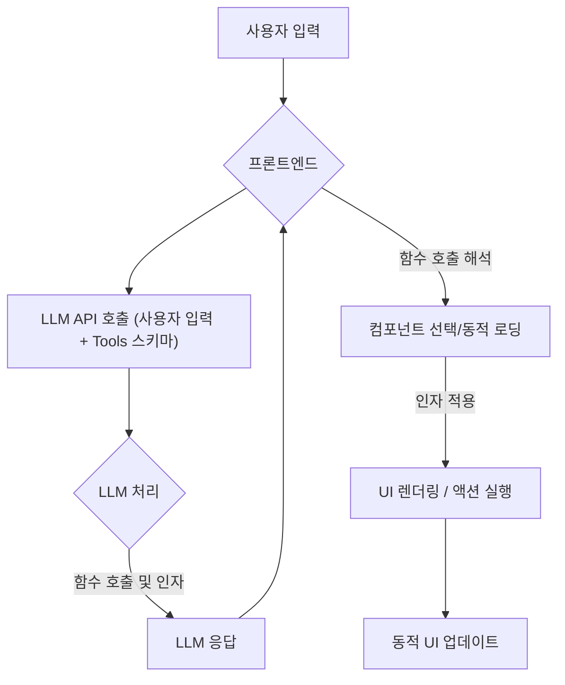

웹 프론트엔드 개발에서 LLM(Large Language Model)의 통합은 정적이고 미리 정의된 UI/UX의 한계를 넘어 사용자 경험을 혁신하는 중요한 전환점을 제시합니다. 기존의 프론트엔드 아키텍처는 대부분 정해진 데이터 구조와 템플릿에 기반하여 UI를 렌더링했지만, LLM은 사용자 입력, 컨텍스트, 의도에 따라 완전히 새로운 UI 요소, 레이아웃, 심지어 인터랙션 플로우를 동적으로 생성하고 조작할 수 있는 잠재력을 제공합니다. 이는 단순한 개인화를 넘어, 마치 살아있는 것처럼 사용자의 요구에 즉각적으로 반응하고 진화하는 인터페이스 구현을 가능하게 합니다.

## LLM 기반 동적 UI/UX 컴포넌트 구현 핵심 패턴

LLM을 프론트엔드에 통합하여 동적 UI를 구현하는 방식은 다양하며, 주로 LLM이 UI 생성을 위해 어떤 종류의 출력을 생성하고, 프론트엔드에서 이를 어떻게 해석하고 렌더링하는지에 따라 패턴이 구분됩니다.

### 1. 함수 호출 (Function Calling) 기반 컴포넌트 오케스트레이션
이 패턴은 LLM이 직접 UI 코드를 생성하기보다는, 특정 UI 컴포넌트를 렌더링하거나 특정 액션을 수행하도록 지시하는 '함수 호출' 형식의 구조화된 데이터를 생성하는 방식입니다. 프론트엔드 애플리케이션은 LLM으로부터 받은 함수 호출을 해석하여, 미리 정의된 컴포넌트 라이브러리에서 적절한 컴포넌트를 선택하고, 전달된 인자를 사용하여 렌더링합니다. 이는 LLM의 환각(hallucination) 위험을 줄이고, 프론트엔드의 제어력을 유지하면서 동적인 동작을 구현하는 데 효과적입니다.

#### 동작 흐름
1.  **사용자 입력**: 프론트엔드에서 사용자의 자연어 입력이 LLM API로 전송됩니다.
2.  **LLM 처리**: LLM은 사용자 입력을 분석하고, 정의된 `tools` (함수 스키마)를 기반으로 호출할 함수와 인자를 결정하여 응답합니다.
3.  **프론트엔드 해석**: 프론트엔드는 LLM 응답에서 함수 호출을 감지하고, 해당 함수 이름과 인자를 파싱합니다.
4.  **컴포넌트 렌더링/액션**: 파싱된 함수 호출에 따라 미리 정의된 React 컴포넌트나 Vue 컴포넌트를 동적으로 렌더링하거나, 특정 클라이언트 측 로직을 실행합니다.

### 2. 스트리밍 HTML / 마크다운 렌더링
LLM이 HTML 스니펫이나 마크다운 텍스트를 직접 생성하여 스트리밍 방식으로 프론트엔드에 전달하는 패턴입니다. 이 방식은 LLM이 생성하는 내용을 그대로 UI에 반영할 수 있어 유연성이 높지만, 보안 및 스타일 일관성 관리가 중요합니다. Next.js의 Server Components나 RSC(React Server Components)와 같은 기술은 이러한 스트리밍 방식의 동적 UI 생성을 더욱 효과적으로 지원합니다.

#### 동작 흐름
1.  **사용자 입력**: 프론트엔드에서 LLM API로 사용자 입력 전송.
2.  **LLM HTML/Markdown 생성**: LLM이 컨텍스트에 맞는 HTML 또는 마크다운 형식의 UI 콘텐츠를 생성하여 스트리밍으로 응답합니다.
3.  **프론트엔드 스트리밍 렌더링**: 프론트엔드는 수신되는 HTML/마크다운 스트림을 점진적으로 파싱하고 DOM에 추가하여 UI를 업데이트합니다.

### 3. 구조화된 UI 스키마 생성 및 해석
이 패턴에서는 LLM이 UI 컴포넌트의 추상적인 구조를 나타내는 JSON 스키마 (예: `type`, `props`, `children`을 포함하는 객체 배열)를 생성합니다. 프론트엔드는 이 스키마를 기반으로 런타임에 실제 UI 컴포넌트를 구성하고 렌더링하는 범용적인 렌더링 엔진을 가집니다. 이는 높은 유연성을 제공하면서도 LLM이 임의의 HTML을 생성하는 위험을 줄일 수 있습니다.

#### 동작 흐름
1.  **사용자 입력**: 프론트엔드에서 LLM API로 사용자 입력 전송.
2.  **LLM UI 스키마 생성**: LLM은 사용자 의도에 따라 UI 구조를 표현하는 JSON 스키마를 생성하여 응답합니다.
3.  **프론트엔드 스키마 해석**: 프론트엔드는 수신된 JSON 스키마를 기반으로, 사전에 정의된 컴포넌트 매핑 규칙에 따라 실제 React/Vue 컴포넌트 인스턴스를 생성하고 속성을 부여합니다.
4.  **동적 컴포넌트 렌더링**: 생성된 컴포넌트 인스턴스들을 조합하여 UI를 렌더링합니다.

## 2026년 최신 트렌드 반영

LLM 기반 동적 UI/UX 구현은 2026년에도 빠르게 진화하고 있습니다. 주요 트렌드는 다음과 같습니다.

*   **멀티모달 LLM 통합**: 텍스트뿐만 아니라 이미지, 음성, 비디오 등 다양한 양식의 입력을 이해하고, 이를 바탕으로 UI를 동적으로 생성하는 복합적인 경험이 중요해지고 있습니다. 예를 들어, 사용자가 이미지를 업로드하고 