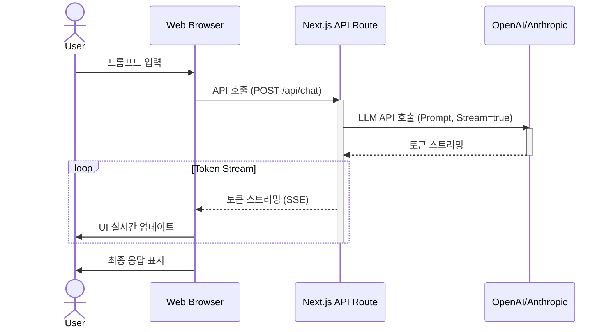

웹 프론트엔드에서 대규모 언어 모델(LLM)을 활용한 인터랙티브 사용자 인터페이스(UI)는 2026년 이후 사용자 경험의 핵심 요소입니다. LLM 기반 UI는 단순히 정보를 제공하는 것을 넘어, 사용자의 의도를 이해하고 맥락에 맞는 동적인 상호작용을 제공함으로써 초개인화된 경험과 복잡한 문제 해결 능력을 가능하게 합니다.

## LLM 기반 인터랙티브 UI의 핵심 원리

LLM 기반 인터랙티브 UI 구현의 핵심은 `비동기 통신`, `스트리밍`, 그리고 `강력한 상태 관리`입니다.

### 비동기 통신 및 스트리밍
LLM 호출은 네트워크 지연 시간으로 인해 본질적으로 비동기적입니다. 사용자에게 즉각적인 피드백을 제공하고 대기 시간을 줄이기 위해 `스트리밍` 기술(Server-Sent Events 또는 WebSocket)이 필수적입니다. LLM의 응답을 토큰 단위로 실시간으로 받아와 UI에 반영함으로써, 사용자는 마치 LLM이 생각하는 과정을 지켜보는 듯한 부드러운 경험을 할 수 있습니다. 이는 AI의 응답성을 극대화하여 `perceived latency`를 줄입니다.

### 컨텍스트 및 상태 관리
LLM 기반 UI는 사용자의 입력, LLM의 응답, 대화의 맥락(Context), 그리고 UI 자체의 로딩 상태 등 다양한 상태를 관리해야 합니다. 특히 대화형 UI에서는 이전 대화 내용을 효과적으로 관리하여 LLM에 전달하는 `컨텍스트 엔지니어링`이 중요합니다. React의 `useState`, `useReducer`, `React Context API` 등 프론트엔드 상태 관리 도구를 활용하여 이러한 상태들을 일관성 있게 유지하고, UI 업데이트를 최적화해야 합니다.

## 아키텍처 패턴: 서버사이드 프록시

LLM과 프론트엔드를 통합하는 가장 일반적이고 권장되는 방식은 `서버사이드 프록시 패턴`입니다. 프론트엔드에서 직접 LLM API를 호출하는 것은 API 키 노출 위험, CORS 문제, 비용 제어 및 로깅의 어려움 등 여러 보안 및 운영 문제를 야기합니다. 대신, 프론트엔드는 자체 백엔드 API (예: Next.js API Routes, Node.js Express 서버)를 호출하고, 이 백엔드 서버가 LLM 공급자(OpenAI, Anthropic 등)의 API를 호출하여 응답을 프론트엔드로 스트리밍합니다.



## 구현 예시 (Next.js & React 핵심 발췌)

### 1. Next.js API Route (`app/api/chat/route.ts`)
LLM으로부터 스트리밍 응답을 받아 프론트엔드로 Server-Sent Events (SSE) 형식으로 전달하는 백엔드 로직의 핵심입니다.

```typescript
import { OpenAIStream, StreamingTextResponse } from 'ai'; // Vercel AI SDK 사용 예시
import OpenAI from 'openai';

const openai = new OpenAI({ apiKey: process.env.OPENAI_API_KEY });

export async function POST(req: Request) {
  const { messages } = await req.json();

  const response = await openai.chat.completions.create({
    model: 'gpt-4o',
    stream: true,
    messages,
  });

  // 응답을 StreamingTextResponse로 변환하여 프론트엔드로 전달
  const stream = OpenAIStream(response);
  return new StreamingTextResponse(stream);
}
```

### 2. 프론트엔드 컴포넌트 (React)
`fetch` API와 `ReadableStream`을 사용하여 백엔드로부터 스트리밍 응답을 비동기적으로 읽어와 UI를 업데이트하는 핵심 로직입니다.

```typescript
import React, { useState } from 'react';

export default function ChatInterface() {
  const [currentResponse, setCurrentResponse] = useState('');
  const [isLoading, setIsLoading] = useState(false);

  const handleStreamedFetch = async (prompt: string) => {
    setIsLoading(true);
    setCurrentResponse('');

    try {
      const response = await fetch('/api/chat', {
        method: 'POST',
        headers: { 'Content-Type': 'application/json' },
        body: JSON.stringify({ messages: [{ role: 'user', content: prompt }] }),
      });

      if (!response.body) throw new Error('Response body is null');

      const reader = response.body.getReader();
      const decoder = new TextDecoder();
      let done = false;

      while (!done) {
        const { value, done: readerDone } = await reader.read();
        done = readerDone;
        const chunk = decoder.decode(value, { stream: true });
        // Vercel AI SDK는 chunk마다 완결된 텍스트를 보내므로, 단순히 이어붙임
        setCurrentResponse(prev => prev + chunk);
      }
    } catch (error) {
      console.error('Error fetching stream:', error);
      setCurrentResponse('오류 발생: ' + (error as Error).message);
    } finally {
      setIsLoading(false);
    }
  };

  return (
    <div>
      <button onClick={() => handleStreamedFetch('안녕하세요. 자신을 소개해주세요.')} disabled={isLoading}>
        AI 응답 요청
      </button>
      <div>{isLoading ? 'Thinking...' : currentResponse}</div>
    </div>
  );
}
```

## 2026년 최신 트렌드 반영

*   **에이전트 기반 UI (Agentic UI)**: 사용자의 목표를 이해하고 여러 도구(Tools)를 자율적으로 활용하는 에이전트 기반 UI가 주류가 됩니다. 프론트엔드는 에이전트의 상태와 행동 계획을 시각화하여 투명성을 제공합니다.
*   **멀티모달 인터랙션**: 텍스트, 음성, 이미지, 비디오 입출력을 지원하는 멀티모달 LLM 확산에 따라, 프론트엔드는 다양한 모달리티를 자연스럽게 통합하고 시각화하는 기술이 요구됩니다.
*   **온디바이스 LLM 및 엣지 컴퓨팅**: 브라우저에서 경량 LLM을 직접 실행하거나 엣지 서버를 통한 추론으로 지연 시간 단축 및 개인정보 보호를 강화합니다.
*   **개인화 및 적응형 UI**: LLM이 사용자의 행동 패턴을 학습하여 UI를 동적으로 재구성하고, 개인에게 최적화된 경험을 제공하는 적응형 UI가 중요해집니다.

## 트레이드오프

LLM 기반 인터랙티브 UI 구현 시 고려해야 할 주요 트레이드오프는 다음과 같습니다:

*   **`클라이언트사이드 vs. 서버사이드 LLM 추론`**: 
    *   **언제 좋고**: 클라이언트사이드(WebGPU 기반 경량 모델)는 개인정보 보호 강화 및 오프라인 작동에 유리합니다. 
    *   **언제 나쁜지**: 모델 크기가 커질수록 리소스 제약이 커지고, 보안에 민감한 데이터나 고성능 모델 사용에는 부적합합니다.

*   **`스트리밍 vs. 일괄 응답`**: 
    *   **언제 좋고**: 스트리밍은 사용자에게 즉각적인 피드백을 제공하여 응답성과 만족도를 높이고, 대화형 인터페이스에 필수적입니다.
    *   **언제 나쁜지**: 구현 복잡성이 증가하며, 네트워크 불안정 시 에러 핸들링이 더 어려워질 수 있습니다. 단순 질의-응답 시스템에서는 오버헤드가 될 수 있습니다.

*   **`프롬프트 엔지니어링 vs. 모델 파인튜닝`**: 
    *   **언제 좋고**: 프롬프트 엔지니어링은 빠르고 유연하게 LLM 행동을 제어할 수 있으며, 데이터셋 구축 비용이 적어 빠른 프로토타이핑에 적합합니다.
    *   **언제 나쁜지**: 복잡하거나 매우 특화된 작업에는 한계가 있으며, 일관성 없는 응답을 생성할 수 있습니다. 특정 도메인에 대한 깊은 지식 학습에는 비효율적입니다.

## 실전 체크리스트

LLM 기반 인터랙티브 UI를 프로젝트에 성공적으로 적용하기 위한 체크리스트입니다.

- [ ] LLM API 호출 지연 시간(latency)을 측정하고, 사용자 경험 목표(예: 3초 이내 초기 응답) 대비 벤치마킹을 완료했는가?
- [ ] 스트리밍 응답(Server-Sent Events 또는 WebSockets)을 백엔드와 프론트엔드에 걸쳐 구현했으며, UI에 토큰 단위로 부드럽게 통합되었는지 확인했는가?
- [ ] LLM 응답 실패 또는 지연 시 사용자에게 명확한 피드백을 제공하는 에러 핸들링 로직을 구현했는가?
- [ ] 중요한 사용자 개인 식별 정보(PII) 또는 민감 데이터가 LLM 프롬프트에 직접 포함되지 않도록 데이터 Sanitization 및 Guardrails를 백엔드에 설정했는가?
- [ ] 사용자 입력에 대한 검증 및 악의적인 프롬프트 주입(Prompt Injection) 시도를 방어하기 위한 메커니즘을 백엔드에 구축했는가?
- [ ] LLM 응답의 정확성, 일관성, 유해성 등을 주기적으로 평가하는 자동화된 테스트 파이프라인(예: RAGAS, LLM Evals)을 구축했는가?
- [ ] LLM 사용량 및 관련 비용을 실시간으로 모니터링하는 시스템을 구축하고, 예기치 않은 비용 발생 시 알림을 받을 수 있도록 설정했는가?