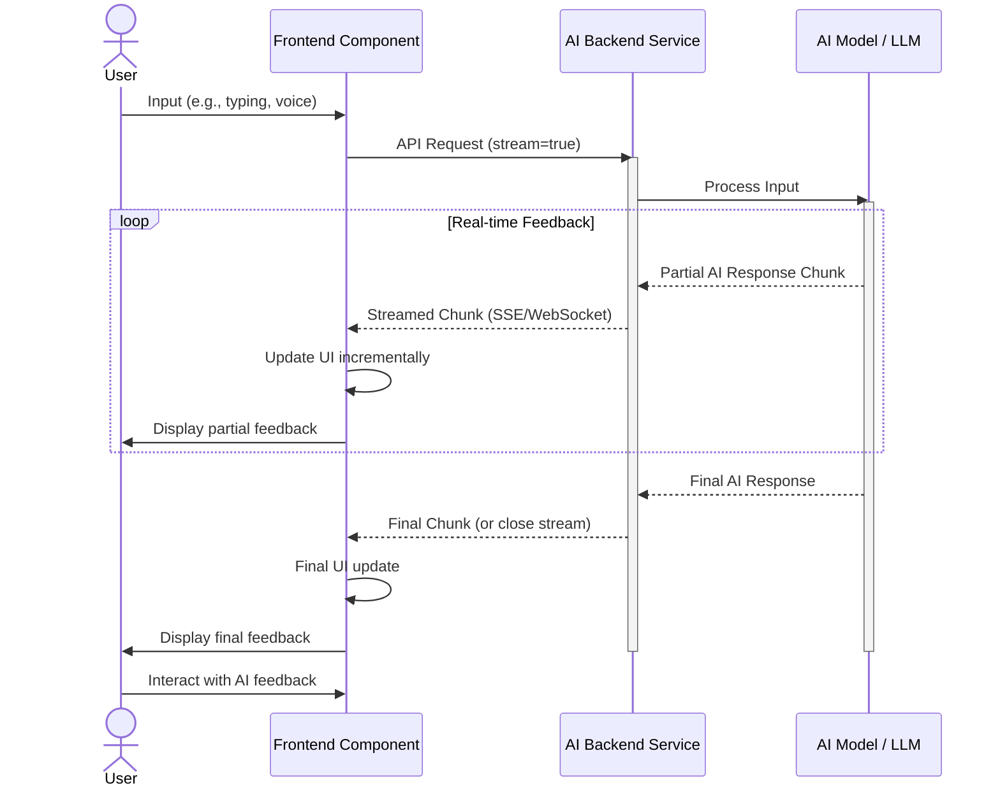

## 실시간 AI 피드백을 활용한 인터랙티브 프론트엔드 컴포넌트 개발

현대 웹 애플리케이션에서 사용자 경험(UX)은 단순한 정적 인터페이스를 넘어 동적이고 개인화된 상호작용으로 진화하고 있습니다. 특히 2026년 현재, 인공지능(AI)의 발전은 이러한 변화를 가속화하며, 실시간 AI 피드백을 프론트엔드 컴포넌트에 통합하는 것은 사용자 참여와 만족도를 극대화하는 핵심 전략이 되었습니다. 이 엔트리에서는 실시간 AI 응답을 프론트엔드 UI/UX에 효과적으로 통합하는 구체적인 방법론을 다룹니다.

### 핵심 개념 및 아키텍처

실시간 AI 피드백은 사용자의 입력이나 행동에 대해 AI가 즉각적으로 분석하고, 그 결과를 UI에 반영하여 연속적인 상호작용을 가능하게 하는 것을 의미합니다. 이는 주로 다음과 같은 기술적 구성 요소를 포함합니다.

1.  **비동기 AI 통신 (Asynchronous AI Communication)**: AI 모델과의 통신은 주로 HTTP Streaming (SSE: Server-Sent Events) 또는 WebSocket을 통해 이루어집니다. 이를 통해 AI가 응답을 생성하는 동안 프론트엔드는 지속적으로 데이터를 수신하고 UI를 업데이트할 수 있습니다.
2.  **프론트엔드 상태 관리 (Frontend State Management)**: AI로부터 스트리밍되는 데이터를 효율적으로 관리하고, UI 컴포넌트의 상태를 동적으로 업데이트하는 메커니즘이 필요합니다. React의 `useState`, `useReducer`, 또는 Redux, Zustand와 같은 전역 상태 관리 라이브러리가 활용됩니다.
3.  **낙관적 UI 업데이트 (Optimistic UI Updates)**: 사용자 액션에 대해 AI 응답을 기다리지 않고, 가장 가능성 높은 결과를 즉시 UI에 반영하여 사용자에게 즉각적인 피드백을 제공합니다. 이후 AI 응답으로 실제 데이터를 업데이트하거나 필요시 롤백합니다.
4.  **피드백 루프 디자인 (Feedback Loop Design)**: AI의 제안, 교정, 자동 완성 등을 사용자에게 명확하고 직관적으로 제시하는 UI/UX 패턴을 설계합니다. 예를 들어, 타이핑 중 실시간 문법 교정, 코드 자동 완성, 대화형 에이전트의 점진적 응답 표시 등이 있습니다.
5.  **지연 시간 관리 (Latency Management)**: AI 추론 및 네트워크 지연을 최소화하기 위한 전략이 중요합니다. Edge AI 또는 on-device LLM (Local Language Model)의 활용, 백엔드의 효율적인 API 게이트웨이 및 캐싱, 그리고 프론트엔드에서의 로딩 스켈레톤, 진행률 표시 등이 포함됩니다.

#### 실시간 AI 피드백 워크플로우

다음 Mermaid 시퀀스 다이어그램은 일반적인 실시간 AI 피드백 워크플로우를 보여줍니다.



### 코드 예제: React + Server-Sent Events

아래는 React 컴포넌트에서 Server-Sent Events (SSE)를 통해 실시간 AI 응답을 처리하는 간소화된 예제입니다. 이 예제는 사용자가 텍스트를 입력하면, AI 백엔드로부터 실시간으로 스트리밍되는 응답을 받아 화면에 점진적으로 표시합니다.

```typescript
// src/components/RealtimeAiInput.tsx
import React, { useState, useRef, useEffect, useCallback } from 'react';

interface RealtimeAiInputProps {
  aiEndpoint: string;
}

const RealtimeAiInput: React.FC<RealtimeAiInputProps> = ({ aiEndpoint }) => {
  const [inputValue, setInputValue] = useState('');
  const [aiResponse, setAiResponse] = useState('');
  const [isLoading, setIsLoading] = useState(false);
  const eventSourceRef = useRef<EventSource | null>(null);

  const handleInputChange = (e: React.ChangeEvent<HTMLTextAreaElement>) => {
    setInputValue(e.target.value);
  };

  const startStreaming = useCallback(async (text: string) => {
    if (!text.trim()) return;

    setIsLoading(true);
    setAiResponse(''); // Clear previous response

    if (eventSourceRef.current) {
      eventSourceRef.current.close();
    }

    // Encode the input text for URL safety
    const encodedText = encodeURIComponent(text);
    const url = `${aiEndpoint}?prompt=${encodedText}`;

    eventSourceRef.current = new EventSource(url);

    eventSourceRef.current.onmessage = (event) => {
      const data = JSON.parse(event.data);
      if (data.type === 'chunk') {
        setAiResponse((prev) => prev + data.content);
      } else if (data.type === 'end') {
        setIsLoading(false);
        eventSourceRef.current?.close();
      }
    };

    eventSourceRef.current.onerror = (error) => {
      console.error('SSE error:', error);
      setIsLoading(false);
      eventSourceRef.current?.close();
    };

  }, [aiEndpoint]);

  const handleSend = () => {
    startStreaming(inputValue);
  };

  useEffect(() => {
    // Cleanup EventSource on component unmount
    return () => {
      if (eventSourceRef.current) {
        eventSourceRef.current.close();
      }
    };
  }, []);

  return (
    <div className="ai-input-container">
      <textarea
        value={inputValue}
        onChange={handleInputChange}
        placeholder="Type your message here..."
        rows={5}
        style={{ width: '100%', marginBottom: '10px' }}
      />
      <button onClick={handleSend} disabled={isLoading}>
        {isLoading ? 'Generating...' : 'Send to AI'}
      </button>
      <div className="ai-response-area" style={{ marginTop: '20px', border: '1px solid #ccc', padding: '10px', minHeight: '100px' }}>
        {isLoading && aiResponse.length === 0 ? (
          <div className="skeleton-loader">Thinking...</div>
        ) : (
          <p>{aiResponse}</p>
        )}
      </div>
    </div>
  );
};

export default RealtimeAiInput;

// Backend example (Node.js with Express and SSE)
/*
const express = require('express');
const cors = require('cors');
const app = express();

app.use(cors()); // Enable CORS for frontend requests

app.get('/ai-stream', async (req, res) => {
  res.setHeader('Content-Type', 'text/event-stream');
  res.setHeader('Cache-Control', 'no-cache');
  res.setHeader('Connection', 'keep-alive');
  res.flushHeaders(); // Send headers immediately

  const prompt = req.query.prompt || 'Tell me a story.';
  console.log(`Received prompt: ${prompt}`);

  // Simulate AI generating response chunks
  const words = `AI is currently processing your request for: "${prompt}". This is a simulated real-time response. Expect more content soon. The AI is now providing further details and context. We hope this enhances your interactive experience.`.split(' ');

  for (let i = 0; i < words.length; i++) {
    await new Promise(resolve => setTimeout(resolve, 100)); // Simulate AI processing delay
    const chunk = { type: 'chunk', content: words[i] + ' ' };
    res.write(`data: ${JSON.stringify(chunk)}\n\n`);
  }

  const endMessage = { type: 'end', content: 'Stream ended.' };
  res.write(`data: ${JSON.stringify(endMessage)}\n\n`);
  res.end();
});

const PORT = process.env.PORT || 3001;
app.listen(PORT, () => console.log(`Backend server listening on port ${PORT}`));
*/
```

이 예제는 EventSource API를 사용하여 AI 백엔드(`aiEndpoint`)로부터 스트리밍되는 `chunk` 타입의 메시지를 받아 `aiResponse` 상태에 추가하여 UI를 점진적으로 업데이트합니다. `isLoading` 상태를 통해 로딩 스켈레톤이나 진행 상황을 표시할 수 있습니다. 백엔드 코멘트는 Node.js 환경에서 SSE를 시뮬레이션하는 간단한 Express 서버의 예시를 보여줍니다.

### 2026년 최신 트렌드 반영

*   **On-Device AI 및 Edge Computing**: 클라이언트 디바이스 자체에서 경량 AI 모델(e.g., Gemini Nano, Llama 3 Mobile)을 실행하여 네트워크 지연을 줄이고 개인 정보 보호를 강화하는 추세입니다. 프론트엔드는 웹 어셈블리(WebAssembly)나 특정 플랫폼(e.g., Android Jetpack Compose AI)의 API를 통해 이러한 모델과 상호작용합니다.
*   **Multimodal Interaction**: 텍스트뿐만 아니라 음성, 이미지, 비디오 등 다양한 형태의 입력을 AI가 처리하고, 그에 상응하는 멀티모달 피드백을 UI에 제공하는 복합적인 상호작용 패턴이 중요해지고 있습니다. 이는 사용자 경험을 더욱 풍부하게 만듭니다.
*   **Agentic UX**: AI 에이전트가 사용자의 목표를 이해하고, 여러 단계를 거쳐 자율적으로 작업을 수행하며, 그 진행 상황과 중간 결과를 UI를 통해 사용자에게 투명하게 보여주는 Agentic UX가 부상하고 있습니다. 프론트엔드 컴포넌트는 이러한 에이전트의 '생각' 과정과 '행동'을 시각화하는 역할을 합니다.
*   **Contextual Adaptability**: AI는 사용자의 현재 상황, 과거 행동, 선호도 등을 종합적으로 파악하여 UI 컴포넌트의 동작이나 콘텐츠를 실시간으로 조절합니다. 예를 들어, 사용자의 감정 상태에 따라 텍스트 필드의 제안 내용이 달라지거나, 작업 흐름에 맞춰 필요한 도구를 자동으로 활성화하는 식입니다.

## 트레이드오프

실시간 AI 피드백 컴포넌트 개발에는 여러 트레이드오프가 존재하며, 프로젝트의 요구사항에 따라 적절한 균형점을 찾아야 합니다.

*   **낮은 지연 시간 (Low Latency) vs. 응답 정확도 (Accuracy)**
    *   **좋을 때**: 사용자에게 즉각적인 반응성을 제공하여 유동적인 경험(e.g., 실시간 검색 제안, 대화형 에이전트)이 중요할 때 유리합니다. 사용자는 기다림 없이 작업 흐름을 유지할 수 있습니다.
    *   **나쁠 때**: AI 모델의 추론 시간이 길어지거나 복잡한 로직을 요구하는 경우, 낮은 지연 시간을 위해 모델의 정확도를 희생해야 할 수 있습니다. 민감한 정보나 중요한 의사 결정에 사용되는 피드백에는 부적합할 수 있습니다.

*   **프론트엔드 개발 복잡도 (Frontend Complexity) vs. 풍부한 사용자 경험 (Rich UX)**
    *   **좋을 때**: 동적이고 예측 불가능한 AI 응답을 효과적으로 시각화하고 관리하여 사용자에게 혁신적인 경험을 제공하고자 할 때 강력합니다. 기존의 정적 UI로는 불가능한 상호작용이 가능합니다.
    *   **나쁠 때**: 실시간 스트리밍 데이터 처리, 상태 관리, 에러 핸들링, 낙관적 UI 업데이트 등 프론트엔드 로직이 매우 복잡해지므로 개발 및 유지보수 비용이 증가합니다. 단순한 정보 표시가 주 목적인 애플리케이션에는 과도한 오버헤드입니다.

*   **API 호출 비용 (API Cost) vs. 실시간성 (Real-timeness)**
    *   **좋을 때**: 사용자 경험의 가치가 API 호출 비용보다 훨씬 클 때(e.g., 고객 서비스 챗봇, 전문 글쓰기 도우미) 합리적입니다. 프리미엄 서비스나 핵심 기능에 적용할 수 있습니다.
    *   **나쁠 때**: 대규모 사용자 기반을 가진 서비스에서 모든 상호작용에 실시간 AI 피드백을 적용하면 API 호출 비용이 기하급수적으로 증가할 수 있습니다. 비용 효율성이 중요한 경우, 배치 처리나 캐싱 전략을 고려해야 합니다.

*   **AI 자율성 (AI Autonomy) vs. 사용자 제어 (User Control)**
    *   **좋을 때**: AI가 사용자의 의도를 명확히 파악하고 대부분의 작업을 대신 처리할 수 있는 시나리오(e.g., 스마트 어시스턴트)에서 효율성을 극대화합니다.
    *   **나쁠 때**: 사용자가 AI의 제안이나 자동 수정에 대한 통제권을 잃는다고 느낄 수 있습니다. 특히 창작 활동이나 중요한 결정 과정에서는 AI가 지나치게 개입하지 않도록 사용자에게 명확한 선택권과 수정 기회를 제공해야 합니다.

## 실전 체크리스트

실시간 AI 피드백 컴포넌트를 프로젝트에 적용할 때 다음 항목들을 검증하여 성공적인 통합을 보장합니다.

- [ ] **AI API 지연 시간 측정 및 목표 설정 완료**: AI 백엔드의 평균 응답 지연 시간(TTFT: Time To First Token, TTTL: Time To Last Token)을 측정하고, 사용자 경험 목표에 부합하는 허용 지연 시간을 정의했는가?
- [ ] **스트리밍 프로토콜 (SSE/WebSocket) 구현 및 테스트 완료**: 백엔드와 프론트엔드 간의 실시간 데이터 스트리밍이 안정적으로 작동하며, 연결 끊김 및 재연결 로직이 올바르게 처리되는지 확인했는가?
- [ ] **UI/UX 피드백 패턴 디자인 적용 완료**: AI 응답이 점진적으로 표시될 때의 시각적 요소(e.g., 타이핑 애니메이션, 스켈레톤 UI), AI 제안의 강조 방식, 사용자 수정/수락 메커니즘이 명확하게 설계되었는가?
- [ ] **AI 응답 에러 핸들링 및 폴백 로직 구현 완료**: AI 모델의 오류, 네트워크 문제, 응답 시간 초과 등 예외 상황에 대한 사용자 친화적인 에러 메시지 및 폴백(fallback) 메커니즘(e.g., 수동 입력 전환)이 구현되었는가?
- [ ] **프론트엔드 상태 관리 최적화 완료**: AI 스트리밍 데이터의 양이 많아질 경우, UI 업데이트로 인한 성능 저하를 방지하기 위해 불필요한 리렌더링을 최소화하고 상태 업데이트 로직을 최적화했는가?
- [ ] **사용자 제어 및 오버라이드 (Override) 기능 제공 완료**: AI의 제안이 항상 정확하지 않을 수 있음을 인지하고, 사용자가 AI의 피드백을 쉽게 무시하거나 수정할 수 있는 명확한 UI 요소를 제공하는가?
- [ ] **AI 개인 정보 보호 및 보안 가이드라인 준수 확인**: 사용자의 입력 데이터가 AI 백엔드로 전송될 때의 암호화, 데이터 보존 정책, 그리고 AI 응답이 민감한 정보를 노출하지 않도록 하는 보안 조치들을 검토하고 적용했는가?