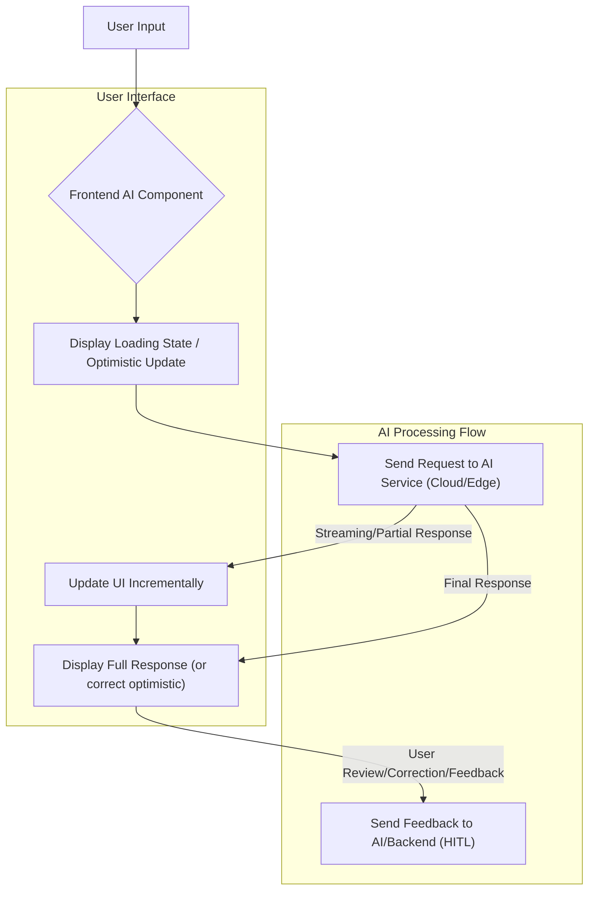

프론트엔드 AI 프로젝트의 성공은 단순히 강력한 AI 모델을 통합하는 것을 넘어, 사용자 경험(UX)을 최우선으로 고려한 디자인에 달려 있습니다. 특히 실시간 사용자 상호작용이 필요한 AI 기능에서는 프론트엔드 컴포넌트의 설계가 핵심적인 역할을 합니다. 본 문서에서는 사용자 친화적인 실시간 AI 상호작용을 위한 프론트엔드 디자인 패턴과 구현 전략을 소개합니다.

## 핵심 개념: 사용자 경험 중심 AI

AI 기능은 사용자에게 마치 마법처럼 느껴질 수 있지만, 불투명하거나 느리다면 실망감을 안겨줄 수 있습니다. 2026년 현재, 사용자들은 AI가 단순한 도구가 아닌, 직관적이고 즉각적인 반응을 제공하는 협력자이기를 기대합니다. 이는 AI의 응답이 실시간으로 시각화되고, 사용자가 AI의 작동 방식을 이해하며, 필요할 때 제어할 수 있는 컴포넌트 디자인을 요구합니다. 특히 LLM(Large Language Model) 기반의 서비스에서는 스트리밍 응답 처리가 필수적이며, 예측 기반 UI는 사용자 생산성을 크게 향상시킬 수 있습니다.

### 디자인 원칙

1.  **Responsiveness and Feedback (응답성 및 피드백)**: AI가 처리 중임을 명확히 알리고, 부분적인 결과라도 빠르게 사용자에게 전달하여 기다림을 최소화합니다.
2.  **Transparency and Control (투명성 및 제어)**: AI가 무엇을 하고 있는지, 어떤 데이터를 기반으로 하는지 사용자에게 보여주고, AI의 동작을 취소하거나 수정할 수 있는 수단을 제공합니다.
3.  **Progressive Enhancement (점진적 개선)**: AI 기능이 없어도 핵심 기능은 작동하도록 설계하고, AI는 추가적인 가치를 제공하는 레이어로 활용합니다.
4.  **Error Handling and Recovery (오류 처리 및 복구)**: AI 오류 발생 시 사용자에게 명확하게 알리고, 복구 옵션이나 대체 경로를 제시하여 불필요한 좌절을 방지합니다.

## 실시간 AI 컴포넌트 디자인 패턴

### 1. 스트리밍 UI (Streaming UI)

LLM과 같이 응답 생성에 시간이 걸리는 AI 모델에서 가장 중요한 패턴입니다. AI의 전체 응답이 완성될 때까지 기다리지 않고, 생성되는 즉시 텍스트나 결과물의 청크(chunk)를 점진적으로 사용자 인터페이스에 표시합니다. 이는 사용자 인지 지연(perceived latency)을 크게 줄이고, 상호작용성을 높입니다.

*   **기술**: 서버 센트 이벤트(SSE, Server-Sent Events) 또는 웹소켓(WebSockets)을 통해 AI 서비스에서 스트리밍 응답을 받고, 프론트엔드에서는 `ReadableStream` API와 `TextDecoder`를 활용하여 실시간으로 DOM을 업데이트합니다. React 18의 스트리밍 SSR(Server-Side Rendering) 및 `useTransition`, `useDeferredValue`와 같은 Hook도 스트리밍 경험을 최적화하는 데 도움이 됩니다.

### 2. 예측 및 예상 UI (Predictive / Anticipatory UI)

사용자의 다음 행동이나 입력 내용을 AI가 미리 예측하여 제시하는 패턴입니다. 예를 들어, 검색창에서 실시간 검색어 추천, 입력 중인 텍스트 자동 완성, 또는 디자인 도구에서 다음 작업 제안 등이 있습니다. 이는 사용자의 인지 부하를 줄이고 효율성을 높여줍니다.

*   **기술**: 사용자의 입력이나 컨텍스트 변화를 기반으로 Edge AI 모델(예: 웹어셈블리(WebAssembly) 기반 모델) 또는 경량화된 클라우드 AI 모델에 비동기 요청을 보내 예측 결과를 받습니다. 입력 디바운싱(debouncing) 또는 스로틀링(throttling)을 통해 과도한 API 호출을 방지해야 합니다.

### 3. Human-in-the-Loop (HITL) 컴포넌트

AI가 생성한 결과물을 사용자에게 검토 및 수정할 기회를 제공하는 패턴입니다. 특히 민감하거나 중요한 작업에서 AI의 오류를 방지하고 신뢰도를 높이는 데 필수적입니다. AI는 초안을 제공하고, 사용자가 최종 결정을 내립니다.

*   **기술**: AI 생성 결과물 옆에 명확한 '수정', '승인', '거부' 또는 '피드백 제공' 버튼을 배치합니다. 수정된 내용은 다시 AI 모델의 파인튜닝(fine-tuning) 데이터로 활용될 수 있는 피드백 루프를 구축하는 것이 중요합니다.

### 4. 낙관적 UI와 AI (Optimistic UI with AI)

사용자가 어떤 작업을 수행했을 때, AI 처리 결과가 확정되기 전에 먼저 성공적으로 변경된 UI를 보여주는 패턴입니다. 이후 AI 응답이 도착하면 최종 상태를 반영하거나, 실패 시 롤백(rollback)합니다. 즉각적인 피드백으로 사용자 만족도를 높일 수 있습니다.

*   **기술**: React의 `useOptimistic` 훅과 같이 UI 상태를 즉시 업데이트하고, 백그라운드에서 AI 호출을 비동기적으로 처리합니다. AI 호출이 성공하면 낙관적 업데이트를 확정하고, 실패하면 이전 상태로 되돌립니다.

### 5. 상황별 AI 피드백 (Contextual AI Feedback)

사용자가 현재 작업 중인 컨텍스트에 따라 관련성 높은 AI 제안이나 정보를 실시간으로 제공합니다. 예를 들어, 코드 에디터에서 코드 블록을 작성할 때 AI가 코드 스니펫을 제안하거나, 문서 작성 시 다음 문장을 추천하는 기능입니다.

*   **기술**: 사용자 입력 외에도 현재 페이지의 DOM 구조, 커서 위치, 선택된 텍스트 등의 프론트엔드 컨텍스트 정보를 AI 모델에 함께 전달합니다. 온디바이스(On-device) AI 모델을 활용하면 네트워크 지연 없이 빠른 컨텍스트 처리 및 피드백 제공이 가능합니다.

## 코드 예제: 실시간 스트리밍 AI 응답 컴포넌트

아래는 Next.js 환경에서 AI API로부터 스트리밍 응답을 받아 점진적으로 UI를 업데이트하는 React 컴포넌트의 예제입니다. 이 컴포넌트는 사용자가 프롬프트를 입력하면, AI 응답을 청크 단위로 받아와 `output` 상태를 업데이트하여 화면에 표시합니다.

```typescript
import React, { useState, useEffect } from 'react';

interface RealtimeAIOutputProps {
  prompt: string;
}

const RealtimeAIOutput: React.FC<RealtimeAIOutputProps> = ({ prompt }) => {
  const [output, setOutput] = useState('');
  const [isLoading, setIsLoading] = useState(false);
  const [error, setError] = useState<string | null>(null);

  useEffect(() => {
    if (!prompt) {
      setOutput('');
      return;
    }

    let controller: AbortController;
    const streamAiResponse = async () => {
      setIsLoading(true);
      setError(null);
      setOutput('');
      controller = new AbortController();
      const signal = controller.signal;

      try {
        const response = await fetch('/api/stream-ai-response', {
          method: 'POST',
          headers: { 'Content-Type': 'application/json' },
          body: JSON.stringify({ prompt }),
          signal,
        });

        if (!response.ok) {
          throw new Error(`HTTP error! status: ${response.status}`);
        }

        const reader = response.body?.getReader();
        if (!reader) {
          throw new Error('Failed to get readable stream reader.');
        }

        const decoder = new TextDecoder('utf-8');
        let done = false;

        while (!done) {
          const { value, done: readerDone } = await reader.read();
          done = readerDone;
          const chunk = decoder.decode(value, { stream: true });
          setOutput(prev => prev + chunk);
        }
      } catch (err: any) {
        if (err.name === 'AbortError') {
          console.log('Stream aborted');
        } else {
          console.error('Streaming error:', err);
          setError(`Error: ${err.message}`);
        }
      } finally {
        setIsLoading(false);
      }
    };

    streamAiResponse();

    return () => {
      if (controller) {
        controller.abort();
      }
    };
  }, [prompt]);

  return (
    <div className="ai-output-container">
      {isLoading && <p>AI is thinking...</p>}
      {error && <p className="error-message">{error}</p>}
      {!isLoading && !error && output && (
        <div className="ai-response-display">
          <h3>AI Response:</h3>
          <p>{output}</p>
        </div>
      )}
      {!output && !isLoading && !error && <p>Enter a prompt to see AI in action.</p>}
    </div>
  );
};

export default RealtimeAIOutput;
```

위 컴포넌트는 `/api/stream-ai-response` 엔드포인트에서 스트리밍 응답을 기대하며, 이는 다음 예시와 같이 구현될 수 있습니다 (Node.js/Express):

```typescript
// pages/api/stream-ai-response.ts (Next.js API Route example)
import type { NextApiRequest, NextApiResponse } from 'next';

export default async function handler(req: NextApiRequest, res: NextApiResponse) {
  if (req.method !== 'POST') {
    return res.status(405).json({ message: 'Method Not Allowed' });
  }

  const { prompt } = req.body;

  res.setHeader('Content-Type', 'text/event-stream');
  res.setHeader('Cache-Control', 'no-cache, no-transform');
  res.setHeader('Connection', 'keep-alive');

  // Simulate AI response streaming
  const stream = (async function* () {
    const fullResponse = `Here is a detailed response to your prompt: "${prompt}".\n\n`;
    const parts = [
      'The key challenge is ', 'integrating AI ', 'seamlessly into ', 'existing user flows. ',
      'This requires ', 'careful consideration ', 'of user expectations ', 'and feedback mechanisms. ',
      'Emerging trends ', 'like on-device AI ', 'and WebAssembly ', 'will further enhance ', 'real-time capabilities. '
    ];

    yield fullResponse;
    for (const part of parts) {
      await new Promise(resolve => setTimeout(resolve, Math.random() * 100 + 50)); // Simulate delay
      yield part;
    }
  })();

  for await (const chunk of stream) {
    res.write(chunk);
  }

  res.end();
}
```

## 실시간 AI 컴포넌트 상호작용 흐름

다음 Mermaid 다이어그램은 사용자의 입력이 실시간 AI 컴포넌트를 통해 처리되고 UI에 반영되는 일반적인 흐름을 시각화합니다.



## 트레이드오프

실시간 AI 컴포넌트 디자인 패턴은 강력하지만, 각각의 장단점을 명확히 이해하고 프로젝트의 요구사항에 맞춰 적용해야 합니다.

*   **스트리밍 UI**: 언제 좋은가: 응답 생성 시간이 긴 LLM 기반 애플리케이션에서 사용자 인지 지연을 최소화하고 싶을 때. 언제 나쁜가: 응답이 매우 짧거나 예측 가능하여 굳이 스트리밍 처리의 복잡성을 감수할 필요가 없을 때 (예: 간단한 분류 결과).
*   **예측/예상 UI**: 언제 좋은가: 사용자의 반복적인 작업이나 입력 흐름을 가속화하여 생산성을 높이고 싶을 때. 언제 나쁜가: 예측 정확도가 낮거나, 예측 결과가 사용자의 의도를 방해하거나 오해를 불러일으킬 가능성이 높을 때.
*   **Human-in-the-Loop (HITL)**: 언제 좋은가: AI 결과의 정확성이 매우 중요하거나, 사용자 개입을 통해 AI 모델을 지속적으로 개선하고자 할 때. 언제 나쁜가: 사용자의 개입이 빈번하여 피로도가 높아지거나, AI가 거의 완벽한 결과를 제공하여 사용자 개입이 불필요할 때.
*   **낙관적 UI (Optimistic UI)**: 언제 좋은가: AI 처리 지연이 발생할 수 있지만, 사용자에게 즉각적인 반응을 제공하여 유동적인 경험을 주고 싶을 때. 언제 나쁜가: AI 처리 실패 시 롤백 로직이 복잡하거나, 롤백 자체가 사용자에게 큰 혼란을 줄 수 있는 중요한 작업에 적용할 때.
*   **온디바이스 AI (On-device AI)**: 언제 좋은가: 네트워크 연결 없이 빠른 응답이 필요하거나, 사용자 데이터 프라이버시가 최우선일 때 (예: Gemini Nano, MediaPipe). 언제 나쁜가: 모델의 크기가 크거나 복잡하여 디바이스의 리소스 제약을 크게 받을 때, 또는 최신 모델 업데이트를 즉시 적용하기 어려울 때.

## 실전 체크리스트

실시간 사용자 상호작용을 위한 프론트엔드 AI 컴포넌트를 프로젝트에 적용할 때 다음 항목들을 검증합니다.

- [ ] **AI 응답 지연 시간 측정 및 시각화**: 각 AI 컴포넌트의 엔드 투 엔드(end-to-end) 응답 지연 시간을 측정하고, 로딩 스피너, 스켈레톤 UI, 또는 프로그레스 바 등으로 사용자에게 명확히 시각적 피드백을 제공하는가?
- [ ] **스트리밍 UI 구현 여부**: LLM과 같이 응답 생성에 시간이 걸리는 AI 기능에 대해 스트리밍 응답 처리를 구현하여 사용자 인지 지연을 최소화하는가?
- [ ] **명확한 오류 및 예외 처리**: AI 서비스 장애 또는 비정상적인 응답 발생 시, 사용자에게 명확한 오류 메시지를 표시하고, 재시도(retry) 옵션 또는 대체 경로를 제공하는가?
- [ ] **사용자 제어 및 개입 메커니즘**: AI가 생성한 결과물에 대한 사용자 수정, 취소, 또는 피드백 제출 기능을 명확하게 제공하여 Human-in-the-Loop 원칙을 따르는가?
- [ ] **성능 및 리소스 최적화**: 예측 AI 또는 온디바이스 AI 컴포넌트가 과도한 네트워크 요청이나 디바이스 리소스를 소비하지 않도록, 디바운싱, 스로틀링, Web Worker, 또는 WebAssembly와 같은 기술을 활용하여 최적화되어 있는가?
- [ ] **개인 정보 보호 및 보안 고려**: 온디바이스 AI 사용 여부와 관계없이 AI 컴포넌트가 사용자 데이터를 어떻게 처리하고 전송하는지 명확히 정의하고, 관련 개인 정보 보호 규정(예: GDPR, CCPA)을 준수하는가?
- [ ] **A/B 테스트 및 사용자 피드백 루프**: 다양한 AI 컴포넌트 디자인 패턴에 대한 A/B 테스트를 수행하고, 사용자 피드백을 수집하여 지속적으로 UX를 개선하는 루프가 구축되어 있는가?
