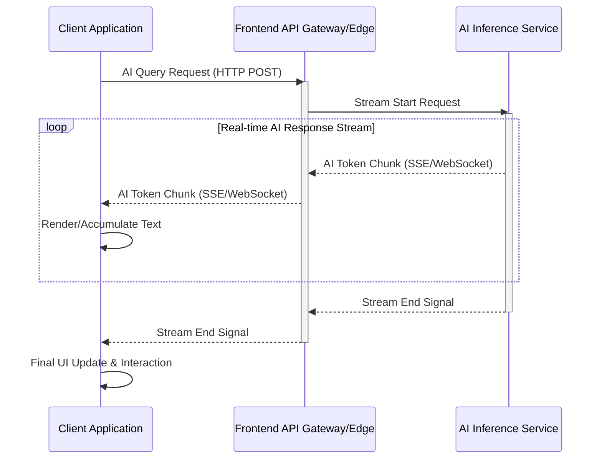

프론트엔드에서 AI 모델의 실시간 응답을 시각화하고 상호작용하는 기술은 사용자 경험(UX) 향상에 필수적입니다. 기존의 요청-응답(Request-Response) 방식은 AI 모델의 추론 시간이 길어질수록 사용자에게 지연감을 주지만, 스트리밍(Streaming) 방식은 응답이 생성되는 즉시 사용자에게 전달하여 즉각적인 피드백을 제공합니다. 이는 특히 대규모 언어 모델(Large Language Model, LLM)과의 상호작용에서 핵심적인 요소입니다. 사용자들은 AI가 정보를 생성하는 과정을 직접 보면서 대화의 흐름을 유지하고, 필요에 따라 즉시 개입하거나 다음 질문을 준비할 수 있습니다. 이는 AI 서비스의 전반적인 만족도와 참여도를 크게 높입니다.

## 스트리밍 인터페이스의 핵심 기술

프론트엔드에서 실시간 AI 응답을 처리하기 위한 주요 기술은 다음과 같습니다.

### Server-Sent Events (SSE)
SSE는 서버가 클라이언트에게 단방향으로 데이터를 스트리밍하는 데 사용됩니다. HTTP/2 프로토콜 위에서 동작하며, `EventSource` API를 통해 쉽게 구현할 수 있습니다. 각 메시지는 이벤트 스트림으로 전송되며, 재연결(reconnection) 메커니즘이 내장되어 있어 네트워크 단절 시 자동으로 연결을 복구합니다. LLM의 텍스트 토큰 스트리밍과 같이 서버에서 클라이언트로만 데이터가 흐르는 경우에 매우 효율적입니다.

### WebSockets
WebSocket은 클라이언트와 서버 간에 전이중(full-duplex) 통신 채널을 제공합니다. 이는 양방향 실시간 상호작용이 필요한 시나리오, 예를 들어 AI 봇과의 채팅에서 사용자가 중간에 메시지를 전송하거나, AI가 시각적 요소를 동적으로 업데이트해야 할 때 적합합니다. WebSocket은 HTTP 핸드셰이크(Handshake)를 통해 연결을 설정한 후 TCP 기반의 지속적인 연결을 유지합니다.

## 프론트엔드 구현 전략

현대 웹 프레임워크와 기술 스택은 실시간 스트리밍 구현을 더욱 용이하게 합니다.

### React의 `use` Hook과 Suspense
React 18 이상에서 도입된 `use` Hook과 Suspense는 비동기 데이터 처리를 간소화합니다. 특히 Next.js의 RSC (React Server Components)와 결합하면 서버에서 직접 데이터를 스트리밍하고, 클라이언트에서 점진적으로 UI를 렌더링할 수 있습니다. 이는 초기 로딩 시간을 줄이고 사용자에게 더 빠른 반응성을 제공합니다. 스트리밍 API 응답을 React 컴포넌트 내부에서 `use(promise)` 형태로 처리하고, `Suspense` 바운더리로 감싸면 데이터가 도착하기 전까지 로딩 스피너를 보여줄 수 있습니다.

### Next.js Server Actions 및 RSC
Next.js의 Server Actions는 클라이언트에서 서버 함수를 직접 호출할 수 있게 하여, 데이터 뮤테이션 및 스트리밍 응답 처리를 통합합니다. RSC는 서버에서 UI를 렌더링하고 스트리밍하여 클라이언트 측 JS 번들 크기를 줄이고 성능을 향상시킵니다. AI 응답 스트리밍과 함께 UI 업데이트를 서버에서 직접 조정하여 클라이언트에 전달하는 방식으로 응답성을 극대화할 수 있습니다.

## 실시간 AI 응답 시각화 및 상호작용

AI 스트리밍 응답은 단순히 텍스트를 나열하는 것을 넘어 사용자에게 의미 있는 시각적 피드백을 제공해야 합니다. 점진적으로 텍스트를 타이핑하는 효과, 중간에 이미지나 그래프 같은 멀티모달(multimodal) 응답 삽입, 사용자가 스트리밍 도중 AI의 답변을 중단하거나 수정할 수 있는 인터페이스 등이 포함됩니다. 2026년에는 WebAssembly 기반의 온디바이스(On-device) AI 모델과의 연동을 통해 일부 추론 작업을 클라이언트에서 직접 수행하고, 결과물을 서버 스트림과 병합하여 더욱 빠르고 개인화된 경험을 제공하는 트렌드가 부상할 것입니다. 또한, AI 에이전트(Agent)의 추론 과정을 시각적으로 단계별로 보여주는 ‘사고의 사슬’(Chain-of-Thought) 비주얼라이제이션도 사용자 신뢰를 높이는 중요한 요소가 됩니다.

## 코드 예제: SSE를 활용한 스트리밍 텍스트 처리 (React)

아래는 SSE를 사용하여 AI 모델로부터 텍스트 응답을 실시간으로 스트리밍받아 화면에 표시하는 간단한 React 컴포넌트 예제입니다.

```jsx
// components/AIStreamingChat.jsx
import React, { useState, useEffect, useRef } from 'react';

const AIStreamingChat = () => {
  const [chatHistory, setChatHistory] = useState([]);
  const [currentResponse, setCurrentResponse] = useState('');
  const [isLoading, setIsLoading] = useState(false);
  const eventSourceRef = useRef(null);

  const handleSendMessage = async (message) => {
    if (!message.trim()) return;

    setChatHistory(prev => [...prev, { role: 'user', content: message }]);
    setCurrentResponse('');
    setIsLoading(true);

    try {
      const response = await fetch('/api/chat-stream', {
        method: 'POST',
        headers: { 'Content-Type': 'application/json' },
        body: JSON.stringify({ prompt: message }),
      });

      if (!response.ok) {
        throw new Error(`HTTP error! status: ${response.status}`);
      }

      // SSE 연결 설정
      eventSourceRef.current = new EventSource('/api/chat-stream-sse');
      eventSourceRef.current.onmessage = (event) => {
        const data = JSON.parse(event.data);
        if (data.type === 'token') {
          setCurrentResponse(prev => prev + data.content);
        } else if (data.type === 'end') {
          setChatHistory(prev => [...prev, { role: 'ai', content: currentResponse }]);
          setCurrentResponse('');
          setIsLoading(false);
          eventSourceRef.current.close();
        }
      };

      eventSourceRef.current.onerror = (error) => {
        console.error('EventSource failed:', error);
        setIsLoading(false);
        eventSourceRef.current.close();
      };

    } catch (error) {
      console.error('Failed to send message:', error);
      setIsLoading(false);
    }
  };

  useEffect(() => {
    return () => {
      if (eventSourceRef.current) {
        eventSourceRef.current.close();
      }
    };
  }, []);

  return (
    <div className="chat-container">
      <div className="chat-history">
        {chatHistory.map((msg, index) => (
          <div key={index} className={`message ${msg.role}`}>
            {msg.content}
          </div>
        ))}
        {isLoading && currentResponse && (
          <div className="message ai current-streaming">
            {currentResponse} <span className="cursor">|</span>
          </div>
        )}
      </div>
      <form onSubmit={(e) => {
        e.preventDefault();
        const input = e.target.elements.messageInput;
        handleSendMessage(input.value);
        input.value = '';
      }}>
        <input type="text" name="messageInput" placeholder="Ask AI..." disabled={isLoading} />
        <button type="submit" disabled={isLoading}>Send</button>
      </form>
    </div>
  );
};

export default AIStreamingChat;
```

```javascript
// pages/api/chat-stream-sse.js (Next.js API Route example)
export default function handler(req, res) {
  res.setHeader('Content-Type', 'text/event-stream');
  res.setHeader('Cache-Control', 'no-cache');
  res.setHeader('Connection', 'keep-alive');
  res.setHeader('X-Accel-Buffering', 'no'); // Disable buffering for Nginx

  // For demonstration, simulate streaming AI response
  let counter = 0;
  const intervalId = setInterval(() => {
    const tokens = [
      { type: 'token', content: '안녕하세요' },
      { type: 'token', content: ',' },
      { type: 'token', content: ' AI입니다' },
      { type: 'token', content: '.' },
      { type: 'token', content: ' 무엇을' },
      { type: 'token', content: ' 도와드릴까요' },
      { type: 'token', content: '?' },
      { type: 'end' }
    ];

    if (counter < tokens.length) {
      res.write(`data: ${JSON.stringify(tokens[counter])}\n\n`);
      counter++;
    } else {
      clearInterval(intervalId);
      res.end(); // End the stream
    }
  }, 200);

  req.on('close', () => {
    clearInterval(intervalId);
    res.end();
  });
}
```

## AI 스트리밍 데이터 흐름 다이어그램

Mermaid 다이어그램을 통해 AI 응답 스트리밍의 일반적인 흐름을 시각화합니다.



## 트레이드오프

프론트엔드에서 실시간 AI 스트리밍 인터페이스를 구현할 때는 여러 트레이드오프를 고려해야 합니다.

*   **SSE vs. WebSockets**: 
    *   **언제 좋음**: SSE는 단방향 데이터 스트리밍(예: LLM 텍스트 출력)에 최적화되어 구현이 간단하고 HTTP 기반이라 프록시 및 방화벽 친화적입니다. 
    *   **언제 나쁨**: 양방향 통신이 필요하거나 낮은 오버헤드가 필수적인 고빈도 업데이트(예: 실시간 게임, 멀티유저 협업)에는 WebSocket이 더 효율적입니다.
*   **클라이언트 측 파싱 및 렌더링 복잡성**: 
    *   **언제 좋음**: `requestAnimationFrame` 또는 `useEffect`와 같은 React 훅을 사용하여 점진적 렌더링 로직을 구현하면 사용자에게 부드러운 경험을 제공할 수 있습니다. 
    *   **언제 나쁨**: 대량의 토큰을 빠르게 처리하거나 복잡한 멀티모달 콘텐츠를 스트리밍할 경우, 클라이언트 측 성능 저하 및 UI 버벅임(jank)이 발생할 수 있습니다. 특히 모바일 환경에서는 최적화가 더욱 중요합니다.
*   **상태 관리 복잡성**: 
    *   **언제 좋음**: React `useState`, Redux, Zustand 등의 전역 상태 관리 라이브러리를 사용하면 스트리밍된 데이터를 일관되게 관리하고 여러 컴포넌트에 걸쳐 공유할 수 있습니다. 
    *   **언제 나쁨**: 실시간으로 업데이트되는 데이터를 과도하게 전역 상태로 관리하면 불필요한 리렌더링과 성능 문제가 발생할 수 있습니다. 데이터의 휘발성(ephemeral) 특성을 고려하여 지역 상태 또는 부분적 업데이트 전략을 고려해야 합니다.
*   **에러 처리 및 재연결 로직**: 
    *   **언제 좋음**: `EventSource`는 내장 재연결 로직을 제공하며, WebSocket은 클라이언트 측에서 `try-catch` 블록과 지수 백오프(Exponential Backoff)를 사용하여 견고한 재연결 로직을 구현할 수 있습니다. 
    *   **언제 나쁨**: 복잡한 네트워크 환경에서 예측 불가능한 연결 끊김이 발생할 경우, 사용자에게 혼란을 줄 수 있으며, 정교한 재연결 및 상태 동기화 로직 없이는 데이터 손실이나 중복 처리가 발생할 위험이 있습니다.
*   **보안 및 인증**: 
    *   **언제 좋음**: JWT (JSON Web Token)나 세션(Session) 기반 인증을 사용하여 스트리밍 연결 전에 사용자를 인증하고, 서버 측에서 데이터 접근 권한을 확인하여 보안을 강화할 수 있습니다. 
    *   **언제 나쁨**: 인증 없이 스트리밍 엔드포인트를 노출하거나, 민감한 정보를 암호화하지 않고 전송할 경우, 데이터 유출 및 서비스 악용의 위험이 커집니다. 특히 SSE는 표준 헤더를 통한 인증만 가능하여 WebSocket보다 유연성이 떨어질 수 있습니다.

## 실전 체크리스트

실시간 AI 응답 스트리밍 인터페이스를 프로젝트에 적용하기 위한 검증 항목입니다.

- [ ] **스트리밍 프로토콜 선정**: 현재 AI 서비스의 데이터 흐름(단방향/양방향) 요구사항에 따라 SSE 또는 WebSocket 중 적절한 프로토콜을 선정했는가?
- [ ] **점진적 UI 업데이트 로직 구현**: AI 응답 토큰이 도착하는 즉시 UI에 반영되도록 최적화된 렌더링 로직(예: `requestAnimationFrame`, `useTransition`)을 적용하여 사용자 경험을 최적화했는가?
- [ ] **에러 처리 및 재연결 전략 수립**: 네트워크 연결 끊김, 서버 에러 등 예외 상황 발생 시 사용자에게 적절한 피드백을 제공하고, 견고한 재연결 로직이 구현되었는가?
- [ ] **성능 모니터링 및 최적화**: 클라이언트 측에서 스트리밍 데이터 처리로 인한 CPU/메모리 사용량을 모니터링하고, 특히 모바일 환경에서의 성능 병목 현상을 해결했는가?
- [ ] **보안 및 인증 메커니즘 통합**: 스트리밍 엔드포인트에 대한 인증 및 권한 부여 로직을 구현하여 무단 접근 및 데이터 유출을 방지했는가?
- [ ] **사용자 상호작용 설계**: AI 응답 스트리밍 도중 사용자가 중단, 재요청, 수정 등 적극적으로 개입할 수 있는 UI/UX를 제공하는가?
- [ ] **백프레셔(Backpressure) 처리**: AI 모델의 응답 속도가 클라이언트의 처리 속도보다 빠를 경우, 클라이언트나 서버 측에서 데이터 소비 속도를 조절하는 메커니즘을 고려했는가?