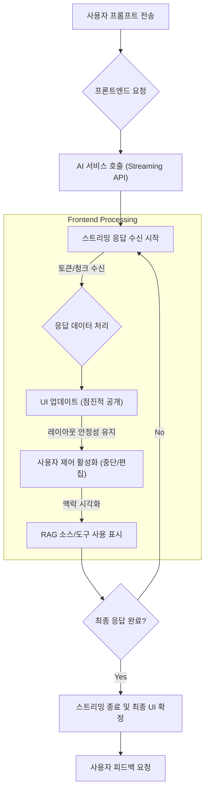

실시간 AI 응답은 사용자 경험(UX)을 혁신하는 핵심 요소입니다. 2026년 현재, 생성형 AI의 발전과 함께 사용자들은 즉각적인 피드백과 동적인 콘텐츠를 기대하며, 프론트엔드 단에서의 정교한 UI/UX 디자인 패턴이 필수적입니다. 기존의 정적 응답 방식은 AI의 잠재력을 온전히 활용하지 못합니다.

## 실시간 AI 응답의 중요성 및 도전 과제

실시간 스트리밍 AI 응답은 AI의 생성 과정을 시각적으로 보여줌으로써 몰입감 있는 경험을 제공하고, 응답 대기 시간을 인지적으로 단축하며, AI의 동작 투명성을 높입니다.

주요 도전 과제는 다음과 같습니다.

*   **부분적 응답 처리 (Partial Responses)**: 불완전한 텍스트나 데이터를 연속적으로 받아 처리해야 합니다.
*   **동적 콘텐츠 레이아웃 (Dynamic Content Layout)**: 예측 불가능한 길이와 구조의 콘텐츠가 실시간으로 추가되면서 UI 레이아웃이 불안정해질 수 있습니다.
*   **사용자 제어 (User Control)**: 생성 중인 응답을 중단하거나 수정할 수 있는 적절한 제어 메커니즘이 필요합니다.
*   **성능 최적화 (Performance Optimization)**: 잦은 업데이트에도 렌더링 성능 저하 없이 부드러운 전환을 제공해야 합니다.

## 핵심 UI/UX 디자인 패턴

### 1. 프로그레시브 디스클로저 (Progressive Disclosure)

AI 응답을 점진적으로 공개하여 사용자가 생성 과정을 자연스럽게 따라가도록 돕습니다.

*   **토큰 스트리밍 (Token Streaming)**: 글자 또는 단어 단위로 스트리밍하여 AI가 "타이핑"하는 듯한 시각적 효과를 제공합니다. React의 `useState`와 `useEffect`, SSE(Server-Sent Events) 또는 WebSocket을 활용합니다.
*   **스켈레톤 로더 (Skeleton Loader)**: 이미지, 코드 블록 등 복잡한 요소에 대해 내용 로드 전까지 스켈레톤 UI를 표시하여 레이아웃 시프트(layout shift)를 방지합니다.

### 2. 가변 응답 및 재구성 (Mutable Response & Reconstruction)

AI 응답은 사용자의 추가 프롬프트나 맥락 변화에 따라 수정될 수 있습니다.

*   **초안 UI (Drafting UI)**: AI가 응답을 "생각하는" 동안 중간 초안 상태를 표시하고, 최종 응답 확정 시 부드럽게 전환합니다.
*   **버전 관리 및 비교 (Version Control & Comparison)**: 여러 응답 옵션이나 수정된 응답에 대해 이전 버전과의 차이점을 시각적으로 비교할 수 있는 기능을 제공합니다.

### 3. 인간 개입 루프 (Human-in-the-Loop)

사용자가 AI 생성 과정에 개입하고 제어할 수 있는 명확한 인터페이스를 제공하여 통제감과 신뢰를 높입니다.

*   **중단/재시도/편집 (Stop/Retry/Edit) 버튼**: AI가 원치 않는 방향으로 진행될 때 즉시 중단, 특정 부분 편집, 또는 전체 응답 재시도 기능을 제공합니다.
*   **피드백 메커니즘 (Feedback Mechanism)**: "좋아요/싫어요" 등 직접적인 피드백 버튼은 AI 모델 개선 및 사용자 발언권 제공에 기여합니다.

### 4. 맥락 시각화 (Contextual Visualization)

AI가 어떤 정보를 바탕으로 응답을 생성하는지 시각적으로 보여줌으로써 투명성을 확보합니다.

*   **RAG 소스 표시 (RAG Source Display)**: RAG(Retrieval Augmented Generation) 패턴 사용 시, AI가 참조한 문서나 데이터 소스를 명확히 표시하여 응답의 근거를 제시하고 환각(hallucination) 가능성을 줄입니다.
*   **도구 사용 시각화 (Tool Use Visualization)**: AI 에이전트가 외부 도구(API, 코드 실행기 등)를 사용하는 과정을 시각적으로 보여줍니다 (예: "Executing search query...").

## 실시간 AI 응답 프론트엔드 구현 예제 (React)

```typescript
import React, { useState, useEffect, useRef } from 'react';

interface AIChatResponseProps {
  initialMessage: string;
  streamEndpoint: string;
}

const AIChatResponse: React.FC<AIChatResponseProps> = ({ initialMessage, streamEndpoint }) => {
  const [displayedContent, setDisplayedContent] = useState('');
  const [isStreaming, setIsStreaming] = useState(true);
  const contentRef = useRef<HTMLDivElement>(null);
  const eventSourceRef = useRef<EventSource | null>(null); // Use ref for eventSource

  useEffect(() => {
    if (contentRef.current) {
      contentRef.current.scrollTop = contentRef.current.scrollHeight;
    }
  }, [displayedContent]);

  useEffect(() => {
    if (!streamEndpoint) return;

    eventSourceRef.current = new EventSource(streamEndpoint);

    eventSourceRef.current.onopen = () => {
      setIsStreaming(true);
    };

    eventSourceRef.current.onmessage = (event) => {
      const { chunk } = JSON.parse(event.data);
      setDisplayedContent((prev) => prev + chunk);
    };

    eventSourceRef.current.onerror = (error) => {
      console.error('SSE error:', error);
      setIsStreaming(false);
      eventSourceRef.current?.close();
    };

    eventSourceRef.current.onclose = () => {
      setIsStreaming(false);
    };

    return () => {
      eventSourceRef.current?.close();
    };
  }, [streamEndpoint]);

  const handleStopStreaming = () => {
    eventSourceRef.current?.close();
    setIsStreaming(false);
  };

  return (
    <div className="ai-response-container">
      <p className="ai-message-initial">{initialMessage}</p>
      <div ref={contentRef} className="ai-message-stream-content">
        {displayedContent}
        {isStreaming && <span className="typing-indicator">_</span>}
      </div>
      {!isStreaming && <button className="ai-action-button">Regenerate</button>}
      {isStreaming && <button className="ai-action-button" onClick={handleStopStreaming}>Stop</button>}
    </div>
  );
};

export default AIChatResponse;
```

## 실시간 AI 응답 프론트엔드 워크플로우



## 트레이드오프

실시간 스트리밍 AI 응답 프론트엔드 UI/UX 패턴 적용 시 다음 트레이드오프를 고려해야 합니다.

*   **프로그레시브 디스클로저 vs. 응답의 최종성**
    *   **언제 좋고**: AI의 사고 과정 시각화로 대기 시간 인지 단축, 동적인 경험 제공에 유용합니다.
    *   **언제 나쁜지**: 최종성(Finality)이 중요한 정보(금융, 법률)는 불완전한 정보 노출로 혼란을 줄 수 있습니다.

*   **실시간 업데이트 빈도 vs. 프론트엔드 성능**
    *   **언제 좋고**: 낮은 지연 시간으로 부드러운 애니메이션 및 즉각적 피드백 제공 시 몰입감을 높입니다.
    *   **언제 나쁜지**: 잦은 DOM 조작은 렌더링 부하를 가중시켜 저사양 기기에서 UI 버벅임을 유발할 수 있습니다.

*   **인간 개입 루프 vs. 자동화된 효율성**
    *   **언제 좋고**: AI 결정에 사용자가 개입하여 잘못된 경로 방지, 개인 선호 반영 시 유용합니다.
    *   **언제 나쁜지**: 모든 과정에 개입 지점을 두면 AI의 자동화 이점 저해 및 작업 흐름을 늦출 수 있습니다.

*   **맥락 시각화의 풍부함 vs. 정보 과부하**
    *   **언제 좋고**: AI 의사 결정 과정 투명성 확보, 신뢰성 검증(RAG 소스, 도구 사용)에 효과적입니다.
    *   **언제 나쁜지**: 과도한 정보는 UI를 복잡하게 만들고, 사용자가 핵심 응답에 집중하기 어렵게 합니다.

## 실전 체크리스트

실시간 스트리밍 AI 응답 UI/UX 패턴을 프로젝트에 적용할 때 검증할 항목입니다.

*   [ ] **스트리밍 지연 시간 (Latency) 목표**: TTFB와 TTR 목표를 정의하고 지속적으로 측정하고 있는가? (예: TTFB < 500ms, TTR < 5s)
*   [ ] **UI 안정성 확보**: 스트리밍 중 CLS(Cumulative Layout Shift) 발생을 최소화하기 위해 스켈레톤 UI, 최소 높이 설정 등을 활용하는가?
*   [ ] **에러 및 연결 끊김 처리**: 스트리밍 에러 발생 시 사용자에게 명확히 알리고 재시도 옵션을 제공하는가?
*   [ ] **사용자 개입 및 제어**: '중단', '편집', '다시 생성' 버튼이 직관적으로 제공되며 예상대로 작동하는가?
*   [ ] **성능 최적화**: 대량 스트리밍 데이터 처리 시 렌더링 성능 저하를 방지하는 최적화 기법(가상화, 쓰로틀링)이 적용되었는가?
*   [ ] **접근성 (Accessibility)**: 스크린 리더 사용자를 위해 동적 업데이트가 ARIA Live Regions 등 접근성 표준을 준수하는가?
*   [ ] **사용자 피드백 통합**: AI 응답 만족도(좋아요/싫어요) 수집 메커니즘이 구현되어 있고, 피드백이 모델 개선 파이프라인으로 연결되는가?