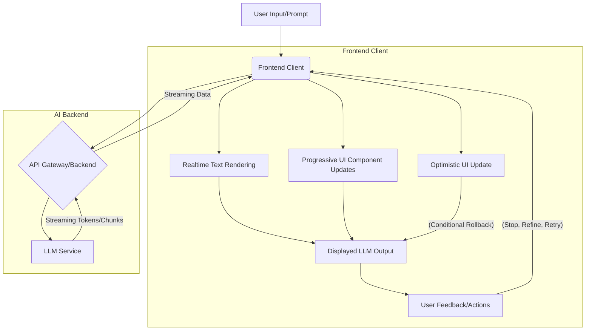

대규모 언어 모델 (LLM)의 발전은 사용자 인터페이스 (UI) 및 사용자 경험 (UX) 디자인에 새로운 패러다임을 가져왔다. 특히 실시간으로 스트리밍되는 LLM 결과는 전통적인 요청-응답 모델과는 다른 접근 방식을 요구한다. AI 결과의 불확실성과 점진적 완성도를 사용자에게 효과적으로 전달하고, 동시에 상호작용의 기회를 제공하는 프론트엔드 디자인은 2026년 이후 AI 기반 서비스의 핵심 경쟁력이 될 것이다.

## 실시간 LLM 결과 반영의 중요성

기존의 웹 애플리케이션은 서버에서 완전한 데이터를 받아 한 번에 렌더링하는 방식이 일반적이었다. 그러나 LLM은 답변을 생성하는 데 시간이 걸리며, 토큰(token) 단위로 점진적인 출력을 제공하는 경우가 많다. 이 점진적인 출력을 UI에 실시간으로 반영하는 것은 사용자에게 다음과 같은 이점을 제공한다:

*   **인지된 반응성 (Perceived Responsiveness):** 사용자는 결과를 기다리는 동안 진행 상황을 시각적으로 확인하며, 시스템이 작동하고 있음을 인지한다. 이는 대기 시간을 덜 지루하게 만든다.
*   **조기 개입 및 제어 (Early Intervention and Control):** 불완전한 결과라도 조기에 사용자에게 노출되면, 사용자는 잘못된 방향으로 가고 있음을 감지하고 프롬프트를 수정하거나 생성을 중단할 수 있다. 이는 자원 낭비와 시간 손실을 줄인다.
*   **정보 처리 효율성 (Information Processing Efficiency):** 복잡한 답변의 경우, 한 번에 모든 정보를 제시하는 것보다 점진적으로 보여주는 것이 사용자의 정보 처리 부담을 줄이고 이해도를 높인다.

## 핵심 디자인 패턴 및 구현 전략

### 1. 스트리밍 텍스트 렌더링 (Streaming Text Rendering)

가장 기본적인 패턴은 LLM이 생성하는 텍스트 토큰을 실시간으로 UI에 추가하는 것이다. 이는 서버-센트 이벤트 (SSE, Server-Sent Events)나 WebSockets을 통해 이루어질 수 있다. 2026년에는 SSE가 대부분의 실시간 텍스트 스트리밍에 선호되며, `EventSource` API를 통해 구현된다.

#### 구현 예제 (React with SSE):

```javascript
// components/LLMStreamComponent.tsx
import React, { useState, useEffect, useRef } from 'react';

interface LLMStreamComponentProps {
  prompt: string;
}

const LLMStreamComponent: React.FC<LLMStreamComponentProps> = ({ prompt }) => {
  const [llmOutput, setLlmOutput] = useState('');
  const [isLoading, setIsLoading] = useState(false);
  const eventSourceRef = useRef<EventSource | null>(null);

  const startStreaming = async () => {
    setIsLoading(true);
    setLlmOutput('');
    if (eventSourceRef.current) {
      eventSourceRef.current.close();
    }

    try {
      const response = await fetch('/api/llm-stream', {
        method: 'POST',
        headers: { 'Content-Type': 'application/json' },
        body: JSON.stringify({ prompt }),
      });

      if (!response.ok) {
        throw new Error(`HTTP error! status: ${response.status}`);
      }

      const reader = response.body?.getReader();
      const decoder = new TextDecoder();
      let result = '';

      // Node.js streaming API emulation for demonstration, or use EventSource directly
      // For actual SSE, use EventSource as shown in the comment below

      // Example using EventSource API (more common for SSE)
      eventSourceRef.current = new EventSource(`/api/llm-stream-sse?prompt=${encodeURIComponent(prompt)}`);
      eventSourceRef.current.onmessage = (event) => {
        const data = JSON.parse(event.data);
        if (data.type === 'token') {
          setLlmOutput((prev) => prev + data.value);
        } else if (data.type === 'end') {
          setIsLoading(false);
          eventSourceRef.current?.close();
        }
      };
      eventSourceRef.current.onerror = (error) => {
        console.error('EventSource failed:', error);
        setIsLoading(false);
        eventSourceRef.current?.close();
      };

    } catch (error) {
      console.error('Error starting LLM stream:', error);
      setLlmOutput('Error: Could not fetch LLM response.');
      setIsLoading(false);
    }
  };

  useEffect(() => {
    if (prompt) {
      startStreaming();
    }
    return () => {
      eventSourceRef.current?.close();
    };
  }, [prompt]);

  return (
    <div>
      <p>Prompt: {prompt}</p>
      <div style={{ border: '1px solid #ccc', padding: '10px', minHeight: '100px' }}>
        {llmOutput.length > 0 ? (
          <pre style={{ whiteSpace: 'pre-wrap', fontFamily: 'inherit' }}>{llmOutput}</pre>
        ) : isLoading ? (
          <span>Generating...</span>
        ) : (
          <span>No output yet.</span>
        )}
      </div>
      {isLoading && <button onClick={() => eventSourceRef.current?.close()}>Stop Generation</button>}
    </div>
  );
};

export default LLMStreamComponent;

// Backend example (Node.js with Express for SSE)
/*
app.post('/api/llm-stream-sse', (req, res) => {
  res.setHeader('Content-Type', 'text/event-stream');
  res.setHeader('Cache-Control', 'no-cache');
  res.setHeader('Connection', 'keep-alive');

  const { prompt } = req.body;
  // Simulate LLM streaming tokens
  const streamTokens = async () => {
    const fullResponse = `This is a simulated LLM response for: ${prompt}. It will be streamed token by token.`;
    for (const char of fullResponse) {
      res.write(`data: ${JSON.stringify({ type: 'token', value: char })}\n\n`);
      await new Promise(resolve => setTimeout(resolve, 50)); // Simulate delay
    }
    res.write(`data: ${JSON.stringify({ type: 'end' })}\n\n`);
    res.end();
  };

  streamTokens().catch(console.error);

  req.on('close', () => {
    console.log('Client disconnected');
    res.end();
  });
});
*/
```

### 2. 점진적 구조화된 출력 (Progressive Structured Output)

단순 텍스트 스트리밍을 넘어, LLM이 JSON 같은 구조화된 데이터를 점진적으로 생성하는 경우, 이 구조를 UI에 반영하여 특정 섹션이나 컴포넌트가 완성되는 대로 렌더링할 수 있다. 예를 들어, 레시피 생성 AI는 재료, 조리법, 팁 순서로 데이터를 보내고, UI는 각 섹션이 완성될 때마다 해당 부분을 업데이트한다.

### 3. 낙관적 UI 업데이트 및 롤백 (Optimistic UI Update & Rollback)

사용자의 입력에 대해 LLM이 높은 신뢰도로 특정 결과를 내놓을 것이 예상될 때, AI 응답이 완전히 도착하기 전에 예상 결과를 UI에 먼저 반영하여 반응성을 극대화할 수 있다. 실제 LLM 응답이 다를 경우, UI를 부드럽게 롤백하거나 수정하는 로직이 필요하다. 이는 `React.useOptimistic` 훅과 같은 2026년의 새로운 React 기능을 활용할 수 있다.

### 4. 사용자 개입 및 제어 (User Intervention and Control)

실시간 LLM UI는 사용자에게 제어권을 부여해야 한다. '생성 중지 (Stop Generation)', '수정 (Refine)', '재시도 (Retry)', '다른 아이디어 (More Ideas)' 등의 버튼은 필수적이다. 특히 '수정' 기능은 사용자가 LLM의 진행 중인 출력의 특정 부분을 선택하여 다시 프롬프트할 수 있게 함으로써, AI 협업의 효율성을 크게 높일 수 있다.

## LLM-Powered UI/UX 디자인 플로우



## 트레이드오프

### 1. 점진적 렌더링 vs. 최종 결과물 일관성 (Progressive Rendering vs. Final Result Consistency)
*   **언제 좋은가 (When good):** 복잡하거나 긴 텍스트 응답, 창의적 생성형 AI 결과처럼 중간 과정이 사용자에게 가치를 제공하거나 진행 상황을 확인해야 할 때 효과적이다. 사용자의 대기 시간을 줄이고 시스템의 반응성을 높이는 데 기여한다.
*   **언제 나쁜가 (When bad):** 중간 결과가 자주 바뀌거나 불안정하여 사용자가 혼란을 느끼거나, 최종 결과물의 정확성과 일관성이 절대적으로 중요한 시나리오 (예: 금융 데이터 요약, 법률 문서 초안)에서는 불리할 수 있다. 최종 결과물의 검증이 필요할 때 오해를 불러일으킬 수 있다.

### 2. 낙관적 UI vs. 보수적 UI (Optimistic UI vs. Conservative UI)
*   **언제 좋은가 (When good):** LLM의 응답이 매우 예측 가능하고, 사용자의 입력에 대한 즉각적인 피드백이 UX에 매우 중요한 경우 (예: 챗봇의 단순 응답, 특정 조건 만족 시 자동 완성) 사용자 경험을 극대화할 수 있다.
*   **언제 나쁜가 (When bad):** LLM의 신뢰도가 낮거나 예측 불가능한 결과가 자주 발생하여 롤백이 빈번하게 일어날 경우, 사용자에게 불안정하고 혼란스러운 경험을 제공할 수 있다. 롤백 처리 로직이 복잡해질 수 있다.

### 3. 사용자 제어권 vs. 자동화 (User Control vs. Automation)
*   **언제 좋은가 (When good):** 창의적인 작업, 복잡한 문제 해결, 또는 LLM의 결과가 여러 대안을 가질 수 있는 경우 사용자에게 개입 및 수정할 기회를 제공하여 협업의 가치를 높일 수 있다. 사용자가 AI를 '도구'로 활용하게 한다.
*   **언제 나쁜가 (When bad):** 단순 반복 작업, 속도가 중요한 작업, 또는 사용자가 AI 결과에 대한 전문 지식이 부족한 경우 과도한 제어권은 오히려 사용자의 피로도를 높이고 효율성을 저해할 수 있다. '자동화'의 이점을 살리지 못하게 된다.

### 4. 시각적 풍부함 vs. 성능 (Visual Richness vs. Performance)
*   **언제 좋은가 (When good):** LLM이 이미지, 그래프, 코드 등 다양한 형식의 출력을 생성하고, 이를 시각적으로 매력적이고 인터랙티브하게 보여줌으로써 사용자 참여와 이해도를 높일 수 있을 때 유용하다. 데이터 시각화가 중요한 대시보드나 리포트 생성에 적합하다.
*   **언제 나쁜가 (When bad):** 로딩 시간, 렌더링 성능, 또는 네트워크 대역폭이 제한적인 환경에서는 과도한 시각적 요소가 오히려 UX를 저해할 수 있다. 빠른 응답 속도가 최우선인 텍스트 기반 챗 애플리케이션 등에서는 불필요한 오버헤드가 될 수 있다.

## 실전 체크리스트

LLM 실시간 UI/UX 디자인을 프로젝트에 적용할 때 다음 항목들을 검증한다:

- [ ] **스트리밍 메커니즘 선택 및 구현 완료:** Server-Sent Events (SSE) 또는 WebSockets 중 프로젝트 요구사항에 적합한 스트리밍 방식을 결정하고, 프론트엔드와 백엔드 간의 연결 및 데이터 전송 로직이 안정적으로 구현되었는가?
- [ ] **점진적 텍스트 렌더링 성능 최적화:** LLM 토큰이 빠르게 도착할 때 UI 업데이트가 `jitter` 없이 부드럽게 이루어지는지 확인하고, DOM 조작 최소화 및 효율적인 렌더링 기법 (예: `React.Fragment`, 가상 스크롤)을 적용했는가?
- [ ] **불확실성 및 에러 상태 시각적 피드백 제공:** LLM 생성 중단, 에러 발생, 또는 결과물의 신뢰도가 낮은 경우에 대한 명확한 시각적 및 텍스트 피드백 (예: 로딩 스피너, 에러 메시지, 결과물 신뢰도 표시)이 제공되는가?
- [ ] **사용자 개입 및 제어 UI 요소 구현:** '생성 중지', '수정', '재시도' 등 사용자가 LLM과의 상호작용을 제어할 수 있는 UI 요소들이 명확하게 노출되고, 예상대로 동작하는가?
- [ ] **최종 결과물 검토 및 확정 기능:** LLM의 최종 결과물에 대한 사용자의 검토 및 수락 (또는 거절) 절차가 명확하며, 필요한 경우 편집 또는 추가 프롬프트 기회를 제공하는가?
- [ ] **접근성 (Accessibility) 고려:** 실시간으로 변화하는 콘텐츠에 대해 스크린 리더 사용자가 변화를 인지할 수 있도록 `aria-live` 속성 등을 활용하고, 키보드 내비게이션 및 충분한 색상 대비를 확보했는가?
- [ ] **성능 모니터링 및 로깅 체계 구축:** LLM 응답 시간, UI 렌더링 지연, 사용자 개입 빈도 등 주요 성능 및 UX 지표를 측정하고 로깅하여 지속적인 개선을 위한 데이터를 수집하는가?