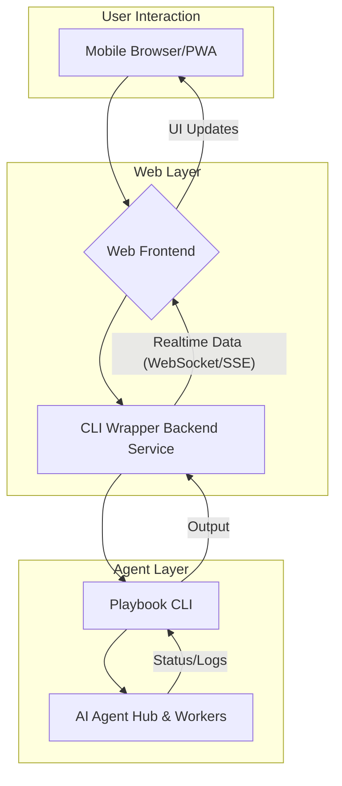

The proliferation of AI agents and autonomous systems demands sophisticated yet accessible management interfaces. Traditional CLI-based tooling, while powerful for developers, often falls short in "ambient 배포" environments where on-the-go monitoring and intervention are critical. This entry explores the implementation of a remote mobile-first web interface for managing AI agent "워커" (workers) and "허브" (hubs) that are fundamentally controlled via CLI. Inspired by projects like Aside CLI wrappers, the goal is to transform robust command-line operations into intuitive, mobile-friendly web experiences. This enables users to dispatch tasks, monitor progress, and receive real-time updates from their playbook agents directly from their smartphones or tablets, enhancing operational agility and responsiveness.

## Architectural Overview
The architecture centers around a secure web application that acts as a proxy for the underlying CLI-based AI agent system. This web interface (Frontend) communicates with a dedicated backend service (CLI Wrapper/API Gateway), which in turn executes the native `playbook` CLI commands and processes their output.

### System Components

1.  **Mobile-First Web Frontend**:
    *   Built with modern JavaScript frameworks (e.g., React, Vue, Svelte) to ensure responsiveness across various devices.
    *   Utilizes Progressive Web App (PWA) capabilities for an app-like experience, including offline access and home screen installation.
    *   Focuses on real-time data visualization for agent status, task queues, and execution logs.
2.  **CLI Wrapper Backend Service**:
    *   A lightweight service (e.g., Node.js, Python Flask/FastAPI, Go) responsible for:
        *   Exposing RESTful APIs or WebSocket endpoints.
        *   Executing `playbook` CLI commands securely.
        *   Capturing and parsing CLI output (stdout/stderr).
        *   Relaying processed data back to the frontend.
        *   Implementing authentication and authorization layers to protect agent access.
3.  **Playbook CLI & AI Agents**:
    *   The existing CLI toolchain for managing AI agent workflows (e.g., `playbook run-task`, `playbook status`).
    *   The underlying AI agents (워커) and their orchestrating hub system.

### Communication Flow
User interactions from the mobile web interface trigger API calls or WebSocket messages to the CLI Wrapper Backend. This backend translates these into `playbook` CLI commands, executes them, captures the response, and streams it back to the frontend. Real-time updates, such as agent progress or log outputs, are efficiently handled via WebSockets or Server-Sent Events (SSE) to maintain a live connection.



## Key Implementation Aspects

### Real-time Communication
For a responsive control experience, "실시간" (real-time) feedback is paramount. WebSockets provide a full-duplex communication channel, allowing the backend to push updates to the frontend as soon as they occur, without constant polling. This is critical for monitoring long-running agent tasks or receiving immediate alerts. Server-Sent Events (SSE) could be an alternative for simpler unidirectional data streams.

### Mobile Responsiveness and PWA
The interface must be designed with a "모바일 우선" (mobile-first) approach. Responsive design principles, flexible layouts, and touch-friendly controls are essential. Implementing the web application as a PWA (Progressive Web App) enhances user experience by enabling offline capabilities, faster loading times, and the ability to "앱처럼 설치" (install like an app) on the home screen, blurring the line between web and native applications. This aligns with the "ambient 배포" goal, allowing seamless access anywhere.

### Security Considerations
Wrapping a CLI tool in a web interface introduces new security vectors. Key considerations include:
*   **Authentication & Authorization**: Strong user authentication (e.g., OAuth 2.0, JWT) and fine-grained authorization to control which users can execute which commands.
*   **Input Sanitization**: Rigorous validation and sanitization of all user inputs to prevent command injection vulnerabilities.
*   **Least Privilege**: The CLI Wrapper service should run with the minimum necessary permissions.
*   **Secure Communication**: All communication between frontend, backend, and CLI should use HTTPS/WSS.
*   **Auditing and Logging**: Comprehensive logging of all command executions and user actions for auditability.

## Code Example: Simplified Agent Control Frontend (React/TypeScript)
This example demonstrates a basic React component for sending commands and displaying real-time output from an AI agent via a WebSocket connection.

```typescript
// components/AgentConsole.tsx
import React, { useState, useEffect, useRef } from 'react';

const AgentConsole: React.FC = () => {
  const [command, setCommand] = useState('');
  const [output, setOutput] = useState<string[]>([]);
  const ws = useRef<WebSocket | null>(null);

  useEffect(() => {
    // WebSocket 연결 설정
    ws.current = new WebSocket('wss://your-agent-hub.com/ws/console');

    ws.current.onopen = () => {
      setOutput(prev => [...prev, 'Connected to Agent Hub.']);
    };

    ws.current.onmessage = (event) => {
      setOutput(prev => [...prev, event.data]);
    };

    ws.current.onclose = () => {
      setOutput(prev => [...prev, 'Disconnected from Agent Hub.']);
    };

    ws.current.onerror = (error) => {
      setOutput(prev => [...prev, `WebSocket Error: ${error}`]);
    };

    return () => {
      ws.current?.close();
    };
  }, []);

  const handleSubmit = (e: React.FormEvent) => {
    e.preventDefault();
    if (command.trim() && ws.current?.readyState === WebSocket.OPEN) {
      ws.current.send(JSON.stringify({ type: 'command', payload: command }));
      setOutput(prev => [...prev, `> ${command}`]);
      setCommand('');
    }
  };

  return (
    <div style={{ fontFamily: 'monospace', backgroundColor: '#1e1e1e', color: '#00ff00', padding: '15px', borderRadius: '8px' }}>
      <h3>AI Agent Remote Console</h3>
      <div style={{ height: '300px', overflowY: 'scroll', border: '1px solid #333', padding: '10px', marginBottom: '10px', whiteSpace: 'pre-wrap' }}>
        {output.map((line, index) => (
          <div key={index}>{line}</div>
        ))}
      </div>
      <form onSubmit={handleSubmit}>
        <input
          type="text"
          value={command}
          onChange={(e) => setCommand(e.target.value)}
          placeholder="Enter agent command (e.g., run-task deploy-feature)"
          style={{ width: 'calc(100% - 100px)', padding: '8px', marginRight: '10px', border: '1px solid #555', backgroundColor: '#333', color: '#fff' }}
        />
        <button type="submit" style={{ padding: '8px 15px', backgroundColor: '#007bff', color: '#fff', border: 'none', borderRadius: '4px', cursor: 'pointer' }}>
          Execute
        </button>
      </form>
    </div>
  );
};

export default AgentConsole;
```

This component provides a user interface to send commands (e.g., `run-task deploy-feature`) to a backend WebSocket server, which then interacts with the `playbook` CLI. The agent's output is streamed back and displayed in real-time.

## 트레이드오프 (Trade-offs)

*   **개발 복잡도 vs. 접근성**:
    *   **언제 좋나?**: 기존 CLI 기반 시스템에 웹 인터페이스를 추가하여 "원격 모바일" 접근성을 획기적으로 높일 때. 사용자 경험(UX) 개선이 최우선 목표일 때 효과적입니다. CLI에 익숙하지 않은 비기술 직군에게도 AI 에이전트 관제 기능을 제공할 수 있습니다.
    *   **언제 나쁜가?**: 웹 인터페이스 개발, 보안 강화, 실시간 통신 인프라 구축 등 초기 개발 및 유지보수 비용과 복잡도가 증가합니다. 단순히 CLI를 래핑하는 것 이상의 복잡한 상호작용이 필요 없는 경우 과도한 설계일 수 있습니다.
*   **성능 오버헤드 vs. 유연성**:
    *   **언제 좋나?**: 웹 계층과 CLI Wrapper 계층이 추가되면서 약간의 "성능 오버헤드"는 발생하지만, 플랫폼 독립적인 접근성과 풍부한 UI/UX를 제공하는 유연성이 더 중요할 때 유용합니다. 특히 다양한 기기에서 접근해야 할 때 강력합니다.
    *   **언제 나쁜가?**: 극단적인 저지연(low-latency) 또는 고처리량(high-throughput)이 요구되는 시스템에서는 중간 계층의 추가가 병목 현상을 유발할 수 있습니다. 예를 들어, 수백 개의 에이전트를 밀리초 단위로 제어해야 하는 경우 직접 CLI 접근이 더 효율적일 수 있습니다.
*   **보안 표면 확장 vs. 제어 강화**:
    *   **언제 좋나?**: 웹 기반 인터페이스는 "보안 표면"을 확장하지만, 잘 설계된 인증, 권한 관리, 입력 유효성 검사 계층을 통해 오히려 "세분화된 제어"와 로깅을 강화할 수 있습니다. 중앙 집중식 관리가 필요한 엔터프라이즈 환경에서 보안 정책 적용에 유리합니다.
    *   **언제 나쁜가?**: 잘못 구현된 웹 인터페이스는 XSS, CSRF, 명령 주입(command injection) 등 새로운 취약점을 노출할 수 있습니다. 기존 CLI 환경보다 더 많은 보안 전문 지식과 노력이 필요합니다.
*   **리소스 사용량 vs. 사용자 편의성**:
    *   **언제 좋나?**: 별도의 데스크톱 애플리케이션 설치 없이 웹 브라우저만으로 모든 기능을 사용할 수 있어 "사용자 편의성"이 극대화됩니다. 이는 사용자 온보딩 비용을 줄이고 접근 장벽을 낮춥니다.
    *   **언제 나쁜가?**: 웹 브라우저 기반의 애플리케이션은 네이티브 애플리케이션에 비해 상대적으로 더 많은 CPU 및 메모리 리소스를 사용할 수 있습니다. 특히 복잡한 실시간 대시보드의 경우 클라이언트 측 리소스 소모가 커질 수 있습니다.

## 실전 체크리스트 (Practical Checklist)

- [ ] **CLI 커맨드 안전성 검증**: 웹 인터페이스를 통해 노출될 `playbook` CLI 커맨드 목록을 확정하고, 각 커맨드의 파라미터 유효성 검사 및 "입력 Sanitization" 로직이 견고하게 구현되었는지 검증합니다.
- [ ] **인증 및 권한 관리 시스템 구축**: 사용자 역할 기반 접근 제어(RBAC)를 포함하여, 누가 어떤 에이전트 기능을 사용할 수 있는지 명확히 정의하고, 강력한 "인증(Authentication)" 및 "인가(Authorization)" 시스템을 구축합니다. (예: JWT 토큰 기반 API 보호)
- [ ] **실시간 피드백 채널 구현**: 에이전트의 작업 진행 상황, 로그 출력, 오류 메시지 등을 지연 없이 사용자에게 전달하기 위해 "WebSocket" 또는 "Server-Sent Events (SSE)" 기반의 실시간 통신 채널을 성공적으로 구축하고 테스트합니다.
- [ ] **모바일 반응형 UI/UX 최적화**: 다양한 스마트폰 및 태블릿 해상도에서 인터페이스가 올바르게 표시되고, 터치 기반 상호작용이 자연스러운지 확인하며, PWA 기능을 활용하여 앱 설치 경험을 제공합니다.
- [ ] **에러 처리 및 로깅 정책 수립**: CLI 실행 오류, 네트워크 문제, 백엔드 서비스 장애 등 발생 가능한 모든 오류 시나리오에 대한 "강건한 에러 처리" 로직을 구현하고, 모든 에이전트 상호작용 및 시스템 이벤트를 상세히 로깅(logging)하여 문제 진단 및 감사에 활용할 수 있도록 합니다.
- [ ] **성능 벤치마킹 및 최적화**: 다수의 동시 사용자 또는 에이전트 작업 요청 시 웹 인터페이스 및 CLI Wrapper 백엔드의 "성능 병목 현상"이 발생하지 않는지 스트레스 테스트를 수행하고, 필요한 경우 캐싱, 비동기 처리 등으로 최적화합니다.
- [ ] **배포 및 모니터링 자동화**: CI/CD 파이프라인을 구축하여 웹 인터페이스와 백엔드 서비스의 배포를 자동화하고, Prometheus, Grafana 등 도구를 활용하여 시스템 "모니터링 대시보드"를 구성하여 이상 징후를 조기에 감지할 수 있도록 합니다.