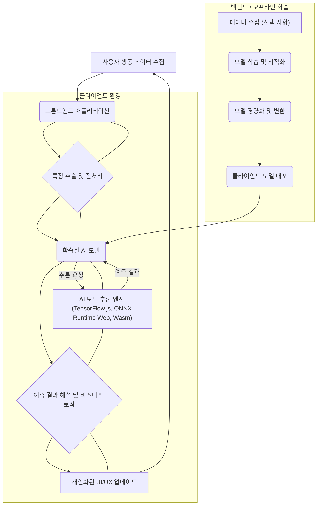

### 사용자 행동 예측을 위한 프론트엔드 AI 모델 통합 및 활용 방법

최신 웹 애플리케이션에서 사용자 경험(UX) 개인화는 핵심 경쟁력으로 부상하고 있으며, 이를 위해 실시간 사용자 행동 예측의 중요성이 강조되고 있다. 전통적으로 사용자 행동 예측은 서버 측에서 이루어졌으나, 네트워크 지연, 개인 정보 보호 문제, 서버 자원 부담 등의 한계가 존재했다. 프론트엔드 AI 모델 통합은 이러한 한계를 극복하고 사용자에게 더욱 즉각적이고 개인화된 경험을 제공하는 새로운 패러다임을 제시한다.

## 프론트엔드 AI 모델 통합의 필요성

프론트엔드에서 AI 모델을 직접 실행함으로써 얻을 수 있는 이점은 다음과 같다.

*   **실시간 반응성 (Real-time Responsiveness)**: 네트워크 지연 없이 사용자 인터랙션에 즉각적으로 반응하여 예측 기반의 동적 UI 변경, 콘텐츠 추천, 미리 로딩 등을 수행한다.
*   **개인 정보 보호 강화 (Enhanced Privacy)**: 민감한 사용자 데이터를 서버로 전송하지 않고 클라이언트 기기 내에서 처리함으로써 개인 정보 보호 규제(GDPR, CCPA) 준수에 유리하다.
*   **서버 부하 감소 (Reduced Server Load)**: 모든 예측 연산을 클라이언트에서 처리하므로, 백엔드 서버의 트래픽 및 연산 부담을 줄일 수 있다.
*   **오프라인 기능 (Offline Capability)**: 인터넷 연결이 불안정하거나 없는 환경에서도 학습된 모델을 기반으로 예측 기능을 제공할 수 있다.

## 사용자 행동 예측 모델의 프론트엔드 통합 전략

프론트엔드에 AI 모델을 통합하는 방식은 다양한 기술 스택과 요구사항에 따라 달라진다. 2026년에는 WebAssembly, WebGPU, 그리고 경량화된 ML 프레임워크가 주류를 이룰 것으로 예상된다.

### 1. 웹 기반 ML 프레임워크 활용

**TensorFlow.js**와 **ONNX Runtime Web**은 브라우저 환경에서 머신러닝 모델을 직접 실행할 수 있도록 지원하는 대표적인 라이브러리이다.

*   **TensorFlow.js**: JavaScript 기반으로, Python에서 훈련된 TensorFlow 모델을 웹 브라우저에서 직접 로드하고 추론할 수 있다. 모델 경량화 및 양자화(quantization) 기술을 적용하여 브라우저 리소스 사용량을 최적화한다.
*   **ONNX Runtime Web**: ONNX(Open Neural Network Exchange) 형식으로 변환된 모델을 웹 환경에서 실행할 수 있다. 다양한 ML 프레임워크(PyTorch, Keras 등)에서 훈련된 모델을 ONNX로 익스포트하여 통합할 수 있어 유연성이 높다.

### 2. WebAssembly (Wasm) 기반 통합

WebAssembly는 C, C++, Rust와 같은 언어로 작성된 코드를 웹 브라우저에서 고성능으로 실행할 수 있게 한다. 복잡하거나 성능에 민감한 머신러닝 모델의 추론 엔진을 Wasm으로 컴파일하여 웹 환경에 배포할 수 있다. 이는 특히 계산 집약적인 모델이나 특정 하드웨어 최적화가 필요한 경우에 유용하다.

### 3. WebGPU를 통한 하드웨어 가속

WebGPU는 웹에서 GPU 하드웨어에 직접 접근하여 병렬 컴퓨팅을 수행할 수 있도록 하는 API이다. 대규모 행렬 연산이 필요한 딥러닝 모델의 추론 성능을 크게 향상시킬 수 있다. 2026년에는 WebGPU 지원이 더욱 보편화되어, 복잡한 사용자 행동 예측 모델도 클라이언트 기기의 GPU 자원을 효율적으로 활용할 수 있게 될 것이다.

## 프론트엔드 AI 아키텍처 다이어그램

다음 Mermaid 다이어그램은 사용자 행동 예측을 위한 프론트엔드 AI 모델 통합의 일반적인 아키텍처 흐름을 보여준다.



## 실전 코드 예제: TensorFlow.js를 이용한 다음 행동 예측

이 예제는 간단한 순차 행동 예측 모델을 TensorFlow.js로 구현하는 방법을 보여준다. 사용자의 클릭 이벤트 시퀀스를 기반으로 다음 클릭할 요소를 예측한다.

```javascript
import * as tf from '@tensorflow/tfjs';

// 1. 모델 정의 (간단한 LSTM 기반)
async function createBehaviorPredictionModel(vocabSize, embeddingDim, lstmUnits) {
    const model = tf.sequential();
    model.add(tf.layers.embedding({
        inputDim: vocabSize,
        outputDim: embeddingDim,
        inputLength: undefined // Variable sequence length
    }));
    model.add(tf.layers.lstm({ units: lstmUnits, returnSequences: false }));
    model.add(tf.layers.dense({ units: vocabSize, activation: 'softmax' })); // Predict next item from vocab
    model.compile({
        optimizer: 'adam',
        loss: 'sparseCategoricalCrossentropy',
        metrics: ['accuracy']
    });
    return model;
}

// 2. 가상의 학습 데이터 생성 (실제로는 서버에서 학습된 모델을 로드)
// 이 예제에서는 개념 설명을 위해 클라이언트에서 데이터를 준비하는 것처럼 보이나,
// 실제 프로덕션에서는 서버에서 학습된 .json 또는 .h5 모델을 로드한다.
const VOCAB_SIZE = 10; // 예: 10가지 종류의 UI 요소
const EMBEDDING_DIM = 16;
const LSTM_UNITS = 32;

// 가상 데이터: [[행동1, 행동2], 다음 행동], [[행동2, 행동3], 다음 행동]
// 시퀀스 데이터는 패딩되어야 한다. 여기서는 간단히 표현.
const sequences = [
    [0, 1, 2], // 0 -> 1 -> 2
    [1, 2, 3], // 1 -> 2 -> 3
    [0, 3, 4], // 0 -> 3 -> 4
    [2, 0, 1]  // 2 -> 0 -> 1
];
const nextItems = [3, 4, 5, 2]; // 예측해야 할 다음 항목

// 패딩을 위한 최대 시퀀스 길이
const MAX_SEQUENCE_LENGTH = 3;

function padSequences(sequences, maxLength) {
    return sequences.map(seq => {
        if (seq.length < maxLength) {
            return [...new Array(maxLength - seq.length).fill(0), ...seq]; // 패딩 값을 0으로 채움
        }
        return seq.slice(-maxLength);
    });
}

async function trainAndPredict() {
    const model = await createBehaviorPredictionModel(VOCAB_SIZE, EMBEDDING_DIM, LSTM_UNITS);

    const paddedSequences = padSequences(sequences, MAX_SEQUENCE_LENGTH);
    const xs = tf.tensor2d(paddedSequences, [paddedSequences.length, MAX_SEQUENCE_LENGTH]);
    const ys = tf.tensor1d(nextItems, 'int32');

    console.log('Model training...');
    await model.fit(xs, ys, {
        epochs: 50,
        batchSize: 1,
        callbacks: {
            onEpochEnd: (epoch, logs) => {
                console.log("Epoch " + epoch + ": Loss = " + logs.loss.toFixed(4) + ", Accuracy = " + logs.acc.toFixed(4));
            }
        }
    });
    console.log('Model training complete.');

    // 3. 모델 로드 및 추론 (실제 프로덕션 시나리오)
    // const loadedModel = await tf.loadLayersModel('path/to/your/model.json');

    // 새로운 사용자 행동 시퀀스에 대한 예측
    const newBehaviorSequence = padSequences([[0, 1, 2]], MAX_SEQUENCE_LENGTH); // 사용자가 0 -> 1 -> 2 행동을 함
    const inputTensor = tf.tensor2d(newBehaviorSequence, [1, MAX_SEQUENCE_LENGTH]);

    const prediction = model.predict(inputTensor);
    const predictedItem = prediction.argMax(-1).dataSync()[0];

    console.log("Predicted next item index: " + predictedItem);
    // 이 예측 결과에 따라 UI를 동적으로 변경하거나 다음 액션을 제안할 수 있다.
}

trainAndPredict();
```

이 예제는 모델의 학습 과정을 클라이언트에서 보여주지만, 실제 프로덕션 환경에서는 서버에서 미리 학습된 모델을 프론트엔드에서 로드하여 사용한다. 모델은 `tf.loadLayersModel('path/to/your/model.json')` 와 같은 방식으로 로드된다.

## 2026년 프론트엔드 AI 모델 통합의 최신 트렌드

*   **Federated Learning on Edge**: 개인 정보 보호를 강화하면서도 모델을 지속적으로 개선하기 위해, 클라이언트 기기에서 모델 학습을 수행하고 업데이트된 가중치만 중앙 서버로 공유하는 연합 학습(Federated Learning)이 더욱 확산될 것이다.
*   **Explainable AI (XAI) for Client-side Models**: 예측의 투명성과 신뢰성을 높이기 위해, 프론트엔드에서 실행되는 AI 모델의 예측 근거를 사용자에게 시각적으로 설명하는 XAI 기술이 중요해진다.
*   **Multimodal Client-side AI**: 텍스트, 이미지, 음성 등 다양한 모달리티의 데이터를 클라이언트에서 동시에 처리하여 더욱 풍부한 사용자 행동 예측과 상호작용을 가능하게 하는 모델이 등장할 것이다.
*   **WebGPU의 보편화**: WebGPU의 표준화와 브라우저 지원 확대는 복잡한 딥러닝 모델의 클라이언트 측 실행 성능을 크게 향상시켜, 이전에는 서버에서만 가능했던 모델들을 프론트엔드에서 구현할 수 있게 할 것이다.

## 트레이드오프

### 1. 성능 vs. 모델 복잡성
*   **언제 좋음**: 경량화된 모델(예: Decision Tree, Logistic Regression, 작은 LSTM/Transformer)은 사용자 기기에서 빠르게 추론되어 실시간 반응성을 제공하고 배터리 소모를 최소화한다.
*   **언제 나쁨**: 매우 복잡하거나 대용량의 모델(예: 최신 대형 LLM)은 클라이언트 기기의 CPU/GPU, 메모리 자원에 큰 부담을 주어 사용자 경험을 저해하고 기기 발열 및 배터리 방전을 초래할 수 있다.

### 2. 개인 정보 보호 vs. 중앙 집중형 데이터 분석
*   **언제 좋음**: 클라이언트 측에서 모든 예측을 수행하여 민감한 사용자 데이터가 서버로 전송되지 않으므로, 개인 정보 보호 규제 준수 및 사용자 신뢰 확보에 유리하다.
*   **언제 나쁨**: 중앙 서버에서 전체 사용자 데이터를 기반으로 한 종합적인 통계 및 고급 인사이트를 얻기 어려워, 글로벌 트렌드 분석이나 A/B 테스트의 세밀한 결과 분석이 제한될 수 있다.

### 3. 개발 및 배포 복잡성 vs. 유연성
*   **언제 좋음**: 모델 업데이트 및 배포가 클라이언트 애플리케이션 번들링 과정에 포함되어 서버 측 배포보다 단순할 수 있으며, 특정 사용자 그룹에 대한 A/B 테스트나 기능 플래그(Feature Flag)를 통한 점진적 배포가 용이하다.
*   **언제 나쁨**: 브라우저 간 호환성 문제, 다양한 클라이언트 기기 성능을 고려한 최적화, 그리고 클라이언트 측 모델의 버전 관리 및 롤백 전략 수립에 추가적인 개발 복잡성이 발생한다. 또한, 모델의 오류나 성능 저하 발생 시 즉각적인 서버 측 롤백과 같은 제어가 어려울 수 있다.

### 4. 초기 로딩 시간 vs. 런타임 성능
*   **언제 좋음**: 모델 파일 크기가 작고 효율적으로 압축된 경우, 초기 로딩 시간이 짧고 이후 실시간 추론에서 높은 성능을 유지할 수 있다.
*   **언제 나쁨**: 모델 파일 크기가 크거나 많은 리소스를 요구하는 경우, 웹 애플리케이션의 초기 로딩 시간이 길어져 사용자 이탈률을 높일 수 있다. 특히 모바일 환경에서는 데이터 사용량에도 영향을 미친다.

## 실전 체크리스트

프론트엔드 AI 모델을 사용자 행동 예측에 통합할 때 다음 항목들을 검토한다.

*   [ ] **모델 경량화 및 최적화**: 배포할 AI 모델이 클라이언트 기기(데스크톱, 모바일)의 다양한 CPU/GPU 리소스와 메모리 제약을 고려하여 충분히 경량화되고 최적화되었는지 확인한다. (예: 양자화, Pruning 적용 여부)
*   [ ] **데이터 프라이버시 및 보안**: 클라이언트 측에서 처리되는 사용자 행동 데이터가 개인 정보 보호 규정(GDPR, CCPA 등)을 준수하며, 민감한 정보가 부적절하게 노출되거나 저장되지 않는지 검증한다.
*   [ ] **성능 벤치마킹 및 모니터링**: 다양한 실제 클라이언트 환경(저사양 모바일, 구형 브라우저 포함)에서 모델 추론 성능(latency), CPU/GPU 사용량, 메모리 점유율, 배터리 소모량을 벤치마킹하고 지속적으로 모니터링하는 체계를 구축한다.
*   [ ] **사용자 경험(UX) 영향 평가**: AI 기반 예측 기능이 웹 애플리케이션의 로딩 시간, 응답성, 전반적인 사용자 흐름에 긍정적인 영향을 미치는지 A/B 테스트를 통해 정량적으로 평가한다.
*   [ ] **모델 버전 관리 및 롤백 전략**: 클라이언트 측에 배포된 모델의 버전 관리 시스템을 확립하고, 예측 오류나 성능 저하 발생 시 이전 버전으로의 신속한 롤백이 가능한 배포 파이프라인을 구축한다.
*   [ ] **오프라인 및 네트워크 불안정성 대응**: 네트워크 연결이 없거나 불안정한 환경에서도 예측 기능이 적절하게 동작하거나, 사용자에게 합리적인 폴백(fallback) 경험을 제공하는지 확인한다.
*   [ ] **예측 결과의 투명성 및 설명 가능성 (XAI)**: 필요한 경우, AI 모델의 예측 결과가 왜 그렇게 도출되었는지 사용자에게 직관적으로 설명할 수 있는 메커니즘을 제공하여 신뢰도를 높일 수 있는지 고려한다. (예: UI 설명 문구, 시각화)
