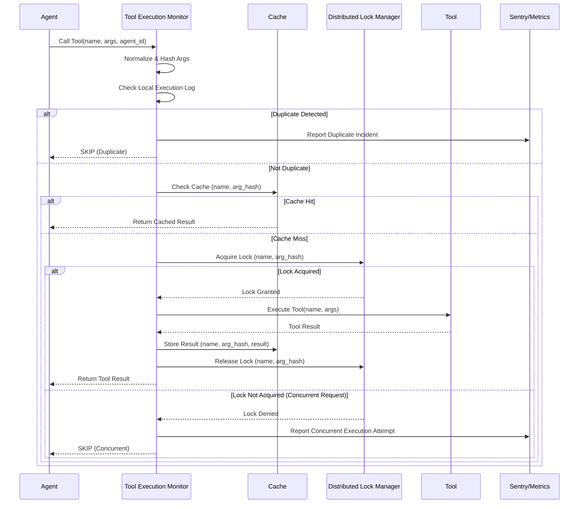

LLM 에이전트 (LLM Agents)의 도구 (Tools) 활용은 복잡한 작업을 자동화하는 데 필수적입니다. 그러나 에이전트의 내부 로직 오류, 재시도 메커니즘 오작동, 또는 분산 환경에서의 동시성 문제로 인해 동일한 도구 호출 (Tool Call)이 불필요하게 중복 실행되는 경우가 발생할 수 있습니다. 이러한 중복 실행 (Duplicate Executions)은 API 호출 비용 증가, 컴퓨팅 자원 낭비, 그리고 예측할 수 없는 시스템 상태 변화를 초래하여 전체 시스템의 효율성과 안정성을 저해합니다. 본 문서는 에이전트의 도구 중복 실행을 효과적으로 감지하고 방지하기 위한 체계적인 메커니즘 구축 방안을 다룹니다.

## 중복 실행 감지 메커니즘
중복 실행을 방지하기 위한 첫 단계는 이를 정확히 감지하는 것입니다. 이를 위해 다음과 같은 접근 방식을 사용합니다.

### 1. 도구 호출 로깅 및 인자 정규화
각 에이전트의 도구 호출에 대한 상세한 기록은 중복 감지의 핵심입니다. 도구 이름 (tool name), 호출 인자 (arguments), 호출 시점 (timestamp), 그리고 해당 에이전트 ID (agent ID)를 포함해야 합니다. 특히, 도구 호출 인자는 동일한 의미라도 표현 방식이 다를 수 있으므로, 일관된 비교를 위해 정규화 (Normalization) 과정이 필수적입니다. 예를 들어, JSON 인자의 키 순서를 정렬하거나, 데이터 타입을 표준화하여 처리합니다.

### 2. 인자 해싱 (Argument Hashing)
정규화된 도구 호출 인자를 기반으로 해시 값 (Hash Value)을 생성합니다. 이 해시 값은 동일한 인자를 가진 호출을 빠르게 식별하는 데 사용됩니다. SHA256과 같은 암호화 해시 함수는 입력 값의 미세한 변화에도 크게 다른 해시 값을 생성하여, 정확한 비교를 가능하게 합니다.

### 3. 시간 윈도우 기반 감지
동일한 (도구 이름, 인자 해시) 조합의 도구 호출이 일정 시간 윈도우 (Time Window) 내에 미리 정의된 임계치 (Threshold) 이상 발생할 경우, 이를 중복 실행으로 간주합니다. 이 임계치는 시스템의 특성과 도구의 멱등성 (idempotency) 여부에 따라 유연하게 설정할 수 있습니다.

## 중복 실행 방지 전략
감지된 중복 실행을 바탕으로, 실제 실행을 방지하기 위한 다양한 전략을 적용할 수 있습니다.

### 1. 멱등성 (Idempotency) 설계
가장 이상적인 접근은 도구 자체가 여러 번 호출되어도 시스템 상태를 한 번만 변경하거나 동일한 결과를 반환하도록 설계하는 것입니다. 이는 데이터베이스의 `UPSERT` 연산이나 상태 전환 (state transition) 로직에 조건을 추가하는 방식으로 구현할 수 있습니다.

### 2. 캐싱 (Caching)
특정 도구 호출의 결과가 예측 가능하고, 해당 도구의 실행 비용이 높으며, 결과가 자주 변경되지 않는다면 캐싱을 활용하여 중복 실행을 방지할 수 있습니다. 도구 이름과 인자 해시를 캐시 키 (Cache Key)로 사용하여 이전에 계산된 결과를 반환합니다. TTL (Time-To-Live)과 같은 캐시 무효화 (Cache Invalidation) 전략을 함께 사용하여 데이터의 최신성을 유지합니다.

### 3. 분산 락 (Distributed Locking)
상태를 변경하는 중요한 도구의 경우, 분산 락 (Distributed Lock) 메커니즘을 사용하여 한 시점에 단일 에이전트 인스턴스만 해당 도구를 실행하도록 보장합니다. 이는 Redis, ZooKeeper, Consul 등 분산 락을 지원하는 시스템을 통해 구현될 수 있습니다.

### 4. 에이전트 상태 관리 (Agent State Management)
에이전트의 작업 진행 상태를 명확하게 관리하는 것도 중요합니다. 이미 완료되었거나 현재 진행 중인 작업에 대한 도구 호출은 에이전트 자체의 플래닝 로직 (Planning Logic) 내에서 필터링하거나 스킵 (skip) 처리합니다.

## 구현 예제: 파이썬 중복 감지 모니터
아래는 파이썬으로 구현된 간단한 도구 실행 모니터 클래스입니다. 이 모니터는 도구 이름과 정규화된 인자를 해싱하여 일정 시간 윈도우 내의 중복 호출을 감지합니다.

```python
import hashlib
import json
import time
from collections import deque

class ToolExecutionMonitor:
    def __init__(self, time_window_seconds=60, duplicate_threshold=1):
        self.execution_log = {}
        self.time_window = time_window_seconds
        self.duplicate_threshold = duplicate_threshold

    def _normalize_args(self, args):
        if isinstance(args, dict):
            return json.dumps(args, sort_keys=True)
        return json.dumps(args)

    def _generate_arg_hash(self, args):
        normalized_args = self._normalize_args(args)
        return hashlib.sha256(normalized_args.encode('utf-8')).hexdigest()

    def check_and_log_execution(self, agent_id, tool_name, args):
        arg_hash = self._generate_arg_hash(args)
        key = (tool_name, arg_hash)
        current_time = time.time()

        if key not in self.execution_log:
            self.execution_log[key] = deque()

        while self.execution_log[key] and self.execution_log[key][0] < current_time - self.time_window:
            self.execution_log[key].popleft()

        self.execution_log[key].append(current_time)

        if len(self.execution_log[key]) > self.duplicate_threshold:
            print(f"DUPLICATE DETECTED: Agent {agent_id}, Tool: {tool_name}, Hash: {arg_hash}")
            # Sentry 또는 다른 관측 시스템에 보고 로직 추가
            return False
        return True

# # 예시 사용법 (실제 에이전트 워크플로우에 통합)
# monitor = ToolExecutionMonitor(time_window_seconds=10, duplicate_threshold=1)
# 
# def agent_tool_call_wrapper(agent_id, tool_name, args):
#     if monitor.check_and_log_execution(agent_id, tool_name, args):
#         print(f"Executing: Agent {agent_id}, Tool '{tool_name}'")
#         # 실제 도구 실행 로직
#         time.sleep(0.1)
#         return "Tool executed successfully."
#     else:
#         return "Execution skipped due to duplication."
# 
# print(agent_tool_call_wrapper("agent-A", "read_config", {"path": "/etc/config.yaml"}))
# print(agent_tool_call_wrapper("agent-B", "read_config", {"path": "/etc/config.yaml"})) # 중복 호출 (agent-B에 의한)
# time.sleep(11) # 시간 윈도우 경과
# print(agent_tool_call_wrapper("agent-A", "read_config", {"path": "/etc/config.yaml"})) # 다시 허용됨
```

## 워크플로우 다이어그램
에이전트의 도구 호출이 중복 감지 및 방지 메커니즘을 통과하는 일반적인 워크플로우는 다음과 같습니다.



## 트레이드오프

*   **감지 지연 vs. 정확도 (Detection Latency vs. Accuracy)**
    *   **좋은 경우:** 실시간에 가까운 감지 (near real-time detection)는 불필요한 비용 발생을 즉시 방지하여 효율성을 극대화합니다. 초기 개발 단계에서 오탐 (False Positive)을 허용하며 빠르게 중복 실행 문제를 파악할 수 있습니다.
    *   **나쁜 경우:** 완벽한 실시간 감지는 시스템 복잡성을 증가시키고, 분산 환경에서는 네트워크 지연 등으로 인한 오탐 가능성이 존재합니다. 너무 엄격한 감지 로직은 정상적인 재시도 로직까지 차단할 수 있습니다.

*   **자원 오버헤드 vs. 비용 절감 (Resource Overhead vs. Cost Savings)**
    *   **좋은 경우:** 캐싱 및 모니터링 인프라 구축은 장기적으로 LLM API 호출 비용과 컴퓨팅 자원 낭비를 크게 줄여 전체 운영 비용을 최적화합니다.
    *   **나쁜 경우:** 감지 및 방지 메커니즘 자체를 위한 추가적인 컴퓨팅 자원 (메모리, CPU), 스토리지 (로그, 캐시), 그리고 네트워크 트래픽이 발생하며, 이는 초기 구축 및 지속적인 유지보수 비용으로 이어집니다.

*   **시스템 복잡성 vs. 견고성 (System Complexity vs. Robustness)**
    *   **좋은 경우:** 멱등성, 분산 락, 정교한 상태 관리 로직은 에이전트 시스템의 예측 불가능성을 줄이고 분산 환경에서의 견고성 (robustness)을 향상시킵니다.
    *   **나쁜 경우:** 이러한 메커니즘을 분산 환경에 적용하면 시스템 아키텍처가 복잡해지고, 데드락 (deadlock), 캐시 불일치 (cache invalidation issues), 락 경합 (lock contention) 등 새로운 종류의 분산 시스템 문제가 발생할 수 있습니다.

*   **일반성 vs. 특수성 (Generality vs. Specificity)**
    *   **좋은 경우:** 범용적인 중복 감지 로직은 다양한 도구에 적용할 수 있어 재사용성이 높고 일관된 관리 포인트를 제공합니다.
    *   **나쁜 경우:** 모든 도구가 동일한 중복 감지/방지 전략을 필요로 하는 것은 아닙니다. 예를 들어, 순수 읽기 전용 도구 (read-only tool)에는 캐싱이 적합하지만, side effect가 있는 도구에는 분산 락이 필수적입니다. 너무 일반적인 접근은 비효율적일 수 있고, 너무 특수한 접근은 유지보수 비용을 증가시킵니다.

## 실전 체크리스트

에이전트 중복 실행 감지 및 방지 메커니즘을 프로젝트에 적용할 때 다음 항목들을 검증해야 합니다.

*   - [ ] LLM 에이전트가 호출하는 모든 도구 (Tools)의 이름과 전체 인자 (Arguments)가 상세히 로깅되고, 해당 로그가 중앙 관측 시스템 (Observability System)으로 전송되는가?
*   - [ ] 도구 호출 인자 (Arguments)를 정규화하고 유니크한 해시 값으로 변환하는 로직이 구현되었으며, 인자 순서나 타입 변화에도 일관된 해시 값을 생성하는가?
*   - [ ] 정의된 시간 윈도우 (Time Window) 내에서 동일한 (도구 이름, 인자 해시) 조합의 중복 호출을 감지하는 메커니즘이 안정적으로 동작하며, 임계치 (Threshold) 설정은 적절한가?
*   - [ ] 중복 실행 감지 시, Sentry 또는 다른 알림 시스템을 통해 즉시 알림 (Alert)이 발생하고 관련 메타데이터 (에이전트 ID, 호출 시점, 인자 등)가 보고되는가?
*   - [ ] 멱등성 (Idempotency)이 보장되는 도구 호출에 대해, 캐싱 레이어 (Caching Layer)를 통합하여 불필요한 재실행을 방지하고 있으며, 캐시 무효화 (Invalidation) 전략은 적절한가?
*   - [ ] 시스템 상태를 변경하는 도구 호출에 대해, 분산 락 (Distributed Lock) 또는 세마포어 (Semaphore)를 사용하여 동시성 제어 및 중복 실행을 방지하고, 데드락 (deadlock) 방지 메커니즘이 포함되어 있는가?
*   - [ ] 중복 실행 감지 보고서를 정기적으로 검토하고, 이를 바탕으로 에이전트의 플래닝 로직 (Planning Logic) 또는 도구 사용 패턴을 지속적으로 최적화하고 있는가?