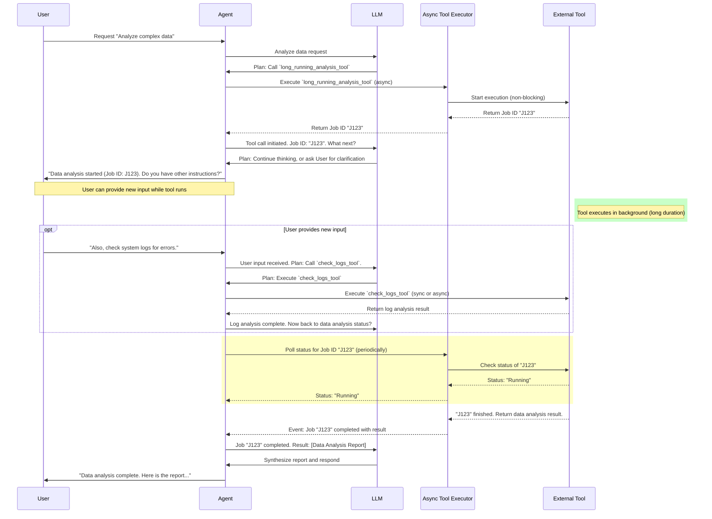

## 에이전트 하네스의 비동기 도구 호출 도입

대규모 언어 모델 (LLM) 기반 에이전트의 효율성과 사용자 경험을 극대화하기 위해, 도구 호출(Tool Calls)의 비동기적 처리와 사용자 개입(User Intervention) 패턴 도입은 필수적인 요소로 부상하고 있습니다. 기존 에이전트 하네스는 도구 실행이 완료될 때까지 LLM이 대기하거나, 주기적인 폴링(Polling) 및 하트비트(Heartbeat) 메시지에 불필요한 토큰을 소모하는 비효율적인 구조를 가질 수 있습니다. 특히 장기 실행(Long-running) 작업, 복잡한 코드 탐색, 광범위한 웹 검색 등 시간이 오래 걸리는 작업에서 이러한 문제는 토큰 비용 증가와 에이전트의 응답성 저하로 직결됩니다.

Unreal Agent와 같은 혁신적인 에이전트 하네스는 도구 호출을 완전히 비동기로 관리함으로써, LLM이 도구 실행 완료를 기다리는 대신 다른 유의미한 작업이나 사용자 피드백 처리에 집중할 수 있게 합니다. 이 접근 방식은 LLM의 토큰 사용량을 절감하고, 에이전트가 작업 중에도 사용자의 추가 지시를 유연하게 받아들여 전반적인 사용자 경험을 향상시킵니다. 본 문서는 비동기 도구 호출 및 사용자 개입 패턴을 Claude Code 하네스와 같은 환경에 적용하는 방법과 그 이점을 다룹니다.

### 비동기 도구 호출의 필요성

기존 LLM 에이전트의 도구 사용은 대개 동기적으로 이루어집니다. 즉, 에이전트가 특정 도구를 호출하면 해당 도구의 실행이 완료되어 결과가 반환될 때까지 에이전트의 추론(Reasoning) 프로세스는 일시 정지됩니다. 이는 단기적이고 빠르게 완료되는 도구에는 문제가 없지만, 다음과 같은 시나리오에서 심각한 병목 현상을 유발합니다.

*   **장기 실행 작업**: 코드 컴파일, 복잡한 데이터 분석, 대규모 파일 시스템 스캔 등 수십 초에서 수분 이상 소요되는 작업.
*   **외부 API 호출**: 응답 시간이 예측 불가능한 서드파티 서비스 통합.
*   **사용자 개입 대기**: 사용자에게 추가 정보를 요청하거나, 승인을 기다리는 경우.

이러한 동기적 대기 시간 동안 LLM은 단순히 "기다리는" 상태를 유지하며, 이 상태를 관리하기 위한 프롬프트(예: "아직 작업 중입니다...", "10초 후 다시 확인")에 불필요한 토큰을 소모하게 됩니다. 이는 결국 운영 비용 증가로 이어집니다.

### 비동기 도구 호출 패턴 설계

비동기 도구 호출은 에이전트가 도구를 실행한 후 즉시 제어권을 다시 가져와 다른 작업을 수행하거나 다음 추론 단계로 넘어갈 수 있도록 합니다. 도구 실행 결과는 별도의 메커니즘을 통해 에이전트에게 통보됩니다. 이 패턴의 핵심은 다음과 같습니다.

1.  **비동기 실행 트리거**: 에이전트가 도구를 호출하면, 도구는 백그라운드에서 실행을 시작하고 즉시 고유한 `작업 ID (Job ID)`를 반환합니다.
2.  **논블로킹 추론**: 에이전트는 `작업 ID`를 기록하고, 도구 완료를 기다리지 않고 다음 추론이나 다른 도구 호출을 진행합니다.
3.  **결과 폴링 또는 콜백**: 에이전트는 주기적으로 `작업 ID`를 사용하여 도구의 상태를 확인(폴링)하거나, 도구 완료 시 특정 콜백 엔드포인트로 결과를 전송하도록 설정할 수 있습니다.
4.  **결과 통합**: 완료된 도구의 결과는 에이전트의 컨텍스트에 통합되어 다음 추론에 활용됩니다.

#### 코드 예시: 비동기 도구 래퍼 (Python, Conceptual)

```python
import uuid
import time
import threading

class AsyncToolManager:
    def __init__(self):
        self.active_jobs = {}
        self.job_results = {}

    def _execute_tool_async(self, tool_name, *args, job_id, **kwargs):
        print(f"Tool {tool_name} (Job ID: {job_id}) started asynchronously.")
        # Simulate long-running tool execution
        time.sleep(5) # This could be an actual API call, file operation etc.
        result = f"Result from {tool_name} with args {args}, kwargs {kwargs} after 5s."
        self.job_results[job_id] = result
        print(f"Tool {tool_name} (Job ID: {job_id}) finished.")

    def call_tool(self, tool_name: str, *args, **kwargs) -> str:
        job_id = str(uuid.uuid4())
        self.active_jobs[job_id] = tool_name
        thread = threading.Thread(
            target=self._execute_tool_async,
            args=(tool_name, *args),
            kwargs={"job_id": job_id, **kwargs}
        )
        thread.start()
        return f"Tool call for {tool_name} initiated. Job ID: {job_id}. Will notify upon completion."

    def get_job_status(self, job_id: str) -> str:
        if job_id in self.job_results:
            return f"Job {job_id} completed. Result: {self.job_results[job_id]}"
        elif job_id in self.active_jobs:
            return f"Job {job_id} is still running ({self.active_jobs[job_id]})."
        return f"Job {job_id} not found."

# Example usage in an agent loop (simplified)
# tool_manager = AsyncToolManager()
# llm_response = tool_manager.call_tool("complex_data_analysis", "report_data.csv", analysis_type="financial")
# print(llm_response) # Agent gets job ID and continues
# # ... agent can do other things ...
# status = tool_manager.get_job_status(job_id_from_llm_response)
# print(status)
```

#### Mermaid 다이어그램: 비동기 도구 호출 흐름



### 사용자 개입 패턴 도입

비동기 도구 호출은 사용자 개입(Human-in-the-loop) 패턴과 시너지를 발휘합니다. 도구가 백그라운드에서 실행되는 동안, 에이전트는 사용자의 추가 지시를 기다리거나, 작업 진행 상황을 사용자에게 알리고 피드백을 요청할 수 있습니다. 이는 다음과 같은 이점을 제공합니다.

*   **향상된 응답성**: 사용자는 오래 기다릴 필요 없이 에이전트와 계속 상호작용할 수 있습니다.
*   **작업 제어**: 사용자는 작업이 예상과 다르게 진행될 경우 중간에 개입하여 방향을 수정하거나 중단할 수 있습니다.
*   **정확도 향상**: 복잡한 문제 해결 시, 에이전트가 불확실한 상황에 직면했을 때 사용자에게 직접 질의하여 정확도를 높일 수 있습니다.

#### 코드 예시: 사용자 개입 처리 (Python, Conceptual)

```python
class AgentInteractionManager:
    def __init__(self, tool_manager: AsyncToolManager):
        self.tool_manager = tool_manager
        self.current_agent_state = {} # Stores context like pending job IDs, current task
        self.user_queue = [] # Queue for incoming user messages

    def process_user_input(self, user_message: str):
        self.user_queue.append(user_message)

    def agent_loop_step(self, llm_inference_func):
        # 1. Check for completed async jobs
        completed_jobs = []
        for job_id in list(self.current_agent_state.get("pending_jobs", {}).keys()):
            status = self.tool_manager.get_job_status(job_id)
            if "completed" in status:
                completed_jobs.append((job_id, status))
                # Update agent state with result, remove from pending
                del self.current_agent_state["pending_jobs"][job_id]
        
        # 2. Integrate completed job results into context
        context_updates = []
        for job_id, result_str in completed_jobs:
            context_updates.append(f"Async Job {job_id} completed: {result_str}")

        # 3. Check for user input
        new_user_inputs = []
        while self.user_queue:
            new_user_inputs.append(self.user_queue.pop(0))

        # 4. Construct prompt for LLM
        current_context = self.current_agent_state.get("context", "")
        prompt_parts = [current_context]
        if context_updates:
            prompt_parts.append("--- Recent Async Tool Results ---")
            prompt_parts.extend(context_updates)
        if new_user_inputs:
            prompt_parts.append("--- New User Instructions ---")
            prompt_parts.extend(new_user_inputs)
        
        full_prompt = "\n".join(prompt_parts)
        
        # 5. Get LLM response
        llm_output = llm_inference_func(full_prompt)
        
        # 6. Parse LLM output for new tool calls or responses
        # (Simplified: assuming LLM returns "CALL_TOOL:tool_name:args" or "RESPOND:message")
        if llm_output.startswith("CALL_TOOL:"):
            parts = llm_output.split(":")
            tool_name = parts[1]
            args = parts[2:]
            job_id_response = self.tool_manager.call_tool(tool_name, *args)
            # Store pending job ID
            if "pending_jobs" not in self.current_agent_state:
                self.current_agent_state["pending_jobs"] = {}
            # Extract job_id from job_id_response (e.g., "Job ID: XXXXX")
            extracted_job_id = job_id_response.split("Job ID: ")[1].split(".")[0]
            self.current_agent_state["pending_jobs"][extracted_job_id] = tool_name
            return f"Agent initiated tool: {job_id_response}"
        elif llm_output.startswith("RESPOND:"):
            return llm_output.replace("RESPOND:", "").strip()
        return llm_output

# Mock LLM inference function
# def mock_llm_inference(prompt):
#    if "check system logs" in prompt:
#        return "CALL_TOOL:check_logs_tool:severity=high"
#    elif "Data analysis started" in prompt and "Do you have other instructions?" in prompt:
#        return "RESPOND:Acknowledged. Waiting for further instructions or analysis completion."
#    elif "Job J123 completed" in prompt:
#        return "RESPOND:Analysis report synthesized. Here are the key findings..."
#    return "RESPOND:Thinking..."

# Example in action (conceptual):
# tool_manager = AsyncToolManager()
# agent_interactor = AgentInteractionManager(tool_manager)
# agent_interactor.current_agent_state["context"] = "Initial task: Analyze sales data."
# print(agent_interactor.agent_loop_step(mock_llm_inference))
# # User sends input
# agent_interactor.process_user_input("What about Q3 revenue projections?")
# print(agent_interactor.agent_loop_step(mock_llm_inference))
# # After some time, tool completes
# print(agent_interactor.agent_loop_step(mock_llm_inference))
```

### Claude Code 하네스 적용 시 이점

Claude Code 하네스는 코드 생성, 디버깅, 리팩토링 등 다양한 개발 작업을 수행하는 데 특화된 에이전트 시스템입니다. 비동기 도구 호출 및 사용자 개입 패턴을 Claude Code 하네스에 적용함으로써 다음과 같은 혁신적인 개선이 가능합니다.

1.  **토큰 비용 절감**: 장시간 소요되는 코드 컴파일, 테스트 실행, 코드베이스 전체 스캔 등의 작업을 비동기적으로 처리하여, LLM이 이러한 작업 완료를 대기하는 동안 발생하는 불필요한 토큰 소비를 최소화합니다. LLM은 그 시간 동안 다른 코드 조각을 분석하거나, 사용자 질문에 답변하거나, 다음 계획을 수립할 수 있습니다.
2.  **응답성 및 사용자 경험 향상**: 사용자는 복잡한 작업이 진행 중일 때에도 하네스와 계속 상호작용하며, 실시간으로 진행 상황을 확인하고 필요한 경우 추가 지시를 내릴 수 있습니다. 예를 들어, "대규모 리팩토링을 시작했지만, 먼저 `auth` 모듈만 집중해줘"와 같은 피드백이 가능해집니다.
3.  **복잡한 개발 워크플로우 효율화**: CI/CD 파이프라인 트리거, 외부 코드 저장소 동기화, 대규모 의존성 설치 등 오래 걸리는 작업을 비동기적으로 관리하여, 개발 에이전트의 전체 워크플로우 속도를 가속화합니다.
4.  **강화된 제어 및 신뢰성**: 사용자가 에이전트의 작업 흐름을 중간에 확인하고 승인하거나 수정할 수 있는 체크포인트(Checkpoint)를 도입하여, 잘못된 방향으로의 진행을 조기에 방지하고 에이전트의 자율성에 대한 신뢰도를 높입니다.

## 트레이드오프

### 1. 복잡성 vs. 효율성 (Complexity vs. Efficiency)

*   **언제 좋은가**: 장기 실행 도구가 많고, 토큰 비용이 중요한 애플리케이션에서 높은 효율성을 제공합니다. LLM이 대기하는 시간을 다른 유의미한 작업으로 대체할 수 있어 전체 처리량(Throughput)이 증가합니다.
*   **언제 나쁜가**: 도구 실행 시간이 매우 짧거나, 도구 의존성(Tool Dependency)이 복잡하여 순차적 실행이 불가피한 경우에는 비동기 로직 도입으로 인한 오버헤드가 효율성 개선 효과를 상회할 수 있습니다. 시스템 설계 및 디버깅 복잡성이 증가합니다.

### 2. 응답성 vs. 자율성 (Responsiveness vs. Autonomy)

*   **언제 좋은가**: 사용자 피드백이 빈번하게 필요하거나, 작업 진행 중 방향 전환이 중요한 대화형 에이전트 및 협업 시나리오에서 사용자 경험을 크게 향상시킵니다. 에이전트가 더 "대화 가능"해집니다.
*   **언제 나쁜가**: 완전히 자율적인(Fully Autonomous) 에이전트 시스템을 목표로 하며, 인간 개입이 최소화되어야 하는 백그라운드 작업이나 반복적인 자동화에는 과도한 사용자 인터페이스 및 상호작용 로직이 불필요한 복잡성을 더할 수 있습니다.

### 3. 개발 오버헤드 vs. 장기적 비용 절감 (Development Overhead vs. Long-term Cost Savings)

*   **언제 좋은가**: 에이전트가 처리하는 작업의 규모가 크고, 반복적이며, 토큰 비용이 상당한 경우 초기 개발 노력 투입 대비 장기적인 운영 비용 절감 효과가 큽니다. 특히 프로덕션 환경에서 대규모 에이전트 배포 시 필수적입니다.
*   **언제 나쁜가**: 프로토타이핑 단계나 소규모, 단발성 작업에서는 비동기 및 개입 로직 구현에 드는 개발 시간이 즉각적인 가치 창출을 지연시킬 수 있습니다. 간단한 스크립트 형태의 에이전트에는 과잉 설계일 수 있습니다.

## 실전 체크리스트

다음은 에이전트 하네스에 비동기 도구 호출 및 사용자 개입 패턴을 도입할 때 고려해야 할 실전 체크리스트입니다.

- [ ] **비동기 도구 인터페이스 표준화**: 모든 장기 실행 도구가 일관된 비동기 API (예: `call_async(args) -> job_id`, `get_status(job_id) -> result | status`)를 제공하는지 확인합니다.
- [ ] **LLM 컨텍스트 관리 전략**: `job_id` 및 중간 상태를 LLM 컨텍스트에 효율적으로 통합하고, 완료된 작업 결과를 적절히 주입하여 토큰 사용량을 최적화하는 메커니즘을 설계합니다.
- [ ] **사용자 개입 지점 정의**: 사용자 피드백이 가장 효과적인 작업 흐름의 체크포인트(예: 대규모 변경 전 승인, 모호한 질문 발생 시)를 식별하고, 해당 지점에서 에이전트가 사용자에게 질의하는 로직을 구현합니다.
- [ ] **폴링/콜백 메커니즘 구현**: 비동기 도구의 결과 통보를 위한 효율적인 폴링 주기 또는 웹훅(Webhook) 기반 콜백 시스템을 구축하고, 실패 시 재시도(Retry) 로직을 포함합니다.
- [ ] **에이전트 상태 저장 및 복원**: 사용자 개입이나 도구 실행 대기 중에 에이전트의 현재 상태(진행 중인 작업, 과거 대화, 컨텍스트 등)를 안정적으로 저장하고 필요시 복원할 수 있는 시스템을 설계합니다.
- [ ] **오래된 작업 정리 (Garbage Collection)**: 완료되었거나 실패한 비동기 작업의 `job_id` 및 관련 리소스를 주기적으로 정리하여 시스템 리소스 누수를 방지하는 정책을 수립합니다.
- [ ] **모니터링 및 로깅**: 비동기 작업의 시작, 진행, 완료, 실패 및 사용자 개입 이벤트에 대한 상세한 모니터링 및 로깅 시스템을 구축하여 문제 진단 및 성능 최적화에 활용합니다.