에이전트 하네스(Agent Harness)에서 컨텍스트 관리는 LLM(Large Language Model) 에이전트의 효율성과 안정성을 결정하는 핵심 요소입니다. 특히 코딩 에이전트와 같이 복잡하고 반복적인 작업을 수행하는 환경에서는 컨텍스트 초과(context overflow)로 인한 조기 종료(early termination) 문제를 방지하고, 모델의 역량과 작업 유형에 따라 컨텍스트 관리 구성요소의 효과를 극대화하는 전략이 필수적입니다. 본 문서는 코딩 에이전트 하네스의 컨텍스트 관리 최적화 방안을 심층적으로 다룹니다.

## Core Problem: Context Overflow and Early Termination
최근 연구에 따르면, 동일한 실행 루프 내에서 계획 수립(planning), 행동 인터페이스(action interface), 컨텍스트 관리(context management) 전략을 변경하여 다양한 모델과 벤치마크를 비교한 결과, 컨텍스트 관리의 주된 효과는 컨텍스트 초과로 인한 조기 종료를 방지하는 데 있음을 확인했습니다. 컨텍스트 초과는 LLM의 제한된 입력 토큰 한계를 넘어설 때 발생하며, 이는 에이전트가 중요한 정보를 잊어버리거나 작업을 완료하지 못하고 실패하게 만듭니다. 이러한 문제는 특히 장기 실행 작업(long-running tasks)에서 두드러집니다.

## Key Components of Agent Harness Context Management
에이전트 하네스 내 컨텍스트 관리는 여러 구성요소의 상호작용을 통해 이루어집니다.

### 계획 수립 (Planning)
에이전트가 다음 행동을 결정하는 과정으로, 이 과정에서 현재 컨텍스트를 활용하여 목표 달성을 위한 최적의 경로를 탐색합니다. 효과적인 계획은 불필요한 정보 탐색을 줄여 컨텍스트 예산을 절약하는 데 기여합니다.

### 행동 인터페이스 (Action Interface)
에이전트가 외부 환경과 상호작용하는 수단으로, 코드 실행, API 호출, 파일 시스템 접근 등 다양한 도구(tool) 사용을 포함합니다. 행동의 결과는 새로운 컨텍스트로 에이전트에게 피드백되며, 이 과정에서 발생하는 정보의 양과 질은 컨텍스트 관리에 직접적인 영향을 미칩니다.

### 컨텍스트 관리 모듈 (Context Management Module)
에이전트의 현재 작업 상태, 과거 대화 기록, 검색된 지식(retrieved knowledge), 도구 사용 결과 등을 효율적으로 압축하고 우선순위를 부여하여 LLM의 컨텍스트 윈도우(context window)에 맞게 조절하는 핵심 모듈입니다. 이 모듈의 설계는 컨텍스트 예산 활용 및 에이전트의 장기적인 성능에 결정적인 역할을 합니다.

## Optimization Strategies for 2026
2026년 에이전트 하네스 컨텍스트 관리의 최신 트렌드는 동적(dynamic), 적응형(adaptive), 의미론적(semantic) 접근 방식을 통해 컨텍스트 효율성을 극대화하는 데 중점을 둡니다.

### 동적 컨텍스트 압축 (Dynamic Context Compaction)
고정된 컨텍스트 요약 방식 대신, 현재 작업의 목표와 진행 상황에 따라 실시간으로 컨텍스트를 압축하는 전략입니다. 중요도가 낮은 과거 대화나 코드 블록은 과감히 요약하거나 제거하고, 핵심적인 정보는 상세히 유지합니다.
*   **Segment-based Summarization**: 긴 코드 파일이나 실행 로그는 관련 섹션별로 분할하여 요약합니다.
*   **Redundancy Elimination**: 의미론적 유사성(semantic similarity)을 기반으로 중복된 정보 제거합니다.

### 의미론적 컨텍스트 캐싱 (Semantic Context Caching)
과거 에이전트 실행에서 자주 사용되었거나 중요하다고 판단된 컨텍스트 조각(chunk)을 의미론적 벡터 데이터베이스(vector database)에 캐싱하여 필요시 빠르게 재활용합니다. 이는 반복적인 정보 검색 비용을 줄이고, 컨텍스트 예산을 효율적으로 사용하게 합니다.

### 적응형 컨텍스트 윈도우 조정 (Adaptive Context Window Adjustment)
LLM의 컨텍스트 윈도우 크기를 고정하지 않고, 현재 작업의 복잡도, 모델의 역량, 가용 토큰 예산에 따라 동적으로 조절합니다. 예를 들어, 단순한 버그 수정에는 작은 윈도우를, 복잡한 기능 개발에는 더 큰 윈도우를 할당합니다.

### 도구 사용별 컨텍스트 (Tool-Use Specific Context)
각 도구(tool)의 특성과 필요한 입력에 맞춰 컨텍스트를 선별적으로 제공합니다. 예를 들어, 특정 API 호출 시에는 해당 API 문서와 관련된 코드 스니펫만 컨텍스트에 포함하고, 파일 시스템 접근 시에는 관련 디렉터리 구조 정보를 우선적으로 제공합니다. 이는 행동 인터페이스와 컨텍스트 관리 모듈의 상호작용을 최적화합니다.

### 하이브리드 메모리 시스템 (Hybrid Memory Systems)
단기 메모리(short-term memory)로서 LLM의 컨텍스트 윈도우와, 장기 메모리(long-term memory)로서 벡터 데이터베이스, 지식 그래프(knowledge graph) 등을 통합하여 사용합니다. 에이전트는 단기적인 추론에는 컨텍스트 윈도우를, 영구적이거나 광범위한 지식에는 장기 메모리를 활용합니다.

## Context Management Example (Python)

아래 Python 코드는 간단한 에이전트의 컨텍스트 관리 로직을 보여줍니다. `AgentContextManager` 클래스는 컨텍스트를 추가하고, LLM에 전달하기 전에 특정 크기로 압축하는 기능을 수행합니다.

```python
import tiktoken
from collections import deque

class AgentContextManager:
    def __init__(self, max_tokens=4000, model_name="claudev3"):
        self.max_tokens = max_tokens
        self.tokenizer = tiktoken.encoding_for_model(model_name)
        self.context_buffer = deque()
        self.current_tokens = 0

    def _get_token_count(self, text):
        return len(self.tokenizer.encode(text))

    def add_message(self, role, content, is_critical=False):
        message = {"role": role, "content": content, "is_critical": is_critical}
        message_tokens = self._get_token_count(f"{role}: {content}")

        if is_critical:
            self.context_buffer.append(message)
            self.current_tokens += message_tokens
        else:
            self.context_buffer.append(message)
            self.current_tokens += message_tokens
            self._compact_context()

    def _compact_context(self):
        while self.current_tokens > self.max_tokens and len(self.context_buffer) > 0:
            if self.context_buffer[0].get("is_critical"):
                found_non_critical = False
                for i in range(1, len(self.context_buffer)):
                    if not self.context_buffer[i].get("is_critical"):
                        removed_msg = self.context_buffer.pop(i)
                        removed_tokens = self._get_token_count(f"{removed_msg['role']}: {removed_msg['content']}")
                        self.current_tokens -= removed_tokens
                        found_non_critical = True
                        break
                if not found_non_critical:
                    removed_msg = self.context_buffer.popleft()
                    removed_tokens = self._get_token_count(f"{removed_msg['role']}: {removed_msg['content']}")
                    self.current_tokens -= removed_tokens
            else:
                removed_msg = self.context_buffer.popleft()
                removed_tokens = self._get_token_count(f"{removed_msg['role']}: {removed_msg['content']}")
                self.current_tokens -= removed_tokens
        
        if self.current_tokens > self.max_tokens:
            print("Warning: Context still exceeds max_tokens after compaction attempt. Consider summarization or larger window.")

    def get_context_for_llm(self):
        full_context_str = []
        for msg in self.context_buffer:
            full_context_str.append(f"{msg['role']}: {msg['content']}")
        
        return "\n".join(full_context_str)

# Usage example
context_manager = AgentContextManager(max_tokens=200) # Small window for demo

context_manager.add_message("user", "Previous interaction about project setup and dependencies.")
context_manager.add_message("assistant", "Configured environment, installed packages A, B, C.")
context_manager.add_message("user", "Problem: 'ModuleNotFoundError' for package D. Check `requirements.txt`.", is_critical=True)
context_manager.add_message("assistant", "I will inspect `requirements.txt` and package D installation status.")
context_manager.add_message("tool_output", "content of requirements.txt: packageA, packageB, packageC")
context_manager.add_message("tool_output", "package D not found in requirements.txt.")

print(f"Current Tokens: {context_manager.current_tokens}")
print(context_manager.get_context_for_llm())
```

**Context Flow with Optimization**

```mermaid
graph TD
    subgraph "Agent Loop"
        A[Start Task] --> B{Planning Module};
        B -- Current Context --> C[LLM Call];
        C -- Action/Observation --> D{Action Interface};
        D -- Raw Feedback --> E[Context Management Module];
        E -- Optimized Context --> B;
        E -- Summarized/Cached Context --> F[Long-Term Memory / Cache];
        F -- Retrieved Context --> B;
    end

    subgraph "Context Management Module"
        E_1[Buffer Input] --> E_2{Dynamic Compaction};
        E_2 --> E_3{Semantic Caching};
        E_3 -- Prioritization --> E_4[Adaptive Window Adjustment];
        E_4 -- Tool-Specific Filtering --> E_5[Output Optimized Context];
    end

    click E_2 "/harness-engineering/dynamic-context-compaction" "Dynamic Context Compaction"
    click E_3 "/harness-engineering/semantic-context-caching" "Semantic Context Caching"
    click E_4 "/harness-engineering/adaptive-context-window-adjustment" "Adaptive Context Window Adjustment"
    click E_5 "/harness-engineering/tool-use-specific-context" "Tool-Use Specific Context"
```



## 트레이드오프

1.  **동적 컨텍스트 압축 (Dynamic Context Compaction)**
    *   **장점**: 컨텍스트 예산을 효율적으로 사용하여 조기 종료를 방지하고, LLM이 핵심 정보에 집중하게 하여 성능을 향상시킵니다.
    *   **단점**: 복잡한 압축 로직(예: LLM 기반 요약)은 추가적인 지연 시간(latency)과 비용을 발생시키며, 잘못된 압축은 중요 정보 손실로 이어질 수 있습니다.
    *   **언제 좋은가**: 컨텍스트 예산이 엄격하고, 장기 실행 작업에서 정보의 양이 방대할 때.
    *   **언제 나쁜가**: 실시간 응답이 중요하고, 컨텍스트 내 모든 정보가 동등하게 중요할 때.

2.  **의미론적 컨텍스트 캐싱 (Semantic Context Caching)**
    *   **장점**: 반복적인 정보 검색 비용을 절감하고, LLM 호출 횟수를 줄여 전체 비용과 지연 시간을 감소시킵니다. 에이전트의 '기억력'을 향상시켜 일관된 행동을 유도합니다.
    *   **단점**: 캐시의 초기 구축 및 유지 관리 비용이 발생하며, 캐시된 정보가 오래되면(stale) 최신성(freshness) 문제가 발생할 수 있습니다.
    *   **언제 좋은가**: 에이전트가 반복적으로 유사한 지식이나 과거 상호작용을 참조하는 시나리오(예: 장기 프로젝트 유지보수).
    *   **언제 나쁜가**: 모든 작업이 고유하고, 과거 컨텍스트의 재활용 가치가 낮은 경우.

3.  **적응형 컨텍스트 윈도우 조정 (Adaptive Context Window Adjustment)**
    *   **장점**: 작업의 실제 요구사항에 맞춰 컨텍스트 예산을 유연하게 할당하여 리소스 낭비를 줄이고 효율성을 높입니다. 다양한 복잡도의 작업에 최적화된 성능을 제공합니다.
    *   **단점**: 최적의 윈도우 크기를 결정하기 위한 휴리스틱(heuristics) 또는 학습 메커니즘이 필요하며, 잘못된 조정은 성능 저하를 초래할 수 있습니다.
    *   **언제 좋은가**: 작업 유형과 LLM 모델 역량이 다양하게 변화하는 에이전트 시스템.
    *   **언제 나쁜가**: 컨텍스트 윈도우 크기가 고정되어도 충분하거나, 동적 조정의 복잡성을 감당하기 어려울 때.

4.  **하이브리드 메모리 시스템 (Hybrid Memory Systems)**
    *   **장점**: LLM의 단기 기억 한계를 극복하고, 방대한 영구 지식을 에이전트에게 제공하여 복잡하고 광범위한 문제 해결 능력을 향상시킵니다.
    *   **단점**: 시스템 아키텍처가 복잡해지며, 단기-장기 메모리 간의 일관성 유지 및 정보 흐름 관리가 어렵습니다.
    *   **언제 좋은가**: 도메인 특화된 방대한 지식이 필요하거나, 에이전트가 장기간에 걸쳐 학습하고 성장해야 하는 시나리오.
    *   **언제 나쁜가**: 에이전트의 작업이 단일 세션 내에서만 이루어지며, 추가적인 영구 기억이 불필요할 때.

## 실전 체크리스트

프로젝트에 에이전트 하네스 컨텍스트 관리 최적화 전략을 적용할 때 다음 항목들을 검증합니다.

- [ ] **컨텍스트 초과 발생률 모니터링**: 에이전트 실행 로그에서 `context overflow` 또는 `early termination` 관련 지표를 정량적으로 추적하고, 특정 임계치(threshold) 이상 발생 시 알림 시스템을 구축했는가?
- [ ] **컨텍스트 예산 활용도 분석**: 각 LLM 호출 시 사용된 토큰 수와 컨텍스트 윈도우 크기 대비 활용률을 분석하여, 불필요하게 많은 컨텍스트가 전달되고 있지는 않은지 확인하는 대시보드를 구축했는가?
- [ ] **핵심 정보 보존 메커니즘 구현**: 동적 압축 또는 요약 과정에서 작업 목표 달성에 필수적인 정보(예: 현재 버그 트레이스, 핵심 요구사항)가 손실되지 않도록 명시적인 우선순위 지정 또는 보호 메커니즘을 적용했는가?
- [ ] **행동 인터페이스와 컨텍스트 모듈의 상호작용 최적화**: 특정 도구(tool) 호출 전후로 필요한 컨텍스트만 선별적으로 주입하고, 도구 출력 중 중요한 부분만 추출하여 다음 컨텍스트에 포함하는 로직을 구현했는가?
- [ ] **적응형 윈도우 조정 정책 검토**: 다양한 작업 유형(예: 코드 생성, 버그 수정, 문서화)에 대해 LLM의 컨텍스트 윈도우 크기를 동적으로 조절하는 정책이 존재하며, 이 정책이 에이전트의 성능 및 비용 지표에 긍정적인 영향을 미치는지 A/B 테스트를 통해 검증했는가?
- [ ] **의미론적 캐시 또는 장기 메모리 통합**: 에이전트가 반복적으로 접근하는 코드 베이스 지식, API 문서, 과거 해결 사례 등을 의미론적으로 캐싱하거나 장기 메모리에 저장하여 컨텍스트 재사용 효율을 높였는가?
- [ ] **컨텍스트 관리에 따른 비용/지연 시간 분석**: 컨텍스트 최적화 전략 적용 전후로 LLM 호출 비용(토큰 수) 및 에이전트의 전체 작업 완료 시간(latency)을 측정하고, 성능 향상 대비 추가 비용 및 복잡성을 평가했는가?