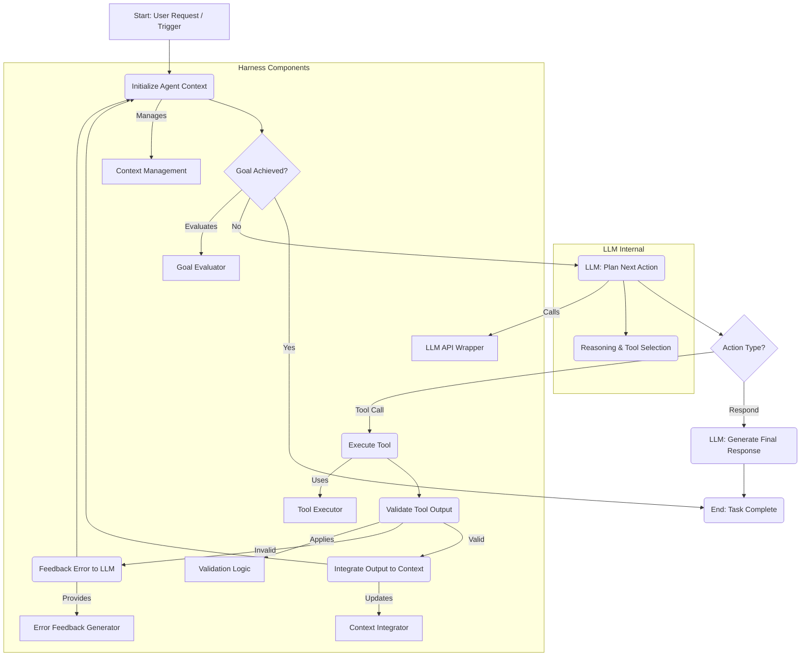

AI 에이전트가 특정 작업을 유용하고 안정적으로 수행하도록 하는 것은 단순한 고성능 LLM 모델만으로는 불가능합니다. 이는 에이전트의 반복적인 동작을 지시하고 검증하는 '하네스(harness)'의 정교한 설계와 '루프 엔지니어링(Loop Engineering)' 원칙의 적용에 달려 있습니다. 에이전트 루프 엔지니어링은 LLM에 초기 컨텍스트를 제공하고, 작업 완료까지 도구를 반복적으로 호출하며, 각 단계의 출력을 검증하고 피드백하여 다음 행동을 결정하는 구조를 체계적으로 설계하는 것을 의미합니다. 특히, 특정 작업 집합에 최적화된 하네스 설계는 에이전트의 효율성과 신뢰성을 극대화하는 핵심 요소입니다.

## 핵심 개념: 에이전트 루프와 하네스

### 기본적인 에이전트 루프 구조

가장 기본적인 에이전트 루프는 다음과 같은 단계를 반복합니다:

1.  **컨텍스트 제공 (Context Provisioning)**: LLM에 현재 상태, 목표, 사용 가능한 도구 목록 및 이전 대화/작업 기록을 제공합니다.
2.  **행동 계획 (Action Planning)**: LLM은 제공된 컨텍스트를 바탕으로 다음 수행할 도구 호출(tool call) 또는 응답 생성을 계획합니다.
3.  **도구 실행 (Tool Execution)**: 계획된 도구를 호출하고 그 결과를 수집합니다.
4.  **결과 통합 및 반복 (Result Integration & Iteration)**: 도구 실행 결과를 컨텍스트에 추가하고, 목표 달성 여부를 평가하여 루프를 계속할지 종료할지 결정합니다.

이 과정에서 에이전트는 목표 지향적인 방식으로 작업을 수행하며, LLM은 '두뇌' 역할을 하여 의사결정을 내립니다.

### 하네스 설계의 중요성

하네스는 에이전트가 이 루프를 안전하고 효율적으로 실행하도록 돕는 인프라 및 로직 계층입니다. 단순히 도구를 호출하는 것을 넘어, 다음과 같은 기능을 포함해야 합니다.

*   **입출력 정제 (I/O Sanitization)**: LLM의 입력 프롬프트를 구성하고, LLM의 출력을 파싱하여 의도된 형식으로 변환합니다.
*   **도구 관리 (Tool Management)**: 사용 가능한 도구를 등록하고, LLM이 도구를 호출할 때 적절한 인터페이스를 제공합니다.
*   **상태 관리 (State Management)**: 루프 전반에 걸쳐 컨텍스트를 유지하고 업데이트합니다.
*   **검증 및 피드백 (Validation & Feedback)**: 도구 실행 결과, LLM 응답, 그리고 전체 작업 흐름의 유효성을 검사하고, 필요한 경우 수정 피드백을 루프에 다시 주입합니다.
*   **오류 처리 및 복구 (Error Handling & Recovery)**: 도구 오류, LLM의 잘못된 응답 등에 대해 견고하게 대응하고 복구 메커니즘을 제공합니다.
*   **감사 및 모니터링 (Auditing & Monitoring)**: 에이전트의 모든 활동을 기록하고, 이상 징후를 감지하여 운영자가 개입할 수 있도록 합니다.

특히 '작업 집합에 맞게 설계된 하네스'는 특정 도메인의 제약 조건, 성공 기준, 예상되는 오류 패턴 등을 반영하여 에이전트의 성능을 극대화합니다. 예를 들어, 코드 생성 에이전트의 하네스는 생성된 코드를 컴파일하고 테스트하는 단계를 포함할 것이고, 데이터 분석 에이전트의 하네스는 SQL 쿼리 유효성 검사 및 데이터 시각화 도구 호출을 담당할 것입니다.

## 에이전트 루프 엔지니어링 원칙 적용

Playbook의 AI 에이전트 하네스 및 자동화 워크플로우 설계 시, '루프 엔지니어링의 미학'에서 제시된 원칙들을 적용하여 견고성을 확보합니다.

### 1. 명확한 목표 및 종료 조건 정의

각 루프는 명확한 시작점과 종료 조건을 가져야 합니다. 모호한 목표는 에이전트가 무한 루프에 빠지거나 엉뚱한 결과를 내는 원인이 됩니다. Playbook에서는 각 자동화 워크플로우에 대한 `TaskSpec` 정의를 통해 최종 목표와 성공/실패 기준을 명시합니다.

### 2. 강력한 검증 및 피드백 루프 구축

단순히 도구의 출력을 다음 입력으로 사용하는 것을 넘어, 각 단계의 출력을 능동적으로 검증하고, 문제가 발견될 경우 LLM에 다시 피드백하여 수정을 유도해야 합니다. 이는 정규 표현식, 스키마 유효성 검사, 코드 린팅, 심지어 다른 LLM 기반 검증 에이전트를 활용할 수도 있습니다.

```python
# Python 예시: 에이전트 하네스의 검증 및 피드백 루프
import json
from typing import List, Dict, Any

class ToolError(Exception):
    pass

class AgentHarness:
    def __init__(self, llm_client, tools: Dict[str, Any]):
        self.llm_client = llm_client
        self.tools = tools
        self.context = []

    def _call_llm(self, prompt: str) -> str:
        # 실제 LLM API 호출 로직 (예: Anthropic Claude, OpenAI GPT)
        response = self.llm_client.generate(prompt=prompt)
        return response.text # 또는 content[0].text

    def _parse_llm_output(self, output: str) -> Dict[str, Any]:
        # LLM 출력을 파싱하여 도구 호출 명령 추출
        # 예: <tool_code>{"tool_name": "search", "args": {"query": "AI trends 2026"}}</tool_code>
        try:
            start_idx = output.find("<tool_code>")
            end_idx = output.find("</tool_code>")
            if start_idx != -1 and end_idx != -1:
                tool_json = output[start_idx + len("<tool_code>"):end_idx]
                return json.loads(tool_json)
            else:
                return {"action": "respond", "content": output}
        except json.JSONDecodeError:
            return {"action": "respond", "content": f"Invalid tool call format: {output}"}

    def _execute_tool(self, tool_name: str, args: Dict[str, Any]) -> str:
        tool_func = self.tools.get(tool_name)
        if not tool_func:
            raise ToolError(f"Unknown tool: {tool_name}")
        try:
            result = tool_func(**args)
            return f"Tool '{tool_name}' executed successfully. Result: {result}"
        except Exception as e:
            raise ToolError(f"Error executing tool '{tool_name}': {e}")

    def run_loop(self, initial_prompt: str, max_iterations: int = 5):
        self.context.append({"role": "user", "content": initial_prompt})

        for i in range(max_iterations):
            full_prompt = self._build_prompt()
            llm_response_text = self._call_llm(full_prompt)
            parsed_action = self._parse_llm_output(llm_response_text)

            if parsed_action.get("action") == "respond":
                print(f"Agent finished: {parsed_action['content']}")
                return parsed_action['content']
            elif "tool_name" in parsed_action:
                tool_name = parsed_action["tool_name"]
                tool_args = parsed_action.get("args", {})
                try:
                    tool_output = self._execute_tool(tool_name, tool_args)
                    print(f"Iteration {i+1}: Executed {tool_name}. Output: {tool_output[:50]}...")
                    self.context.append({"role": "tool_output", "content": tool_output})
                except ToolError as e:
                    print(f"Iteration {i+1}: Tool Error - {e}. Feeding back to LLM.")
                    self.context.append({"role": "error_feedback", "content": f"Tool Error: {e}. Please try again or choose a different approach."})
            else:
                print(f"Iteration {i+1}: Invalid action. Feeding back to LLM. Response: {llm_response_text}")
                self.context.append({"role": "error_feedback", "content": f"Invalid action detected from LLM. Please output a valid tool call or final response. Original output: {llm_response_text}"})

        print("Max iterations reached. Agent could not complete the task.")
        return "Task incomplete due to max iterations."

    def _build_prompt(self) -> str:
        # 전체 컨텍스트와 사용 가능한 도구 목록을 포함한 프롬프트 생성
        # 실제 구현에서는 더 복잡한 프롬프트 템플릿 사용
        prompt_parts = []
        prompt_parts.append("You are an AI assistant. Your goal is to help the user. Use the provided tools if necessary. Respond with <tool_code>{"tool_name": "your_tool", "args": {}}</tool_code> to use a tool, or provide a final response.")
        prompt_parts.append("\nAvailable tools:")
        for name, tool_func in self.tools.items():
            prompt_parts.append(f"- {name}: {tool_func.__doc__}")
        prompt_parts.append("\nConversation history:")
        for entry in self.context:
            prompt_parts.append(f"{entry['role'].capitalize()}: {entry['content']}")
        prompt_parts.append("\nYour next action:")
        return "\n".join(prompt_parts)

# 예시 도구
def search_web(query: str) -> str:
    """Searches the web for information based on the query."""
    # 실제 웹 검색 API 호출
    return f"Search results for '{query}': ... (simulated result)"

# 사용 예시 (LLM 클라이언트는 mock 객체로 대체)
class MockLLMClient:
    def generate(self, prompt: str):
        class MockResponse:
            text = ""
        response = MockResponse()
        if "AI trends 2026" in prompt:
            response.text = "<tool_code>{\"tool_name\": \"search_web\", \"args\": {\"query\": \"AI trends 2026\"}}</tool_code>"
        elif "Tool Error" in prompt:
            response.text = "Okay, I understand there was an error with the search. Let me try a different approach: What are the key ethical considerations for AI in 2026?"
        else:
            response.text = "The future of AI in 2026 will focus on explainable AI, robust agent systems, and ethical deployment."
        return response

mock_tools = {"search_web": search_web}
mock_llm = MockLLMClient()
harness = AgentHarness(mock_llm, mock_tools)
harness.run_loop("What are the major AI trends expected in 2026?")
```

### 3. 상황별 컨텍스트 관리

LLM의 컨텍스트 윈도우 한계를 고려하여, 관련성이 높은 정보만 선별하여 제공해야 합니다. 이는 컨텍스트 압축(context compaction), 요약(summarization), 또는 동적 검색(retrieval) 메커니즘을 통해 이루어질 수 있습니다. Playbook은 `agentic-context-compaction-trigger-heuristics`와 같은 전략을 활용하여 컨텍스트의 효율성을 최적화합니다.

### 4. 확장 가능하고 모듈화된 하네스 아키텍처

하네스는 새로운 도구, 검증 로직, 또는 LLM 모델이 쉽게 통합될 수 있도록 모듈화되어야 합니다. 이는 에이전트 시스템의 장기적인 유지보수성과 확장성에 필수적입니다. 마이크로 서비스 아키텍처나 플러그인 기반 설계를 고려할 수 있습니다.

### 5. 투명한 실행 및 감사 기능

에이전트가 어떤 결정을 내리고 어떤 도구를 사용했으며, 어떤 결과를 얻었는지 명확하게 기록되어야 합니다. 이는 디버깅, 성능 분석, 그리고 시스템의 신뢰성을 확보하는 데 중요합니다. SpanLens와 같은 도구를 활용하여 에이전트의 트레이스(trace)를 시각화할 수 있습니다.

## 에이전트 루프 엔지니어링의 상세 흐름



위 다이어그램은 에이전트 루프의 핵심 단계를 보여줍니다. 특히, LLM이 다음 행동을 계획하는 `D(LLM: Plan Next Action)` 단계와 도구 실행 후 `G(Validate Tool Output)` 단계에서 피드백 루프가 작동하는 것을 확인할 수 있습니다. `G` 단계에서 출력이 유효하지 않을 경우, `I(Feedback Error to LLM)`를 통해 LLM에 오류 정보를 다시 주입하여 다음 계획에 반영하도록 합니다. 이는 LLM이 자체적으로 오류를 인지하고 수정하는 `Self-correction` 메커니즘의 기반이 됩니다.

## 트레이드오프

### 1. **복잡성 vs. 견고성**
*   **언제 좋음**: 고도의 신뢰성과 정확성이 요구되는 프로덕션 환경에서, 예측 불가능한 LLM의 행동을 제어하고 예상치 못한 오류에 대응하기 위해 복잡한 하네스 설계가 필수적일 때. 특히 금융, 의료, 법률 등 규제 환경에서 에이전트를 사용할 경우. `closed-loop-automation-design-philosophy-feedback-dimension`과 관련.
*   **언제 나쁨**: POC(개념 증명) 단계나 단순 반복 작업에서는 과도한 복잡성이 개발 속도를 저해하고 불필요한 오버헤드를 발생시킬 수 있습니다. 초기에는 빠른 구현을 위해 최소한의 하네스부터 시작하는 것이 효율적일 수 있습니다.

### 2. **유연성 vs. 제어**
*   **언제 좋음**: LLM이 다양한 도구를 자유롭게 조합하여 창의적인 방식으로 문제를 해결하도록 유도하면서도, 비즈니스 로직이나 안전 제약을 벗어나지 않도록 명확한 가드레일(guardrails)을 설정해야 할 때. `agents/ai-agent-superpowers-guardrails-intent-alignment`과 관련.
*   **언제 나쁨**: 에이전트의 행동이 고도로 예측 가능하고 정형화된 시나리오에서는 유연성을 제한하고 정해진 경로만 따르도록 하는 것이 오히려 효율적일 수 있습니다. 과도한 유연성은 예상치 못한 행동으로 이어질 수 있습니다.

### 3. **성능(속도) vs. 정확성/신뢰성**
*   **언제 좋음**: 에이전트의 결과가 비즈니스에 직접적인 영향을 미치거나, 오류가 치명적인 결과를 초래할 수 있는 경우, 여러 검증 단계와 재시도(retry) 메커니즘을 포함하여 정확성과 신뢰성을 최우선으로 확보해야 할 때. `harness-engineering/llm-inference-reliability-validation-harness`과 관련.
*   **언제 나쁨**: 실시간 응답이 중요하거나, 대량의 작업을 빠르게 처리해야 하는 경우, 각 루프의 검증 및 피드백 오버헤드가 전체 처리량을 저하시킬 수 있습니다. 이때는 `agentic-loop-analytical-chain-lite-mode`처럼 경량화된 루프 설계가 필요합니다.

### 4. **개발 비용 vs. 운영 비용**
*   **언제 좋음**: 초기 하네스 설계에 더 많은 자원(시간, 인력)을 투자하여 강력한 검증 및 자동 복구 메커니즘을 구축함으로써, 장기적으로 운영 단계에서의 수동 개입, 오류 처리 비용, 잠재적 문제 발생 비용을 크게 절감할 수 있을 때.
*   **언제 나쁨**: 단기 프로젝트이거나, 에이전트의 수명 주기가 짧을 것으로 예상되는 경우, 초기 개발 비용을 최소화하고 운영 중 발생할 수 있는 문제를 수동으로 처리하는 것이 더 경제적일 수 있습니다.

## 실전 체크리스트

에이전트 루프 엔지니어링 원칙과 하네스 설계를 프로젝트에 적용할 때 다음 항목들을 검증합니다.

- [ ] **명확한 목표 및 종료 조건 정의**: 각 에이전트 루프의 최종 목표와 성공/실패를 판단할 수 있는 구체적인 조건이 명시적으로 정의되었는가?
- [ ] **입력 유효성 검사 구현**: LLM에 입력되는 모든 컨텍스트와 도구 호출 인자가 스키마 또는 규칙에 따라 자동으로 유효성 검사되는가? (예: `json.schema` 검증)
- [ ] **도구 출력 및 LLM 응답 검증 로직**: 도구의 실행 결과와 LLM의 응답이 다음 단계로 전달되기 전에 최소 1개 이상의 검증 로직(예: 정규 표현식, 의미론적 검사 LLM)을 통과하는가?
- [ ] **오류 피드백 및 재시도 메커니즘**: 도구 실행 오류 또는 LLM의 잘못된 응답 시, 해당 오류가 LLM에 다시 피드백되어 재시도를 유도하거나 다른 접근 방식을 시도하도록 설계되었는가?
- [ ] **컨텍스트 최적화 전략**: 장기 실행 루프를 위해 컨텍스트 윈도우 한계를 관리하는 요약 또는 검색 기반 컨텍스트 압축 전략이 구현되었는가?
- [ ] **운영 모니터링 및 감사**: 에이전트의 모든 의사결정, 도구 호출, 검증 결과 및 피드백 루프 작동 내역이 기록되고 시각화되어 운영자가 쉽게 감사하고 디버깅할 수 있는가? (예: `spanlens-llm-observability-agent-trace-monitoring`)
- [ ] **하네스 모듈화 및 확장성**: 새로운 도구나 검증 로직이 추가될 때 기존 하네스 코드의 변경 없이 쉽게 통합될 수 있는 모듈화된 아키텍처를 갖추었는가?
