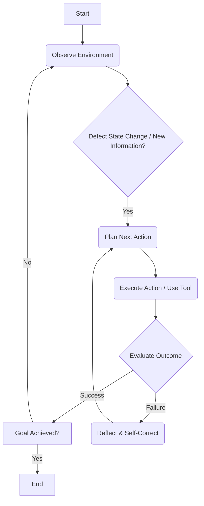

AI 에이전트 운영의 패러다임이 단일 프롬프트 지시 방식에서 반복적인 작업 사이클을 수행하는 루프 패턴으로 진화하고 있습니다. 이는 에이전트의 자율성과 복잡한 태스크 완료율을 획기적으로 향상시키는 핵심 전략입니다. 기존 방식의 한계는 LLM이 한 번의 추론으로 완벽한 결과를 내기 어렵다는 점에 있습니다. 특히 복잡하거나 모호한 목표의 경우, 에이전트는 피드백을 통해 자신의 행동을 수정하고 목표에 점진적으로 수렴해 나가는 iterative process가 필수적입니다.

## 에이전트 루프의 핵심 개념

에이전트 루프는 특정 정지 조건이 충족될 때까지 일련의 행동 단계를 반복하는 패턴을 의미합니다. 이는 인간의 문제 해결 방식인 '시도-오류-수정' 과정을 AI 에이전트에 적용하는 것으로, 에이전트가 환경과 상호작용하며 지속적으로 학습하고 개선하도록 돕습니다. Claude Code 팀의 분석에 따르면, 에이전트 루프는 크게 네 가지 기준으로 분류할 수 있습니다.

### 1. 트리거 방식 (Triggering Mechanisms)

루프가 시작되는 조건입니다. 이는 내부 상태 변화, 외부 이벤트, 시간 주기 등 다양합니다.

*   **내부 상태 기반**: 에이전트의 `thought`나 `observation`이 특정 임계값(threshold)을 넘거나, 새로운 정보가 발견될 때. 예를 들어, 코드를 컴파일했을 때 오류가 발생하면 수정 루프를 트리거합니다.
*   **외부 이벤트 기반**: API 호출 결과, 사용자 입력, 파일 시스템 변경 등 외부 시스템의 변화에 반응하여 루프가 시작됩니다.
*   **시간 기반**: 주기적으로 특정 작업을 수행하거나 상태를 점검할 때 사용됩니다. (예: `cron` 잡 형태)

### 2. 정지 방식 (Stopping Conditions)

루프가 종료되는 조건입니다. 무한 루프를 방지하고 효율적인 자원 사용을 위해 매우 중요합니다.

*   **목표 달성**: 에이전트가 최종 목표를 성공적으로 완료했을 때. (예: 모든 테스트 케이스 통과, 특정 파일 생성 완료)
*   **오류 임계값**: 특정 수 이상의 오류가 발생하거나, 동일한 오류가 반복될 때.
*   **자원 한계**: 최대 반복 횟수, 할당된 시간, API 토큰 비용 등 자원 제약에 도달했을 때.
*   **인간 개입**: `Human-in-the-Loop` (HITL) 시스템에서 사용자의 명시적인 중단 명령.

### 3. 사용 프리미티브 (Primitives Used)

루프 내에서 에이전트가 수행하는 기본적인 행동 단위입니다.

*   **Tool Usage**: 외부 API 호출, 코드 실행, 데이터베이스 쿼리 등.
*   **Internal Reasoning**: `Chain-of-Thought` (CoT) 또는 `Self-Reflection`을 통해 다음 행동 계획을 수립.
*   **Sub-agent Invocation**: 특정 전문 분야를 담당하는 다른 에이전트에게 태스크를 위임.

### 4. 적합 작업 유형 (Suitable Task Types)

에이전트 루프가 가장 효과적인 태스크의 종류입니다.

*   **복잡한 코딩 및 디버깅**: 다단계 코드 생성, 테스트, 오류 수정.
*   **장기 데이터 분석**: 데이터 수집, 전처리, 모델 훈련, 결과 평가의 반복.
*   **다단계 문제 해결**: 여러 하위 목표로 분해되고 각 단계에서 피드백이 필요한 문제.

## 에이전트 루프 아키텍처 다이어그램

일반적인 에이전트 루프의 흐름은 다음과 같습니다.



## 실제 동작 코드 예제: 자율 코드 수정 에이전트

다음은 Python을 활용한 매우 간소화된 자율 코드 수정 에이전트의 예시입니다. 에이전트는 `check_code_errors` 툴을 사용하여 코드 오류를 감지하고, `fix_code` 툴로 수정하는 과정을 반복합니다. `max_attempts`라는 정지 조건을 통해 무한 루프를 방지합니다.

```python
import json

# --- Mocks for external tools (실제 환경에서는 LLM 호출 및 외부 API 연동)

def mock_check_code_errors(code_content):
    # Simulate code linting or compilation errors
    if "buggy_function" in code_content and "return x + y" not in code_content:
        return {"errors": [{"line": 5, "message": "Missing return statement in buggy_function"}]}
    if "syntax error" in code_content:
        return {"errors": [{"line": 1, "message": "Invalid syntax"}]}
    return {"errors": []}

def mock_fix_code(current_code, error_report):
    # Simulate LLM's code fixing capability
    # This would typically involve a call to an LLM with the code and error_report
    if "Missing return statement" in json.dumps(error_report):
        print("Agent: Attempting to fix missing return statement...")
        return current_code.replace("def buggy_function(x, y):", "def buggy_function(x, y):\n    return x + y")
    if "syntax error" in json.dumps(error_report):
        print("Agent: Attempting to fix syntax error...")
        return current_code.replace("syntax error", "pass # Fixed syntax")
    return current_code

# --- Agent Core Logic

class CodeCorrectionAgent:
    def __init__(self, initial_code, max_attempts=5):
        self.current_code = initial_code
        self.max_attempts = max_attempts
        self.attempts = 0
        self.is_code_clean = False

    def run(self):
        print("Agent: Starting code correction loop...")
        while not self.is_code_clean and self.attempts < self.max_attempts:
            self.attempts += 1
            print(f"\n--- Attempt {self.attempts} ---")
            
            # 1. Observe: Check for errors
            error_report = mock_check_code_errors(self.current_code)
            
            if error_report["errors"]:
                print(f"Agent: Errors found: {json.dumps(error_report['errors'])}")
                # 2. Act: Fix code if errors exist
                self.current_code = mock_fix_code(self.current_code, error_report)
                print("Agent: Code after attempted fix:\n" + self.current_code)
            else:
                print("Agent: No errors found. Code is clean.")
                self.is_code_clean = True
                
        if self.is_code_clean:
            print("\nAgent: Code correction completed successfully!")
            return self.current_code
        else:
            print("\nAgent: Failed to fix code after max attempts.")
            return self.current_code

# --- Usage Example

buggy_code = """
def buggy_function(x, y):
    # This function is supposed to return something
    pass
"""

agent = CodeCorrectionAgent(buggy_code)
final_code = agent.run()
print("\n--- Final Code ---")
print(final_code)

# Example with a syntax error
syntax_error_code = """
syntax error
def hello():
    print("World")
"""
syntax_agent = CodeCorrectionAgent(syntax_error_code)
syntax_agent.run()
```

## 2026년 에이전트 루프 최신 트렌드

2026년에는 에이전트 루프 패턴이 더욱 고도화되어 AI 시스템의 핵심을 이룰 것입니다. 주요 트렌드는 다음과 같습니다.

*   **적응형 루프 (Adaptive Loops)**: 고정된 루프 로직이 아닌, 에이전트의 현재 성능, 작업 복잡도, 사용 가능한 리소스에 따라 동적으로 루프의 구조나 프리미티브를 변경하는 방식입니다. 예를 들어, 쉬운 태스크에는 `few-shot` 추론 후 바로 종료하고, 복잡한 태스크에는 `multi-step reflection` 루프를 적용합니다.
*   **동적 종료 조건 (Dynamic Termination Conditions)**: 단순히 최대 횟수를 넘어, `cost` 예산, `confidence score`, `semantic similarity` 변화율 등 다차원적인 지표를 활용하여 루프를 효율적으로 종료합니다. 이를 통해 과도한 리소스 소모를 방지하고 최적의 시점에 작업을 완료합니다.
*   **RAG 및 Long-Term Memory 통합**: 루프 내에서 `Retrieval-Augmented Generation` (RAG) 및 장기 기억 시스템 (long-term memory system)을 적극적으로 활용하여, 에이전트가 반복 과정에서 새로운 지식을 획득하고 기존 컨텍스트를 지속적으로 보강합니다. 이는 특히 `codebase` 학습이나 복잡한 `documentation` 작업에서 할루시네이션(hallucination) 감소 및 정확도 향상에 기여합니다.
*   **향상된 관측성 (Enhanced Observability)**: 루프 내 각 단계의 실행, 결정 과정, 상태 변화를 상세히 추적하고 시각화하는 `observability` 도구들이 필수적으로 통합됩니다. 이를 통해 에이전트의 '생각'을 이해하고, 예상치 못한 동작이나 무한 루프 상황을 빠르게 진단하고 디버깅할 수 있습니다.
*   **멀티모달 에이전트 루프 (Multimodal Agent Loops)**: 텍스트 외에 이미지, 비디오, 음성 등 다양한 모달리티(modality)를 이해하고 생성하는 에이전트가 등장하면서, 각 모달리티에 특화된 `observation` 및 `action` 프리미티브가 루프에 통합됩니다. 이는 실제 세계의 복잡한 문제 해결에 더욱 강력한 기능을 제공합니다.

## 트레이드오프

에이전트 운영 패턴에 반복 루프를 적용하는 것은 강력한 이점을 제공하지만, 동시에 고려해야 할 트레이드오프가 존재합니다.

1.  **자율성 증대 vs 제어 복잡성 증가**: 
    *   **좋을 때**: 예측하기 어려운 환경이나 복잡한 문제에서 에이전트가 스스로 최적의 경로를 찾아내고, `human-in-the-loop` 개입 없이 작업을 완료하는 자율성이 극대화됩니다.
    *   **나쁠 때**: 에이전트의 행동이 예측 불가능해지거나, 무한 루프에 빠지거나, 의도하지 않은 부작용(side effect)을 일으킬 위험이 있습니다. 디버깅 및 감사 (auditing)가 어려워질 수 있습니다.

2.  **작업 완료율 향상 vs 리소스 소모**: 
    *   **좋을 때**: 단일 시도에서 실패하더라도 반복적인 시도와 수정 과정을 통해 최종 목표 달성 확률이 크게 증가합니다. 특히 `deterministic`하지 않은 LLM의 특성상 여러 번 시도하는 것이 유리합니다.
    *   **나쁠 때**: 불필요한 반복이나 비효율적인 루프 디자인은 컴퓨팅 자원(GPU) 및 LLM API 비용을 과도하게 소모시킬 수 있으며, 작업 완료까지의 시간이 지연될 수 있습니다.

3.  **적응성 vs 예측 가능성**: 
    *   **좋을 때**: 동적으로 변화하는 입력이나 환경 조건에 에이전트가 유연하게 적응하여 최적의 `strategy`를 동적으로 생성하고 실행할 수 있습니다. 이는 견고하고 유연한 시스템 구축에 기여합니다.
    *   **나쁠 때**: 에이전트의 행동 흐름이 `dynamic`하게 변하기 때문에, 특정 입력에 대한 출력이나 행동 시퀀스를 정확히 예측하기 어려워집니다. 이는 시스템의 안정성 및 재현성 (reproducibility) 확보를 어렵게 만듭니다.

4.  **복잡한 문제 해결 능력 vs 설계 및 구현 난이도**: 
    *   **좋을 때**: 다단계 추론, 탐색, 정련, 그리고 `self-correction`이 필요한 고난도 문제를 효과적으로 해결할 수 있는 능력을 제공합니다. (예: `end-to-end` 코드 생성 및 디버깅)
    *   **나쁠 때**: 루프의 시작 및 종료 조건, 피드백 메커니즘, `primitive` 선택 등 초기 설계의 복잡성이 매우 높습니다. 견고하고 효율적인 루프를 구현하는 것은 상당한 `engineering effort`를 요구합니다.

## 실전 체크리스트

에이전트 운영 패턴에 반복 루프를 적용할 때 다음 항목들을 검토하여 시스템의 견고함과 효율성을 확보해야 합니다.

- [ ] **명확한 시작 및 종료 조건 정의**: 루프가 시작되는 트리거와 종료되는 정지 조건(예: 목표 달성, 최대 반복 횟수, 시간 초과)이 명확하게 정의되어 무한 루프나 불필요한 실행을 방지하는가?
- [ ] **상태 및 컨텍스트 관리**: 각 루프 사이클에서 에이전트의 내부 상태(`memory`) 및 외부 환경 컨텍스트가 적절하게 업데이트되고 다음 사이클에 정확하게 전달되는가?
- [ ] **오류 감지 및 복구 로직**: 에이전트가 반복 과정에서 발생하는 `runtime error`나 `validation failure`를 감지하고, 이에 대한 `graceful recovery` 또는 `self-correction` 로직이 구현되어 있는가?
- [ ] **리소스 사용량 모니터링**: LLM 토큰 사용량, 컴퓨팅 시간 등 `resource consumption`을 실시간으로 모니터링하고, `cost` 또는 성능 `threshold` 초과 시 루프를 안전하게 종료하거나 경고를 발생시키는가?
- [ ] **관측성 (Observability) 메커니즘**: 루프 내 각 단계의 `thought`, `action`, `observation`이 상세하게 로깅되며, 이를 시각화하여 에이전트의 `decision-making` 과정을 추적하고 디버깅할 수 있는가?
- [ ] **결과물 유효성 검사 (Output Validation)**: 루프 종료 후 에이전트의 최종 결과물에 대한 `automated validation` 단계가 포함되어, 생성된 결과의 품질과 정확성을 검증하는가?
- [ ] **Human-in-the-Loop (HITL) 통합**: 복잡하거나 중요한 결정 지점에서 `human operator`가 루프 진행 상황을 검토하고, 필요시 개입하거나 지시를 변경할 수 있는 인터페이스 또는 `policy`가 마련되어 있는가?