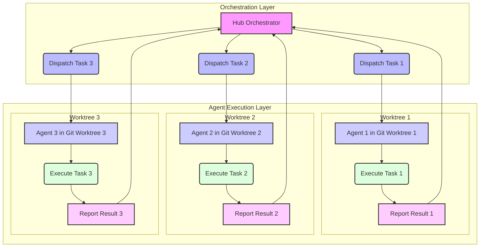

AI 에이전트 시스템이 복잡해지고 처리해야 할 워크로드가 증가함에 따라, 효율적인 병렬 실행과 안정적인 환경 격리(isolation)는 필수적인 설계 요소로 부상하고 있습니다. 특히, 여러 에이전트가 동시에 다양한 작업을 수행하거나, 동일한 작업을 여러 변형으로 시도하여 최적의 결과를 찾는 시나리오에서 이러한 패턴은 생산성과 신뢰성을 크게 향상시킬 수 있습니다. 최근 오픈소스 Kanban 데스크톱 앱 KanBots는 칸반 카드별로 Claude Code와 Codex 같은 LLM 에이전트를 병렬 실행하며, 각 실행을 별도의 Git worktree에서 격리하는 혁신적인 접근 방식을 선보였습니다. 이 패턴은 Playbook의 허브-워커 복리 자동화(hub-worker compounding automation) 및 LLM 출력 검증 파이프라인에 적용하여 에이전트 관제 효율성을 극대화할 수 있는 잠재력을 가집니다.

## 핵심 개념: Git Worktree를 활용한 에이전트 격리

`git worktree`는 하나의 Git 저장소(repository)에 대해 여러 개의 작업 디렉토리(working directory)를 생성할 수 있는 Git 기능입니다. 이는 마치 동일한 저장소의 여러 브랜치(branch)를 동시에 체크아웃(checkout)하여 작업하는 것과 유사합니다. 각각의 worktree는 독립적인 브랜치에 연결될 수 있으며, 파일 시스템 상에서 별도의 폴더로 존재합니다. 이 특성은 AI 에이전트의 병렬 실행 및 격리에 매우 유용하게 활용될 수 있습니다.

### 에이전트 관점에서의 격리 이점

1.  **의존성 격리 (Dependency Isolation):** 각 에이전트 작업 공간은 고유한 `venv` (virtual environment) 또는 컨테이너 환경을 가질 수 있습니다. 이는 서로 다른 에이전트가 상충하는 라이브러리 버전이나 환경 설정을 요구할 때 발생하는 충돌을 방지합니다.
2.  **환경 재현성 (Environment Reproducibility):** 특정 작업을 수행하는 에이전트는 특정 Git 커밋(commit) 또는 브랜치 상태에 고정된 worktree에서 실행될 수 있습니다. 이는 문제가 발생했을 때 정확한 환경을 재현하여 디버깅하거나, 특정 시점의 에이전트 동작을 감사(audit)하는 데 필수적입니다.
3.  **상태 관리 단순화 (Simplified State Management):** 각 worktree는 에이전트 실행 중 발생하는 중간 결과물이나 상태를 해당 작업 공간 내에 보관할 수 있습니다. 이는 중앙 저장소의 복잡성을 줄이고, 에이전트 간의 불필요한 상태 간섭을 방지합니다.
4.  **병렬 실행 시 충돌 방지 (Conflict Prevention):** 여러 에이전트가 동시에 동일한 코드베이스에 변경을 가하더라도, 각 에이전트는 독립적인 worktree에서 작업하므로 직접적인 파일 시스템 수준의 충돌 없이 안전하게 병렬 실행됩니다. 커밋 및 병합은 중앙 허브에서 관리합니다.

## 에이전트 병렬 실행 아키텍처

KanBots의 사례처럼, 중앙 허브(Hub)가 전체 워크플로우를 관리하고 개별 작업을 워커 에이전트(Worker Agents)에게 할당하는 허브-워커 모델에 `git worktree` 패턴을 통합할 수 있습니다. 예를 들어, `Playbook`의 복리 자동화 시스템에서 특정 작업을 위해 여러 LLM 에이전트가 동시에 다양한 전략을 탐색해야 할 때, 각 전략 에이전트에게 별도의 worktree를 할당하여 격리된 환경에서 실행시킵니다.

LLM 출력 검증 파이프라인의 경우, 원본 LLM의 출력을 검증하기 위해 여러 검증 에이전트(Validation Agents)를 병렬 실행할 수 있습니다. 각 검증 에이전트는 원본 출력의 특정 측면(예: 사실 관계, 코드 문법, 보안 취약점 등)을 담당하며, 독립된 worktree에서 검증 로직과 의존성을 갖춘 채로 실행됩니다. 이는 검증 프로세스의 처리량을 높이고, 각 검증 단계의 신뢰성을 보장합니다.

## 구현 예제: Git Worktree 기반 에이전트 오케스트레이션

다음은 Python을 이용한 `git worktree` 기반의 에이전트 오케스트레이션 개념을 보여주는 의사 코드(pseudo-code)입니다. 실제 구현에서는 `subprocess` 모듈을 통해 Git 명령어를 실행하고, 각 worktree 내에서 에이전트 스크립트를 실행하는 방식으로 진행됩니다.

```python
import subprocess
import os
import shutil
import time

def run_command(command, cwd=None):
    """Run a shell command."""
    print(f"Executing: {command} in {cwd if cwd else os.getcwd()}")
    try:
        result = subprocess.run(command, shell=True, check=True, cwd=cwd, capture_output=True, text=True)
        print(result.stdout)
        if result.stderr: print(f"Stderr: {result.stderr}")
        return result.stdout
    except subprocess.CalledProcessError as e:
        print(f"Command failed: {e}")
        print(f"Stdout: {e.stdout}")
        print(f"Stderr: {e.stderr}")
        raise

def setup_agent_worktree(repo_path, agent_id, branch_name):
    """Setup a new Git worktree for an agent."""
    worktree_path = os.path.join("agents_worktrees", f"agent_{agent_id}")
    if os.path.exists(worktree_path):
        shutil.rmtree(worktree_path) # Clean up previous worktree if exists
    run_command(f"git worktree add --detach {worktree_path} {branch_name}", cwd=repo_path)
    # Create a virtual environment and install dependencies within the worktree
    run_command(f"python -m venv venv", cwd=worktree_path)
    run_command(f"./venv/bin/pip install -r requirements.txt", cwd=worktree_path)
    return worktree_path

def execute_agent_task(worktree_path, task_data):
    """Execute an agent's task within its worktree."""
    print(f"Agent in {worktree_path} executing task: {task_data}")
    # Simulate agent execution
    # In a real scenario, this would call an agent script with task_data
    agent_script_path = os.path.join(worktree_path, "agent_script.py")
    run_command(f"{os.path.join(worktree_path, 'venv', 'bin', 'python')} {agent_script_path} \"{task_data}\"", cwd=worktree_path)
    time.sleep(2) # Simulate work
    result = f"Result from {worktree_path} for task {task_data}"
    # Optionally, agent could commit changes to its worktree branch
    # run_command(f"git add . && git commit -m 'Agent {agent_id} completed task'", cwd=worktree_path)
    return result

def cleanup_agent_worktree(repo_path, worktree_path):
    """Cleanup an agent's Git worktree."""
    run_command(f"git worktree remove --force {worktree_path}", cwd=repo_path)
    if os.path.exists(worktree_path):
        shutil.rmtree(worktree_path) # Ensure removal

# Main orchestration logic
if __name__ == "__main__":
    REPO_ROOT = "."
    base_branch = "main"

    # Assume a dummy requirements.txt and agent_script.py exist in the main branch
    # For demonstration, let's create them:
    with open(os.path.join(REPO_ROOT, "requirements.txt"), "w") as f: f.write("requests\n")
    with open(os.path.join(REPO_ROOT, "agent_script.py"), "w") as f: f.write(
        """import sys
import os
print(f"Hello from agent_script.py in {os.getcwd()} with task: {sys.argv[1]}")
with open('agent_output.txt', 'w') as f: f.write(f'Processed: {sys.argv[1]}\n')
"""
    )

    # Initialize a Git repo if not already one
    if not os.path.exists(os.path.join(REPO_ROOT, ".git")):
        run_command("git init", cwd=REPO_ROOT)
        run_command("git add . && git commit -m 'Initial commit'", cwd=REPO_ROOT)

    tasks = ["task-A", "task-B", "task-C"]
    worktrees = []
    results = []

    for i, task in enumerate(tasks):
        agent_id = f"worker_{i}"
        # For simplicity, detach worktree. In real scenario, create specific branch for each agent.
        worktree_path = setup_agent_worktree(REPO_ROOT, agent_id, base_branch)
        worktrees.append((agent_id, worktree_path, task))

    # Execute tasks in parallel (conceptual parallelism using threads/processes in real app)
    for agent_id, worktree_path, task in worktrees:
        # In a real system, this would be a separate process/thread
        try:
            output = execute_agent_task(worktree_path, task)
            results.append(output)
            # Retrieve outputs (e.g., agent_output.txt) from worktree_path
            with open(os.path.join(worktree_path, "agent_output.txt"), "r") as f:
                print(f"Collected output for {agent_id}: {f.read().strip()}")
        except Exception as e:
            print(f"Agent {agent_id} failed: {e}")
        finally:
            cleanup_agent_worktree(REPO_ROOT, worktree_path)

    print("\n--- All agent tasks completed ---")
    for res in results:
        print(res)

    # Clean up dummy files
    os.remove(os.path.join(REPO_ROOT, "requirements.txt"))
    os.remove(os.path.join(REPO_ROOT, "agent_script.py"))
```

이 예제는 `main` 브랜치를 기반으로 여러 개의 `worktree`를 생성하고, 각 `worktree` 내에 독립적인 가상 환경을 설정한 뒤 에이전트 스크립트를 실행하는 과정을 시뮬레이션합니다. 작업 완료 후에는 `worktree`를 정리하여 시스템 자원을 확보합니다. 실제 시스템에서는 `asyncio`나 `multiprocessing` 라이브러리를 사용하여 병렬 실행을 구현하고, 에이전트 상태 및 결과 보고 메커니즘을 추가해야 합니다.

## 병렬 에이전트 워크플로우



## 트레이드오프

Git worktree를 활용한 에이전트 병렬 실행 및 격리 패턴은 여러 이점을 제공하지만, 동시에 고려해야 할 단점들도 존재합니다.

*   **장점: 높은 격리성 (High Isolation)**
    *   **언제 좋은가:** 복잡한 의존성 관리(dependency management)가 필요한 다수의 에이전트가 존재하거나, 서로 다른 LLM 버전/도구 세트를 사용하는 에이전트들이 공존해야 할 때 매우 효과적입니다. `Playbook` 복리 자동화와 같이 장기 실행되며 안정성이 중요한 워크플로우에 예측 가능한 실행 환경을 제공하여 안정성을 증대시킵니다.
    *   **언제 나쁜가:** 모든 에이전트가 동일한, 경량화된 의존성을 가지는 경우, 과도한 격리 메커니즘으로 인해 불필요한 복잡성과 오버헤드를 야기할 수 있습니다. 단기적이고 간단한 스크립트 기반 에이전트에게는 비효율적일 수 있습니다.

*   **장점: 환경 재현성 및 감사 용이성 (Reproducibility & Auditability)**
    *   **언제 좋은가:** LLM 출력 검증 파이프라인에서 오류가 발생했을 때, 특정 에이전트가 어떤 Git 스냅샷(snapshot) 기반의 환경에서 실행되었는지 정확히 파악하여 디버깅 및 사후 분석(post-mortem analysis)을 용이하게 합니다. 각 작업의 Git 상태를 메타데이터로 활용할 수 있어, 규제 준수(compliance)나 보안 감사가 필요한 환경에 적합합니다.
    *   **언제 나쁜가:** 에이전트가 생성하는 모든 결과물이 Git에 커밋되어야 하는 엄격한 요구사항이 없을 경우, 또는 결과물이 매우 크고 빈번하게 발생하는 경우 Git 저장소의 비대화 및 성능 저하를 초래할 수 있습니다. 경량화된 로깅(logging)이나 데이터베이스 저장 방식이 더 효율적일 수 있습니다.

*   **장점: 병렬 처리 효율성 (Parallel Processing Efficiency)**
    *   **언제 좋은가:** 독립적인 작업 단위가 많고, 각 작업이 비교적 긴 처리 시간을 요구할 때 전체 처리량을 크게 늘릴 수 있습니다. 이는 여러 LLM 에이전트가 동시에 독립적인 추론(inference)이나 분석 작업을 수행해야 하는 경우에 특히 유리합니다. 리소스가 충분할 때 빠르게 대량의 작업을 처리해야 하는 `Playbook`의 스케일업(scale-up) 시나리오에 적합합니다.
    *   **언제 나쁜가:** 에이전트 간에 빈번한 데이터 공유나 동기화(synchronization)가 필요한 경우, 격리된 worktree 간의 통신 오버헤드나 데이터 일관성(consistency) 유지 비용이 더 커질 수 있습니다. 또한, 시스템 리소스(CPU, 메모리, 디스크 I/O)가 제한적일 경우, 병렬 처리의 이점보다 리소스 경합(resource contention)으로 인한 성능 저하가 발생할 수 있습니다.

*   **단점: 리소스 오버헤드 (Resource Overhead)**
    *   **언제 나쁜가:** 각 worktree 생성 시 발생하는 디스크 공간 사용량 증가와 가상 환경 설정 및 의존성 설치에 필요한 시간이 시스템 자원 제약이 있는 환경에서는 큰 부담이 될 수 있습니다. 수백 개 이상의 에이전트를 동시에 실행해야 하는 초고도 병렬 환경에서는 이러한 오버헤드가 누적되어 전체 시스템 성능을 저해할 수 있습니다.
    *   **언제 좋은가:** 충분한 시스템 자원을 확보하고 있거나, 에이전트의 재사용 주기가 길어서 초기 설정 비용이 상쇄될 수 있는 경우 격리의 이점이 오버헤드를 상회합니다. 예를 들어, 한 번 생성된 worktree가 여러 작업을 처리하는 스테이트풀(stateful) 에이전트에게 유용합니다.

*   **단점: 오케스트레이션 복잡성 (Orchestration Complexity)**
    *   **언제 나쁜가:** Git worktree의 생성, 관리, 브랜치 전환, 결과 병합 및 삭제 등 라이프사이클(lifecycle) 관리가 중앙 오케스트레이터의 개발 및 유지보수 복잡성을 가중시킵니다. 특히 에이전트 실행 실패 시 worktree의 상태를 파악하고 복구하는 로직이 복잡해질 수 있습니다.
    *   **언제 좋은가:** 강력한 자동화 및 에이전트 관리 프레임워크(`Playbook`의 허브 등)가 이미 구축되어 있거나, `Infrastructure as Code` (IaC) 방식으로 인프라를 관리하는 역량이 뛰어난 팀에서는 이러한 복잡성을 효과적으로 관리하고 자동화할 수 있습니다.

## 실전 체크리스트

Git worktree 기반 에이전트 병렬 실행 및 격리 패턴을 프로젝트에 도입할 때 다음 항목들을 검토해야 합니다.

- [ ] **에이전트 작업 단위 및 격리 범위 정의:** 각 에이전트가 수행할 작업의 최소 단위를 명확히 정의하고, 해당 작업이 Git worktree 격리를 통해 얻을 수 있는 이점을 분석했는가? (예: `Playbook`의 개별 복리 자동화 스텝, LLM 출력의 특정 검증 규칙)
- [ ] **Git Worktree 라이프사이클 관리 전략 수립:** 에이전트 작업 시작 시 worktree 생성, 작업 완료 후 삭제 또는 재활용(recycling) 등 worktree의 전체 생명주기 관리 프로세스를 자동화했는가? (`git worktree remove --force` 등의 명령어를 안전하게 사용하는 전략 포함)
- [ ] **에이전트 환경별 의존성 관리 및 캐싱 전략 구현:** 각 worktree 내에서 가상 환경 설정, `requirements.txt` 기반 의존성 설치, Docker 이미지 활용 등 효율적인 의존성 관리 및 빌드 시간 단축을 위한 캐싱(caching) 전략을 마련했는가?
- [ ] **병렬 실행 에이전트의 실시간 모니터링 및 로깅 시스템 구축:** 여러 worktree에서 실행되는 에이전트들의 상태, 진행 상황, 오류 로그 등을 중앙에서 통합하여 실시간으로 모니터링하고 분석할 수 있는 시스템을 갖추었는가? (예: ELK Stack, Prometheus & Grafana)
- [ ] **에이전트 출력의 일관성 및 무결성 검증 파이프라인 설계:** 병렬 실행된 에이전트들이 생성하는 결과물(LLM 출력, 코드 변경 등)의 유효성, 일관성, 보안 취약점 등을 검증하는 후처리 파이프라인을 설계하고 자동화했는가? (`Playbook`의 LLM 출력 검증 파이프라인에 통합)
- [ ] **Git Worktree 기반 변경 사항 병합 및 충돌 해결 전략 마련:** 만약 에이전트가 Git 저장소에 변경 사항을 커밋하는 경우, 병렬 실행된 여러 worktree에서의 변경 사항을 중앙 허브에서 어떻게 통합(merge)하고, 발생 가능한 병돌(conflict)을 어떻게 해결할 것인지에 대한 명확한 전략을 수립했는가?
- [ ] **시스템 리소스 (CPU, 메모리, 디스크 I/O) 할당 및 최적화 계획 수립:** 병렬 에이전트 실행에 필요한 서버 자원을 충분히 확보하고, 각 worktree에 적절한 리소스를 할당하며, 자원 경합을 최소화하기 위한 최적화 방안을 고려했는가?