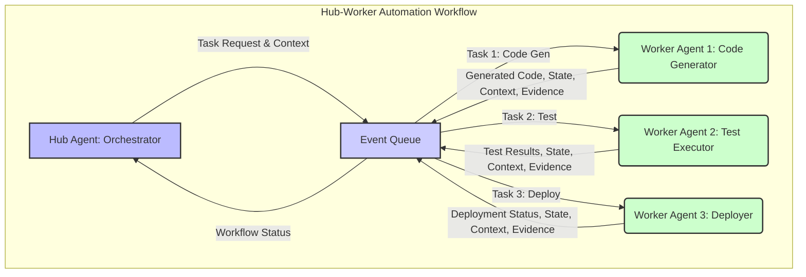

다중 AI 에이전트 시스템에서 각 에이전트가 고립된 태스크를 수행하는 것을 넘어, 유기적으로 협력하여 복잡한 목표를 달성하기 위해서는 **상태 (State), 맥락 (Context), 증거 (Evidence)**의 안정적인 전달 메커니즘이 필수적입니다. 특히, 소프트웨어 공장과 같은 자동화된 환경에서는 코드 생성부터 제품 배포에 이르기까지 인간의 판단이 필요한 지점에서 에이전트 간 정보 불일치로 인한 오류를 최소화해야 합니다. "인간의 판단은 소프트웨어 공장을 떠나지 않고 위치를 바꿈"이라는 긱뉴스 원문에서 시사하듯이, 자동화가 고도화될수록 에이전트 간 정보 전달의 정확성과 견고함이 시스템 전체의 신뢰성을 좌우합니다.

## 핵심 개념 및 중요성

**상태 (State)**는 특정 시점에서 에이전트나 시스템이 가지고 있는 데이터를 의미합니다. 예를 들어, 코드 생성 에이전트가 생성한 중간 코드, 테스트 에이전트의 테스트 결과, 배포 에이전트의 배포 준비 상태 등이 여기에 해당합니다. 상태는 다음 에이전트의 작업을 위한 직접적인 입력이 됩니다.

**맥락 (Context)**은 상태를 둘러싼 배경 정보입니다. 제품 의도, 시스템 설계 원칙, 품질 기준, 사용자의 특정 요구사항 등은 코드 자체에는 명시되지 않지만, 에이전트의 의사결정에 결정적인 영향을 미칩니다. 맥락이 누락되거나 왜곡되면 에이전트는 의도와 다른 결과를 도출할 수 있습니다.

**증거 (Evidence)**는 에이전트가 특정 결정이나 행동을 취하게 된 근거가 되는 구체적인 정보입니다. 이는 로그, 오류 보고서, 테스트 실패 스냅샷, 분석 리포트, 혹은 특정 코드 변경의 정당성을 뒷받침하는 문서 등 다양합니다. 증거는 에이전트의 판단을 검증하고, 문제가 발생했을 때 디버깅 및 사후 분석을 용이하게 합니다.

이 세 가지 요소의 효과적인 전달은 특히 `playbook` 내 허브-워커 복리 자동화 워크플로우와 같이 이벤트 기반 큐를 통해 작업을 반복 처리하는 환경에서 매우 중요합니다. 허브 에이전트는 전체 워크플로우를 조율하고, 워커 에이전트는 특정 작업을 수행합니다. 워커 에이전트가 작업을 완료하면, 그 결과 (상태), 작업의 배경 (맥락), 그리고 왜 그러한 결과가 도출되었는지 (증거)를 다음 에이전트나 허브 에이전트에 정확하게 전달해야 합니다.

## 에이전트 간 전달 메커니즘 구현 전략

### 1. 이벤트 기반 큐 (Event-Driven Queue) 활용

긱뉴스 원문에서도 강조된 이벤트 기반 큐는 에이전트 간 비동기적이고 견고한 통신을 가능하게 합니다. 각 에이전트는 특정 이벤트에 반응하여 작업을 수행하고, 그 결과를 다시 이벤트 형태로 큐에 발행합니다. 이 과정에서 메시지 페이로드에 상태, 맥락, 증거를 구조화하여 포함하는 것이 핵심입니다.

```python
# Python 예시: 이벤트 기반 메시지 구조
import json
from datetime import datetime

class AgentMessage:
    def __init__(self, sender_id: str, receiver_id: str, event_type: str,
                 state: dict, context: dict, evidence: list = None):
        self.timestamp = datetime.now().isoformat()
        self.sender_id = sender_id
        self.receiver_id = receiver_id
        self.event_type = event_type
        self.state = state
        self.context = context
        self.evidence = evidence if evidence is not None else []

    def to_json(self) -> str:
        return json.dumps({
            "timestamp": self.timestamp,
            "sender_id": self.sender_id,
            "receiver_id": self.receiver_id,
            "event_type": self.event_type,
            "state": self.state,
            "context": self.context,
            "evidence": self.evidence
        }, indent=2)

    @classmethod
    def from_json(cls, json_str: str):
        data = json.loads(json_str)
        return cls(
            sender_id=data["sender_id"],
            receiver_id=data["receiver_id"],
            event_type=data["event_type"],
            state=data["state"],
            context=data["context"],
            evidence=data.get("evidence", [])
        )

# 사용 예시
# Agent A가 코드 생성을 완료하고 결과를 Agent B에게 전달
code_generator_state = {"generated_code_path": "/tmp/feature_x.py", "status": "completed"}
project_context = {"project_id": "proj-123", "feature_name": "feature-x", "priority": "high"}
code_generation_log = ["LLM response received", "Code written to file"]

message_to_tester = AgentMessage(
    sender_id="code-generator-agent",
    receiver_id="test-agent",
    event_type="code_generated",
    state=code_generator_state,
    context=project_context,
    evidence=code_generation_log
)

print(message_to_tester.to_json())
# 이 JSON 메시지가 Kafka, RabbitMQ 등의 이벤트 큐에 발행됨
```

### 2. 공유 지식 베이스 (Shared Knowledge Base) 및 장기 기억

모든 정보가 메시지에 담기 어렵거나 비효율적인 경우, 에이전트들이 접근할 수 있는 중앙화된 또는 분산된 공유 지식 베이스 (예: 벡터 데이터베이스, 그래프 데이터베이스)를 활용합니다. 에이전트는 중요한 상태, 맥락, 증거를 이 지식 베이스에 저장하고, 필요한 정보를 검색하여 활용합니다. 이를 통해 긴 워크플로우에서도 일관된 맥락을 유지하고, 에이전트의 `long-term memory`를 구축할 수 있습니다.

### 3. 구조화된 데이터 모델 (Structured Data Models)

전달되는 상태, 맥락, 증거는 명확하게 정의된 스키마 (예: JSON Schema, Protobuf)를 따라야 합니다. 이는 에이전트 간의 `interface contract` 역할을 하며, 정보의 일관성을 보장하고 파싱 오류를 줄입니다. 2026년에는 `semantic data models`을 활용하여 데이터의 의미론적 연결을 강화하고, 에이전트가 단순히 데이터를 전달받는 것을 넘어 의미를 정확하게 해석하도록 돕는 트렌드가 강화될 것입니다.

## 다중 에이전트 워크플로우에서의 정보 흐름 (Mermaid Diagram)

아래 다이어그램은 허브-워커 패턴에서 에이전트 간의 상태, 맥락, 증거가 이벤트 큐를 통해 어떻게 전달되는지를 보여줍니다. 허브 에이전트는 전체 워크플로우를 관리하며, 워커 에이전트들은 특정 태스크를 수행하고 결과를 큐에 다시 발행합니다.



이러한 구조를 통해 각 에이전트가 이전 에이전트의 작업 결과뿐만 아니라, 그 작업이 어떤 의도와 배경에서 진행되었는지, 그리고 어떤 근거로 특정 결론에 도달했는지를 명확히 인지하고 다음 작업을 수행할 수 있습니다. 이는 자동화된 워크플로우의 신뢰성을 근본적으로 향상시키고, 에이전트가 복잡한 문제 해결 과정에서 발생할 수 있는 `hallucination`이나 `drift`를 줄이는 데 기여합니다.

## 트레이드오프

1.  **데이터 무결성 vs. 성능 오버헤드**:
    *   **언제 좋고**: 상태, 맥락, 증거를 엄격한 스키마와 트랜잭션으로 관리하면 데이터 무결성과 신뢰성이 보장됩니다. 이는 금융, 의료 등 높은 정확성이 요구되는 시스템에 적합합니다.
    *   **언제 나쁜지**: 모든 정보를 상세히 기록하고 검증하는 과정은 시스템의 처리량과 지연 시간에 상당한 오버헤드를 발생시킬 수 있습니다. 실시간 반응성이 중요한 시스템이나 데이터 양이 방대한 경우 성능 저하를 초래할 수 있습니다.

2.  **중앙 집중식 저장소 vs. 분산 저장소**:
    *   **언제 좋고**: 모든 에이전트가 공유하는 중앙 집중식 지식 베이스는 일관된 `global context`를 유지하고 관리하기 용이합니다. 시스템의 전체적인 상태를 파악하기 쉽습니다.
    *   **언제 나쁜지**: 단일 장애 지점 (Single Point of Failure)이 될 수 있으며, 확장성 (scalability)에 제약을 받을 수 있습니다. 또한, 에이전트 간 네트워크 지연이 발생할 수 있고, 민감한 정보의 접근 제어 관리가 복잡해질 수 있습니다.

3.  **명시적 전달 (Explicit Passing) vs. 암시적 전달 (Implicit Sharing)**:
    *   **언제 좋고**: 메시지 페이로드에 모든 관련 정보를 명시적으로 포함하여 전달하면 에이전트 간의 의존성이 명확해지고 디버깅이 용이합니다. 각 에이전트가 필요한 정보만을 추출하여 처리합니다.
    *   **언제 나쁜지**: 메시지 크기가 커지고 중복 데이터가 발생할 수 있습니다. 관련 없는 정보까지 전달되어 에이전트의 `context window`를 불필요하게 소모하거나, 에이전트가 비효율적으로 정보를 처리할 수 있습니다.

4.  **인간 개입 지점 vs. 완전 자동화**:
    *   **언제 좋고**: 특정 지점에서 인간의 판단과 개입을 위한 `checkpoint`를 두어 핵심적인 맥락과 증거를 검토하게 하면, 자동화된 시스템의 신뢰성과 최종 결과물의 품질을 향상시킬 수 있습니다. 특히 초기 단계나 중요 결정 과정에 유용합니다.
    *   **언제 나쁜지**: 인간 개입은 워크플로우의 `latency`를 증가시키고, 완전 자동화의 이점을 저해합니다. 반복적이고 단순한 작업에 인간 개입이 너무 많으면 자동화의 ROI (Return on Investment)가 감소합니다.

## 실전 체크리스트

이벤트 기반 큐 및 에이전트 간 맥락/증거의 안정적 전달 체계를 `playbook` 내 허브-워커 워크플로우에 도입하기 위한 체크리스트입니다.

- [ ] **데이터 스키마 정의**: 각 에이전트가 주고받을 상태, 맥락, 증거의 JSON/Protobuf 스키마를 명확히 정의하고 문서화했는가?
- [ ] **이벤트 큐 인프라 구축**: Kafka, RabbitMQ 등 선택한 이벤트 큐 시스템이 고가용성 (High Availability) 및 메시지 영속성 (Message Durability)을 보장하는가?
- [ ] **메시지 전달 모니터링**: 에이전트 간 메시지 전달 성공 여부, 지연 시간, 실패율을 모니터링하고 알림 체계를 구축했는가?
- [ ] **맥락 보존 메커니즘**: 긴 워크플로우에서 중요한 초기 맥락이 다음 에이전트에까지 일관되게 보존되고 활용되는지 검증했는가?
- [ ] **증거 기반 의사결정**: 에이전트가 중요한 결정을 내릴 때, 그 결정의 근거가 되는 증거 데이터를 메시지에 포함하거나 공유 지식 베이스에 기록하도록 설계했는가?
- [ ] **오류 처리 및 재시도**: 메시지 처리 실패 시 에이전트가 오류를 감지하고, 적절한 재시도 로직 또는 `fallback` 전략이 구현되었는가?
- [ ] **보안 및 접근 제어**: 민감한 상태 및 맥락 데이터가 전송 및 저장되는 과정에서 암호화, 접근 제어 등 보안 대책이 충분히 마련되었는가?